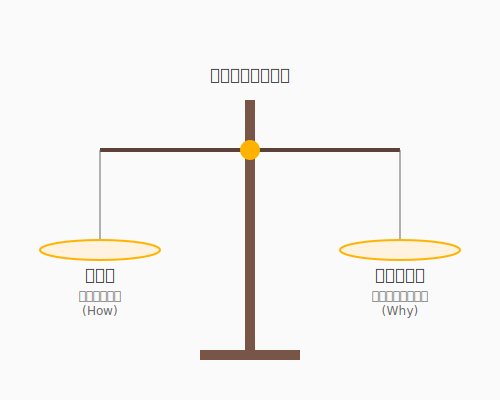

# 8.1 賢者の誓い——エンジニアの倫理と社会的責任

## 導入: 魔法の杖と「意志」

昔話に出てくる魔法の杖は、持ち主の意志次第で、枯れ木に花を咲かせることもあれば、国を滅ぼす災いをもたらすこともあります。

現代において、ソフトウェア工学とAIは、まさにその「魔法の杖」です。AIという強力な力を手にした私たちは、かつてないほど速く、かつてないほど大規模なものを創り出すことができます。しかし、だからこそ問われるのが、その杖を振るうあなたの**「意志」**です。

「このコードは、誰を幸せにするのか？」「このシステムが普及したとき、世界はどう変わるのか？」
技術的な美しさのその先にある「意味」を問うこと。それが、プロのエンジニアに求められる最も重要な資質です。

---

## エンジニアの倫理: 誰のための技術か

ACM（計算機学会）やIEEE（電気電子学会）が定めるソフトウェア工学の倫理規定には、共通する精神があります。それは、**「社会、顧客、雇用主、そして専門職に対する誠実さ」**です。



具体的に、私たちは以下の視点を忘れてはなりません。

1.  **公平性とバイアス**: AIが学習するデータには、現実世界の偏見が含まれています。その偏見を強化するようなシステムを作っていないか、常に疑う目が必要です。
2.  **アクセシビリティ**: そのソフトウェアは、障がいを持つ方や高齢の方も「冒険の仲間」に迎え入れていますか？ 誰もが等しく技術の恩恵を受けられるように配慮することは、エンジニアの誇りです。
3.  **プライバシーとセキュリティ**: ユーザーから預かった大切なデータ（魂の一部のようなものです）を、結界を張るように守り抜くこと。

技術的に「できる」ことと、社会的に「すべき」こと。その境界線を見極める力が、プロフェッショナルとしてのあなたを守ります。

---

## 技術の恩送り（Pay it Forward）

あなたが今、この本を読み、QuestForgeのようなアプリを作れるのは、かつての偉大なエンジニアたちが築き上げたオープンソースや知識の蓄積があるからです。

エンジニアの創造性は、閉じられたものではありません。
- 便利なライブラリを公開する
- 誰かのブログ記事に助けられたら、自分も知見を公開する
- 初心者の質問に優しく答える

こうした「知の循環」に参加し、未来のエンジニアのために道を整えること。それ自体が、社会に対する誠実さの証となります。

---

## まとめ

1.  **意志の力**: 強力な技術を持つ者こそ、「なぜ作るのか」という意志が問われる。
2.  **プロの倫理**: 公平性、アクセシビリティ、プライバシーを設計の初期段階から組み込む。
3.  **知の共有**: 未来のエンジニアのために、自分の知見を世界へ開いていく。

---

## AIへの詠唱例

```
私は新しいWebサービスを企画しています。
[サービスの概要を記述]
このサービスが社会に普及した際、発生しうる「倫理的な懸念点」や「無意識のバイアス」を
5つの異なる視点（ユーザー、非ユーザー、将来世代、マイノリティ、環境など）から分析してください。
```

```
以下のユーザーストーリーに対して、
「アクセシビリティ（アクセスのしやすさ）」の観点から
追加すべき受け入れ基準を提案してください。
[ユーザーストーリーを記述]
```
