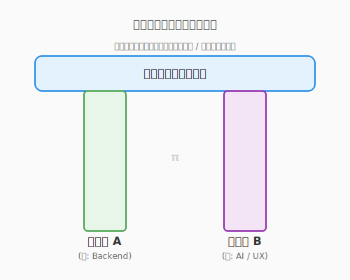

# 8.3 終わりのない旅——学びのサイクルとギルドの力

## 導入: 「最強の装備」は存在しない

この本の最後となる本節へ、ようこそ。ここまで辿り着いたあなたは、もう立派な冒険者です。

しかし、ソフトウェア工学という広大な世界において、「これで完璧」「この装備さえあれば一生安泰」という瞬間は訪れません。昨日までの最強の魔法（フレームワーク）が、明日には古いものになっているかもしれない。そんな変化の激しい世界です。

「また新しいことを覚えなきゃいけないのか……」と、ため息をつく必要はありません。それは裏を返せば、**「このゲームは一生飽きることがない」**ということです。明日にはまた新しいダンジョン（未踏の技術）が現れ、新しい魔法が生まれる。そんなエキサイティングな世界を生きていることを、ぜひ誇ってください。

---

## 好奇心のメンテナンス

学び続けるための最大のエネルギー源は、義務感ではなく**「好奇心」**です。

### 情報の取捨選択（キュレーション）
現代は情報の洪水です。すべてを追いかけるのは不可能ですし、その必要もありません。
- **不変の原理（アルゴリズム、OS、ネットワーク、設計原則）**: 10年後も使える知恵。じっくり腰を据えて学ぶ。
- **流行の技術（ライブラリ、ツール）**: 鮮度の高い知恵。必要になった時に、楽しみながらつまみ食いする。

このバランスを保つことが、知的な「息切れ」を防ぐコツです。

### 「3ヶ月後の自分」へのプレゼント
あなたが今日学んだこと、解決したエラーの記録を、ブログやメモに残しておきましょう。それは未来の自分への、そして世界中のどこかで同じ問題に悩む冒険者への、最高のプレゼントになります。アウトプットこそが、最も深いインプットになるのです。

---

## コミュニティという名のギルド

一人で暗い部屋に籠もって学ぶのは限界があります。外の世界（コミュニティ）へ飛び出しましょう。

- **勉強会とカンファレンス**: **デブサミ（Developers Summit）**、**XP祭り**、**Agile Japan**、**PyCon JP**など、同じ志を持つ仲間と出会い、熱量を共有する場が国内にも数多く存在します。
- **オープンソース（OSS）**: 世界中の天才たちが書いたコードを読み、貢献できる「究極の攻略本」です。
- **賢者たちの最高評議会（学術学会）**: ソフトウェア工学の理論を磨き、数十年先の未来を議論する場所です。国際的なIEEEやACMだけでなく、国内でも**情報処理学会（ソフトウェア工学研究会）**、**電子情報通信学会（ソフトウェアサイエンス研究会）**、**日本ソフトウェア科学会**などが、理論と実践の架け橋となっています。
- **SNS・技術ブログ**: ゆるい繋がりから、思いがけないチャンスや知見が舞い込んできます。

「教えることは、二度学ぶこと」——。あなたが学んだばかりの知識こそ、今まさに始めたばかりの誰かにとって、最も分かりやすい教えになるのです。

また、実務での発見を論文や技術記事として言語化することは、あなたの知見を「人類の共有財産」へと昇華させる、最も高潔な錬金術の一つです。理論（学会）と実践（現場）の螺旋階段を登り続けること。それが、真のマスター・アルケミストへの道です。

---

## キャリアの羅針盤

あなたのキャリアを、RPGのスキルツリーのように描いてみましょう。



### T型人材からπ型人材へ
まずは一つの分野（例：Pythonバックエンド）を深く掘り下げます（Tの縦棒）。その過程で得た「学び方」を応用して、他の分野（例：UI/UX、AI、クラウド）へと横に広げていきます。
複数の強みを掛け合わせることで、あなたにしか解決できない「ユニークなクエスト」が舞い込むようになります。

### 「不変の原理」に根ざす
技術の流行が激しいからこそ、設計原則やアルゴリズムといった「根っこ」を大切にしてください。根っこが深ければ、枝葉（トレンド）がどれだけ変わっても、あなたは揺るぎないエンジニアであり続けられます。

---

## まとめ

1.  **New Game+**: 学びは「終わりのある苦行」ではなく、「一生遊べるゲーム」の続きである。
2.  **不変と流行のバランス**: 10年後も使える原理原則と、最新のトレンドをバランスよく吸収する。
3.  **アウトプットの力**: 自分のために、そして誰かのために、学んだことを発信し続ける。
4.  **コミュニティの熱量**: 仲間と繋がり、知を共有することで、成長は加速し、孤独は消える。
5.  **楽しむ勇気**: 変化を楽しみ、好奇心の赴くままに、新しい魔法を試し続ける。

---

## AIへの詠唱例

```
私は今後1年間で[目指すエンジニア像]になりたいと考えています。
現在の私のスキルセット[現在のスキル]を踏まえて、
「不変の原理」と「最新トレンド」をバランスよく配置した
学習ロードマップを提案してください。
```

---

## さらに学ぶためのリソース

- 📄 **論文**: L. Briand "[The Future of Software Engineering: A Research Perspective](https://ieeexplore.ieee.org/document/8109118)" (2017)（ソフトウェア工学の未来の研究課題を展望した、包括的なレポート）
- 🌐 **Web**: [ICSE (International Conference on Software Engineering)](https://conf.researchr.org/home/icse-2024)（ソフトウェア工学における世界最高峰の国際会議）
- 🌐 **学会（日本）**: [情報処理学会 ソフトウェア工学研究会 (SIGSE)](https://www.sigse.jp/) / [電子情報通信学会 ソフトウェアサイエンス研究会 (SS)](https://www.ieice.org/~ss/) / [日本ソフトウェア科学会 (JSSST)](https://jssst.or.jp/)
- 🌐 **コミュニティ（日本）**: [デブサミ](https://event.shoeisha.jp/devsumi) / [XP祭り](https://www.xpj.jp/) / [Agile Japan](https://www.agilejapan.jp/)
- 📚 **書籍**: 結城浩『[新版 数学リテラシー](https://www.sbcr.jp/product/4815606145/)』（エンジニアにとっての「不変の土台」である論理的思考力を養うための一冊）
- 🌐 **Web**: [Thoughtworks Technology Radar](https://www.thoughtworks.com/radar)（世界の技術トレンドを俯瞰し、「不変」と「流行」を見極めるための羅針盤）
- 📄 **論文**: Mary Shaw "[Software Engineering Education: A Roadmap](https://dl.acm.org/doi/10.1145/336512.336588)" (2000)（ソフトウェア工学教育の歴史と未来を描いた、示唆に富むロードマップ）

