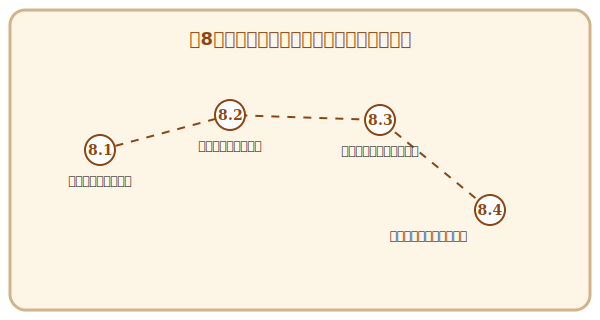

# 第8章 エンジニアの倫理と未来への責任——終わりなき冒険の始まり

## この章で手に入れる力

ここまでの7つの章で、あなたは要求を聴き、設計し、実装し、磨き、守り、届け、そしてチームの力で価値を生み出す——ソフトウェア工学の一連の旅を歩んできました。

しかし、この旅には「ゴール」がありません。技術は進化し続け、社会は変化し続け、あなた自身も成長し続けるからです。そして、AI時代を生きるエンジニアには、技術力だけでなく、その力をどう使うかという**倫理と責任**が、これまで以上に求められています。

この章では、AIと共に創造する時代のエンジニアとしての誇りと責任を考え、そしてソフトウェア工学という**「一生遊べるゲーム」**を、これからも楽しみ続けるための道しるべを手に入れましょう。

## 冒険の地図

---

---

## 読了後のあなた

この章を読み終えると、あなたは以下のことができるようになります。

- **倫理を貫く**: 「この技術は誰を幸せにするのか？」と問い、誠実な判断ができる
- **問いを立てる**: AIをパートナーとして、人間ならではの視点で価値を定義できる
- **学び続ける**: 好奇心を燃料に、不変の原理と流行の技術をバランスよく吸収できる
- **世界を広げる**: コミュニティを通じて知を共有し、エンジニアとしての旅を愉しめる

この本で手に入れた力は、始まりに過ぎません。ソフトウェア工学という「一生遊べるゲーム」を、存分に楽しんでいきましょう。

---

## さらに学ぶためのリソース（章全体）

- 📚 **書籍**: Andrew Hunt, David Thomas『[達人プログラマー 第2版 ―熟達に向けたあなたの旅](https://www.ohmsha.co.jp/book/9784274226298/)』（生涯にわたるエンジニアの成長哲学。第8章のテーマと強く共鳴します）
- 📚 **書籍**: Cal Newport『[大事なことに集中する ―気が散るものだらけの世界で生産性を最大化する科学的方法](https://www.diamond.co.jp/book/9784478069967.html)』（Deep Workの重要性を説く、現代の知的生産者のための必読書）
- 📚 **書籍**: Virginia Eubanks『[格差の自動化 ―データによる選別・監視・処罰](http://www.jimbunshoin.co.jp/book/b589418.html)』（技術がもたらす社会的不平等の実態を暴く衝撃作）
- 📚 **書籍**: Cathy O'Neil『[あなたを支配し、社会を破壊する、AI・ビッグデータの罠](http://www.intershift.jp/math-destruction/)』（アルゴリズムの倫理的影響を警鐘する。原題: Weapons of Math Destruction）
- 📚 **書籍**: Eric Raymond『[伽藍とバザール](http://www.hyuki.com/yukiwiki/wiki.cgi?TheCathedralAndTheBazaar)』（オープンソースの思想と文化を決定づけた伝説的エッセイ。山形浩生氏による全訳も公開されています）

### 📜 賢者伝説（学術論文）

- 📄 **50s**: Alan M. Turing "[Computing Machinery and Intelligence](https://academic.oup.com/mind/article/LIX/236/433/986230)" (1950)（「機械は思考できるか？」という問いを立て、AI時代の哲学の基礎を築いた記念碑的論文）
- 📄 **10s**: A. Jobin, M. Ienca, and E. Vayena "[The global landscape of AI ethics guidelines](https://www.nature.com/articles/s42256-019-0088-2)" (2019)（世界中のAI倫理ガイドラインを俯瞰し、共通の原則（透明性、正義、責任など）を整理した現代の指針）
