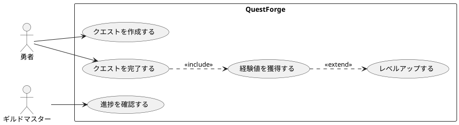
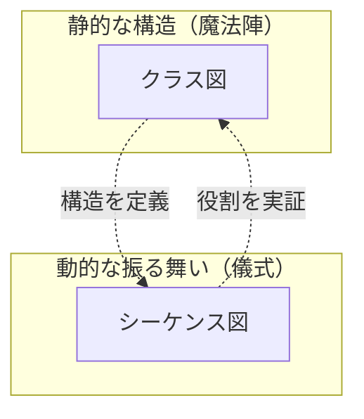
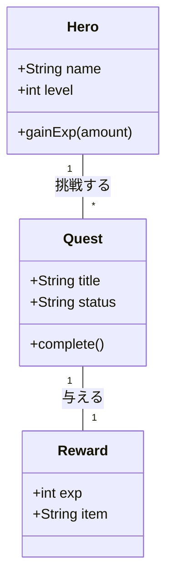
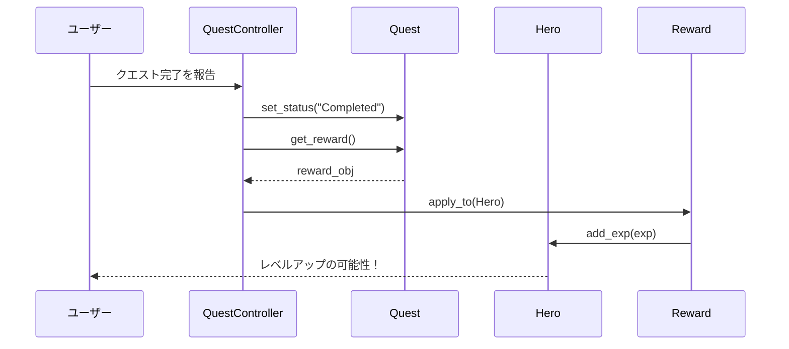
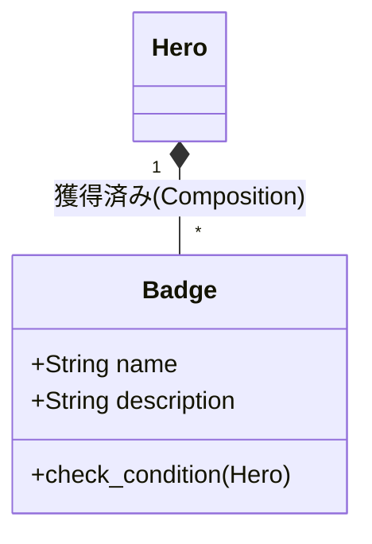
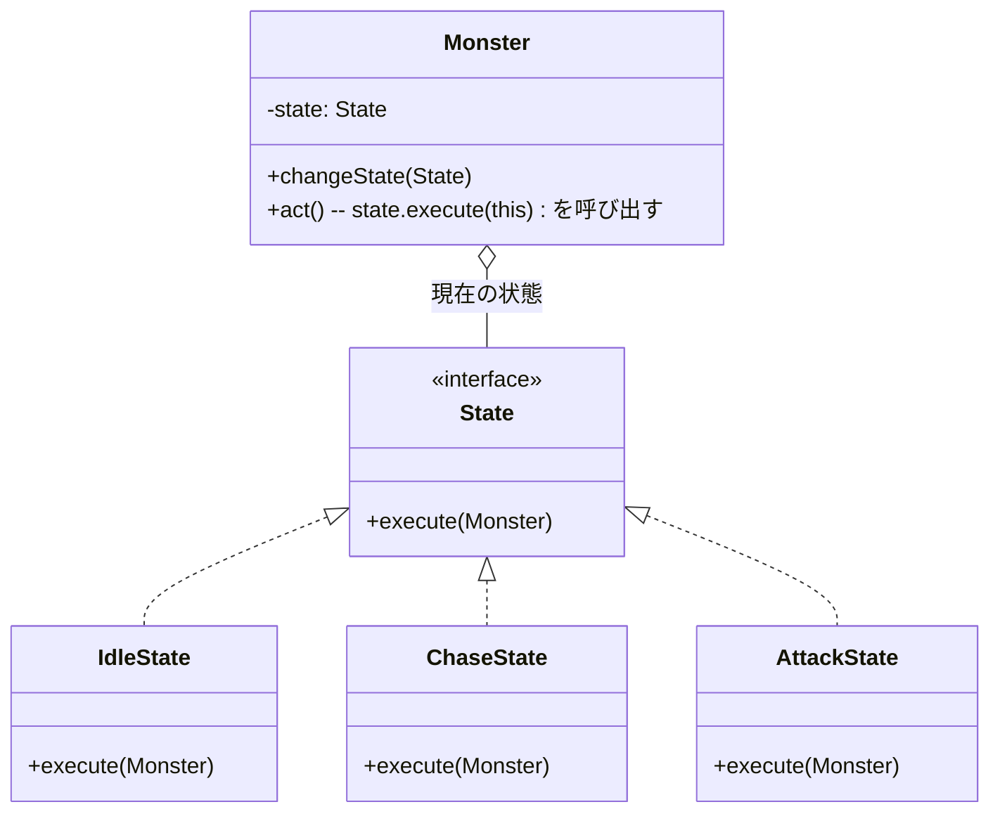
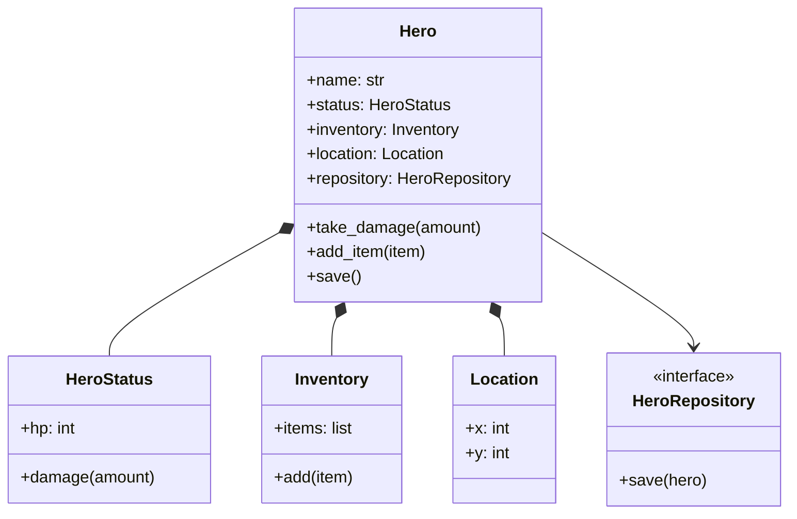
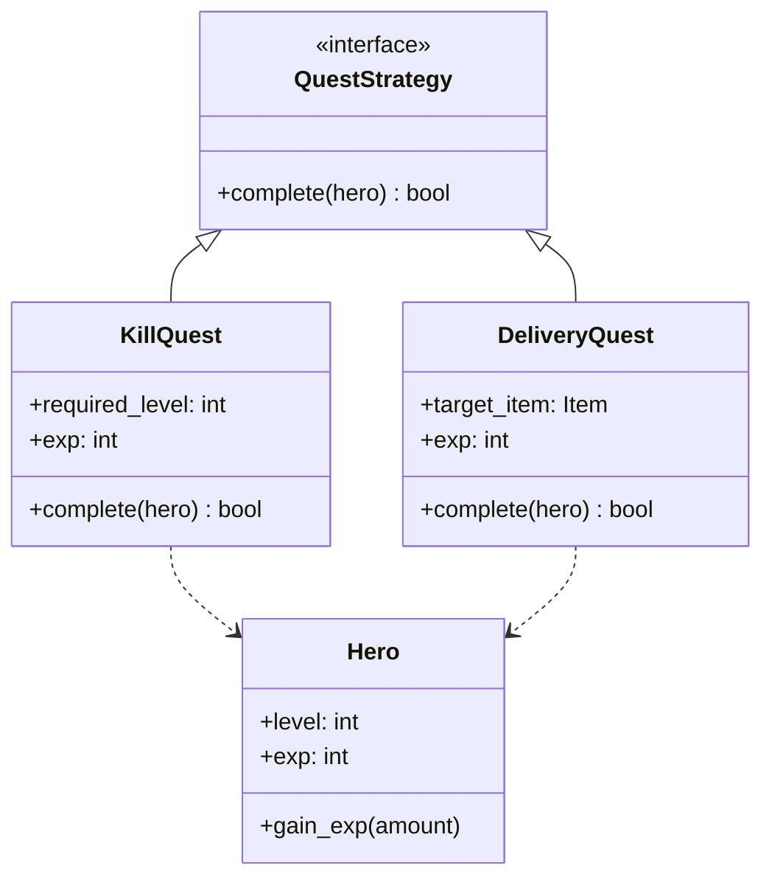

<!-- SECTION_START: COVER.md -->

# 『「楽しい」ソフトウェア工学の教科書』
## デジタル・アルケミー：伝統の美学とAIで紡ぐ創造の地図


---

### **世界の欠片を論理のモデルへ、言葉が命を宿す瞬間。**

ソフトウェア工学という「魔法の地図」を手に、
伝統的な設計の美学と、現代のAI駆動開発が融合する
新たな創造のフロンティアへ。

---

**著者：**
小川 秀人（OGAWA Hideto）
& AI Familiar (Claude / Gemini)

**発行：**
2026年2月23日 初版発行
Digital Alchemy Press


<!-- SECTION_START: toc.md -->

# 『「楽しい」ソフトウェア工学の教科書』目次

**デジタル・アルケミー：伝統の美学とAIで紡ぐ創造の地図**

---

## プロローグ

- [プロローグ：ソフトウェア工学は「魔法の地図」である](chapters/prologue/prologue.md) — ✅ 完成

---

## 第1部 構想の美学

### 第1章 ドメインという名の異世界探検——要求工学入門 🟩

- [第1章 概要](chapters/part1/chapter01/chapter01.md) — 🟩 暫定完了
- [1.1 なぜ聴くのか？——要求工学という冒険の始まり](chapters/part1/chapter01/1-1.md) — 🟩 暫定完了
- [1.2 どう聴くか？——アクティブ・リスニングの技法](chapters/part1/chapter01/1-2.md) — 🟩 暫定完了
- [1.3 誰に聴くか？——AIペルソナとの対話](chapters/part1/chapter01/1-3.md) — 🟩 暫定完了
- [1.4 どう整理するか？——ゴール指向要求分析](chapters/part1/chapter01/1-4.md) — 🟩 暫定完了
- [1.5 どう可視化するか？——要求を描く魔法陣（UML前編）](chapters/part1/chapter01/1-5.md) — 🟩 暫定完了

### 第2章 悠久のアーキテクチャ——ソフトウェア設計入門 🟩

- [第2章 概要](chapters/part1/chapter02/chapter02.md) — 🟩 暫定完了
- [2.1 オブジェクト指向という魔法の源](chapters/part1/chapter02/2-1.md) — 🟩 暫定完了
- [2.2 どう構造化するか？——設計を描く魔法陣（UML後編）](chapters/part1/chapter02/2-2.md) — 🟩 暫定完了
- [2.3 どう分けるか？——美しい構造の黄金律（SOLID原則）](chapters/part1/chapter02/2-3.md) — 🟩 暫定完了
- [2.4 どう受け継ぐか？——デザインパターンの知恵](chapters/part1/chapter02/2-4.md) — 🟩 暫定完了
- [2.5 どう守るか？——クリーンアーキテクチャ](chapters/part1/chapter02/2-5.md) — 🟩 暫定完了
- [2.6 【外伝】二つの聖域——エンタープライズと組み込み](chapters/part1/chapter02/2-6.md) — 🟩 暫定完了

---

## 第2部 構築のダイナミズム

### 第3章 モダン・アルケミー——論理を具現化する実装の技法 🟩

- [第3章 概要](chapters/part2/chapter03/chapter03.md) — 🟩 暫定完了
- [3.1 魔導の元素——アルゴリズムとデータ構造](chapters/part2/chapter03/3-1.md) — 🟩 暫定完了
- [3.2 術式の構築——制御構造と論理の美学](chapters/part2/chapter03/3-2.md) — 🟩 暫定完了
- [3.3 術式の器——関数・クラス・モジュール](chapters/part2/chapter03/3-3.md) — 🟩 暫定完了
- [3.4 審美眼の錬磨——コードの評価と静的解析](chapters/part2/chapter03/3-4.md) — 🟩 暫定完了
- [3.5 詠唱による具現化——自律型エージェントとの共闘](chapters/part2/chapter03/3-5.md) — 🟩 暫定完了
- [3.6 多彩なる魔導体系——言語の壁を超える](chapters/part2/chapter03/3-6.md) — 🟩 暫定完了
- [3.7 並列詠唱の奥義——非同期・並行プログラミング](chapters/part2/chapter03/3-7.md) — 🟩 暫定完了

### 第4章 無敵の軍団を作る——テストと品質保証 🟩

- [第4章 概要](chapters/part2/chapter04/chapter04.md) — 🟩 暫定完了
- [4.1 守護魔法の体系——テストの全体像](chapters/part2/chapter04/4-1.md) — 🟩 暫定完了
- [4.2 鑑定術の技法——テスト設計の4つの流派](chapters/part2/chapter04/4-2.md) — 🟩 暫定完了
- [4.3 赤から緑へ——テスト駆動開発のリズム](chapters/part2/chapter04/4-3.md) — 🟩 暫定完了
- [4.4 AIが放つ刺客——テストの自動生成と拡張](chapters/part2/chapter04/4-4.md) — 🟩 暫定完了
- [4.5 鉄壁の防衛線——テスト自動化とCI](chapters/part2/chapter04/4-5.md) — 🟩 暫定完了
- [4.6 術式の不調を探る——デバッグという推理ゲーム](chapters/part2/chapter04/4-6.md) — 🟩 暫定完了

---

## 第3部 守護者の誇り

### 第5章 リファクタリング：彫刻を磨く喜び 🟩

- [第5章 概要](chapters/part3/chapter05/chapter05.md) — 🟩 暫定完了
- [5.1 コードの「匂い」を嗅ぎ分ける](chapters/part3/chapter05/5-1.md) — 🟩 暫定完了
- [5.2 AIによるコードレビュー](chapters/part3/chapter05/5-2.md) — 🟩 暫定完了
- [5.3 技術負債の返済ゲーム](chapters/part3/chapter05/5-3.md) — 🟩 暫定完了
- [5.4 【外伝】万変の魔導書——ソフトウェアプロダクトライン](chapters/part3/chapter05/5-4.md) — 🟩 暫定完了

### 第6章 進化する生命体——デプロイと運用 🟩

- [第6章 概要](chapters/part3/chapter06/chapter06.md) — 🟩 暫定完了
- [6.1 命を吹き込む儀式——デプロイメントの進化](chapters/part3/chapter06/6-1.md) — 🟩 暫定完了
- [6.2 絶え間なき循環——CI/CDパイプライン](chapters/part3/chapter06/6-2.md) — 🟩 暫定完了
- [6.3 鍛冶場の結界——セキュリティという守りの技法](chapters/part3/chapter06/6-3.md) — 🟩 暫定完了
- [6.4 脈動を聴く——オブザーバビリティ](chapters/part3/chapter06/6-4.md) — 🟩 暫定完了
- [6.5 カオスへの耐性——レジリエンスと自己修復](chapters/part3/chapter06/6-5.md) — 🟩 暫定完了
- [6.6 ユーザーとの共進化——フィードバックループ](chapters/part3/chapter06/6-6.md) — 🟩 暫定完了

---

## 第4部 チーム・オーケストラ

### 第7章 アジャイルという名の冒険パーティ——開発プロセス 🟩

- [第7章 概要](chapters/part4/chapter07/chapter07.md) — 🟩 暫定完了
- [7.1 スクラムの祝祭](chapters/part4/chapter07/7-1.md) — 🟩 暫定完了
- [7.2 Git/GitHubを通じた知の交流](chapters/part4/chapter07/7-2.md) — 🟩 暫定完了
- [7.3 共鳴する魂——ペアプロ・モブプロ](chapters/part4/chapter07/7-3.md) — 🟩 暫定完了

### 第8章 エンジニアの倫理と未来への責任——終わりなき冒険の始まり 🟩

- [第8章 概要](chapters/part4/chapter08/chapter08.md) — 🟩 暫定完了
- [8.1 賢者の誓い——エンジニアの倫理と社会的責任](chapters/part4/chapter08/8-1.md) — 🟩 暫定完了
- [8.2 創造の火——AI時代の創造性と「問い」を立てる力](chapters/part4/chapter08/8-2.md) — 🟩 暫定完了
- [8.3 終わりのない旅——学びのサイクルとギルドの力](chapters/part4/chapter08/8-3.md) — 🟩 暫定完了

---

## エピローグ

- [エピローグ：世界を再構築するあなたへ](chapters/epilogue/epilogue.md) — 🟩 暫定完了

---

## 執筆進捗サマリー

| 状態 | セクション数 |
|------|-------------|
| ✅ 完成 | 1 |
| 🟩 暫定完了 | 49 |
| 🟦 人間修正中 | 0 |
| 🟨 AI草稿 | 0 |
| 📝 未着手 | 0 |

**最終更新**: 2026-02-23


<!-- SECTION_START: chapters/prologue/prologue.md -->

# プロローグ：ソフトウェア工学は「魔法の地図」である


あなたは、プログラミングを学んだとき、どんな気持ちでしたか？何を作ろうか。自分好みの新しいゲームが作れるようになるかな。面倒な手作業が楽になる。これでいいお給料が貰えるようになるに違いない――そんなわくわくした気持ちもあったと思います。

ところが、いざプログラミングやソフトウェア工学を学んでみると、「○○してはいけない」「△△を避けるべき」「正しい方法は□□」――そんな「べからず集」に囲まれて、息苦しさを感じたことはありませんか？もしかすると、ソフトウェア工学という言葉に、堅苦しい規則や、退屈なドキュメント作成、無意味なチェックリストを連想してしまうかもしれません。

でも、ちょっと待ってください。ソフトウェア工学は、そんな窮屈なものではありません。むしろ、その正反対です。ソフトウェア工学は、あなたに「できる」を与える魔法のような技術なのです。

## 世界を再構築する「アーキテクト」として

想像してみてください。あなたの目の前に、複雑で混沌とした現実世界が広がっています。ユーザーの曖昧な要望、絡み合ったビジネスルール、山積みの技術的課題。まるで、濃い霧に包まれた未踏の土地のようです。皆さんが大好きな異世界に転生した状況だと思ってください。

ソフトウェア工学は、この霧の中に一筋の光を差し込む「魔法の地図」です。混沌を論理へ、曖昧さを明確さへ、そして不可能を可能へと翻訳していく技術。それこそが、ソフトウェア工学の本質なのです。

そして、この地図を手にしたあなたは、もはや「管理される側」ではありません。世界を再構築する「アーキテクト」です。要求を聞き、構造を設計し、コードという魔法の言葉で新しい現実を創り出す――それは、まさに錬金術師（アルケミスト）のような営みです。

## 制約という名の「ゲーム」を楽しむ

「でも、現実には制約だらけじゃないか」

そう思いましたか？その通りです。予算の制約、納期の制約、技術の制約、チームの制約――ソフトウェア開発は、制約のオンパレードです。

でも、ここで発想を転換してみましょう。

ゲームを思い出してください。RPGの縛りプレイ、パズルゲームの限られたピース、将棋の駒の動き方。制約があるからこそ、ゲームは面白いのです。制約があるからこそ、創意工夫が生まれ、エレガントな解決策を見つけたときの喜びが生まれるのです。

ソフトウェア工学も同じです。「2週間でMVPを作る」「メモリ使用量を半分にする」「レガシーコードを壊さずに新機能を追加する」――これらは制約ではなく、あなたの創造性を引き出すための「ゲームのルール」なのです。

そして、美しい設計、クリーンなコード、エレガントなアーキテクチャ。それらは、制約という縛りの中で生まれる「芸術作品」なのです。

## 自由という名の「冒険」を取り戻す

以前、ある著名なジャズピアニストのインタビューを読みました。彼は長年ジャズの第一線で活躍してきましたが、近年、クラシック音楽への挑戦を始めたといいます。

彼はこう語っていました。
「かつては、クラシックは楽譜に縛られた堅苦しいもので、ジャズこそが自由な音楽だと思っていた。でも、実際に深く入り込んでみると逆だった。ジャズには『ジャズはこうでなければならない』という暗黙の制約やスタイルが多く、むしろクラシックの方が、その解釈や表現において無限の自由があると感じる」

これは、現代のソフトウェア開発にも通じる話ではないでしょうか。
「モダンな開発とはこうあるべきだ」「この手法はもう古い」「あのアーキテクチャこそが唯一の正解だ」……。私たちは新しい「正しさ」のラベルを次々と生み出し、自らその定義に縛られ、息苦しくなってはいないでしょうか。

かつてあなたがプログラミングに抱いた、あの自由でワクワクするような感覚。それは、「最新」や「正しいとされる方法」という記号の中にではなく、自分の目で世界を観察し、自分自身の力で最適な術式を編み出すという「冒険」の中にこそあったはずです。

もっと自由に、ソフトウェアの世界を冒険してみませんか？ ラベルを剥がし、先入観を捨て、自分たちの手で「魔法」を編み出す喜びを取り戻しましょう。

## AI時代の新しい魔法

さらに、今、私たちは歴史的な転換点に立っています。

AI（人工知能）という新しい「魔法の杖」[^魔法の杖]を手に入れたのです。OpenAI ChatGPTから始まった生成AIは、Google GeminiやAnthropic Claudeへと進化を遂げました。これらは、Codex CLI、Claude Code、Gemini CLIなどのコーディングエージェントとして進化しました。GitHub Copilot、Cursor、ClineのようなIDE統合型エージェントも登場しました。Devinのような自律的な開発エージェントも現れました。そして、AWS Kiroのような仕様駆動開発という新しいパラダイムまで生まれています。私たちの設計方法、実装方法が根本から変わりつつあるのです。
[^魔法の杖]:AIは万能の魔法ではなく優れた道具として使うべきだという意見もあります。著者もそう思います。でも優れた技術は魔法と区別がつかないという言葉もあります。本書では敢えて魔法の杖として、それを使いこなすアルケミストが成長する物語を期待しているのです。

「AIが仕事を奪うのでは？」という不安を感じる人もいるでしょう。

でも、考えてみてください。電卓が登場したとき、数学者は不要になりましたか？いいえ。電卓は計算の手間を省き、数学者はより高度な問題に挑戦できるようになりました。写真が登場して画家は失業しましたか？いいえ。画家たちは人の視点での世界の印象や、人の内面を描くことに絵画を深化させていきました。製糸が自動化されて作業員は不要になりましたか？これはある意味では「はい」ですね。でも、厳しい作業環境から人々を解放しただけでなく、生産量の飛躍的な増大が繊維産業全体を拡大し、結果としてより多様な雇用を創出しました。

AIも同じです。
AIは、ボイラープレート（定型的なコード）を書き、バグを見つけ、リファクタリングを提案してくれます。そのおかげで、私たちエンジニアは、より創造的な仕事に集中できるのです。
「どんなシステムを作るべきか」「どう設計すべきか」「ユーザーをどう幸せにするか」――そんな、本当に大切な問いに向き合う時間が増えるのです。

本書では、伝統的なソフトウェア工学の知恵と、AI時代の新しい手法を融合させた「デジタル・アルケミー（デジタル錬金術）」をお伝えします。

## この旅で得られるもの

この本を読み終えたとき、あなたは次のような力を手に入れているでしょう：

- **世界を論理に翻訳する力**：曖昧な要求から、美しい設計を生み出す技術
- **制約を楽しむ心**：限られた条件の中で、最高の解決策を見つける喜び
- **AIとの協働術**：AIを「相棒」として使いこなし、創造性を最大化する方法
- **エンジニアとしての誇り**：技術で世界を変える「アーキテクト」としての自信

そして何より、ソフトウェア工学が「楽しい」と感じることでしょう。

## 旅の地図

本書は、4つの部で構成されています：

**第1部：構想の美学**では、世界の欠片を論理のモデルへと翻訳する技術を学びます。要求工学、モデリング、AIとのブレインストーミング、そしてアーキテクチャの設計――混沌に秩序をもたらす魔法です。

**第2部：構築のダイナミズム**では、言葉が命を宿す瞬間を体験します。AIを使った実装、コパイロットとの共鳴、そしてコードを彫刻のように磨き上げるリファクタリング。あなたのアイデアが、動くソフトウェアへと変貌する喜びを味わいましょう。

**第3部：守護者の誇り**では、信頼を築く技術を習得します。テスト駆動開発、AIによるテストケース生成、CI/CD、そして運用の技――これらは、あなたのシステムを「無敵」にする守護者です。

**第4部：チーム・オーケストラ**では、一人では到達できない高みへ挑みます。アジャイル開発、Gitを通じた協働、そしてエンジニアとしての倫理。仲間と共に、より大きな何かを創り出す力を得ましょう。

## さあ、冒険を始めよう

ページをめくるたびに、新しい発見があるはずです。時には立ち止まり、コードを試し、AIと対話してみてください。この本は、ただ読むだけのものではありません。あなた自身が「体験」し、「実践」し、「楽しむ」ための魔導書なのです。

本書の各セクションには、**AIへの詠唱例**を掲載しています。これは、学んだ技法をAIと一緒に実践するためのプロンプト（呪文）のサンプルです。そのままコピーして使うもよし、自分なりにアレンジするもよし。AIという魔法の杖を、ぜひ使いこなしてください。

ソフトウェア工学は、世界を変える魔法です。
そして、この魔法を使えるのは、特別な才能を持った一部の人だけではありません。正しい地図を持ち、正しい道を歩めば、誰もが魔法使いになれるのです。
あなたも、その一人です。
さあ、一緒に、デジタル・アルケミーの世界へ踏み出しましょう。
ワクワクするような冒険が、あなたを待っています。

---

**執筆メモ**（公開版では削除）:
- 執筆日時: 2026-01-18
- 文字数: 約2800文字
- 主要コンセプト:
  - 「べからず」→「できる」への転換
  - 制約をゲームとして楽しむ
  - AIとの協働
  - アーキテクトとしての誇り
- トーン: 親しみやすく、ワクワク感を重視
- 次のステップ: 人間による修正・経験の追加


<!-- SECTION_START: chapters/part1/chapter01/chapter01.md -->

# 第1章 ドメインという名の異世界探検——要求工学入門


## この章で手に入れる力

ソフトウェア開発の冒険は、「何を作るか」を見極めることから始まります。

どんなに優れた技術を持っていても、作るべきものを見誤れば、その技術は活かせません。逆に、ユーザーの真の願いを理解できれば、シンプルな技術でも大きな価値を生み出せます。

この章では、**要求工学（Requirements Engineering）**の基礎を学びます。ユーザーの言葉の奥にある「隠れた願い」を発見し、それを明確な形に整理し、チームで共有できる図として可視化する——その一連の技術を身につけましょう。

---

## 章の構成

| セクション | タイトル | 学ぶこと |
|-----------|---------|---------|
| 1.1 | なぜ聴くのか？ | 要求工学の重要性、要求の3層構造、聴くことの価値 |
| 1.2 | どう聴くか？ | アクティブ・リスニング、5W1H、感情へのフォーカス |
| 1.3 | 誰に聴くか？ | ペルソナ法、AIペルソナとの対話、仮説検証 |
| 1.4 | どう整理するか？ | ゴール指向要求分析、AND/OR分解、ゴールツリー |
| 1.5 | どう可視化するか？ | UML（ユースケース図、アクティビティ図）、PlantUML |

---

## 冒険の地図

```
┌─────────────────────────────────────────────────────────────┐
│                                                             │
│   [1.1 なぜ聴くのか？]                                       │
│         │                                                   │
│         ▼                                                   │
│   [1.2 どう聴くか？] ←── アクティブ・リスニングの技法         │
│         │                                                   │
│         ▼                                                   │
│   [1.3 誰に聴くか？] ←── AIペルソナとの対話                  │
│         │                                                   │
│         ▼                                                   │
│   [1.4 どう整理するか？] ←── ゴール指向要求分析              │
│         │                                                   │
│         ▼                                                   │
│   [1.5 どう可視化するか？] ←── UMLで図にする                 │
│         │                                                   │
│         ▼                                                   │
│   ──────────────────────────────────────────────────────    │
│         │                                                   │
│         ▼                                                   │
│   [第2章へ] 設計の世界へ                                     │
│                                                             │
└─────────────────────────────────────────────────────────────┘
```

---

## 本章で使うサンプルプロジェクト

本章では、**QuestForge**というサンプルアプリを題材に学びます。

> **QuestForge**: 日々のタスクをRPGの「クエスト」に見立てて管理するアプリ。タスクを完了すると経験値を獲得し、レベルアップしていきます。

詳細は1.1節のコラムで紹介しています。サンプルコードは `sample-code/questforge/` にあります。

---

## 読了後のあなた

この章を読み終えると、あなたは以下のことができるようになります。

- **聴く**: ユーザーの言葉から「隠れた願い」を引き出せる
- **対話する**: AIペルソナを使って、いつでも仮説を検証できる
- **整理する**: 散らばった要求をゴールツリーで体系化できる
- **描く**: ユースケース図・アクティビティ図で要求を可視化できる
- **共有する**: チームメンバーと認識を揃えられる

さあ、要求工学という冒険の世界へ踏み出しましょう。

---

## さらに学ぶためのリソース（章全体）

各セクションの参考文献に加え、要求工学全般を学ぶためのリソースです。

- 📚 **書籍**: カール・ウィーガーズ『ソフトウェア要求 第3版』（要求工学の定番テキスト）
- 📚 **書籍**: ジェラルド・ワインバーグ『要求仕様の探検学』（要求発見の技法を物語形式で学ぶ）
- 📚 **書籍**: Axel van Lamsweerde『Requirements Engineering』（ゴール指向要求分析の教科書）
- 📚 **書籍**: マーチン・ファウラー『UMLモデリングのエッセンス 第3版』（UMLの定番入門書）


<!-- SECTION_START: chapters/part1/chapter01/1-1.md -->

# 1.1 なぜ聴くのか？——要求工学という冒険の始まり

## 導入: 言葉の迷宮への入り口

「もっと使いやすいシステムにしてほしいんです」

ユーザーからそう言われたとき、あなたはどう反応しますか？

「わかりました、UIを改善しましょう」と即答する前に、ちょっと立ち止まってみませんか？　ここには、もっとワクワクする可能性が眠っています。

ユーザーの言葉は、海面に浮かぶ氷山の一角に過ぎません。その下には、言葉にできない期待、本人も気づいていない願望、そして本当に実現したいことという巨大な氷塊が隠れています。

ソフトウェア工学における**要求工学（Requirements Engineering）**とは、単に言われたことをメモする作業ではありません。それは、王（クライアント）の希望を聞き、町（現場）を歩いて真実を探り、「財宝（ソフトウェア）」の正体を明らかにするプロセスなのです。

この章では、その第一歩として「なぜ聴くことが重要なのか」を深く理解します。

---

## 理論的背景: 「欲しいもの」と「必要なもの」は違う

### ブランコの風刺画が教えてくれること

ソフトウェア開発の現場には、古くから伝わる有名な風刺画があります。


*※注: この階層図は要求の本質を捉えるためのものです。ブランコの風刺画そのものは、歴史的に「伝言ゲームの悲劇」を象徴する図として広く知られています。*

この絵が描いているのは、以下のようなストーリーです。

- **顧客が説明したもの**: 複雑な3段構造のブランコ
- **開発者が理解したもの**: さらに複雑な何か
- **実際に作られたもの**: まったく別の何か
- **顧客が本当に欲しかったもの**: タイヤをロープで吊るしただけのシンプルなブランコ

この絵は1970年代から存在し、半世紀経った今も開発現場で共有され続けています。それは、**コミュニケーションの技術**が、いつの時代も価値を持ち続けることを示しています。

### ドリルではなく「穴」が欲しい

マーケティングの世界には有名な言葉があります。

> 「顧客はドリルが欲しいのではない、穴が欲しいのだ」[^ドリル]

[^ドリル]: 本書の著者はドリルそのものを保有して自分で穴を開けたい人なので、誰かに穴を空けてもらったり、別のソリューションを提案されても嬉しくありません。たまにそんなめんどくさい人もいるので注意しましょう。

しかし私たちは、さらに一歩踏み込む必要があります。

**なぜ穴を開けたいのでしょうか？**

- 壁に絵を飾りたいから？　→　石膏ボード用の穴が目立たない壁掛けフックの方が良いかもしれない
- 隣の部屋へLANケーブルを通したいから？　→　Wi-Fiルーターが解決策かもしれない
- 換気のためか？　→　窓を開ける習慣で済むかもしれない

ユーザーが「ドリルが欲しい」と言ったとき、それは**解決策の一つ**に過ぎません。真の要求は、その奥にある「目的」なのです。

### 要求の3つの層

要求には階層があります。


```
┌─────────────────────────────────────┐
│     ビジネス要求（Why of Why）       │  ← 組織・事業の目標
│  「売上を20%向上させたい」           │
├─────────────────────────────────────┤
│     ユーザー要求（Why）              │  ← ユーザーが達成したいこと
│  「在庫切れで機会損失したくない」     │
├─────────────────────────────────────┤
│     機能要求（What/How）             │  ← 具体的な機能
│  「在庫が10個以下になったら通知」     │
└─────────────────────────────────────┘
```

プロジェクトが大きな成果を上げるとき、多くの場合、上位の「なぜ」から始めています。「通知機能を作ってください」という依頼に対して、「なぜ通知が必要なのか？」を掘り下げることで、より本質的な解決策が見えてきます。

上位の「なぜ」を理解できれば、期待を超える提案ができるのです。

---

## 「聴く」ことで広がる可能性

### 言葉の奥にある宝物

ユーザーの言葉には、まだ言語化されていない宝物が眠っています。それを見つけるチャンスが3つあります。

1. **暗黙知の発掘**: 毎日やっている作業ほど、言葉になっていない。「なんとなくこうやってる」の中に、本当のニーズが隠れている。

2. **目的への遡上**: ユーザーは「解決策」を語りがち。そこから「本当の目的」へと遡ることで、より良いアイデアが生まれる。

3. **未知の可能性**: ユーザーはまだ存在しないものを想像するのが難しい。だからこそ、私たちが新しい可能性を提案できる。スマートフォンが登場する前、誰が「ポケットに入るコンピュータ」を想像できただろうか？

### エンジニアが持つ特別な視点

エンジニアには、ユーザーにはない強みがあります。それを活かすための意識ポイントです。

1. **技術的可能性の提案**: 「面白そうな技術」を知っているからこそ、ユーザーが想像できなかった解決策を提案できる。まずは聴いてから、技術の魔法を見せよう。

2. **多角的な検証**: 自分の仮説を持ちつつも、異なる視点からも検証することで、より確かな理解に到達できる。

3. **翻訳者としての役割**: ユーザーの言葉を技術に変換できるのはエンジニアだけ。丁寧な翻訳で、ニュアンスまで伝えよう。

これらの強みを最大限に活かすために、**意識的に「聴く」技術**を身につけましょう。

---

## 聴くことがもたらす価値

### プロジェクト成功への近道

Standish Groupの調査（CHAOS Report）によれば、プロジェクト成功の鍵となる要因のトップ3は以下の通りです。

1. **ユーザーの参加（User Involvement）** — ユーザーの声を聴き、対話を通じて実現できる
2. **経営層のサポート（Executive Management Support）** — 経営層もステークホルダー。ビジネス要求を聴くことで得られる
3. **要求の明確化（Clear Statement of Requirements）** — しっかり聴くことで達成できる

3つすべてが「聴く」ことに深く関わっています。**適切に聴くことは、プロジェクト成功への最も確実な近道**なのです。

### 手戻りコストの削減

要求の誤りを発見するタイミングによって、修正コストは指数関数的に増加します。

| 発見フェーズ | 相対コスト |
|-------------|-----------|
| 要求定義時 | 1x |
| 設計時 | 5x |
| 実装時 | 10x |
| テスト時 | 20x |
| リリース後 | 200x |

最初に正しく聴くことは、最も費用対効果の高い投資なのです。

### 信頼関係の構築

そして何より、「聴いてもらえた」という経験は、ユーザーとの信頼関係を築きます。

> 「この人は私の話を本当に理解しようとしてくれている」

その信頼があれば、開発中に発生する様々な課題も、協力して乗り越えられます。


---

> ### コラム: 本書のサンプルプロジェクト「QuestForge」
>
> 本書では、ソフトウェア工学の各技法を**QuestForge**というサンプルアプリを通じて学びます。
>
> #### QuestForgeとは
>
> 日々のタスクをRPGの「クエスト」に見立てて管理するアプリです。タスクを完了すると経験値を獲得し、レベルアップしていきます。
>
> #### 主な機能
>
> | 機能 | 説明 |
> |------|------|
> | クエスト管理 | タスクを「クエスト」として登録・完了 |
> | 経験値システム | 難易度に応じた経験値を獲得 |
> | レベルアップ | 経験値が閾値を超えると勇者がレベルアップ |
> | ストリーク | 連続達成日数を記録してモチベーション維持 |
> | バッジ | 特定の条件を満たすと実績を獲得 |
>
> #### なぜQuestForgeを題材にするのか
>
> - **身近なテーマ**: タスク管理は誰もが経験する課題
> - **適度な複雑さ**: 要求分析から設計、実装、テストまで一通りの技法を適用できる
> - **拡張の余地**: 章が進むにつれて機能を追加し、学んだ技法を実践できる
>
> #### 本書での発展
>
> | 章 | QuestForgeで学ぶこと |
> |----|---------------------|
> | 第1章 | 要求の聴き取り、ゴール分析、UMLによる可視化 |
> | 第2章 | ドメインモデル設計、クリーンアーキテクチャ |
> | 第3章 | AIを活用した実装、コード生成 |
> | 第4章 | TDD、テストケース生成 |
> | 第5章 | リファクタリング、コードレビュー |
> | 第6章 | CI/CD、運用 |
>
> サンプルコードは `sample-code/questforge/` にあります。実際に動かしながら読み進めてください。

---


## まとめ

1. **言葉は氷山の一角**: ユーザーの発言は、真の要求のごく一部に過ぎない。
2. **解決策ではなく目的を探れ**: 「ドリルが欲しい」の奥にある「なぜ穴が必要か」を問え。
3. **要求には階層がある**: ビジネス要求→ユーザー要求→機能要求。上位を理解せよ。
4. **聴くことは投資**: 最初に正しく聴けば、後の手戻りコストを劇的に削減できる。
5. **聴くことは信頼**: 「理解しようとしてくれる」姿勢が、プロジェクトを支える土台になる。

次節では、この「聴く」を実践するための具体的な技法——**アクティブ・リスニング**を学びます。

---

## さらに学ぶためのリソース

- 📚 **書籍**: カール・ウィーガーズ『ソフトウェア要求 第3版』（要求工学の定番テキスト）
- 📚 **書籍**: ジェラルド・ワインバーグ『要求仕様の探検学』（要求発見の技法を物語形式で学ぶ）
- 📚 **書籍**: Barry Boehm『Software Engineering Economics』1981（手戻りコストの原典）
- 📊 **レポート**: Standish Group CHAOS Report（プロジェクト成功/失敗要因の統計データ）
- 🎨 **風刺画**: [Tree swing cartoon - Wikipedia](https://en.wikipedia.org/wiki/Tree_swing_cartoon)（風刺画の歴史と起源）

---

## AIへの詠唱例

```markdown
# 要求の階層を分析する
以下のユーザー発言から、要求の3層（ビジネス要求、ユーザー要求、機能要求）を
推測して整理してください。
不明な部分は「確認が必要」と記載し、確認すべき質問も提案してください。

**ユーザー発言**:
「毎月の経費精算が面倒なので、レシートを撮影したら自動で処理してくれるアプリが欲しい」
```

```markdown
# 「解決策」から「目的」を逆算する
以下の機能要求が、どのようなユーザー要求・ビジネス要求に紐づくか、
3つの可能性を挙げてください。

**機能要求**:
「QuestForgeに、友達とクエストを共有する機能を追加してほしい」
```


<!-- SECTION_START: chapters/part1/chapter01/1-2.md -->

# 1.2 どう聴くか？——アクティブ・リスニングの技法

## 導入: 聴く技術は訓練できる

前節で「なぜ聴くことが重要か」を理解しました。しかし「聴くことが大切だ」と知っていることと、「実際に聴ける」ことは別物です。

多くのエンジニアは、ユーザーの話を聞きながら、頭の中ではすでに技術的な解決策を考えています。「Reactで作ろうか」「データベースはPostgreSQLがいいかな」——技術への情熱は素晴らしいことですが、その前に「聴く」時間を設けることで、さらに良いアイデアが生まれます。

このセクションでは、ユーザーの隠れた願いを引き出すための具体的な技法——**アクティブ・リスニング**を学びます。

---

## 理論的背景: アクティブ・リスニングとは


### 心理療法から生まれた技法

アクティブ・リスニング（積極的傾聴）は、心理学者カール・ロジャーズの来談者中心療法（1940年代〜）を基盤とし、その後広く普及した技法です。もともとはカウンセリングの場で使われていましたが、その有効性からビジネスや教育の世界に広まりました。

ソフトウェア開発においても、ユーザーの「本当の問題」を引き出すために、この技法は極めて有効です。

### 受動的な「聞く」との違い

日本語では「聞く」と「聴く」を区別することがあります。

- **聞く（hear）**: 音が耳に入る。受動的。
- **聴く（listen）**: 意識的に理解しようとする。能動的。

アクティブ・リスニングは、さらに一歩進みます。相手の言葉の**背後にある意図、感情、文脈**を理解しようと積極的に働きかけるのです。

### アクティブ・リスニングの3要素

1. **共感的理解**: 相手の立場に立って物事を見る
2. **無条件の肯定的関心**: 批判せずに受け止める
3. **自己一致**: 聴き手自身が誠実である

これらは「技術」というより「姿勢」に近いものです。しかし、具体的なテクニックを身につけることで、この姿勢を実践できるようになります。

---

## 実践テクニック: 5つのWで深掘りする

### 魔法の質問「Why」

ユーザーの言葉を額面通りに受け取らず、その背景を探る最も強力な問いかけが「なぜ（Why）」です。

ただし、「なぜ？」を繰り返すだけでは尋問になってしまいます。共感を示しながら、好奇心を持って問いかけることが重要です。

**シンプルな問いかけ:**
> 「なぜToDoアプリが欲しいんですか？」
> 「なぜ管理できないんですか？」

**さらに効果的な問いかけ:**
> 「タスクが多くて大変なんですね。管理しきれないというのは、具体的にどんな瞬間に感じますか？」

### 5W1Hを状況に応じて使い分ける

[図: 質問タイプの使い分けマップ]

| 問いかけ | 目的 | 質問例 |
|---------|------|--------|
| Why (なぜ？) | 目的・動機の確認 | 「その機能があると、どう嬉しいですか？」 |
| Who (誰が？) | 利用者の特定 | 「実際に使うのは誰ですか？」 |
| When (いつ？) | 利用タイミングの把握 | 「どんな時にそれが必要になりますか？」 |
| Where (どこで？) | 利用環境の把握 | 「オフィスで？ 移動中に？」 |
| What (何を？) | 具体的な対象の特定 | 「管理したい『タスク』とは具体的に？」 |
| How (どのように？) | 現状の方法の把握 | 「今はどうやって対処していますか？」 |

### オウム返しと言い換え

相手の言葉を繰り返す（オウム返し）、または自分の言葉で言い換える（パラフレーズ）ことで、「ちゃんと聴いている」ことを示せます。

> **ユーザー**: 「朝起きて、やることリストを見ると、もうそれだけでやる気が失せるんだよね」
>
> **あなた**: 「朝、リストを見た瞬間にやる気が失せてしまう……それは辛いですね」

この一言で、ユーザーは「理解してもらえた」と感じ、より深い話をしてくれるようになります。

### 感情にフォーカスする

機能の話ではなく、感情の話を引き出しましょう。

> 「その時、どんな気持ちになりますか？」
> 「それができないと、どんな不便がありますか？」
> 「逆に、うまくいった時はどう感じますか？」

感情は、ユーザー自身も言語化できていない「隠れた願い」への入り口です。

---

## 実践例: QuestForgeの誕生対話

この技法を使った対話例を見てみましょう。以下は説明のために作成した架空の対話であり、QuestForge開発時の実際の会話ではありません。

### シナリオ: 「タスク管理ツールが欲しい」

勇者志望のAさんが相談に来ました。

> **Aさん**: 「日々のタスクが多くて管理しきれないんだ。ToDoリストアプリを作ってくれないか？」

#### すぐに技術に飛び込む反応

> **あなた**: 「わかりました！ Reactで作りますか？ それともモバイルアプリがいいですか？ リストへの追加と削除機能があればいいですよね。」

これでも動くアプリは作れます。でも、もっとワクワクする可能性を探ってみましょう。

#### アクティブ・リスニングを使った反応

> **あなた**: 「タスクが多くて大変なんですね。**管理しきれない**というのは、具体的にどんな瞬間に感じますか？」
>
> **Aさん**: 「うーん、朝起きて、やるべきことが山積みになっているリストを見ると、それだけでやる気が失せるんだよね……」
>
> **あなた**: 「なるほど、リストの量に圧倒されてしまうんですね。**逆に、どんな時なら『よし、やるぞ！』という気持ちになれますか？**」
>
> **Aさん**: 「ゲームをしている時は何時間でも集中できるんだけどな。レベルアップとか、報酬があると燃えるんだ。」
>
> **あなた**: 「面白いですね！ ゲームでは集中できる……。もし、**面倒なタスクが『モンスター』で、それを倒すと経験値が入るとしたら**どうでしょう？」
>
> **Aさん**: 「それなら、朝起きるのが楽しみになるかもしれない！」

### 対話の分析

この対話で何が起きたか、分析してみましょう。

| ターン | 技法 | 効果 |
|-------|------|------|
| 1 | 共感 + 具体化の質問 | 曖昧な「管理しきれない」を具体的な場面に落とし込んだ |
| 2 | オウム返し + 反対からの質問 | 問題だけでなく、ポジティブな体験も引き出した |
| 3 | 言い換え + 仮説の提示 | 得られた情報を統合し、新しい視点を提案した |

最終的に、要求は「ToDoリスト機能」から「**タスク消化を通じて達成感とワクワクを提供する体験**」へと変化しました。

これが「隠れた願いの翻訳」です。

---

## さらに効果を高めるコツ

### コツ1: 提案は聴いた後で

> 「あ、それならこういう機能を作ればいいですね」

アイデアが浮かんだら、まずは心の中にメモ。十分に聴いてから提案すると、ユーザーは「この人は本当に理解してくれた」と感じ、より深い話をしてくれます。

### コツ2: 相手の言葉で話す

> 「APIでデータを取得して、フロントエンドでレンダリングすれば……」

技術的な表現を、ユーザーの言葉に翻訳してみましょう。**相手の言葉で話す**ことで、対話がスムーズになります。

### コツ3: 沈黙を味方にする

ユーザーが考え込んでいる時、焦って話を続けなくても大丈夫。**沈黙は思考の時間**です。待つことで、より深い答えが返ってきます。

### コツ4: 目を見て聴く

記録は大切ですが、メモは後でも取れます。対話中は**アイコンタクト**を大切に。「聴いてもらえている」という安心感が、ユーザーの本音を引き出します。

---

## AI時代のアプローチ: 深掘りの壁打ち相手

### AIに「次の質問」を提案してもらう

アクティブ・リスニングで難しいのは、「次に何を聞けばいいか」の判断です。ここでAIが力を発揮します。

**プロンプト例:**
```text
以下はユーザーとの対話メモです。

「タスクが多くて管理しきれない。朝リストを見るとやる気が失せる。
ゲームなら何時間でも集中できる。レベルアップや報酬があると燃える。」

このユーザーの「隠れた願い」をさらに深掘りするために、
まだ聞けていない重要な質問を5つ提案してください。
各質問には、なぜその質問が有効かの理由も添えてください。
```

### 「これじゃない」を引き出すプロトタイピング

言葉だけの合意には限界があります。AIを使えば、対話の内容から瞬時に簡単な画面イメージやモックアップを生成できます。

それをユーザーに見せて、「これですか？」と聞くのです。

ユーザーは「欲しいもの」を言葉にするのは苦手です。しかし、目の前のものが「違う」ことを指摘するのは得意です。

> 「違います、こうじゃなくて……」

この言葉こそが、真の要求への道しるべとなります。

---

## ハンズオン: AIとアクティブ・リスニングを練習する

### ステップ1: テーマを決める

身近な課題をテーマにしましょう。

- 「毎日の献立が決まらない」
- 「積読（つんどく）が減らない」
- 「運動が続かない」

### ステップ2: AIに相談役になってもらう

以下のプロンプトで、AIに「優秀なプロダクトマネージャー」になってもらいます。

```markdown
私は「[あなたの課題]」という問題を解決するアプリを作りたいと考えています。

あなたは経験豊富なプロダクトマネージャーとして、
私の「真の要求」を引き出すために、一度に1つずつ、深掘りする質問を投げかけてください。

私が答えたら、その回答を踏まえて次の質問をしてください。
5回ほどやり取りした後、私の「隠れた願い」を要約してください。
```

### ステップ3: 振り返る

対話を終えたら、以下を確認しましょう。

- 当初考えていた機能とは違う視点が見えたか？
- AIはどんな質問を使っていたか？
- 自分ならどう質問するか？

---

## まとめ

1. **アクティブ・リスニングは技術**: 共感・傾聴・言い換えなど、具体的なテクニックで実践できる。
2. **5W1Hで深掘りする**: 特に「Why」は強力だが、尋問にならないよう注意。
3. **感情にフォーカス**: 機能ではなく、ユーザーの喜び・不安・苛立ちを聴く。
4. **沈黙を恐れない**: 考える時間を与えることも、聴く技術の一部。
5. **AIを練習相手に**: 質問の提案やプロトタイピングで、聴く力を強化する。

次節では、この「聴く」をさらに発展させ、**AIにペルソナを演じさせて対話する**技法を学びます。

---

## さらに学ぶためのリソース

- 📚 **古典**: カール・ロジャーズ『カウンセリングと心理療法』（来談者中心療法の基礎理論）
- 📚 **書籍**: カール・ウィーガーズ『ソフトウェア要求 第3版』（要求工学の定番テキスト）
- 📚 **書籍**: ジェラルド・ワインバーグ『要求仕様の探検学』（要求発見の技法を物語形式で学ぶ）

---

## AIへの詠唱例

```markdown
# 深掘り質問の生成
以下のユーザーの発言から、「隠れた願い」を探るための
深掘り質問を5つ生成してください。
各質問には、なぜその質問が有効かの理由も添えてください。

**ユーザーの発言**:
「毎朝の定例ミーティングが無駄に感じる。もっと効率的にしたい。」
```

```markdown
# 対話の分析と次のステップ
以下のユーザーとの対話を分析し、
1. ユーザーの「隠れた願い」の仮説
2. まだ確認すべき点
3. 次に投げかけるべき質問
を提案してください。

**対話**:
[対話ログをここに貼り付ける]
```

```markdown
# 曖昧な要望からの要件定義
以下の曖昧な要望から、具体的な「ユーザーストーリー」を3つ作成し、
それぞれの「受入条件（Acceptance Criteria）」を定義してください。

**要望**:
「なんかこう、QuestForgeを使った時に、もっとみんなで盛り上がれる機能が欲しいんだよね。一人だと寂しいし。」
```


<!-- SECTION_START: chapters/part1/chapter01/1-3.md -->

# 1.3 誰に聴くか？——AIペルソナとの対話

## 導入: 仮想のユーザーを召喚する


前節では、ユーザーの「隠れた願い」を引き出すアクティブ・リスニングを学びました。

しかし現実には、インタビューの機会は限られています。忙しいユーザーに何度も質問するわけにはいきません。

「もっと練習したい」「仮説を検証したい」「でも相手がいない」——そんなとき、AIは最高の練習相手になります。

このセクションでは、ソフトウェア開発で古くから愛用されてきた**ペルソナ法**を学び、AIという「依代（よりしろ）」を与えることで、仮想のユーザーと何度でも対話する技術を身につけます。

---


## 理論的背景: ペルソナ法という伝統儀式


### ペルソナとは何か


**ペルソナ法**は、1990年代にアラン・クーパーが提唱した手法です。

ターゲットユーザーを代表する架空の人物像を作り上げ、開発の指針にします。

ペルソナは単なる「ユーザー属性の箇条書き」ではありません。名前があり、年齢があり、趣味があり、悩みがあります。まるで小説の登場人物のように、生き生きとした人間像を作るのです。

### なぜペルソナが有効なのか

ペルソナが効果を発揮する理由は3つあります。

1. **共感の装置**: 「30代男性会社員」より「田中太郎さん（32歳、2児の父、通勤時間にスマホゲームが唯一の息抜き）」の方が心に響く
2. **意思決定の基準**: 「この機能、太郎さんは使うだろうか？」と問うことで、独りよがりな設計を防げる
3. **チームの共通言語**: 全員が同じ「仮想のユーザー」を脳内に共有できる

### 伝統的なペルソナの作り方

従来のペルソナ作成は、以下のプロセスで行われてきました。

1. **調査**: 実際のユーザーへのインタビューやアンケート
2. **分類**: 回答をパターン化し、ユーザー群を特定
3. **具体化**: 代表的なユーザー像を1〜3人分作成
4. **共有**: チーム全員がアクセスできる場所に掲示

このプロセスは有効ですが、時間がかかります。調査だけで数週間を要することも珍しくありません。

---

## AI時代のアプローチ: ペルソナに命を吹き込む

### 「書類上の設定」から「語りかける存在」へ

現代の私たちは、ペルソナにAIという強力な依代を与えられます。これにより、ペルソナは紙の上の設定から、実際に語りかけてくる生きた存在へと進化します。

従来のペルソナ: 壁に貼られたポスター。眺めるだけ。
AIペルソナ: 質問に答え、感情を表現し、予想外の反応を返す対話相手。

### AIペルソナの作り方

AIにペルソナを演じさせるには、以下の情報を与えます。

```text
あなたは以下の人物として振る舞ってください。

【基本情報】
- 名前: 佐藤美咲（28歳）
- 職業: フリーランスのWebデザイナー
- 家族: 一人暮らし、猫1匹

【性格・特徴】
- 完璧主義で、タスクを先延ばしにしがち
- SNSでの情報収集が日課
- ゲームは好きだが「時間を浪費している」と罪悪感がある

【現状の悩み】
- 案件が複数重なると優先順位がわからなくなる
- 締め切りに追われる日々にストレスを感じている
- 既存のToDoアプリは「できなかったこと」が可視化されて辛い

【回答のルール】
- 感情的かつ少し曖昧に答えてください
- 最初から全てを話さず、質問に応じて徐々に本音を明かしてください
- 時々、話が脱線してもOKです（リアルなユーザーのように）
```

このプロンプトを与えたAIに対して、あなたは開発者としてインタビューを行います。

---

## 実践例: QuestForgeのペルソナたち

### メインペルソナ: 勇者志望のAさん

1.2節で登場したAさんを、より具体的なペルソナに仕上げてみましょう。

> **名前**: 鈴木 翔太（25歳）
> **職業**: IT企業のジュニアエンジニア（入社2年目）
> **趣味**: RPGゲーム、アニメ鑑賞、プログラミング勉強会
> **悩み**: やるべきことは多いが、優先順位がつけられない。成長実感がなく焦っている。
> **性格**: 素直で前向きだが、飽きっぽい。新しいもの好き。
> **一言**: 「もっとレベルアップしてる実感が欲しいんだよなあ」

### AIペルソナとの対話例

以下は説明のために作成した架空の対話です。実際にAIに翔太を演じさせ、QuestForgeの仕様を深掘りしてみましょう。

> **あなた**: 「普段、タスク管理ってどうしてますか？」
>
> **AI（翔太）**: 「えっと、一応Notionにリスト作ってるんですけど……見返さないんですよね。書いた時点で満足しちゃうというか」
>
> **あなた**: 「満足しちゃう、というのは？」
>
> **AI（翔太）**: 「なんか、書き出しただけで仕事した気になっちゃうんです。でも翌日見ると、全然進んでなくて凹む。ゲームだったらクエスト受注した瞬間からワクワクするのに」
>
> **あなた**: 「ゲームと何が違うと思いますか？」
>
> **AI（翔太）**: 「うーん……ゲームって、やるべきことが明確じゃないですか。『ゴブリンを5体倒せ』とか。現実のタスクって、どこから手をつければいいかわからない」

この対話から、新たな洞察が得られました。「タスクの細分化と明確なゴール設定」がQuestForgeの核心機能であるべきだ、と。

### サブペルソナの活用

メインペルソナだけでは視野が偏ります。異なるユーザー層を代表するサブペルソナも用意しましょう。

| ペルソナ | 年齢・職業 | 特徴 | QuestForgeへの期待 |
|---------|-----------|------|------------------|
| 翔太 | 25歳・エンジニア | ゲーム好き、成長志向 | レベルアップの実感 |
| 美咲 | 28歳・デザイナー | 完璧主義、先延ばし癖 | 小さな達成感の積み重ね |
| 健一 | 42歳・マネージャー | チーム管理、多忙 | チームの進捗可視化 |

それぞれのペルソナをAIに演じさせ、同じ質問に対する異なる反応を観察します。これにより「誰のために作るのか」が鮮明になります。

---

## ハンズオン: AIペルソナと対話してみよう

### ステップ1: ペルソナを設計する

あなたが作りたいアプリのターゲットユーザーを1人、具体的に想像してください。以下の項目を埋めましょう。

- 名前・年齢・職業
- 性格（3つのキーワード）
- 現在の悩み（具体的に）
- 趣味・日常の過ごし方

### ステップ2: AIに演じさせる

ステップ1で作ったペルソナを、前述のプロンプトテンプレートに当てはめてAIに入力してください。

### ステップ3: インタビューする

5〜10回の質問を投げかけ、以下を探りましょう。

- ユーザーが**本当に実現したいこと**は何か？
- 既存の解決策では**何が足りない**と感じているか？
- どんな瞬間に**感情が動く**か（嬉しい、もっとこうだったら、ワクワク）？

### ステップ4: 発見をまとめる

対話を終えたら、AIに以下のように依頼してみましょう。

```text
ここまでの対話を振り返り、以下の形式でまとめてください：

1. このユーザーの「隠れた願い」（1文で）
2. 最も重要な機能要求（3つ）
3. 意外だった発見（1つ）
```

---

## まとめ

1. **ペルソナは共感の装置**: 抽象的な「ユーザー」ではなく、具体的な「人」として捉えることで設計の精度が上がる。
2. **AIは最高の役者**: ペルソナに命を吹き込み、何度でもインタビューの練習ができる。
3. **複数ペルソナで視野を広げる**: 1人だけでなく、異なる属性のペルソナで仮説を検証する。
4. **対話から発見が生まれる**: 事前に想定していなかった要求が、対話の中から自然に浮かび上がる。

---

## さらに学ぶためのリソース

- 📚 **書籍**: アラン・クーパー『About Face: インタラクションデザインの極意』（ペルソナ法の提唱者による実践ガイド）
- 📚 **書籍**: ジェフ・パットン『ユーザーストーリーマッピング』（ペルソナからストーリーへの展開方法）
- 🔗 **参考**: [ニールセン・ノーマン・グループのペルソナ記事群](https://www.nngroup.com/topic/personas/)

---

## AIへの詠唱例

このセクションで学んだことを実践するためのプロンプト：

```markdown
# ペルソナの自動生成
以下の条件を満たすペルソナを3人作成してください。
それぞれ異なる年代・職業・性格にしてください。

**アプリの概要**: QuestForge（タスク管理をRPG風に楽しむアプリ）
**ターゲット**: 日々のタスクに追われている社会人

各ペルソナについて以下を記述してください：
- 基本情報（名前、年齢、職業、家族構成）
- 性格と特徴
- 現在の悩み
- このアプリに期待すること
- 使わない理由になりそうなこと
```

```markdown
# ペルソナ間の対立を発見する
以下の2人のペルソナがQuestForgeに対して
異なる期待を持っています。

ペルソナA: 翔太（25歳、ゲーマー、個人利用）
ペルソナB: 健一（42歳、マネージャー、チーム利用）

この2人の要求の両立が求められる場面を3つ挙げ、
それぞれの解決策を提案してください。
```


<!-- SECTION_START: chapters/part1/chapter01/1-4.md -->

# 1.4 どう整理するか？——ゴール指向要求分析

## 導入: 「何を作るか」の前に「なぜ作るか」

ここまでで、なぜ聴くことが重要か（1.1）、どう聴くか（1.2）、そしてAIペルソナと対話して仮説を検証する方法（1.3）を学びました。

しかし、集まった情報はまだ「断片」に過ぎません。「レベルアップ感が欲しい」「小さな達成感を積み重ねたい」「チームで盛り上がりたい」——これらのバラバラな願いを、どうやって一貫したシステムへとまとめるのでしょうか？

ここで登場するのが**ゴール指向要求分析**です。RPGで言えば「メインクエスト」と「サブクエスト」の関係を整理し、冒険の全体地図を描く技術です。

---

## 理論的背景: ゴール指向要求分析とは

### 「機能」ではなく「目的」から始める

従来の要求分析では、こう聞きがちです。

> 「どんな**機能**が欲しいですか？」

ゴール指向要求分析では、問いの方向が逆転します。

> 「何を**達成したい**ですか？」

この違いは決定的です。機能から始めると「ボタンを追加する」「画面を作る」といった手段の議論に陥ります。ゴールから始めれば、本当に必要なものが見えてきます。

### ゴールの階層構造


ゴールは階層的に分解できます。

上位のゴールは「なぜ」を、下位のゴールは「どうやって」を表します。

```
【戦略ゴール（Why of Why）】
  └── なぜこのシステムを作るのか？

    【ユーザーゴール（Why）】
      └── ユーザーは何を達成したいのか？

        【サブゴール（How）】
          └── それをどうやって実現するか？

            【タスクゴール（What）】
              └── 具体的に何をするか？
```

上から下へ「How?（どうやって？）」で分解し、下から上へ「Why?（なぜ？）」で検証します。どの階層でも「なぜ？」に答えられなければ、そのゴールは不要かもしれません。

### AND/OR分解


ゴールの分解には2つのパターンがあります。

**AND分解**: すべてのサブゴールを達成しないと親ゴールは達成できない。

```
ユーザーがタスクを楽しく消化する
├── [AND] タスクに達成感がある
├── [AND] 継続するモチベーションがある
└── [AND] 進捗が可視化されている
```

**OR分解**: いずれかのサブゴールを達成すれば親ゴールは達成できる。

```
継続するモチベーションがある
├── [OR] 経験値・レベルで成長を実感する
├── [OR] ストリーク（連続日数）で習慣化する
└── [OR] 仲間との競争・協力で刺激を得る
```

OR分解は設計の選択肢を表します。すべてを実装する必要はなく、優先順位をつけて選べます。

---

## 実践例: QuestForgeのゴールツリー

QuestForgeのゴールを体系的に分解してみましょう。

### 戦略ゴール

> **「日々のタスク消化を、成長の実感と達成感に変換する」**

### ゴールツリー全体像

```
日々のタスク消化を成長の実感と達成感に変換する [戦略ゴール]
│
├── タスクに取り組む意欲を高める [ユーザーゴール 1]
│   ├── [AND] タスクが明確で取り組みやすい
│   │   ├── タスクを適切な粒度に分解できる
│   │   └── 難易度が可視化されている
│   └── [AND] 取り組みの先に報酬がある
│       ├── [OR] 経験値を獲得できる
│       ├── [OR] バッジ（実績）を獲得できる
│       └── [OR] レベルアップの演出がある
│
├── 継続するモチベーションを維持する [ユーザーゴール 2]
│   ├── [OR] ストリーク記録で習慣化を促す
│   ├── [OR] レベル進捗で長期的成長を可視化する
│   └── [OR] 過去の達成を振り返れる
│
└── 再スタートを応援する [ユーザーゴール 3]
    ├── [AND] 再挑戦を歓迎する設計
    │   ├── ストリークが切れても気軽に再開できる
    │   └── 未完了タスクも次の一歩として表示する
    └── [AND] 再開のハードルが低い
        ├── 1つの小さなタスクから再開できる
        └── 復帰ボーナスで迎え入れる
```

### ゴールツリーから見える設計判断

このツリーから、いくつかの重要な設計判断が浮かび上がります。

1. **ユーザーゴール3「再スタートを応援する」** は、QuestForgeならではの視点です。1.2節の対話で「やる気が失せる」という声を聴いたからこそ、ここにゴールが立ちました。

2. **OR分解の選択**: 「継続のモチベーション」には3つの手段がありますが、MVP（最小限の製品）ではまず「ストリーク」に絞る、という判断ができます。

3. **AND条件の確認**: 「取り組む意欲を高める」には「明確さ」と「報酬」の**両方**が必要です。片方だけでは不十分。

---

## AI時代のアプローチ: ゴール分析の加速

### AIにゴールツリーを補強してもらう

自分で作ったゴールツリーをさらに充実させましょう。AIに「追加できるゴール」を提案してもらいます。

```text
以下はタスク管理アプリ「QuestForge」のゴールツリーです。
このツリーをさらに充実させるために、
追加すると良さそうなゴールを3つ提案してください。

[ゴールツリーをここに貼り付ける]
```

### ゴール間のバランスを探る

異なるゴール同士を両立させる工夫が必要な場面があります。

例えば「タスクを細分化する」と「画面をシンプルに保つ」は、両立のための工夫が求められます。AIにバランスの取り方を提案してもらいましょう。

```text
以下のゴールツリーの中で、両立に工夫が必要なゴールの組み合わせを
列挙してください。
それぞれについて、うまくバランスを取る方法を提案してください。
```

### 非機能要求への展開：冒険の品質を守る

ゴールツリーは、目に見える機能だけを描くものではありません。工学的に極めて重要なのが、**非機能要求（Non-Functional Requirements: NFR）**です。機能が「何ができるか」なら、非機能要求は「どのくらいの品質でできるか」を定義します。

冒険に例えるなら、機能要求は「空を飛ぶ魔法」ですが、非機能要求は「何時間飛び続けられるか（信頼性）」「何人まで乗れるか（効率性）」「詠唱中に攻撃されても発動するか（堅牢性）」といった**魔法の制約条件**です。

```
ユーザーがストレスなく使える [品質ゴール]
├── [AND] 操作から1秒以内に応答する（性能）
├── [AND] 通信が途切れてもデータが失われない（信頼性）
└── [AND] 初見でも迷わず操作できる（使用性）
```

これらは「機能」ではないため見落とされがちですが、これらが欠けると、どんなに素晴らしい機能があってもユーザーは離れてしまいます。ゴール指向分析の段階で、これらの「品質の願い」も明文化しておくことが、後の設計やテストの道標となります。

---

## ハンズオン: ゴールツリーを構築してみよう

### ステップ1: 戦略ゴールを1文で書く

あなたのプロジェクトが**究極的に達成したいこと**を1文で書いてください。「〜を〜に変換する」「〜によって〜を実現する」の形が書きやすいです。

### ステップ2: ユーザーゴールを3つ挙げる

戦略ゴールを達成するために必要な「ユーザー視点のゴール」を3つ挙げてください。1.1節や1.2節で得た洞察を活用しましょう。

### ステップ3: AND/ORで分解する

各ユーザーゴールを1〜2段階、AND/ORで分解してください。

- 「すべて必要」ならAND
- 「どれか1つでよい」ならOR

### ステップ4: AIに検証してもらう

完成したゴールツリーをAIに見せ、以下を問いかけてみましょう。

- 「追加すると良いゴールはあるか？」
- 「両立させたいゴール同士の関係は？」
- 「優先順位をつけるとしたら？」

---

## まとめ

1. **ゴールから始めよ**: 「何を作るか」ではなく「なぜ作るか」を問うことで、本質を見失わない。
2. **階層的に分解せよ**: 戦略ゴール→ユーザーゴール→サブゴール→タスクと、抽象から具体へ降りていく。
3. **AND/ORで選択肢を可視化せよ**: AND条件は「必須要件」、OR条件は「設計の選択肢」を示す。
4. **ゴール間のバランスを探れ**: 両立が必要なゴールを見つけ、バランスの取り方を記録する。
5. **非機能要求も忘れるな**: 性能やUXのゴールも明示的にツリーに含める。

---

## さらに学ぶためのリソース

- 📚 **書籍**: Axel van Lamsweerde『Requirements Engineering: From System Goals to UML Models to Software Specifications』（ゴール指向要求分析の教科書）
- 📚 **論文**: 「Goal-Oriented Requirements Engineering: A Guided Tour」（GORE分野の概観論文）
- 📚 **書籍**: 『ソフトウェア要求 第3版』カール・ウィーガーズ著（要求工学の定番テキスト）

---

## AIへの詠唱例

このセクションで学んだことを実践するためのプロンプト：

```markdown
# ゴールツリーの生成
以下のプロジェクト概要から、ゴールツリーを作成してください。

**プロジェクト**: QuestForge（タスク管理RPGアプリ）
**戦略ゴール**: 日々のタスク消化を成長の実感と達成感に変換する

以下の形式で出力してください：
- 戦略ゴール（1つ）
- ユーザーゴール（3〜5つ）
- 各ユーザーゴールをAND/ORで2段階に分解
- 非機能要求ゴール（2〜3つ）

各ゴールには [AND] または [OR] のラベルをつけてください。
```

```markdown
# ゴールツリーからユーザーストーリーへの変換
以下のゴールツリーの末端（リーフ）ゴールを、
それぞれユーザーストーリー形式に変換してください。

形式: 「[ペルソナ]として、[ゴール]したい。なぜなら[理由]だから。」

さらに、各ストーリーにMoSCoW優先度（Must/Should/Could/Won't）を
付与してください。

[ゴールツリーをここに貼り付ける]
```


<!-- SECTION_START: chapters/part1/chapter01/1-5.md -->

# 1.5 どう可視化するか？——要求を描く魔法陣（UML前編）

## 導入: 言葉の限界、図の力


ここまでで、ユーザーの声を聴き（1.1, 1.2）、AIペルソナと対話し（1.3）、ゴールツリーで整理する（1.4）方法を学びました。

ここで、さらに強力な武器を手に入れましょう。**図を使えば、認識をより正確に揃える**ことができます。

> 「ユーザーがログインして、タスクを追加できる」

この一文を読んで、あなたは何を想像しますか？

- ログイン画面は独立したページ？ モーダル？
- タスク追加はボタンをクリック？ エンターキーで？
- 追加後、リストは自動更新される？ 手動リロード？

同じ言葉を読んでも、人によって想像する「絵」は違います。

そこで登場するのが**UML（Unified Modeling Language）**——ソフトウェアの世界で長く使われてきた「共通の魔法陣」です。

---

## 理論的背景: UMLとは何か


### 統一された「図の言語」

UMLは1990年代に, 複数のモデリング手法を統合して生まれました。「Unified（統一された）」の名が示すように、異なる流派の図法を一つにまとめたものです。

かつて、ソフトウェアの世界には多くの「賢者（メソッド・エンジニア）」たちが存在し、それぞれが独自の図法を提唱していました。有名なものでは、グラディ・ブーチによる「Booch法」、ジェームズ・ランボーによる「OMT（オブジェクトモデル技術）」、そしてイヴァ・ヤコブソンによる「OOSE（オブジェクト指向ソフトウェア工学）」などがあります。これらは「メソッド戦争」と呼ばれるほど、どの手法が優れているかを競い合っていました。

しかし、1990年代半ば、これら3つの手法の提唱者たちは「協力して、より強力で共通の魔法陣を作ろう」と手を取り合いました。彼らは**スリーアミーゴス**（Three Amigos）と呼ばれ、彼らがまとめ上げた知恵の結晶こそがUMLなのです。

いわば、古のグリモワール（魔導書）に記された「火」や「水」の紋章のように、誰が見てもその意味が伝わるように約束された「共通言語」なのです。私たちアルケミストにとっては、論理を具現化するための「共通の魔法陣」と言えるでしょう。

UMLには14種類もの図がありますが、すべてを覚える必要はありません。本章では、**要求を可視化する**ための2つの図に絞ります。

| 図の種類 | 目的 | 問いかけ |
|---------|------|---------|
| **ユースケース図** | システムと利用者の関係を俯瞰する | 「誰が何をするのか？」 |
| **アクティビティ図** | 処理の流れを詳細に描く | 「どんな順序で進むのか？」 |

### なぜ「要求」と「設計」でUMLを分けるのか

UMLは要求分析にも設計にも使えます。しかし、**同じ図法でも、フェーズによって描く粒度が違います**。

- **要求フェーズ（本章）**: 「何をするか」を描く。技術的な詳細は含まない。
- **設計フェーズ（2.1節）**: 「どう作るか」を描く。クラス構造やシーケンスを含む。

本章では「要求の可視化」に集中し、設計レベルのUML（クラス図、シーケンス図）は第2章で扱います。

---

## ユースケース図: 「誰が何をするか」の魔法陣

### ユースケース図の基本要素

ユースケース図は、システムの「外側」から見た機能を描きます。

```
┌─────────────────────────────────────────────┐
│             QuestForge                       │
│  ┌─────────────────────────────────────┐    │
│  │                                     │    │
│  │    (クエストを作成する)              │◀───── 勇者
│  │                                     │    │    (Actor)
│  │    (クエストを完了する)              │◀───┘
│  │                                     │    │
│  │    (経験値を獲得する)                │    │
│  │                                     │    │
│  │    (レベルアップする)                │    │
│  │                                     │    │
│  └─────────────────────────────────────┘    │
│                                              │
└─────────────────────────────────────────────┘
         システム境界
```

**構成要素:**

| 要素 | 表記 | 意味 |
|------|------|------|
| アクター | 人型の記号 | システムを利用する人や外部システム |
| ユースケース | 楕円 | システムが提供する機能 |
| システム境界 | 四角形 | システムの範囲 |
| 関連 | 線 | アクターとユースケースの結びつき |

### ユースケースの命名規則

ユースケースは**「〜する」という動詞形**で書きます。

**推奨する書き方:**
- クエストを作成する
- 経験値を獲得する
- ストリークを確認する

**さらに明確にできる書き方:**
- 「クエスト作成機能」→「クエストを作成する」（動詞形にする）
- 「クエスト」→「クエストを管理する」（動詞を追加する）
- 「ユーザーがクエストを作成してレベルアップする」→ 2つのユースケースに分ける

### QuestForgeのユースケース図

QuestForgeのユースケースを整理してみましょう。

```
┌──────────────────────────────────────────────────────────┐
│                      QuestForge                          │
│                                                          │
│   ┌──────────────────┐                                   │
│   │ クエストを作成する │◀────────┐                        │
│   └──────────────────┘         │                        │
│            │                   │                        │
│            │ <<include>>       │                        │
│            ▼                   │                        │
│   ┌──────────────────┐         │      ┌─────┐           │
│   │ 難易度を設定する  │          ├──────│ 勇者 │           │
│   └──────────────────┘         │      └─────┘           │
│                                │                        │
│   ┌──────────────────┐         │                        │
│   │ クエストを完了する │◀────────┤                        │
│   └──────────────────┘         │                        │
│            │                   │                        │
│            │ <<include>>       │                        │
│            ▼                   │                        │
│   ┌──────────────────┐         │                        │
│   │ 経験値を獲得する  │◀────────┘                        │
│   └──────────────────┘                                   │
│            │                                             │
│            │ <<extend>>                                  │
│            ▼                                             │
│   ┌──────────────────┐                                   │
│   │ レベルアップする  │                                   │
│   └──────────────────┘                                   │
│                                                          │
│   ┌──────────────────┐                                   │
│   │ 進捗を確認する   │◀───────────────────────┐          │
│   └──────────────────┘                        │          │
│                                               │          │
│                                          ┌────┴────┐     │
│                                          │ギルドマスター│    │
│                                          └─────────┘     │
└──────────────────────────────────────────────────────────┘
```

**関係の種類:**

| 関係 | 表記 | 意味 |
|------|------|------|
| include | <<include>> | 必ず含まれる処理（共通処理の抽出） |
| extend | <<extend>> | 条件によって追加される処理（オプション） |

「クエストを完了する」には「経験値を獲得する」が**必ず含まれる**（include）。
「経験値を獲得する」と「レベルアップする」は、経験値が閾値を超えた**場合のみ**発生する（extend）。

---

## アクティビティ図: 「どう流れるか」の道筋

### アクティビティ図の基本要素

アクティビティ図は、処理の**流れ**を描きます。フローチャートに似ていますが、並行処理も表現できます。

```
        ●（開始）
        │
        ▼
┌───────────────┐
│ クエストを選択 │
└───────────────┘
        │
        ▼
    ◇（分岐）
   ／    ＼
  ／      ＼
[難易度:高]  [難易度:低]
  │          │
  ▼          ▼
┌─────┐   ┌─────┐
│確認表示│   │即開始│
└─────┘   └─────┘
  │          │
  └────┬─────┘
       │
       ▼
┌───────────────┐
│ クエスト実行中 │
└───────────────┘
       │
       ▼
   ◎（終了）
```

**構成要素:**

| 要素 | 表記 | 意味 |
|------|------|------|
| 開始ノード | ●（黒丸） | 処理の開始点 |
| 終了ノード | ◎（二重丸） | 処理の終了点 |
| アクション | 角丸四角形 | 具体的な処理 |
| 分岐 | ◇（ひし形） | 条件による分岐 |
| フロー | 矢印 | 処理の流れ |

### スイムレーンで責任を明確に

複数のアクターが関わる処理では、**スイムレーン**で責任範囲を明確にできます。

```
      │ 勇者           │ システム         │
      │               │                 │
      │   ●           │                 │
      │   │           │                 │
      │   ▼           │                 │
      │┌──────────┐   │                 │
      ││クエストを選択│   │                 │
      │└──────────┘   │                 │
      │   │           │                 │
      │   │───────────┼──▶              │
      │               │   ▼              │
      │               │┌──────────┐     │
      │               ││難易度を判定│     │
      │               │└──────────┘     │
      │               │   │              │
      │   ◀───────────┼───│              │
      │   │           │                 │
      │   ▼           │                 │
      │┌──────────┐   │                 │
      ││確認ダイアログ│   │                 │
      │└──────────┘   │                 │
      │   │           │                 │
```

スイムレーンを使うと、「この処理は誰の責任か？」が一目でわかります。

### QuestForgeのアクティビティ図: クエスト完了フロー

```
      │ 勇者           │ QuestForge       │
      │               │                  │
      │   ●           │                  │
      │   │           │                  │
      │   ▼           │                  │
      │┌───────────┐  │                  │
      ││完了ボタン押下│  │                  │
      │└───────────┘  │                  │
      │   │           │                  │
      │   │───────────┼──▶               │
      │               │   ▼               │
      │               │┌───────────┐     │
      │               ││経験値を計算│     │
      │               │└───────────┘     │
      │               │   │               │
      │               │   ▼               │
      │               │ ◇（分岐）         │
      │               │／      ＼         │
      │               │[レベルアップ] [通常] │
      │               │   │        │      │
      │               │   ▼        │      │
      │               │┌─────┐    │      │
      │               ││演出表示│   │      │
      │               │└─────┘    │      │
      │               │   │        │      │
      │               │   └───┬────┘      │
      │               │       │           │
      │               │       ▼           │
      │               │┌───────────┐     │
      │               ││結果を保存  │     │
      │               │└───────────┘     │
      │               │       │           │
      │   ◀───────────┼───────│           │
      │   │           │                  │
      │   ▼           │                  │
      │┌───────────┐  │                  │
      ││結果を確認  │  │                  │
      │└───────────┘  │                  │
      │   │           │                  │
      │   ◎           │                  │
```

---

## AI時代のアプローチ: 図を描く相棒

### AIにUML図を生成させる

テキストで要求を伝え、AIにUML図を生成させることができます。

**プロンプト例:**
```text
以下の機能要求から、PlantUML形式でユースケース図を生成してください。

**機能要求**:
- 勇者はクエストを作成できる
- 勇者はクエストを完了できる
- クエスト完了時に経験値を獲得する
- 経験値が閾値を超えるとレベルアップする
- ギルドマスターは全員の進捗を確認できる
```

### PlantUMLによるテキストベースの図

UMLはグラフィカルなツールで描くこともできますが、**PlantUML**というテキストベースの記法を使えば、コードのようにバージョン管理できます。



このテキストをPlantUMLツールに通すと、自動的に図が生成されます。

### AIとの図のレビュー

描いた図をAIにレビューしてもらいましょう。

**プロンプト例:**
```text
以下のユースケース図をレビューしてください。
- 追加すると良いユースケースはあるか？
- アクターの分類は適切か？
- include/extendの使い方は正しいか？

[PlantUMLコードをここに貼り付ける]
```

---

## ハンズオン: QuestForgeの図を描いてみよう

### ステップ1: アクターを洗い出す

QuestForgeを使う「人」や「外部システム」を列挙しましょう。

- 勇者（一般ユーザー）
- ギルドマスター（管理者）
- 通知システム（外部連携）？

### ステップ2: ユースケースを列挙する

1.4節のゴールツリーを参考に、システムが提供する「機能」を動詞形で書き出します。

- クエストを作成する
- クエストを完了する
- 経験値を獲得する
- レベルアップする
- バッジを獲得する
- ストリークを確認する
- 進捗を振り返る

### ステップ3: 関係を整理する

- どのアクターがどのユースケースを使うか？
- include/extendの関係はあるか？

### ステップ4: AIで図を生成する

```text
以下のユースケース一覧から、PlantUML形式のユースケース図を生成してください。
アクターとユースケースの関係も適切に設定してください。

**アクター**: 勇者、ギルドマスター
**ユースケース**: [ステップ2で列挙したもの]
```

---

## ユースケース記述: 図を補完する文書

### 図だけでは足りない

ユースケース図は「何があるか」を俯瞰できますが、**詳細な振る舞い**は表現できません。そこで、各ユースケースに対して**ユースケース記述**を書きます。

### ユースケース記述のテンプレート

```markdown
## ユースケース: クエストを完了する

**アクター**: 勇者

**事前条件**:
- 勇者がログインしている
- 未完了のクエストが1つ以上存在する

**基本フロー**:
1. 勇者がクエスト一覧を表示する
2. 勇者が完了するクエストを選択する
3. 勇者が「完了」ボタンを押す
4. システムが経験値を計算する
5. システムが勇者の経験値を更新する
6. システムが完了メッセージを表示する

**代替フロー**:
- 4a. レベルアップ条件を満たす場合
  - 4a1. システムがレベルアップ演出を表示する
  - 4a2. システムが勇者のレベルを更新する

**事後条件**:
- クエストが「完了」状態になっている
- 勇者の経験値が増加している
```

### AIにユースケース記述を生成させる

```text
以下のユースケースについて、ユースケース記述を生成してください。
事前条件、基本フロー、代替フロー、事後条件を含めてください。

**ユースケース名**: クエストを作成する
**アクター**: 勇者
**概要**: 勇者が新しいクエスト（タスク）を作成する
```

---

## 設計フェーズへの橋渡し

### 要求と設計の境界

本章で描いたUML図は、**「何をするか」を明確にする**ためのものでした。

- ユースケース図: システムの機能の全体像
- アクティビティ図: 処理の流れ
- ユースケース記述: 詳細な振る舞い

これらは**技術的な実装方法には言及していません**。データベースの構造も、クラスの設計も、まだ決めていないのです。

### 第2章への予告

第2章では、「**どう作るか**」を設計するためのUMLを学びます。

| 図の種類 | 目的 | 本書での位置づけ |
|---------|------|-----------------|
| ユースケース図 | 何をするか | 1.5節（本章） |
| アクティビティ図 | どう流れるか | 1.5節（本章） |
| クラス図 | どんな構造か | 2.2節 |
| シーケンス図 | どう連携するか | 2.2節 |

要求フェーズで描いた図が、設計フェーズでどのように具体化されていくのか——その過程を楽しみにしていてください。

---

## まとめ

1. **言葉の限界を図で補う**: 同じ文章でも、人によって想像する「絵」は違う。UMLで認識を揃える。
2. **ユースケース図で俯瞰する**: 「誰が何をするか」をシステム全体で把握する。
3. **アクティビティ図で流れを描く**: 「どんな順序で進むか」を明確にする。
4. **ユースケース記述で詳細を補完する**: 図だけでは表現できない振る舞いを文書化する。
5. **AIを図の相棒に**: PlantUML生成やレビューでAIを活用する。

これで第1章「ドメインという名の異世界探検」は完結です。あなたは要求工学の基本——聴く、整理する、可視化する——を身につけました。

第2章では、いよいよ「設計」の世界に足を踏み入れます。

---

## さらに学ぶためのリソース

- 📚 **書籍**: マーチン・ファウラー『UMLモデリングのエッセンス 第3版』（UMLの定番入門書）
- 📚 **書籍**: アリスター・コーバーン『ユースケース実践ガイド』（ユースケース記述の詳細な技法）
- 🔗 **ツール**: PlantUML（https://plantuml.com/）テキストからUML図を生成
- 🔗 **ツール**: Mermaid（https://mermaid.js.org/）Markdown内でUML図を描ける

---

## AIへの詠唱例

```markdown
# ユースケース図の生成
以下の機能一覧から、PlantUML形式でユースケース図を生成してください。
アクターの識別と、include/extend関係の設定も行ってください。

**システム名**: QuestForge
**機能一覧**:
- ユーザー登録
- ログイン
- クエスト作成
- クエスト完了
- 経験値獲得
- レベルアップ
- バッジ獲得
- 進捗確認（管理者のみ）
```

```markdown
# アクティビティ図の生成
以下の処理フローを、PlantUML形式のアクティビティ図で表現してください。
スイムレーンを使って、勇者とシステムの責任を分けてください。

**処理名**: クエスト作成フロー
**フロー**:
1. 勇者がクエスト名を入力
2. 勇者が難易度を選択
3. システムが入力を検証
4. 入力に不足がある場合、案内メッセージを表示して1に戻る
5. システムがクエストを保存
6. システムが完了メッセージを表示
```

```markdown
# ユースケース記述の生成
以下のユースケースについて、詳細なユースケース記述を作成してください。

**ユースケース名**: レベルアップする
**アクター**: 勇者（システムが自動実行）
**トリガー**: 経験値が次のレベルの閾値を超えた時

以下の項目を含めてください：
- 事前条件
- 基本フロー（5〜8ステップ）
- 代替フロー（2つ以上）
- 例外フロー
- 事後条件
- ビジネスルール
```


<!-- SECTION_START: chapters/part1/chapter02/chapter02.md -->

# 第2章 悠久のアーキテクチャ——ソフトウェア設計入門


## この章で手に入れる力

第1章で「何を作るか」という地図を手に入れたあなたは、次に「いかに作るか」という建物の設計図を描く必要があります。

良い設計は、時の試練に耐え、変化し続ける要求に対しても柔軟に応えることができます。逆に、その場しのぎの設計は、後に巨大な「技術的負債」という魔物となってあなたの冒険を阻むことでしょう。

この章では、**ソフトウェア設計（Software Design）**の普遍的な知恵を学びます。オブジェクト指向という魔法の源泉から、美しく堅牢な構造を築くための黄金律（SOLID）、そしてそれらを守り抜くためのクリーンアーキテクチャまで——悠久の時を経て磨かれた設計の極意を身につけましょう。

---

## 章の構成

| セクション | タイトル | 学ぶこと |
|-----------|---------|---------|
| 2.1 | オブジェクト指向という魔法の源 | カプセル化、継承、ポリモーフィズムの本質 |
| 2.2 | どう構造化するか？ | UML（クラス図、シーケンス図）、静的・動的構造の可視化 |
| 2.3 | どう分けるか？ | 高凝集・疎結合、SOLID原則（5つの黄金律） |
| 2.4 | どう受け継ぐか？ | デザインパターンの知恵、GoFパターンの現代的活用 |
| 2.5 | どう守るか？ | クリーンアーキテクチャ、依存方向の制御、トレードオフ |
| 2.6 | 【外伝】二つの聖域 | エンタープライズと組み込み・制御、設計のコンテキスト |

---

## 冒険の地図

```
┌─────────────────────────────────────────────────────────────┐
│                                                             │
│   [2.1 魔法の源] ←── オブジェクト指向の本質を掴む             │
│         │                                                   │
│         ▼                                                   │
│   [2.2 構造化の技法] ←── 魔法陣（UML）で設計図を描く           │
│         │                                                   │
│         ▼                                                   │
│   [2.3 黄金律] ←── SOLID原則で美しさを保つ                    │
│         │                                                   │
│         ▼                                                   │
│   [2.4 先人の知恵] ←── デザインパターンという定石              │
│         │                                                   │
│         ▼                                                   │
│   [2.5 最後の守り] ←── クリーンアーキテクチャで境界を引く        │
│         │                                                   │
│         ▼                                                   │
│   [2.6 外伝] ←── 世界観を広げる（エンタープライズと組み込み）   │
│         │                                                   │
│         ▼                                                   │
│   ──────────────────────────────────────────────────────    │
│         │                                                   │
│         ▼                                                   │
│   [第3章へ] 実装の技法へ                                     │
│                                                             │
└─────────────────────────────────────────────────────────────┘
```

---

## 読了後のあなた

この章を読み終えると、あなたは以下のことができるようになります。

- **整理する**: 複雑な要求をオブジェクトとして適切にモデル化できる
- **描く**: クラス間の関係やメッセージの流れを図解できる
- **判断する**: 「どこにコードを書くべきか」を論理的に決定できる
- **改善する**: 密結合で壊れやすいコードを、柔軟な構造へリファクタリングできる
- **守る**: 長期間にわたって保守可能なアーキテクチャを選択できる

アーキテクチャという「悠久の城」を築く旅を始めましょう。

---

## さらに学ぶためのリソース（章全体）

- 📚 **書籍**: ロバート・C・マーチン『Clean Architecture 達人に学ぶソフトウェアの構造と設計』
- 📚 **書籍**: エリック・ガンマ他『オブジェクト指向における再利用のためのデザインパターン』
- 📚 **書籍**: 結城浩『Java言語で学ぶデザインパターン入門』
- 📚 **書籍**: Joshua Kerievsky『リファクタリング・デザインパターン』


<!-- SECTION_START: chapters/part1/chapter02/2-1.md -->

# 2.1 オブジェクト指向という魔法の源

## 導入: 世界を再構築する思想

第1章では「要求」という未知の領域を探検し、地図を描きました。これからは、その地図の上に城を築く「設計」のフェーズに入ります。

しかし、いきなり柱を立て始める前に、私たちが使う「建材」と「工法」について知る必要があります。現代のソフトウェア・アルケミーにおいて、最も基本的かつ強力な思想——それが**オブジェクト指向（Object-Oriented Programming: OOP）**です。

### 手続き型の迷宮 vs オブジェクト指向の秩序

オブジェクト指向以前の世界（手続き型プログラミング）では、データ（魔力）と処理（呪文）はバラバラに管理されていました。「勇者のHP」という変数がどこかにあり、「勇者を攻撃する関数」が別の場所にありました。規模が大きくなると、どこで誰のHPが減らされたのか追うのが難しくなり、世界はまるで出口のない迷宮のように複雑になっていきました。

オブジェクト指向は、この問題を解決するために生まれた「世界を再構築する魔法」です。
複雑な現実世界を「モノ（Object）」の集まりとして捉え直します。「勇者」というオブジェクトの中に「HP（データ）」と「戦う（処理）」をセットにして持たせるのです。

### モノと役割の物語

オブジェクト指向の世界では、すべてのオブジェクトが「自律」しています。
彼らは自分の状態を自分で管理し、互いにメッセージ（依頼）を送り合うことでシステム全体を動かします。神様（メイン関数）がすべてを細かく操作するのではなく、登場人物たちがそれぞれの**役割（Role）**を果たしながら協調して物語を紡ぐ——それがオブジェクト指向の本質です。

このセクションでは、この魅力的な世界を支える「3つの魔法石」——カプセル化、継承、ポリモーフィズムについて学びます。これらを理解することで、あなたのコードは単なる命令の羅列から、生命を持った有機的なシステムへと進化します。

---


## 0. クラスとインスタンス：設計図と実体

オブジェクト指向を語る上で避けて通れないのが、「クラス」と「インスタンス」の関係です。

- **クラス（Class）**: 魔法のレシピ、あるいは設計図。「勇者とはこういうものだ」という定義です。実体はないので、これだけでは戦えません。
- **インスタンス（Instance）**: レシピから具現化された実体。「勇者アリス」や「勇者ボブ」など、実際にHPを持ち、戦うことができる存在です。

私たちアーキテクト（設計者）の仕事は、美しい「クラス」を書くことです。そして、実行時にそのクラスから無数の「インスタンス」が生まれ、世界を動き回るのです。

---

## 1. カプセル化：魔力の隠蔽

[図: カプセル化—内部状態と公開インターフェース]

### 概要
カプセル化（Encapsulation）とは、データ（魔力）とそれを操作する手続き（呪文）を一つの「カプセル」に閉じ込め、外部から不用意に触らせないようにする技術です。

### 冒険でのたとえ
「伝説の魔剣」を想像してください。
使い手は、剣の柄を握って振る（インターフェース）だけで、強力な炎を放つことができます。剣の内部でどのような魔力回路が動いているか（内部実装）を知る必要はありません。また、剣の核（データ）に直接触れて壊してしまうリスクもありません。

### コードでの表現
```python
class MagicSword:
    def __init__(self):
        self._power = 100  # 内部の魔力（外部からは隠されている）

    def attack(self):
        # 外部には「攻撃する」という方法だけを見せる
        self._consume_power()
        print("炎の斬撃！")

    def _consume_power(self):
        # 内部でのみ使われる処理
        self._power -= 10
```

---

## 2. 継承：力の継承と進化

### 概要
継承（Inheritance）とは、あるクラス（親）の性質を受け継ぎ、新しいクラス（子）を作る技術です。コードの再利用性を高め、階層構造を作ります。

### 冒険でのたとえ
「モンスター」という基本種族がいるとします。
そこから「ドラゴン」や「ゴブリン」が派生します。彼らは皆「HPを持つ」「攻撃する」というモンスターとしての共通の性質（親の力）を受け継ぎつつ、ドラゴンなら「火を吐く」、ゴブリンなら「盗む」といった独自の能力（子の力）を追加で持っています。

### コードでの表現
```python
class Monster:
    def attack(self):
        print("攻撃した！")

class Dragon(Monster):  # Monsterの力を継承
    def breath(self):   # 独自の能力を追加
        print("火を吐いた！")
```

---

## 3. ポリモーフィズム：多態性の輝き

### 概要
ポリモーフィズム（Polymorphism）とは、同じ「命令」に対して、受け取り手によって異なる「振る舞い」をする性質です。日本語では「多態性」と呼ばれます。

### 冒険でのたとえ
ギルドマスターが「総員、攻撃せよ！」と号令をかけたとします。
- 剣士は「剣を振るう」
- 魔法使いは「杖を掲げる」
- 僧侶は「祈りを捧げる」

号令（インターフェース）は一つですが、実際の行動（実装）はそれぞれの職業（クラス）によって異なります。これにより、ギルドマスターは個々の職業の詳細を知らなくても、全員を指揮することができます。

### コードでの表現
```python
def guild_attack(members):
    for member in members:
        member.attack()  # 全員に同じ「攻撃せよ」という命令

# 実行時
# memberが剣士なら斬撃、魔法使いなら魔法が発動する
```

---

## AI時代のアプローチ: 役割分担の相談役

オブジェクト指向設計の難しさは、「誰にどの役割を持たせるか」を決めることにあります。ここでAIが強力なパートナーになります。

### 責務の提案
AIに「この機能を実現するために、どのようなクラス構成にすべきか？」と問いかけてみてください。AIは、驚くほど的確に「モノ」と「役割」を提案してくれます。

### ポリモーフィズムの発見
「この `if` 文の羅列、ポリモーフィズムを使ってもっときれいに書けない？」と相談すれば、AIはすぐに共通のインターフェースを定義し、美しいクラス構造へとリファクタリングしてくれます。

---

## ハンズオン: 小さな世界を創造する

### ステップ1: クラスを定義する
「動物（Animal）」クラスを作り、`speak`（鳴く）というメソッドを持たせましょう。

### ステップ2: 継承で種族を作る
「犬（Dog）」と「猫（Cat）」クラスを作り、Animalを継承させます。それぞれの `speak` メソッドで「ワン」「ニャー」と表示するようにオーバーライド（上書き）してください。

### ステップ3: 多態性を体験する
Animalのリストを作り、ループで回しながら `speak` を呼び出してみましょう。コードは同じでも、振る舞いが変わることを確認してください。

---

## さらに学ぶためのリソース

### 古のグリモワール（推薦図書）

- 📚 **マット・ワイスフェルド『オブジェクト指向の思考プロセス』**: 言語に依存せず、オブジェクト指向の「考え方」を学べる良書。
- 📚 **エリック・フリーマン他『Head Firstオブジェクト指向分析設計』**: ストーリー形式で楽しく学べる入門書。

---

## まとめ

オブジェクト指向は、システムに秩序と柔軟性を与えるための基盤です。

1. **カプセル化**で、複雑さを隠蔽し、安全に使う。
2. **継承**で、共通点をまとめ、進化の系譜を作る。
3. **ポリモーフィズム**で、詳細を気にせず、統一的に扱う。

これらの概念は、次節以降で学ぶUML（2.2節）やSOLID原則（2.3節）を理解するための「共通言語」となります。さあ、この強力な魔法の源を手に入れた私たちは、いよいよ設計図を描く準備が整いました。

---

## AIへの詠唱例

```
Pythonを使って、カプセル化、継承、ポリモーフィズムの3大要素を示す簡単なRPGのコード例を書いてください。
```

```
オブジェクト指向の「ポリモーフィズム」について、小学生でもわかるように「動物の鳴き声」を使って説明してください。
```


<!-- SECTION_START: chapters/part1/chapter02/2-2.md -->

# 2.2 どう構造化するか？——設計を描く魔法陣（UML後編）

## 導入: 思考の解像度を上げる


第1章では、私たちは「何を作りたいのか」という、広大で魅力的な要求の世界を探索してきました。

ユースケース図で登場人物（アクター）の目的を整理し、アクティビティ図で冒険の流れを描き出しました。

しかし、冒険の地図を手にしても、実際にその場所に城を築くためには、より詳細な「設計図」が必要です。「誰が何をするか」という要求の解像度を一段引き上げ、「どんな部品が、どう組み合わさって動くのか」という構造の世界へ足を踏み入れる時が来ました。

このセクションでは、設計を描くための「共通の魔法陣」——UML（統一モデリング言語）の後半戦として、クラス図とシーケンス図を学びます。これらは、あなたの頭の中にある漠然としたアイデアを、魔法（コード）として発動可能な論理的な形へと変換するための、美しく力強いツールです。

---

## 理論的背景

### なぜこれが重要か

設計図を描くことは、単なる記録作業ではありません。それは「思考の整理」そのものです。

複雑なシステムを構築する際、すべてを一度に考えるのは至難の業です。クラス図を使ってシステムの「静的な構造」を固定し、シーケンス図で「動的な振る舞い」をシミュレーションすることで、実装を始める前に設計のバランスを確認できます。これにより、後の工程でさらに効果的な改善を行うための、強固な土台を築くことができるのです。

### 基本概念

設計フェーズで最も頻繁に使われる、2つの重要な図を確認しましょう。

#### 1. クラス図：世界の「骨組み」
クラス図という魔法陣を使ってシステムの「静的な構造」を描き、概念間の関係性を固定します。

- **クラス**: 名前（真名）、属性（魔力）、操作（呪文）を持つ情報の箱。
- **関係性（魔力の結びつき）**:
    - **関連 (Association)**: 通常の結びつき。互いに認識している状態。
    - **集約 (Aggregation / 白抜きの菱形)**: 「パーティ」のような緩やかな主従関係。勇者がいなくなっても、装備していた剣は独立して存在できる。
    - **コンポジション (Composition / 黒塗りの菱形)**: 「肉体」のような強い主従関係。勇者が消滅すれば、その腕力も同時に消滅する運命共同体。
    - **依存 (Dependency / 点線矢印)**: 一時的な協力関係。ある呪文を唱える一瞬だけ、他のアイテムの力を借りるような淡い関係。
- **継承/汎化 (Inheritance)**: 「共通の性質」をまとめるエレガントな構造。

#### 2. シーケンス図：共鳴の儀式（ダイナミズム）
シーケンス図は、複数のオブジェクトが時間の経過とともに、どのようにメッセージをやり取りして一つの魔法（機能）を実現するかを描く「動的な魔法陣」です。

- **ライフライン（生命線）**: 魔法の媒介者（オブジェクト）がその儀式の間に存在していることを示す点線です。
- **メッセージ（魔力の伝達）**: オブジェクト間で交わされる「呼び出し」です。あるオブジェクトが別のオブジェクトの力を借りる（メソッドを呼ぶ）たびに、魔力が横断するように矢印が描かれます。
- **活性化（魔力の練成）**: ライフライン上に描かれる細長い長方形。そのオブジェクトが実際に思考し、魔力を練り上げている（処理を実行している）時間を表します。

クラス図が「どんな魔導具があるか」を示す目録だとすれば、シーケンス図は「それらをどの順番で動かして、どんな奇跡を起こすか」を示す、いわば**詠唱の連鎖**なのです。


[図: クラス図（静）とシーケンス図（動）の補完関係]

---

## 実践例: QuestForgeのドメインモデル

私たちのサンプルプロジェクト「QuestForge」を題材に、実際に図を描いてみましょう。

### 従来のアプローチ（要求レベルのモデル）

最初は、ドメインの主要な概念を抽出することから始めます。1.4節のゴール指向分析で特定した要素を、クラスの候補として配置します。



### AI時代のアプローチ（詳細設計への進化）

AIを活用すると、このシンプルなモデルから、より実装に近い詳細な設計へとスムーズに移行できます。AIは既存のコードや要求仕様から、クラス間の細かい依存関係や、適切なインターフェースを提案してくれます。

たとえば、AIとの対話を通じて、「クエスト完了時の報酬付与プロセス」をシーケンス図として具体化してみましょう。



### 比較と考察

要求を整理するための図と、実装を導くための図では、その「目的」に違いがあります。

| 観点 | 要求モデリング（1.5節） | 設計モデリング（本節） |
|------|-------------------------|------------------------|
| 主な読者 | ユーザー、ステークホルダー | 開発者、AIアシスタント |
| 抽象度 | 高い（現実世界の言葉） | 中〜低（プログラミングの言葉） |
| 注目点 | 「何ができるか」 | 「どう実現するか」 |
| ゴール | 共通認識の形成 | 迷いのない実装のガイド |

---

## 付録: 魔法陣の文法書（クラス図記法リファレンス）

正確な魔法陣を描くための、標準的な記法（シンタックス）をまとめました。

### 1. クラスの構造
クラスは3つの部屋を持つ長方形で描かれます。

| 部屋 | 内容 | 記法例 |
|---|---|---|
| **上段** | **クラス名**（真名） | `Hero` |
| **中段** | **属性**（魔力） | `+name: String`<br>`-hp: int` |
| **下段** | **操作**（呪文） | `+attack(target)`<br>`#recover()` |

### 2. 可視性（魔力の公開範囲）
属性や操作が、誰から見えるかを定義します。

| 記号 | 名前 | 意味 | イメージ |
|:---:|---|---|---|
| `+` | **Public** | 誰でもアクセス可能 | 街の広場で叫ぶ |
| `-` | **Private** | 自分自身のみ | 心の中の独り言 |
| `#` | **Protected** | 自分と継承者（子供）のみ | 一族の秘伝 |
| `~` | **Package** | 同じパッケージ内のみ | ギルドメンバー限定 |

### 3. 関係性（魔力の結びつき）の詳細
クラス間の結びつきを、線の種類で区別します。

| 関係名 | 線種 | 説明 | コード例 |
|---|---|---|---|
| **関連**<br>(Association) | 実線<br>`──>` | 知り合い。「AはBを知っている」。 | `class A { b: B }` |
| **集約**<br>(Aggregation) | 白抜き菱形<br>`◇──` | 「全体」と「部分」。部分は独立して生きられる（弱い所有）。 | `Party` と `Hero` |
| **コンポジション**<br>(Composition) | 黒塗り菱形<br>`◆──` | 運命共同体。全体が消えれば部分も消える（強い所有）。 | `Hero` と `Arm` |
| **依存**<br>(Dependency) | 点線矢印<br>`..>` | 一時的な利用。引数などで一時的に使うだけ。 | `Hero.heal(Potion)` |
| **汎化**<br>(Generalization) | 白抜き三角<br>`──▷` | 継承。「BはAの一種である（Is-a）」。 | `Dragon` is a `Monster` |
| **実現**<br>(Realization) | 点線白三角<br>`..▷` | 実装。インターフェースの契約を満たす。 | `Hero` implements `ICharacter` |

### 4. 多重度（結びつきの数）
関係の端に数字を書き、相手がいくつ存在するかを示します。

- `1`: 必ず1つ（運命の相手）
- `0..1`: 0か1つ（持っていないかもしれない）
- `*` / `0..*`: 0以上（たくさん）
- `1..*`: 1以上（最低1つは必要）

**例**: `Hero "1" -- "0..*" Badge`
「一人の勇者は、0個以上のバッジを持つ」

---

## ハンズオン: 実際に描いてみよう

現代の設計では、マウスで図を描くよりも、テキストベースで図を「記述」するスタイルが主流です。これにより、AIとの親和性が格段に高まります。

### ステップ1: PlantUML / Mermaidの準備

VS Codeなどのエディタに、MermaidやPlantUMLの拡張機能を導入しましょう。これらは、テキストを即座に美しい図へと変換してくれます。

### ステップ2: クラスの関係を定義する

以下のコードをエディタに貼り付けてみてください。QuestForgeに「バッジ（Badge）」システムを追加する設計です。
ここで `*--` は**コンポジション（強い結びつき）**を表しています。バッジは勇者の実績の一部であり、勇者が消えればバッジも意味をなさなくなる、という設計意図を込めています。



### ステップ3: AIに図をレビューしてもらう

描いた図（テキスト）をAIに見せ、「この設計をさらに柔軟にするにはどうすればいい？」と問いかけてみましょう。AIは、インターフェースの導入やパターンの適用など、あなたの設計を次のレベルへ引き上げるアイデアをくれるはずです。

ここでAIが提案してくる「美しさの基準」の多くは、次節（2.3節）で詳しく学ぶ「SOLID原則」に基づいています。今はまず、図を描くことで思考が整理される感覚を楽しんでください。

---

## より深く理解するために

### よくある誤解

1. **誤解**: すべてのクラスを完璧に図示しなければならない。
   - **真実**: 図は「伝えるための道具」です。複雑すぎる図はかえって理解を妨げます。重要な部分、変化が激しい部分に絞って描くのがコツです。

2. **誤解**: コードを書く前にすべてのシーケンスを確定させるべきだ。
   - **真実**: 設計と実装は反復するものです。図で大枠を捉え、実装しながら詳細を詰め、必要に応じて図を更新していくのが、現代的なアジャイルのアプローチです。

### ベストプラクティス

- **コードと同期させる**: 魔法陣が古くなると混乱を招きます。Git管理できるテキストベースのUMLを使い、コードの変更に合わせて図も更新しましょう。
- **AIを「モデリング・パートナー」にする**: AIに「このアクティビティ図を実現するクラス図を提案して」と依頼することで、要求から設計へのジャンプを軽やかに行えます。
- **「魔力の流れ」を左から右へ**: シーケンス図では、主要な流れを左から右へ、応答を右から左へ描くのが基本です。矢印が激しく交差しすぎる場合は、責務の分散が「調和」していないサインかもしれません。そんな時は、魔法陣の構成を見直すチャンスです。

---

## まとめ

1. **クラス図**は、システムの「静的な構造」を描き、部品の役割と関係を明確にする。
2. **シーケンス図**は、オブジェクト間の「動的な振る舞い」を描き、処理の流れをシミュレーションする。
3. 要求図（What）から設計図（How）への移行は、**思考の解像度を上げる**プロセスである。
4. テキストベースのUMLを活用することで、**AIとの協働**がスムーズになり、設計の質を高速に高められる。

次は、これらの部品をどのように配置すれば、変更に強く触りやすいコードになるのか——「美しい構造の黄金律（SOLID原則）」の世界を探索しましょう。

## さらに学ぶためのリソース

### 古のグリモワール（推薦図書）

- 📚 **マーチン・ファウラー『UMLモデリングのエッセンス 第3版』**: 魔法陣（UML）のエッセンスが凝縮された、アルケミスト必携の書。薄いが内容は濃い。
- 📚 **ロバート・C・マーチン『Clean Architecture』**: 第2.5節で詳しく学びますが、構造を設計するための哲学が詰まっています。
- 📚 **クレイグ・ラーマン『実践UML』**: 反復開発とUMLを組み合わせた、実践的な魔導書。

### 魔法の道具（ツール）

- 🛠 **Mermaid.js**: 本書でも多用している、テキストから魔法陣を生成するツール。GitHubとの相性が抜群。
- 🛠 **PlantUML**: より高度で複雑な魔法陣を描ける、老舗のツール。

---

## AIへの詠唱例

このセクションで学んだことを実践するためのプロンプト：

```
以下の要求仕様から、主要なクラスとその関係性を示すMermaid形式のクラス図を作成してください：
「ユーザーはクエストを受注し、達成すると経験値とアイテムを獲得できる。また、特定の条件を満たすとバッジが付与される。」
```

```
上記の設計において、「クエスト完了から報酬付与、バッジ獲得のチェックまで」の処理の流れをシーケンス図にしてください。
```

---

**執筆メモ**:
- 執筆日時: 2026-01-26
- AIモデル: Gemini 2.0 Flash (CLI)
- 実装の意図: 要求から設計へのスムーズな移行を、UML後編という位置づけでポジティブに解説。AI時代にテキストベースUMLが重要であることを強調。


<!-- SECTION_START: chapters/part1/chapter02/2-3.md -->

# 2.3 どう分けるか？——美しい構造の黄金律（SOLID原則）

## 導入: 「触るのが楽しいコード」の秘密

あなたは、これまでにコードを書いていて「一箇所を直しただけなのに、思わぬところが壊れてしまった」という経験はありませんか？あるいは、「機能を追加したいだけなのに、関係ないファイルまで大量に書き換えなければならなかった」ことは？

それは、魔法陣（設計）の「構造」が少しだけ複雑に絡み合ってしまっているサインかもしれません。

美しいソフトウェアには、共通する「黄金律」があります。それは、整理整頓が行き届いたアトリエのように、どこに何があるかが明確で、一つひとつの道具（クラス）が自分の役割に誇りを持っている状態です。

このセクションでは、変化に強く、拡張するのがワクワクするような美しい構造を生み出すための5つの原則——**SOLID原則**について学びます。

---

## 理論的背景

### なぜこれが重要か

ソフトウェアは、一度作って終わりではありません。使われ続ける限り、新しい魔法（機能）が追加され、既存の術式（ロジック）が磨かれ、変化し続けます。

SOLID原則は、その変化を「苦労」ではなく「楽しみ」に変えるための知恵です。この原則に従うことで、コードは「高凝集・疎結合」な状態になります。

[図: 高凝集・疎結合のイメージ比較]

#### 美しい構造の2つの条件

1. **高凝集（High Cohesion）：専門家の誇り**
   クラスの中に、強く関連する要素だけが集まっている状態です。「私はこの仕事のプロフェッショナルだ」と胸を張れる状態とも言えます。凝集度が高いと、修正箇所が散らばらず、コードを読むのも直すのも楽になります。

2. **疎結合（Low Coupling）：自立した関係**
   クラス同士の依存が最小限である状態です。「相手の秘密（内部実装）を知らなくても、インターフェース（契約）さえ守れば協力できる」という、大人の関係です。結合度が低いと、一つの変更が他の場所に波及する「予期せぬ破壊」を防げます。

SOLID原則は、この「高凝集・疎結合」を実現するための具体的なガイドラインなのです。


### SOLID原則：5つの黄金律

| 頭文字 | 原則名 | ひとことで言うと | 冒険パーティでのたとえ |
|:---:|---|---|---|
| **S** | **単一責任の原則**<br>(SRP) | 一つのクラスは、一つの役割だけを持つ | **「魔法使いは剣を振るうな」**<br>回復役が前衛に出るとパーティが崩壊する。役割に集中せよ。 |
| **O** | **開放閉鎖の原則**<br>(OCP) | 修正には閉じ、拡張には開いている | **「装備は変えられても、技は変えるな」**<br>新しい武器（拡張）は装備できるが、剣術の型（既存コード）は崩さない。 |
| **L** | **リスコフの置換原則**<br>(LSP) | 子は親の代わりを完璧に務められる | **「伝説の剣は、ただの剣としても使える」**<br>上位職は下位職の仕事を完全にこなせなければならない。 |
| **I** | **インターフェース分離の原則**<br>(ISP) | 必要な機能だけが入った道具箱を渡す | **「盗賊に重装備を渡すな」**<br>使わないスキルや道具を押し付けられると、動きが鈍くなる。 |
| **D** | **依存性逆転の原則**<br>(DIP) | 具体的な実装ではなく、抽象的概念に頼る | **「特定の剣ではなく、『剣技』に頼れ」**<br>「聖剣」がないと戦えない勇者より、どんな剣でも戦える達人になれ。 |

---

## 実践例: QuestForgeの改善

QuestForgeの初期のコードを題材に、これらの原則を適用して、より効果的な設計へと進化させてみましょう。

### 1. 単一責任の原則 (SRP)

**初期の状態**: 
`Quest` クラスが、自分のデータ管理だけでなく、「経験値ボーナスの計算ロジック」や「作業時間の推定」まで抱え込んでいます。

```python
class Quest:
    def complete(self):
        # 完了処理...
        bonus = self._calculate_bonus() # ボーナス計算も自分でやる
        return self.exp + bonus

    def _calculate_bonus(self):
        # 複雑なボーナス計算ロジック...
        pass
```

**さらに効果的な方法**:
ボーナス計算の知恵を `ExpCalculator` という専門のクラス（賢者）に任せます。これにより、計算ルールが変わっても `Quest` クラスを書き換える必要がなくなります。

```python
class ExpCalculator:
    """経験値計算の専門家"""
    def calculate(self, quest: Quest) -> int:
        # 専門的な計算ロジック
        return quest.base_exp + bonus_logic
```

### 2. 開放閉鎖の原則 (OCP)

**初期の状態**: 
新しいカテゴリのクエスト（例：期間限定のイベントクエスト）を追加するたびに、既存の報酬計算処理の `if` 文を書き換えています。

**さらに効果的な方法**:
「報酬計算」というインターフェース（共通の型）を作り、カテゴリごとに新しいクラスを作成します。既存のコードを一切汚さずに、新しい種類のクエストを無限に追加できるようになります。

---

## AI時代のアプローチ: 原則の守護者としてのAI

SOLID原則は非常に強力ですが、常に完璧に守り続けるのは根気のいる作業です。ここで、AIを「設計の守護者」として活用しましょう。

### 1. 責務の肥大化を検知する
AIに自分のコードを渡し、「このクラスに複数の責務が混ざっていないか？」と問いかけてみてください。AIは「このロジックは別のクラスに分けたほうが、将来の拡張性が高まりますよ」といった、冷静で的確なアドバイスをくれます。

### 2. リファクタリング案の生成
「この `if-else` の塊に開放閉鎖の原則（OCP）を適用して、ストラテジーパターンで書き換えて」と詠唱するだけで、AIは一瞬にしてエレガントなクラス構造を提案してくれます。

### 3. トレードオフの議論
原則を厳格に守りすぎると、コードが細分化されすぎて複雑になることもあります。AIと「この規模のアプリで、どこまで抽象化すべきか？」をディスカッションすることで、現在のプロジェクトにとって最適なバランスを見つけ出すことができます。

---

## ハンズオン: クラスを「純粋」にする

実際に、多すぎる役割を抱えたクラスを整理（リファクタリング）してみましょう。

### ステップ1: 整理前のコードを確認する

以下の `Quest` クラスを見てください。データの管理だけでなく、複雑な「作業時間の推定」ロジックまで自分で抱え込んでしまっています。

```python
from datetime import timedelta

class Quest:
    def __init__(self, title, difficulty):
        self.title = title
        self.difficulty = difficulty # "EASY", "HARD" など

    def estimate_work_time(self):
        # 難易度に応じて時間を推定するロジック（本来は別の専門家の仕事）
        if self.difficulty == "EASY":
            return timedelta(minutes=30)
        elif self.difficulty == "HARD":
            return timedelta(hours=4)
        return timedelta(hours=1)
```

### ステップ2: 専門家クラスを創る

推定ロジックを `EffortEstimator`（見積もりの賢者）という新しいクラスに切り出します。

```python
class EffortEstimator:
    """作業時間推定の専門家"""
    def estimate(self, difficulty):
        if difficulty == "EASY":
            return timedelta(minutes=30)
        elif difficulty == "HARD":
            return timedelta(hours=4)
        return timedelta(hours=1)
```

### ステップ3: 役割を委譲し、クラスを純粋にする

最後に、`Quest` クラス自身がロジックを持つのではなく、専門家に「依頼（委譲）」するように書き換えます。

```python
class Quest:
    def __init__(self, title, difficulty, estimator: EffortEstimator):
        self.title = title
        self.difficulty = difficulty
        self._estimator = estimator # 専門家を雇う

    def get_estimated_time(self):
        # 自分では計算せず、専門家に聞く
        return self._estimator.estimate(self.difficulty)
```

これで、`Quest` クラスは「自分のデータを知っている」という本来の役割に集中できるようになりました。これが単一責任の原則（SRP）の第一歩です。

---

## まとめ

1. **SOLID原則**は、変更に強く、拡張するのが楽しくなる「美しい構造」を作るための指針である。
2. **単一責任の原則 (SRP)** を意識するだけで、コードの理解しやすさと再利用性は劇的に向上する。
3. **高凝集・疎結合**な設計は、将来の自分やチームメンバーへの最高のプレゼントになる。
4. **AIをパートナー**にすることで、原則の適用やトレードオフの判断をよりスムーズに行える。

次は、これらの原則をより具体的に実現するための、先人たちの知恵の結晶——「デザインパターン（賢者たちの処方箋）」の世界へ進みましょう。

## さらに学ぶためのリソース

### 古のグリモワール（推薦図書）

- 📚 **ロバート・C・マーチン『Clean Architecture』**: SOLID原則を含む、ソフトウェア構造の哲学が記された大著。
- 📚 **ロバート・C・マーチン『アジャイルソフトウェア開発の奥義』**: SOLID原則の起源と詳細な解説が載っている、原典に近い魔導書。
- 📚 **エリック・フリーマン他『Head Firstデザインパターン』**: SOLID原則をどのようにデザインパターンに応用するかを、視覚的に学べる楽しい一冊。

---

## AIへの詠唱例

このセクションで学んだことを実践するためのプロンプト：

```
以下のPythonクラスについて、SOLID原則（特に単一責任の原則）の観点からレビューし、改善案を提示してください。
[対象のコードを貼り付け]
```

```
この `if-elif-else` で分岐している処理を、開放閉鎖の原則（OCP）に従って、新しいクラスを追加するだけで拡張できるようにリファクタリングしてください。
```

---

**執筆メモ**:
- 執筆日時: 2026-01-26
- AIモデル: Gemini 2.0 Flash (CLI)
- 実装の意図: QuestForgeの実際のコード（Questクラス）を題材に、SRPなどの適用前後のイメージをポジティブに提示。AIを「設計の相談相手」として位置づける。


<!-- SECTION_START: chapters/part1/chapter02/2-4.md -->

# 2.4 どう受け継ぐか？——デザインパターンの知恵

## 導入: 賢者たちの処方箋

ここまでの旅で、あなたは「オブジェクト指向」という魔法の源（2.1節）を手に入れ、「UML」という魔法陣（2.2節）を描き、「SOLID原則」という黄金律（2.3節）を学びました。

しかし、実際の冒険（開発）では、似たような挑戦に何度も遭遇することになります。
「変化するアルゴリズムをどう切り替えるか？」「状態の変化をどうやって皆に知らせるか？」「複雑なオブジェクトをどうやって生成するか？」

安心してくだい。これらの問題は、あなたより先にこの道を歩いた「古の賢者たち」も悩み、そして解決してきたものです。彼らが残した解決策の結晶、それが**デザインパターン**です。

これは単なる再利用ではありません。「知恵の継承」です。先人たちの知恵を受け継ぎ、巨人の肩の上に立つことで、私たちはより遠くへ行けるのです。

---

## 理論的背景

### パターン・ランゲージ：建築家からの贈り物


「パターン」という考え方は、実はソフトウェアの世界で生まれたものではありません。
元々は建築家クリストファー・アレグザンダーが提唱した**パターン・ランゲージ**という概念です。彼は、心地よい街や建物に共通する「構造」をパターンとして抽出しました。

「日当たりの良い場所（Sunny Place）」や「縁側（Arcade）」のように、名前をつけることで、誰もがその良さを認識し、設計に取り入れられるようにしたのです。

この「共通の課題に、名前のついた解決策を与える」という思想が、ソフトウェア工学にも輸入されました。私たちもまた、バーチャルな世界に「心地よい構造」を築く建築家だからです。

### GoFのデザインパターン

1994年、4人の賢者（Gang of Four: GoF）によって記されたグリモワール『デザインパターン』は、この思想をソフトウェアの世界で決定的なものにしました。彼らは23のパターンを定義しましたが、現代のAI駆動開発において特に重要なのは以下の3つの分類です。

1.  **生成に関するパターン（Creational）**: 「どう生み出すか」の知恵（例：Factory Method）
2.  **構造に関するパターン（Structural）**: 「どう組み合わせるか」の知恵（例：Adapter）
3.  **振る舞いに関するパターン（Behavioral）**: 「どう協調するか」の知恵（例：Strategy, Observer）

### パターンは「共通言語」

「ここにStrategyパターンを使おう」と言えば、世界中のエンジニア（そしてAI）に一瞬で意図が伝わります。パターンを学ぶことは、より高度な魔法の言葉を習得することと同じなのです。

### GoFの23の紋章（全パターン一覧）

すべてのパターンを一度に覚える必要はありませんが、目録として知っておくと便利です。本書の世界観に合わせて、ひとこと比喩を添えました。

| 分類 | パターン名 | ひとこと比喩 |
|:---:|---|---|
| **生成** | **Factory Method** | 「町工場」：製品の作り方は工場に任せる |
| | **Abstract Factory** | 「王立工廠」：関連する製品群をまとめて作る |
| | **Builder** | 「建築手順書」：複雑な建築手順を段階的に進める |
| | **Prototype** | 「影分身」：自分自身のコピーを作って増える |
| | **Singleton** | 「唯一神」：世界に一つしか存在しないことを保証する |
| **構造** | **Adapter** | 「翻訳機」：異なる言葉（インターフェース）を繋ぐ |
| | **Bridge** | 「機能と実装の架け橋」：両者を独立して拡張する |
| | **Composite** | 「マトリョーシカ」：全体と部分を同じように扱う |
| | **Decorator** | 「着せ替え人形」：中身を変えずに機能を追加・装飾する |
| | **Facade** | 「執事」：複雑な裏側を隠し、シンプルな窓口になる |
| | **Flyweight** | 「共有倉庫」：大量の細かいオブジェクトを共有して軽くする |
| | **Proxy** | 「代理人」：本人の代わりにアクセスを制御する |
| **振る舞い** | **Chain of Responsibility** | 「たらい回し」：責任を持てる人が見つかるまで次へ渡す |
| | **Command** | 「命令書」：要求をオブジェクトとしてカプセル化する |
| | **Interpreter** | 「通訳」：文法規則に従って言語を解釈する |
| | **Iterator** | 「ガイド」：内部構造を知らなくても要素に順にアクセスする |
| | **Mediator** | 「仲介者」：オブジェクト同士の複雑な通信を整理する |
| | **Memento** | 「セーブポイント」：状態を保存し、後で復元する |
| | **Observer** | **「狼煙（のろし）」：状態変化を登録者に通知する** |
| | **State** | 「変身」：状態によって振る舞いを変える |
| | **Strategy** | **「軍師の策」：アルゴリズム（戦術）を切り替える** |
| | **Template Method** | 「秘伝のレシピ」：処理の枠組みを決め、詳細は子に任せる |
| | **Visitor** | 「訪問者」：データ構造と処理を分離する |

※ **太字** は、以下の実践例で詳しく解説する、現代のAI駆動開発においても特に頻出のパターンです。なお、**Repositoryパターン**はGoFには含まれませんが（PofEAA由来）、現代の設計では必須級のため併せて紹介します。

---

## 実践例: QuestForgeへの継承

QuestForgeの開発において、特に役立つ「3つの処方箋」を紹介しましょう。

### 1. Strategyパターン：戦術の切り替え

[図: StrategyパターンによるXP計算の差し替え]

**課題**: クエストの経験値計算ロジックが、「通常時」「キャンペーン期間中」「プレミアム会員」などで頻繁に変わる。`if`文の嵐になりそうだ。

**処方箋**: 「計算ロジック（戦術）」をクラスとして独立させ、切り替え可能にする。

```python
# 戦術のインターフェース
class ExpStrategy:
    def calculate(self, base_exp): pass

# 具体的な戦術
class NormalStrategy(ExpStrategy):
    def calculate(self, base_exp): return base_exp

class CampaignStrategy(ExpStrategy):
    def calculate(self, base_exp): return base_exp * 2

# 使用者（コンテキスト）
class Quest:
    def __init__(self, strategy: ExpStrategy):
        self.strategy = strategy

    def complete(self):
        return self.strategy.calculate(self.base_exp)
```

**効果**: どんなに計算式が増えても、`Quest`クラスは無傷です（OCPの遵守）。

### 2. Observerパターン：狼煙（のろし）を上げる

**課題**: クエストを完了した時、「レベルアップの確認」「バッジの付与」「UIの更新」「ログの送信」など、やりたいことが山ほどある。これらを全部 `complete()` メソッドに書くと、結合度が爆発する。

**処方箋**: 「何かが起きた（イベント）」ことだけを通知し、興味がある人（オブザーバー）に勝手に動いてもらう。

```python
class QuestSubject:
    def __init__(self):
        self._observers = []

    def attach(self, observer):
        self._observers.append(observer)

    def notify_completion(self, quest):
        # 狼煙を上げる！
        for observer in self._observers:
            observer.update(quest)

# 興味がある人たち
class LevelUpChecker: ...
class BadgeGranter: ...
class UIRefresher: ...
```

**効果**: 通知する側は、相手が誰で何をするか知る必要がありません（疎結合の極み）。

### 3. Repositoryパターン：倉庫の番人

**課題**: データを保存する場所が、メモリだったり、ファイルだったり、クラウドデータベースだったりと変わる可能性がある。ビジネスロジックが保存先の詳細を知りたくない。

**処方箋**: データの出し入れを抽象化し、「倉庫の番人」に任せる。

```python
class IQuestRepository:
    def save(self, quest): pass
    def find_by_id(self, id): pass

# 実装は裏でこっそり切り替える
class JsonQuestRepository(IQuestRepository): ...
class SqliteQuestRepository(IQuestRepository): ...

# 利用側のイメージ：具体的な保存先を知らなくてよい
repo: IQuestRepository = SqliteQuestRepository() # 実際は設定ファイル等で切り替える
repo.save(new_quest)
```

**効果**: テスト時はメモリ、本番はDBといった切り替えが容易になります（テスト容易性の向上）。

---

## AI時代のアプローチ: パターンの民主化

かつて、デザインパターンの習得には長い修行が必要でした。しかし今は、AIという相棒がいます。

### パターンの発見と適用
「このコード、条件分岐が多くて読みづらいんだけど、いいパターンある？」とAIに聞いてみてください。「Strategyパターンが使えますよ」と提案し、リファクタリング後のコードまで生成してくれるでしょう。

### パターンの学習
「Observerパターンを、学校の放送委員会に例えて説明して」と頼めば、AIはあなたにぴったりの比喩で解説してくれます。

---

## ハンズオン: AIと行う「設計の選定」

コードを書く前に、まずは「どのパターンを使うべきか」を判断し、構造を設計することが重要です。AIを参謀として、最適な戦術を選んでみましょう。

### ステップ1: 課題をAIに相談する

あなたは「モンスターの行動パターンが複雑すぎて、管理しきれない」という問題に直面しています。以下のプロンプトをAIに投げかけ、解決策を探ってください。

```
RPGを作っていますが、モンスターの状態（待機、追跡、攻撃、逃走）によって行動がガラリと変わり、switch文が肥大化して困っています。
この問題を解決するのに適したGoFデザインパターンを提案し、その理由を教えてください。
```

### ステップ2: 構造を可視化する

AIはおそらく「Stateパターン」や「Strategyパターン」を提案するでしょう。
次に、そのパターンを適用した場合の設計図（クラス図）を描かせます。

```
提案された「Stateパターン」を適用した場合のクラス図を、Mermaid形式で出力してください。
クラス名：Monster, State（インターフェース）, IdleState, ChaseState, AttackState
```

### ステップ3: 魔法陣（設計図）を確認する

AIが出力したMermaidコードをエディタやプレビューツールで確認しましょう。以下のような構造が表示されるはずです。



コードを1行も書かずに、複雑な状態遷移をきれいに整理する「構造」が見えましたか？
これがデザインパターンの力であり、設計の楽しさです。

---

## まとめ

1.  **デザインパターン**は、先人たちの知恵の結晶であり、共通の課題に対する「処方箋」である。
2.  **Strategyパターン**は、アルゴリズム（戦術）をカプセル化し、交換可能にする。
3.  **Observerパターン**は、状態変化を通知し、疎結合な連携を実現する。
4.  **AIを活用**することで、適切なパターンの選択と実装が劇的に容易になる。

これで、あなたの道具箱には強力な魔法の道具が揃いました。
次節では、これらを組み合わせて城全体を築くための設計図——**アーキテクチャ**について学びます。

---

## さらに学ぶためのリソース

### 古のグリモワール（推薦図書）

- 📚 **エリック・フリーマン他『Head Firstデザインパターン』**: ここでも登場。パターンの入門書としてこれ以上のものはない。
- 📚 **GoF『オブジェクト指向における再利用のためのデザインパターン』**: 原典。難解だが、アルケミストなら一度は目を通しておきたい。
- 📚 **結城浩『Java言語で学ぶデザインパターン入門』**: 日本の賢者による、非常に分かりやすい解説書。言語はJavaだが考え方は共通。

---

## AIへの詠唱例

```
PythonでObserverパターンを実装したいです。
「天気が変わったら、村人とカエルがそれぞれの反応をする」というサンプルコードを書いてください。
```

```
StrategyパターンとStateパターンの違いを、RPGのキャラクターの状態変化に例えて説明してください。
```


<!-- SECTION_START: chapters/part1/chapter02/2-5.md -->

# 2.5 どう守るか？——クリーンアーキテクチャ

## 導入: 嵐の中の堅牢な城

オブジェクト指向で「魔力の源」を知り、UMLで「魔法陣」を描き、SOLID原則とデザインパターンで「美しい構造」を学びました。しかし、あなたの作ったシステムは、外の世界の嵐（変化）に耐えられるでしょうか？

- 「データベースをOracleからPostgreSQLに変えたい」
- 「Web画面だけでなく、スマホアプリも作りたい」
- 「UIフレームワークをReactからVueに変えたい」

こうした外側の変化のたびに、大切なビジネスロジック（クエストの計算式やレベルアップのルール）まで書き換える必要があったら、冒険はいつまでたっても進みません。

本当に大切な「魂（ドメインロジック）」を守るために、堅牢な城壁を築く必要があります。それが**クリーンアーキテクチャ**です。


---


## 理論的背景


### 同心円の城郭都市


クリーンアーキテクチャは、システムを同心円状の階層（レイヤー）に分ける考え方です。

中心に行けば行くほど「重要で変化しにくいもの」、外側に行けば行くほど「詳細で変化しやすいもの」を配置します。

#### 1. ドメイン層（Entities）：城の本丸（Keep）
ビジネスの核心となるルールです。QuestForgeで言えば、「経験値が溜まればレベルが上がる」といった、ゲーム自体のルールです。データベースやUIが何であれ、このルールは変わりません。

#### 2. アプリケーション層（Use Cases）：内郭（Inner Wall）
ユーザーがシステムを使って達成したいこと（ユースケース）です。「クエストを作成する」「報酬を受け取る」といった処理の流れを記述します。

#### 3. インターフェース層（Interface Adapters）：外郭（Outer Wall）
内側のデータを、外側（DBやUI）が使いやすい形に変換する翻訳者たちです。ControllerやPresenter、Gatewayがここにいます。

#### 4. インフラ層（Frameworks & Drivers）：城下町
Webフレームワーク、データベース、外部APIなど。これらはあくまで「道具」であり、いつでも取り替え可能な状態にしておきます。

### 依存の方向性（The Dependency Rule）

[図: 依存方向のルール（内向きの矢印）]

この城にはたった一つ、絶対の掟があります。

> **「依存の矢印は、常に外側から内側へ向かわなければならない」**

外側（DBやUI）は内側（ドメイン）を知っていますが、内側は外側のことを一切知りません。王様（ドメイン）は、城下町（DB）の流行り廃りに影響されないのです。

### 城壁の高さ：オーバーエンジニアリングとYAGNIの智慧

クリーンアーキテクチャは強力な「守り」ですが、一つだけ心がけておきたいポイントがあります。それは、**オーバーエンジニアリング（過剰設計）**です。

小さな小屋を建てるだけなのに、何十メートルもの石造りの城壁（何層もの抽象化レイヤー）を築くのは、かえって時間と労力の無駄になり、身動きが取れなくなってしまいます。

ここで、アルケミストが心得ておくべき2つの「自戒の呪文」を紹介します。

1.  **YAGNI（You Aren't Gonna Need It）**: 
    「それはきっと必要にならない」。将来の変更を予測して複雑な構造を作るのではなく、本当に必要になった瞬間に初めてその構造を導入せよ、という教えです。
2.  **KISS（Keep It Simple, Stupid）**: 
    「常にシンプルにしておけ」。複雑な魔法陣よりも、誰にでも効果がわかる単純な術式の方が、間違いが少なく扱いやすいのです。

クリーンアーキテクチャという「堅牢な城」を築くべきか、あるいは今はまだ「身軽なキャンプ」で済ませるべきか。その**トレードオフ（利害のバランス）**を見極めることこそが、真のエンジニアリングの醍醐味です。

---

## 実践例: QuestForgeの城郭構造

QuestForgeのディレクトリ構造は、この思想を反映しています。

```
questforge/
├── domain/           # [本丸] エンティティ、リポジトリのインターフェース
│   ├── hero.py       # Heroクラス（純粋なPythonコード）
│   └── i_repo.py     # IHeroRepository（インターフェース）
│
├── application/      # [内郭] ユースケース
│   └── level_up.py   # LevelUpUseCase
│
├── infrastructure/   # [城下町] 詳細な実装
│   └── db_repo.py    # SqliteHeroRepository（IHeroRepositoryの実装）
│
└── presentation/     # [城下町] UI
    └── cli.py        # コマンドライン操作
```

### コードで見る「依存の逆転」

ここで重要なのが、2.3節で学んだ「依存性逆転の原則（DIP）」です。

**初期の状態（内側が外側に依存）**:
```python
# application/level_up.py
from infrastructure.db_repo import SqliteRepo # ❌ 外側の詳細に依存している！

def level_up(hero_id):
    repo = SqliteRepo() # DBが変わったらここも修正が必要
    hero = repo.find(hero_id)
```

**さらに効果的な方法（外側が内側に依存）**:
```python
# application/level_up.py
from domain.i_repo import IHeroRepository # ⭕ 内側のインターフェースに依存

def level_up(hero_id, repo: IHeroRepository):
    # repoがSqliteかJsonかは知らなくていい
    hero = repo.find(hero_id)
```

こうすることで、`infrastructure` フォルダを丸ごと削除しても、`domain` と `application` のコードは1行も書き換えずに済みます。これが「守られている」状態です。

---

## AI時代のアプローチ: ボイラープレートからの解放

レイヤーを分けると、どうしても似たようなクラスや変換処理（ボイラープレートコード）が増えます。これを手で書くのは退屈ですが、AIにとっては得意分野です。

### レイヤー構造の生成
「Heroエンティティを基に、Repositoryインターフェース、ユースケース、そしてSQLite用の実装クラスの雛形を一括生成して」と詠唱すれば、AIは城の骨組みを一瞬で築き上げます。

### 依存ルールのチェック
「このプロジェクトの中で、内側のレイヤーから外側のレイヤーをimportしている箇所はないかチェックして」とAIに依頼することで、城壁のほころび（アーキテクチャ違反）を早期に発見できます。

---

## ハンズオン: 城壁を築く

### ステップ1: レイヤーを定義する
自分のプロジェクトフォルダに `domain`, `application`, `infrastructure` という3つのディレクトリを作成しましょう。

### ステップ2: 本丸（ドメイン）を守る
`domain` フォルダに、外部ライブラリ（SQLAlchemyやDjangoなど）を一切使わない、純粋なPythonクラスを作成してください。これが守るべき宝です。

### ステップ3: 門（インターフェース）を作る
`domain` フォルダに、データの保存や取得に必要なメソッドを定義した「抽象クラス（インターフェース）」を作成しましょう。実装はまだ書きません。

---

## コラム: 城の内側を豊かにする思想——ドメイン駆動設計（DDD）

クリーンアーキテクチャは「城の守り方（構造）」を教えてくれますが、「城の中で誰がどのように暮らすか（ドメインモデルの中身）」を決定するのは、あなたの思想です。ここで役立つのが、**ドメイン駆動設計（Domain-Driven Design: DDD）**の知恵です。

「アーキテクチャ」が城壁なら、「DDD」はその中で共通の言葉を話し、秩序を守るための「王国の法律」のようなものです。特に重要な3つの概念を、冒険の比喩で紐解いてみましょう。

### 1. ユビキタス言語：翻訳の壁を壊す「共通語」
開発者と、ビジネスの専門家（ドメインエキスパート）が使う言葉がバラバラだと、悲劇が起きます。
専門家が「冒険者の称号を授与する」と言っているのに、コードが `update_user_status(3)` となっていたらどうでしょう？ 修正のたびに「status(3)って称号のことだっけ？」という脳内翻訳が必要になり、いつか必ずミスが起きます。

DDDでは、会話でも、仕様書でも、そして**ソースコードの変数名やメソッド名でも**、全く同じ言葉（ユビキタス言語）を使います。
`hero.grant_title("Dragon Slayer")` と書けば、誰が読んでも意図が一目でわかります。言葉の壁を取り払うことで、魔法（プログラム）の暴走を防ぐのです。

### 2. 境界づけられたコンテキスト：言葉の衝突を防ぐ「領土」
同じ「ヒーロー」という言葉でも、場所が変われば意味が変わります。
- **「戦闘」の領土**では、ヒーローは「HPや攻撃力を持つ戦士」です。
- **「酒場（ギルド管理）」の領土**では、ヒーローは「ランクや会費の支払い状況を持つ登録者」です。

これらを無理に一つの巨大な `Hero` クラスにまとめようとすると、あらゆるデータが混ざり合い、複雑すぎて手がつけられない「キメラ」が生まれてしまいます。
領土（コンテキスト）ごとに境界を引き、「ここではヒーローは戦士として扱う」「あちらでは登録者として扱う」と割り切ることで、モデルをシンプルに保つのです。

### 3. 集約：データの整合性を守る「結束」
システムの中には、バラバラに操作してはいけない「運命共同体」が存在します。
例えば、「クエスト」とその「達成条件（タスク）」です。クエスト本体を知らずに、勝手にタスクだけを「完了」にできてしまったら、クエスト全体の整合性が崩れてしまいます。

これを防ぐのが「集約」です。クエストとタスクを一つのグループ（集約）とし、外部からの操作は必ずグループのリーダー（集約ルート）である「クエスト」を通すように制限します。これにより、「タスクが全部終わっていないのにクエストが完了扱いになる」といった矛盾した状態を防ぐ、強力な防壁となるのです。

城壁（アーキテクチャ）を作ったら、その中にはこれらの法律を敷き、豊かで秩序ある王国（ドメインモデル）を築いていきましょう。

---

## まとめ

1.  **クリーンアーキテクチャ**は、ビジネスロジック（宝）をフレームワークやDB（道具）の変化から守るための城郭である。
2.  **同心円の構造**を持ち、中心ほど重要で変化しにくいものを配置する。
3.  **依存の方向性**は常に「外から内」へ。内側は外側の詳細を知ってはならない。
4.  この構造を守ることで、**テストが容易**になり、技術選定の変更にも**柔軟に対応**できる。

### 技術的負債という魔物

ここで一つ、アルケミストが心に留めておくべき概念があります——**技術的負債（Technical Debt）**です。

技術的負債とは、「今は楽だが、後で利子（追加の作業）を払うことになる設計上の妥協」のことです。締め切りに追われて「とりあえず動く」コードを書いたり、本来分離すべきレイヤーを混ぜてしまったりすると、負債は静かに積み上がります。

負債そのものは必ずしも悪ではありません。冒険には時に「今を乗り切るための借金」が必要なこともあります。大切なのは、**負債の存在を認識し、計画的に返済していくこと**です。

技術的負債を見つけ出し、美しく返済していく技術——それが**リファクタリング**です。この魔法については、**第5章「リファクタリング：彫刻を磨く喜び」**で詳しく学びます。

---

これで第2章「悠久のアーキテクチャ」の旅は終わりです。
オブジェクト指向から始まり、UML、SOLID、デザインパターンを経て、最後にそれらを統合するクリーンアーキテクチャに到達しました。

あなたの手には今、堅牢で美しい城を築くための設計図があります。
次章からは、いよいよこの城に命を吹き込む「実装」の旅——**第3章：モダン・アルケミー（AI駆動実装）**が始まります。

---

## さらに学ぶためのリソース

### 古のグリモワール（推薦図書）

- 📚 **ロバート・C・マーチン『Clean Architecture』**: この概念の生みの親による原典。必読。
- 📚 **エリック・エヴァンス『エリック・エヴァンスのドメイン駆動設計』**: ドメイン層をいかに豊かに設計するかを説いた、もう一つの聖典。
- 📚 **ヴァーン・ヴァーノン『実践ドメイン駆動設計』**: エヴァンスの本をより実践的に噛み砕いた「赤本」。実装のヒントが満載。
- 📚 **成瀬 允宣『ドメイン駆動設計入門 ボトムアップでわかる！ドメイン駆動設計の基本』**: 日本の賢者による、非常に実践的で分かりやすい解説書。
- 📚 **スティーブン・ヴァン・デァ・バーン他『Dependency Injection Principles, Practices, and Patterns』**: 依存性注入（DI）を極めるための専門書。

---

## AIへの詠唱例

```
以下のドメインオブジェクト（Heroクラス）に対して、クリーンアーキテクチャに基づいた
1. リポジトリインターフェース
2. ヒーローを作成するユースケース
3. インメモリで動作するリポジトリの実装
のPythonコードを生成してください。
```

```
このPythonプロジェクトのディレクトリ構造を解析し、Clean Architectureの「依存性のルール（外側から内側へのみ依存）」に違反しているimport文があれば指摘してください。
```


<!-- SECTION_START: chapters/part1/chapter02/2-6.md -->

# 2.6 【外伝】二つの聖域——エンタープライズと組み込み

## 導入: 魔法が従う「物理法則」

この章では、オブジェクト指向、SOLID原則、そしてクリーンアーキテクチャという、ソフトウェア設計の「王道」を学んできました。これらは、複雑な現代のソフトウェアを長期間守り抜くための最強の盾です。

しかし、アルケミスト（開発者）が扱う「コード」という魔法は、どの世界でも同じ物理法則に従うわけではありません。魔法が発動する「戦場」が変われば、重力や魔力の供給源といった前提条件そのものが一変してしまいます。

最後に、私たちが学んできた「エンタープライズ」の世界と、それとは対極の力学で動く「組み込み・制御」の世界の違いを覗いてみましょう。


---

## 1. エンタープライズ（無限の空を飛ぶ城）

### 主戦場
Webサービス、金融システム、SNS、QuestForge（Web版）。

### 世界のルール：変化こそが日常
この世界は、常に「ユーザーの要望」という嵐にさらされています。機能は明日には追加され、仕様は来週には変わるかもしれません。

*   **設計の焦点**: 保守性と拡張性。魔法を「改良し続けられること」が正義です。
*   **アーキテクチャ**: 本章で学んだクリーンアーキテクチャが最も輝く場所です。多少のコード量や抽象化のオーバーヘッドがあっても、変更に強い構造を作ることが優先されます。
*   **魔力（リソース）**: CPUやメモリが足りなければ、魔法石（クラウドのインスタンス）を買い足せば解決します。「開発者の時間（人件費）」は「機械の時間」より遥かに高価だからです。

---

## 2. 組み込み・制御（一滴の水を黄金に変える）

### 主戦場
自動車のエンジン制御、スマート家電、医療機器、火星探査機。

### 世界のルール：器（ハードウェア）が絶対
この世界には「無限」という言葉はありません。物理的な物質の中に魔法を閉じ込める必要があります。

*   **設計の焦点**: 効率と確実性。1ミリ秒の応答遅延や、1バイトのメモリ不足が、物理的な事故や製品の回収（リコール）に直結します。
*   **アーキテクチャ**: 抽象化による美しさよりも、「予測可能性」が重視されます。クリーンアーキテクチャのような重厚な盾を構える余裕はなく、ハードウェアに近い、鋭く研ぎ澄まされたナイフのような設計が求められます。
*   **魔力（リソース）**: 魔石（メモリ・電力）は極めて限定的で、後から買い足すことはできません。一滴の魔力も無駄にしない「極限の節約」こそがアルケミストの技量となります。

---

## 3. アルケミストの柔軟な視点

ここまで学んできた設計原則は、決して「絶対の教義」ではありません。

*   **エンタープライズの知恵**（重厚な抽象化）を組み込みに持ち込みすぎれば、リソース不足で魔法は不発に終わるでしょう。
*   **組み込みの知恵**（密結合な最適化）をエンタープライズに持ち込みすぎれば、あまりの複雑さに誰も増築ができなくなるでしょう。

優れたアルケミストは、自分が今立っている戦場の特性を理解しています。

この章で手に入れた「設計の武器」は非常に強力です。しかし、それをいつ、どこで振るうべきか、あるいはあえて振るわないべきか。その判断力こそが、あなたを真のマスターへと導くのです。

---

## コラム：QuestForgeの戦場はどこだ？

私たちが作っている QuestForge は、基本的には「エンタープライズ」の住人です。Webを通じて多くの冒険者に届け、機能を追加し続ける必要があるからです。

しかし、もしあなたが「QuestForge専用の携帯ゲーム機（ハードウェア）」を自作し、そこでの動作を最適化しようとするなら、その瞬間にあなたは「組み込み」の聖域に足を踏み入れることになります。その時、あなたのコードから不必要な抽象化を剥ぎ取り、1バイトの節約に挑むことになるかもしれません。それもまた、エキサイティングな冒険なのです。


<!-- SECTION_START: chapters/part2/chapter03/chapter03.md -->

# 第3章 モダン・アルケミー——論理を具現化する実装の技法


## この章で手に入れる力

第2章で「城の設計図（アーキテクチャ）」を描き終えたあなたは、ついに現場での「建築（実装）」に取り組む準備が整いました。

実装とは、抽象的な設計という「魂」を、具象的なコードという「肉体」に宿らせる儀式です。現代のアルケミスト（エンジニア）には、伝統的な計算機科学の知識に加え、AIという強力な「精霊」と共鳴し、爆速で高品質なコードを生み出す技術が求められます。

この章では、**AI駆動の実装技法（Modern Implementation）**を学びます。アルゴリズムという最小単位から、美しく淀みのないロジック、そしてAIへの「詠唱（プロンプト）」による自動生成まで——設計図を動くソフトウェアへと昇華させる力を身につけましょう。

---

## 章の構成

| セクション | タイトル | 学ぶこと |
|-----------|---------|---------|
| 3.1 | 魔導の元素 | アルゴリズムとデータ構造、計算量（O記法）の本質 |
| 3.2 | 術式の構築 | 制御構造、可読性、ガード節、複雑度の管理 |
| 3.3 | 術式の器 | 関数・クラス・モジュールによる処理の構造化 |
| 3.4 | 審美眼の錬磨 | コードメトリクス、静的解析、型チェックによる品質評価 |
| 3.5 | 詠唱による具現化 | 自律型エージェントとの共闘、AIとの設計・実装協働 |
| 3.6 | 多彩なる魔導体系 | プログラミングパラダイム、静的・動的型付け、言語横断開発 |
| 3.7 | 並列詠唱の奥義 | 非同期・並行プログラミング、async/await、CSP・アクターモデル |

---

## 冒険の地図

```
┌─────────────────────────────────────────────────────────────┐
│                                                             │
│   [3.1 魔導の元素] ←── アルゴリズムとデータ構造（元素）        │
│         │                                                   │
│         ▼                                                   │
│   [3.2 術式の構築] ←── 美しく淀みのない術式（構築）           │
│         │                                                   │
│         ▼                                                   │
│   [3.3 術式の器] ←── 関数・クラス・モジュール（構造化）       │
│         │                                                   │
│         ▼                                                   │
│   [3.4 審美眼の錬磨] ←── コード品質の鑑定と解析（評価）      │
│         │                                                   │
│         ▼                                                   │
│   [3.5 詠唱による具現化] ←── 詠唱（プロンプト）による具現化    │
│         │                                                   │
│         ▼                                                   │
│   [3.6 多彩なる魔導体系] ←── 多彩なる言語とパラダイム         │
│         │                                                   │
│         ▼                                                   │
│   [3.7 並列詠唱の奥義] ←── 非同期・並行プログラミング          │
│         │                                                   │
│         ▼                                                   │
│   ──────────────────────────────────────────────────────    │
│         │                                                   │
│         ▼                                                   │
│   [第4章へ] 無敵の軍団を作る（テストと品質保証）               │
│                                                             │
└─────────────────────────────────────────────────────────────┘
```

---

## 読了後のあなた

この章を読み終えると、あなたは以下のことができるようになります。

- **選ぶ**: 目的に応じて最適なアルゴリズムとデータ構造を選択できる
- **書く**: ネストが浅く、誰が見ても意図が伝わる美しい術式を構築できる
- **まとめる**: 関数・クラス・モジュールで処理を適切な粒度に構造化できる
- **評価する**: AIが出力したコードの品質や効率を正しく判断できる
- **使役する**: AIに的確な指示を出し、設計に忠実なコードを生成させられる
- **広げる**: 一つの言語に縛られず、パラダイムを意識した開発ができる
- **操る**: 非同期処理や並行プログラミングで、複数の処理を同時に進められる

設計図に命を吹き込み、動く魔法（ソフトウェア）を創造する旅を始めましょう。

---

## さらに学ぶためのリソース（章全体）

- 📚 **書籍**: Jon Bentley『珠玉のプログラミング』（アルゴリズム的思考の古典）
- 📚 **書籍**: Dustin Boswell, Trevor Foucher『リーダブルコード』（可読性のバイブル）
- 📚 **書籍**: Andrew Hunt, David Thomas『達人プログラマー』（エンジニアの心構えと技法）
- 📚 **書籍**: Steve McConnell『Code Complete』（実装技術の集大成）


<!-- SECTION_START: chapters/part2/chapter03/3-1.md -->

# 3.1 魔導の元素——アルゴリズムとデータ構造

## 導入: 最小の構成単位

あなたが第2章で設計した「城（アーキテクチャ）」は、壮大で美しいものでした。しかし、その城を構成するレンガの一つひとつが脆ければ、城はやがて崩壊してしまいます。

ソフトウェアという魔法の世界において、レンガに相当する最小の構成単位——それが「アルゴリズム」と「データ構造」です。

「AIがあれば、アルゴリズムなんて知らなくてもコードは書ける」と思うかもしれません。確かに、AIはソート（並べ替え）や検索のコードを瞬時に生成してくれます。しかし、生成されたコードが「なぜそのデータ構造を選んだのか」「その魔法を使うのにどれだけの魔力（計算資源）を消費するのか」を判断することが、あなたが真のアルケミスト（錬金術師）になる道なのです。

このセクションでは、魔法の原子であるアルゴリズムとデータ構造の基礎を学び、AIの出力を正しく評価し、最適化するための「目」を養います。

---

## 理論的背景

### なぜこれが重要か

アルゴリズムとデータ構造を理解することは、少ない魔力で素早く魔法を発動することに繋がります。

1. **魔力の節約**: 非効率なアルゴリズムは、データ量が増えた瞬間に指数関数的にリソースを大量に消費します。
2. **魔道具との対話能力**: 「高速に検索したい」「メモリを節約したい」といった具体的な意図を魔道具(AI)に素早くかつ正しく伝えるには、適切な用語（ハッシュマップ、二分探索など）を知る必要があります。
3. **トラブルシューティング**: AIが生成したコードが特定の条件下で遅くなる理由を見抜くには、計算量の知識が不可欠です。

### 基本概念

#### 1. 計算量（O記法）：魔法のコスト見積もり
魔法を発動する際、どれだけの時間やメモリが必要かを評価する指標が「計算量」です。一般に **O（オーダー）記法** を使って表します。
オーダーは、対象とするデータの大きさが増大するにあたり、時間やメモリなどのリソースがどのように増加するかを示します。


| 計算量 | 特徴 | 代表例 |
|--------|------|--------|
| **O(1)** | 常に一定。魔法の指を鳴らすだけで完了 | ハッシュマップの検索 |
| **O(log N)** | データが増えても時間はほぼ増えない。極めて優秀 | 二分探索 |
| **O(N)** | データの数に比例。素直で分かりやすい魔法 | 線形探索 |
| **O(N log N)** | 大規模データでも実用的。洗練された魔法 | マージソート、クイックソート |
| **O(N^2)** | データが2倍で時間は4倍。大規模データでは工夫が必要 | バブルソート、選択ソート |

#### ソートアルゴリズムに見る計算量の威力

「並べ替え（ソート）」は、アルゴリズムの威力を最も実感できる題材です。同じ「並べ替える」という目的でも、アルゴリズムの選択によって効率が劇的に変わります。

**洗練されたソートアルゴリズム（O(N log N)）**:
- **マージソート**: データを半分に分割し、それぞれを整列させてから統合する「分割統治法」の傑作。100万件のデータでも約2000万回の操作で完了します。
- **クイックソート**: 基準値（ピボット）を使って効率よく分割する、実務で最も愛用されるアルゴリズム。平均的にはマージソートと同等の速さを誇ります。

**シンプルなソートアルゴリズム（O(N^2)）**:
- **バブルソート**: 隣り合う要素を比較して入れ替える、最も直感的な方法。100万件では約1兆回の操作が必要になり、洗練されたアルゴリズムとの差は歴然です。


#### 速さだけではない——空間とのトレードオフ

「速いアルゴリズムがわかっているならば、それを常に選べばいい」と思うかもしれませんが、魔法には**魔力（メモリ）**も必要です。時間計算量だけでなく、**空間計算量**（必要なメモリ量）も考慮する必要があります。
さきほどの表に空間計算量を加えてみましょう。

| アルゴリズム | 時間計算量 | 空間計算量 | 特徴 |
|-------------|-----------|-----------|------|
| **マージソート** | O(N log N) | O(N) | 高速だが、元データと同じサイズの作業領域が必要 |
| **クイックソート** | O(N log N) | O(log N) | 元の配列上で並べ替え（インプレース）、メモリに優しい |
| **バブルソート** | O(N^2) | O(1) | 遅いが、追加メモリはほぼ不要 |

**具体例: 1GBのデータをソートする場合**

- **マージソート**: 高速だが、追加で約1GBのメモリが必要。メモリが潤沢な環境向き。
- **クイックソート**: 同じく高速で、追加メモリはわずか。メモリが限られた環境でも活躍。
- **バブルソート**: ソート完了までに膨大な時間がかかるが、追加メモリはほぼゼロ。

組み込みシステムやモバイルアプリなど、メモリが貴重な環境では「少し遅くてもメモリを節約するアルゴリズム」が選ばれることもあります。**トレードオフを理解し、状況に応じて最適な選択をすること**——これがアルケミストの腕の見せどころです。

この視点があれば、AIが提案したアルゴリズムに対して「メモリ使用量を抑えた別の方法はある？」と問いかけることもできます。

#### 2. データ構造：魔力の容れ物
データをどのように保持するかによって、その後の処理効率が劇的に変わります。


**基本の4つ**:

| データ構造 | 特徴 | 得意なこと |
|-----------|------|-----------|
| **配列（Array）** | 順番に並んだ巻物 | インデックスでの高速アクセス O(1) |
| **連想配列（Hash Map）** | 魔法の索引 | キーによる瞬時の検索 O(1) |
| **スタック（Stack）** | 本の山（LIFO: 後入れ先出し） | 直前の状態に戻る操作（Undo機能など） |
| **キュー（Queue）** | 行列（FIFO: 先入れ先出し） | 順番待ちの処理（タスクキューなど） |

**発展的なデータ構造**:

- **木構造（Tree）**: 系譜図のような階層構造。高速な検索（二分探索木）やデータの階層管理に適している。
- **ヒープ（Heap）**: 「常に最大値（または最小値）を素早く取り出せる」特殊な木構造。優先度付きキューの実装に使われる。
- **グラフ（Graph）**: ノード（点）とエッジ（線）で関係性を表現。SNSの友達関係や地図の経路探索に活躍。

QuestForgeでは、クエストの依存関係を**グラフ**で、「やり直し機能」を**スタック**で、報酬の配布順を**キュー**で表現できます。

---

## 実践例

QuestForgeにおいて、1万件のクエストから特定の「タグ」がついたものを探すシーンを考えてみましょう。

### 従来のアプローチ（全件検索）

リストの先頭から一つずつ確認していく方法です。これを「線形探索」と呼びます。

```python
# 従来の方法：リストを全走査する
def find_quests_by_tag_linear(quests, target_tag):
    found_quests = []
    for quest in quests:
        if target_tag in quest.tags:
            found_quests.append(quest)
    return found_quests

# 計算量: O(N) 
# クエストが100万件になれば、100万回のチェックが必要。
```

### AI時代のアプローチ（インデックス作成）

あらかじめ検索用の「索引（ハッシュマップ）」を作っておく方法です。

```python
# 最適化された方法：あらかじめタグをキーにした辞書を作っておく
class QuestStore:
    def __init__(self, quests):
        self.tag_index = {} # 魔法の索引 (ハッシュマップ)
        for quest in quests:
            for tag in quest.tags:
                if tag not in self.tag_index:
                    self.tag_index[tag] = []
                self.tag_index[tag].append(quest)

    def find_by_tag(self, target_tag):
        return self.tag_index.get(target_tag, [])

# 計算量: O(1) 
# クエストがいくら増えても、一瞬で取り出せる。
```

### 比較と考察

| 観点 | 従来のアプローチ（線形探索） | AI時代のアプローチ（索引利用） |
|------|-----------------|-------------------|
| 実行速度 | データ量に比例して遅くなる | 常に一定（極めて高速） |
| メモリ消費 | 少ない | 索引の分だけ多くなる |
| 実装コスト | 低い | やや高い（事前の準備が必要） |
| 推奨シーン | データが少ない、または一度きり | 頻繁に検索が発生する大規模システム |

> [!TIP]
> **コラム: 「クラス」と「関数」**
> プログラミングパラダイムによって、ロジックの呼び方や捉え方は異なります。オブジェクト指向では「クラス（のメソッド）」、関数型や手続き型プログラミングでは「関数」と呼ばれます。
> 
> これらは厳密には異なる概念ですが、**「特定のデータ構造に対して、一定の手順（アルゴリズム）で処理を行う最小単位」**という点では共通しています。本書では、アルゴリズムの元素を説明するにあたって、これらを概念的に類似したものとして捉えて進めます。

AIに「検索を速くして」と頼むと、多くの場合後者のような「インデックス（ハッシュマップ）を使った実装」を提案してくれます。この時、「なぜ辞書を使う必要があるのか」を理解していれば、自信を持ってその提案を採用できます。

---

## ハンズオン: 実際に試してみよう

### ステップ1: 大量データの準備

Pythonの標準ライブラリを使って、10万件のダミーデータを生成してみましょう。

### ステップ2: 実行時間の比較

線形探索とハッシュマップによる探索で、どれくらい速度が違うかを計測します。

```python
import time
import random

# ダミーデータ生成
num_quests = 100000
tags = ["Urgent", "Daily", "Legendary", "Gold", "XP"]
quests = [{"id": i, "tags": [random.choice(tags)]} for i in range(num_quests)]

# 1. 線形探索
start = time.perf_counter()
result_linear = [q for q in quests if "Legendary" in q["tags"]]
end = time.perf_counter()
print(f"Linear Search: {end - start:.6f} seconds")

# 2. ハッシュマップ（インデックス）
start = time.perf_counter()
# 索引の構築（本来は事前に行う）
index = {}
for q in quests:
    for t in q["tags"]:
        if t not in index: index[t] = []
        index[t].append(q)
# 検索
result_hash = index.get("Legendary", [])
end = time.perf_counter()
print(f"Index Search: {end - start:.6f} seconds")
```

### ステップ3: 検証

実行結果を見て、数十倍から数百倍の速度差が出ることを確認してください。これが「アルゴリズムの魔力」です。

---

## より深く理解するために

### より深く理解するために

1. **誤解**: 「今のコンピュータは速いから、効率の悪いコードでも問題ない」
   - **真実**: データが「指数関数的」に増える場合、ハードウェアの進化では追いつけません。O(N^2)のアルゴリズムは、少しデータが増えただけでシステムを沈黙させます。

2. **誤解**: 「AIに『速くして』と言えば、常に最適なコードが出る」
   - **真実**: AIは文脈なしでは「メモリを削るべきか、速度を優先すべきか」を判断できません。アルケミスト（あなた）が優先順位を指定する必要があります。

### ベストプラクティス

- **検索には辞書（Set/Dict）**: 重複チェックや検索を行うなら、リスト（List）ではなくセット（Set）や辞書（Dict）を使いましょう。
- **適切なライブラリの利用**: 自作する前に、Pythonの `bisect`（二分探索）や `heapq`（優先度付きキュー）などの強力な標準モジュールがないか確認しましょう。

---

## まとめ

1. **計算量（O記法）**は、コードの効率を見積もるための共通言語である。
2. **データ構造**は目的に合わせて選ぶ。特にハッシュマップ（辞書）は検索の最強の武器になる。
3. **AI時代の基礎力**とは、AIが生成したロジックの「効率」を評価し、適切な「反応プロセス」を選択する力である。

次回は、これらの元素を組み合わせて複雑な魔法を組み立てる「制御構造」の美学について学びます。

---

## さらに学ぶためのリソース

### 古のグリモワール（推薦図書）

- 📚 **Aditya Y. Bhargava『なっとく！アルゴリズム 第2版』翔泳社**: イラスト豊富で、ソート・探索・グラフを直感的に理解できる。アルゴリズム入門の第一歩として最適。
- 📚 **米田優峻『問題解決のための「アルゴリズム×数学」が基礎からしっかり身につく本』**: 全200問の演習で手を動かしながら学べる。中学数学から始められる。
- 📚 **大槻兼資『問題解決力を鍛える！アルゴリズムとデータ構造』**: アルゴリズムを「自分の道具」にしたい人向けの実践的入門書。
- 📚 **T.コルメン他『アルゴリズムイントロダクション 第4版』近代科学社**: 世界標準MIT教科書。辞書的に使える網羅的な一冊。本格的に学びたい人向け。

### 魔導の系譜（原典論文）

本節で扱った概念には、それぞれ歴史的な原典があります。「誰が、いつ、どのような着想で生み出したのか」を知ることで、アルゴリズムへの理解がより深まります。

| 概念 | 原典 | 一言 |
|------|------|------|
| O記法 | Knuth, "Big Omicron and Big Omega and Big Theta," *ACM SIGACT News*, 1976 | O・Ω・Θの3記法を計算機科学に定着させた |
| マージソート | Knuth, "Von Neumann's First Computer Program," *ACM Computing Surveys*, 1970 | 史上最初のプログラム（1945年）がソートだった |
| クイックソート | Hoare, "Quicksort," *The Computer Journal*, 1962 | 実務で最も使われるソートの誕生 |
| ハッシュテーブル | Peterson, "Addressing for Random-Access Storage," *IBM J. Res. Dev.*, 1957 | ハッシュの数学的分析の先駆け |
| グラフ探索 | Dijkstra, "A Note on Two Problems in Connexion with Graphs," *Numerische Mathematik*, 1959 | たった3ページで最短経路を解いた |

### 体験できるリソース

- 🔗 **[VisuAlgo](https://visualgo.net)**: ソートやデータ構造をアニメーションで可視化。自分のデータで試せる。
- 🔗 **[Big-O Cheat Sheet](https://www.bigocheatsheet.com)**: アルゴリズムの計算量を一覧比較できる早見表。

---

## AIへの詠唱例

```
以下のPythonコードはリストを全走査して検索を行っています。
データ量が増えても高速に動作するように、適切なデータ構造（ハッシュマップなど）を使ってリファクタリングしてください。
また、リファクタリング前後の計算量（O記法）についても説明してください。
[対象のコードを貼り付け]
```

```
QuestForgeのクエストツリー（依存関係）を表現するのに最適なデータ構造を提案してください。
特定のクエストが完了した際に、影響を受ける後続のクエストを効率よく抽出できる構造にしたいです。
```

---

**執筆メモ**:
- 執筆日時: 2026-01-28
- AIモデル: Gemini 3 Pro Preview
- 実装の意図: アルゴリズムの基礎を、AIとの協働という文脈で再定義する。


<!-- SECTION_START: chapters/part2/chapter03/3-2.md -->

# 3.2 術式の構築——制御構造と論理の美学

## 導入: 呪文を編み上げる

前節で学んだ「元素（アルゴリズムとデータ構造）」が魔法の材料だとしたら、それらをどのように組み合わせ、どのような順序で発動させるかを決める手順が「術式（制御構造）」です。

すべてのプログラムは、たった3つの基本構造の組み合わせで表現できます。

- **順次（Sequence）**: 上から下へ順番に実行する
- **分岐（Selection）**: 条件によって道を変える（`if`, `switch`など）
- **反復（Iteration）**: 条件を満たすまで繰り返す（`for`, `while`など）

シンプルな原理ですが、これらを組み合わせると無限の複雑さが生まれます。本節では、複雑さを手なずけ、美しく読みやすい術式を構築する技法を学びます。


---

## 1. どう設計するか（思考編）

コードを書き始める前に、制御フローを頭の中で（あるいは紙の上で）設計します。

### 1.1 正常系（ハッピーパス）を先に描く

まず「すべてがうまくいった場合」の流れを明確にします。

```
クエスト完了の正常系:
1. クエストがアクティブである
2. 英雄のレベルが足りている
3. 期限内である
4. → クエスト完了、経験値付与
```

正常系が明確になれば、それが術式の「幹」になります。

### 1.2 異常系を列挙する

次に「何が失敗しうるか」を洗い出します。

```
異常系の列挙:
- クエストがアクティブでない → エラー
- レベルが足りない → エラー
- 期限切れ → エラー
```

異常系は正常系の「枝」として扱います。幹と枝を分離することで、術式の見通しが良くなります。

### 1.3 制御フローを図式化する

複雑な処理は、書く前に図にすると整理できます。

```
[開始]
   │
   ▼
[アクティブ?]──No──→[エラー: 非アクティブ]
   │Yes
   ▼
[レベル足りる?]──No──→[エラー: レベル不足]
   │Yes
   ▼
[期限内?]──No──→[エラー: 期限切れ]
   │Yes
   ▼
[クエスト完了処理]
   │
   ▼
[終了]
```

この図を見れば、コードの構造が自然と浮かび上がります。

---

## 2. どう表現するか（実装編）

設計した制御フローを、読みやすいコードとして表現する技法を学びます。

### 2.1 分岐の技法

#### ガード節（早期リターン）

異常系を関数の冒頭で弾き、正常系をメインの流れとして残す技法です。

```python
# ガード節を使った術式
def complete_quest(quest, hero):
    # 異常系を先に弾く（ガード節）
    if quest.status != "ACTIVE":
        return Error("Quest not active")

    if hero.level < quest.required_level:
        return Error("Level too low")

    if quest.is_expired():
        return Error("Quest expired")

    # 正常系（ハッピーパス）
    quest.status = "COMPLETED"
    hero.add_xp(quest.xp_reward)
    return Success("Quest completed!")
```

ガード節の利点:
- 正常系がネストせず、左端に揃う
- 各条件が独立して読める
- 条件の追加・削除が容易

#### 条件式の書き方

**肯定形を優先する**: 人間の脳は否定より肯定を処理しやすいです。

```python
# 否定形（読みにくい）
if not user.is_inactive():
    process(user)

# 肯定形（読みやすい）
if user.is_active():
    process(user)
```

**複雑な条件は名前をつける**: 条件式が長くなったら、意図を表す名前に抽出します。

```python
# 条件式が長い（意図が見えにくい）
if user.age >= 18 and user.has_verified_email and not user.is_banned:
    allow_purchase()

# 意図を名前にする（読みやすい）
can_purchase = user.age >= 18 and user.has_verified_email and not user.is_banned
if can_purchase:
    allow_purchase()

# さらに良い: メソッドに抽出
if user.can_purchase():
    allow_purchase()
```

#### switch/match vs if-else

分岐先が3つ以上あり、同じ変数を比較する場合は `switch` や `match` が適しています。

```python
# if-elseの連鎖（冗長）
if status == "PENDING":
    handle_pending()
elif status == "ACTIVE":
    handle_active()
elif status == "COMPLETED":
    handle_completed()
elif status == "CANCELLED":
    handle_cancelled()

# match文（Python 3.10+）
match status:
    case "PENDING":
        handle_pending()
    case "ACTIVE":
        handle_active()
    case "COMPLETED":
        handle_completed()
    case "CANCELLED":
        handle_cancelled()
```

### 2.2 ループの技法

#### for vs while の選択基準

| 使い分け | for | while |
|---------|-----|-------|
| 回数が決まっている | ✅ | |
| コレクションを走査 | ✅ | |
| 終了条件が動的 | | ✅ |
| 無限ループ | | ✅ |

```python
# 回数が決まっている → for
for i in range(10):
    print(i)

# コレクションを走査 → for
for quest in active_quests:
    quest.check_deadline()

# 終了条件が動的 → while
while not queue.is_empty():
    process(queue.pop())
```

#### 無限ループの安全な書き方

無限ループは意図的に使う場面があります。必ず脱出条件を明示します。

```python
# ゲームループの例
while True:
    event = get_input()

    if event == "QUIT":
        break  # 明確な脱出条件

    update_game_state(event)
    render()
```

#### break と continue

- **break**: ループを完全に抜ける
- **continue**: 今回のイテレーションをスキップし、次へ進む

```python
# continueで不要な処理をスキップ
for quest in all_quests:
    if quest.is_completed():
        continue  # 完了済みはスキップ

    # 未完了クエストの処理
    check_deadline(quest)
    notify_hero(quest)
```

#### 再帰という選択肢

木構造やグラフの探索など、自己相似的なデータには再帰が自然です。

```python
# ディレクトリ内のファイルを再帰的に取得
def find_all_files(directory):
    files = []
    for item in directory.contents:
        if item.is_file():
            files.append(item)
        elif item.is_directory():
            files.extend(find_all_files(item))  # 再帰呼び出し
    return files
```

ただし、再帰はスタックオーバーフローのリスクがあります。深さが不明な場合はループに変換するか、末尾再帰最適化を意識します。

### 2.3 例外処理の技法

プログラムの実行中に異常が発生したとき、どのように対処するかを決める仕組みが例外処理です。例外処理を理解するには、**制御の流れ**（どこで・どう対処するか）と**エラー情報の渡し方**（何を使って伝えるか）の2つの軸で整理すると見通しが良くなります。

#### 制御の流れの三つの型

エラーが発生したとき、プログラムの制御がどう動くかは大きく3つに分類できます。

| 型 | 仕組み | 代表例 |
|----|--------|--------|
| **例外機構によるジャンプ** | エラー発生地点から、あらかじめ登録されたハンドラへ制御が飛ぶ | `try-catch`（Java, Python, C#） |
| **条件分岐による局所判定** | 戻り値やフラグを `if` 文等でチェックし、その場で分岐する | C言語のエラーコード判定、Goの `if err != nil` |
| **呼び出し元への委譲** | 関数内では対処せず、エラー情報を戻り値として返して判断を委ねる | Rustの `Result<T, E>` + `?` 演算子 |

それぞれの制御フローを図で見てみましょう。

**型1: 例外機構によるジャンプ**

```
呼び出し元                    呼び出し先
┌──────────────┐          ┌──────────────┐
│ try:         │          │              │
│   func() ───────────→   │  処理実行     │
│ except:      │  ←─────── │  raise Error │（ジャンプ！）
│   回復処理    │          └──────────────┘
└──────────────┘
```

エラーが起きると、通常の実行順序を飛び越えて `catch`/`except` ブロックに制御が移ります。関数の呼び出し階層を何段でも遡れるのが特徴です。

```python
# Python: 例外機構によるジャンプ
def connect_database():
    try:
        return Database.connect(config)
    except ConnectionError as e:
        # ここに制御がジャンプする
        raise DatabaseUnavailable(f"Cannot connect: {e}")
```

**型2: 条件分岐による局所判定**

```
┌──────────────────────────┐
│ result = func()          │
│ if result == ERROR:      │──→ エラー処理
│   ...                    │
│ else:                    │──→ 正常処理
│   ...                    │
└──────────────────────────┘
```

呼び出し直後にその場でチェックします。制御のジャンプは起きず、通常の順次実行の中で分岐するだけです。

```c
// C言語: エラーコードを条件分岐で判定
int result = open_file("data.txt");
if (result == -1) {
    printf("Failed to open file\n");
    return EXIT_FAILURE;
}
// 正常処理を続行
```

**型3: 呼び出し元への委譲**

```
関数A                  関数B                  関数C
┌────────────┐    ┌────────────┐    ┌────────────┐
│ B()を呼ぶ   │    │ C()を呼ぶ   │    │ エラー発生   │
│ Err→処理    │←── │ Err→そのまま │←── │ Err を返す   │
│            │    │   返す      │    │             │
└────────────┘    └────────────┘    └────────────┘
```

関数Cはエラーを返すだけ。関数Bも自分では処理せずそのまま返す。最終的に関数Aが判断します。「誰が責任を持つか」を呼び出し階層の中で選べる柔軟な方式です。

```rust
// Rust: Result型 + ?演算子で呼び出し元に委譲
fn load_quest(id: u32) -> Result<Quest, QuestError> {
    let data = read_file(id)?;   // エラーなら即座に返す（?演算子）
    let quest = parse(data)?;    // ここも同様
    Ok(quest)                    // 成功時のみここに到達
}
```

#### エラー情報の伝え方

制御の流れとは別に、「エラーの内容をどのような形で伝えるか」にも複数の方法があります。

| 方法 | 仕組み | 言語例 |
|------|--------|--------|
| **例外オブジェクト** | エラーの種類・メッセージ・スタックトレースをオブジェクトに格納して `throw`/`raise` する | Java, Python, C# |
| **Result / Either 型** | 成功値とエラー値のどちらかを保持する型で返す。型システムが処理漏れを検出できる | Rust (`Result<T, E>`), Haskell (`Either`) |
| **エラーコード（整数値）** | 関数の戻り値として整数を返し、0 なら成功、それ以外はエラー番号を示す | C, POSIX API |
| **複数戻り値** | 正常値とエラー値をタプルや多値で同時に返す | Go (`value, err`) |
| **Option / Maybe 型** | 「値がある（Some）」か「ない（None）」かだけを表現する。エラーの詳細は持たない | Rust (`Option<T>`), Haskell (`Maybe`) |

それぞれの方法を具体的なコードで見てみましょう。

```python
# 例外オブジェクト（Python）
# → エラーの種類を型で、詳細をメッセージで伝える
raise QuestNotFound(f"Quest {quest_id} does not exist")
```

```rust
// Result型（Rust）
// → 成功(Ok)かエラー(Err)かを型で保証。処理し忘れるとコンパイル警告
fn find_user(id: u32) -> Result<User, UserError> {
    match database.query(id) {
        Some(user) => Ok(user),
        None => Err(UserError::NotFound(id)),
    }
}
```

```go
// 複数戻り値（Go）
// → 値とエラーを同時に返す。慣習的にerrをチェックしてから値を使う
func findUser(id int) (*User, error) {
    user, err := database.Query(id)
    if err != nil {
        return nil, fmt.Errorf("user %d not found: %w", id, err)
    }
    return user, nil
}
```

```c
// エラーコード（C）
// → 整数値で成否を返す。詳細はグローバル変数errnoに格納される
int fd = open("quest.dat", O_RDONLY);
if (fd == -1) {
    perror("open failed");  // errnoから詳細メッセージを表示
}
```

どの方法にも一長一短があり、「これが唯一の正解」というものはありません。使用する言語の慣習やチームの方針に沿って選ぶことが大切です。

#### 例外処理の実践的なコツ

ここからは、特に例外機構（`try-catch`）を使う場合の実践的な技法を紹介します。

**try-catch は回復できる場所に書く**

例外をキャッチするのは、そのエラーに対して意味のある回復処理を行える場所に限ります。

```python
# 改善前: 例外の握りつぶし（何が起きたかわからない）
def process_quest(quest_id):
    try:
        quest = load_quest(quest_id)
        execute(quest)
    except Exception:
        pass

# 改善後: 回復できるエラーだけをキャッチし、それ以外は上位に伝播
def process_quest(quest_id):
    try:
        quest = load_quest(quest_id)
    except QuestNotFound:
        logger.warning(f"Quest {quest_id} not found, skipping")
        return

    execute(quest)  # ここで発生した例外は上位に伝播する
```

**早期失敗（Fail Fast）で原因を特定しやすくする**

入力の検証は関数の冒頭で行い、おかしな値を早い段階で検出します。処理が進んでから発覚するほど、原因の特定に手間がかかります。

```python
def create_hero(name, level):
    # 入力検証を最初に行う（早期失敗）
    if not name:
        raise ValueError("Name cannot be empty")
    if level < 1 or level > 100:
        raise ValueError(f"Level must be 1-100, got {level}")

    # 検証を通過したら本処理
    return Hero(name=name, level=level)
```

---

## 3. QuestForgeで実践

これまで学んだ技法を、QuestForgeのアイテム取得処理で実践してみましょう。

### Before: ネストの深い術式

```python
def pickup_item(hero, item, area):
    if area.is_safe:
        if hero.inventory.has_space():
            if item.is_pickable:
                if hero.can_carry(item.weight):
                    hero.inventory.add(item)
                    return "Picked up!"
                else:
                    return "Too heavy"
            else:
                return "Cannot pick this up"
        else:
            return "Inventory full"
    else:
        return "Area is dangerous"
```

改善の余地:
- 正常系が最も深いネストに埋もれている
- 条件の対応関係が追いにくい
- 新しい条件を追加しにくい

### After: ガード節による再構築

```python
def pickup_item(hero, item, area):
    # ガード節: 異常系を先に弾く
    if not area.is_safe:
        return "Area is dangerous"

    if not hero.inventory.has_space():
        return "Inventory full"

    if not item.is_pickable:
        return "Cannot pick this up"

    if not hero.can_carry(item.weight):
        return "Too heavy"

    # 正常系: ハッピーパス
    hero.inventory.add(item)
    return "Picked up!"
```

改善点:
- 正常系が最も浅い階層に
- 各条件が独立して読める
- 新しい条件の追加が容易（ガード節を1つ追加するだけ）

---

## まとめ

1. **設計が先、実装は後**: 正常系を描き、異常系を列挙し、図式化してからコードを書く
2. **ガード節で幹と枝を分離**: 異常系を先に弾き、正常系を際立たせる
3. **条件には名前をつける**: 複雑な条件式は意図を表す名前に抽出する
4. **ループは目的で選ぶ**: for は回数・走査、while は動的条件
5. **例外処理は制御の流れ×情報の渡し方で整理**: ジャンプ・条件分岐・委譲の3型と、例外オブジェクト・Result型・エラーコード等の伝達手段を区別する
6. **try-catch は回復できる場所で**: 握りつぶさず、意味のある回復処理ができる場所で使う
7. **早期失敗で原因を特定しやすく**: 入力検証は関数の冒頭で

---

## AIへの詠唱例

```
この関数のネストを解消し、ガード節を使ってリファクタリングしてください。
正常系（ハッピーパス）が最も浅い階層に来るようにしてください。
[コードを貼り付け]
```

```
以下の条件式に意図を表す名前をつけて、読みやすくリファクタリングしてください。
`if user.age >= 18 and user.has_license and not user.is_suspended:`
```

```
この関数の例外処理を見直してください。
握りつぶしている箇所があれば指摘し、適切な処理方法を提案してください。
[コードを貼り付け]
```

---

## さらに学ぶためのリソース

### 書籍

- 📚 **Edsger W. Dijkstra他『構造化プログラミング』サイエンス社**: 制御構造の原典。goto文を超えた構造化の思想を学べる古典。
- 📚 **Dustin Boswell, Trevor Foucher『リーダブルコード』オライリー**: 可読性の高いコードを書くための実践的なテクニック集。ガード節や条件式の書き方も詳しい。
- 📚 **Martin Fowler『リファクタリング 第2版』オーム社**: 制御構造の改善パターンを体系的に学べる。第5章で詳しく扱う。

### 論文

- Edsger W. Dijkstra (1968) "Go To Statement Considered Harmful," *Communications of the ACM*, Vol.11, No.3. — 構造化プログラミングの出発点となった歴史的書簡。

---

**執筆メモ**:
- 執筆日時: 2026-01-28
- 構成変更: 「設計→実装」の流れで再構成、評価は別節へ分離
- 実装技法: 分岐・ループ・例外処理の3カテゴリで整理


<!-- SECTION_START: chapters/part2/chapter03/3-3.md -->

# 3.3 術式の器——関数・クラス・モジュール

## 導入: 器なき術式は霧散する

前節までに、あなたはアルゴリズムという「元素」と、制御構造という「術式の構文」を学びました。しかし、数十行の処理を直接書き連ねていくだけでは、コードはあっという間に読み解けない長文呪文になってしまいます。

ここで必要になるのが、処理を適切な単位に分けて名前をつけ、再利用できるようにする**「器（Container）」**です。関数、クラス、モジュール——これらの器を使いこなすことで、術式は整理され、他の魔術師（チームメンバー）と共有でき、未来の自分にとっても読みやすいものになります。

厳密に言えば、関数・クラス・モジュールはそれぞれ異なる概念です。特にクラスは「オブジェクト指向」、関数を中心に据える発想は「関数型」というように、プログラミングパラダイムと深く結びついています。その違いは3.6節で詳しく扱います。本節ではパラダイムの違いには立ち入らず、これらに共通する**「処理をまとめて名前をつけ、適切な粒度で構造化する」**という考え方に焦点を当てます。


---

## 関数（Function）: 最小の器

### 一つの関数 = 一つの仕事

関数は、処理をまとめる最も基本的な器です。良い関数は「一つの仕事」だけを担います。

```python
# 一つの仕事に集中した関数
def calculate_xp_reward(quest: Quest, hero: Hero) -> int:
    """クエスト報酬の経験値を計算する"""
    base_xp = quest.base_xp
    level_bonus = 1.5 if hero.level < quest.recommended_level else 1.0
    return int(base_xp * level_bonus)
```

この関数は「経験値の計算」だけを行います。ログ出力もデータベース保存もしません。一つの仕事に集中しているからこそ、テストが書きやすく、変更にも強い関数になります。

これは3.4節で学ぶコードメトリクス（循環複雑度など）にも直結します。一つの仕事に集中した小さな関数は、自然と複雑度が低くなるのです。

### 引数と戻り値: 契約の明示

関数の入口（引数）と出口（戻り値）を明確にすることは、関数の「契約」を読み手に示すことです。

```python
# 契約が明確な関数
def find_available_quests(
    hero_level: int,
    all_quests: list[Quest],
    max_results: int = 10
) -> list[Quest]:
    """英雄のレベルに応じた受注可能なクエストを返す"""
    return [
        quest for quest in all_quests
        if quest.required_level <= hero_level
           and quest.status == "AVAILABLE"
    ][:max_results]
```

型ヒント（`int`, `list[Quest]`）があることで、AIがコードを読み解く際にも正確な推論が可能になります。人間にとっても、AIにとっても優しい「契約書」です。

### 純粋関数と副作用

関数には2つの種類があります。

| 種類 | 特徴 | 例 |
|------|------|-----|
| **純粋関数** | 同じ入力には常に同じ出力を返す。外部状態を変えない | `calculate_xp_reward()` |
| **副作用のある関数** | 外部状態を変更する（DBへの書き込み、ログ出力など） | `save_quest()`, `print()` |

```python
# 純粋関数: 入力だけで出力が決まる
def calculate_damage(attack: int, defense: int) -> int:
    return max(0, attack - defense)

# 副作用のある関数: 外部の状態を変更する
def complete_quest(quest: Quest, repository: QuestRepository) -> None:
    quest.status = "COMPLETED"
    repository.save(quest)  # 外部（DB）への書き込み
```

純粋関数はテストが容易で、並列処理にも強いという特徴があります。3.6節で学ぶ関数型プログラミングのパラダイムでは、この「純粋さ」が中心的な価値観となります。

すべてを純粋関数にする必要はありませんが、**純粋な計算と副作用のある操作を意識的に分離する**ことで、コードの見通しは大きく改善します。

### スコープ: 名前が届く範囲

変数や関数には「見える範囲（スコープ）」があります。

```python
total_xp = 0  # モジュールスコープ（広い）

def add_quest_reward(quest):
    bonus = quest.base_xp * 0.1  # 関数スコープ（この関数内だけ）

    global total_xp
    total_xp += quest.base_xp + bonus  # モジュールスコープの変数を変更
```

スコープが広い変数（グローバル変数）を多用すると、「誰がいつこの値を変えたのか」が追いにくくなります。変数のスコープは**必要最小限に留める**のが原則です。

---

## クラス（Class）: データと振る舞いの器

### フィールドとメソッド

関数が「処理」の器なら、クラスは「データとそれに関連する処理」をひとまとめにする器です。

```python
class Hero:
    """冒険者を表すクラス"""

    def __init__(self, name: str, level: int = 1):
        self.name = name          # フィールド: データ
        self.level = level
        self.xp = 0
        self.inventory: list[Item] = []

    def gain_xp(self, amount: int) -> None:
        """経験値を獲得し、必要ならレベルアップする"""
        self.xp += amount
        while self.xp >= self.xp_to_next_level():
            self.xp -= self.xp_to_next_level()
            self.level += 1

    def xp_to_next_level(self) -> int:
        """次のレベルに必要な経験値を計算する"""
        return self.level * 100
```

第2章（2.1節）で学んだ**カプセル化**を覚えていますか？　あの設計の視点が、ここでは実装として具現化されます。`Hero`クラスは、経験値の計算ロジックを内部に隠蔽し、外部からは `gain_xp()` というシンプルなインターフェースだけを公開しています。

### コンストラクタ: 器の初期化

`__init__` メソッド（コンストラクタ）は、オブジェクトが生まれる瞬間に呼ばれる特別なメソッドです。ここで、オブジェクトが正しい状態で生まれることを保証します。

```python
class Quest:
    def __init__(self, title: str, difficulty: str, base_xp: int):
        # 生まれた瞬間から正しい状態を保証
        if not title:
            raise ValueError("Quest title is required")
        if base_xp < 0:
            raise ValueError("XP reward must be non-negative")

        self.title = title
        self.difficulty = difficulty
        self.base_xp = base_xp
        self.status = "AVAILABLE"  # 初期状態は常に「受注可能」
```

### 言語による表現の違い

「データと振る舞いをまとめる」という概念は、言語によって異なる姿をとります。

| 言語 | 表現 | 特徴 |
|------|------|------|
| Python, Java, C# | `class` | 最も一般的なクラスベースOOP |
| Rust | `struct` + `impl` | データ定義と実装を分離 |
| Go | `struct` + メソッド | 継承なし、インターフェースで多態性 |
| JavaScript | `class` / プロトタイプ | ES6以降はclass構文、内部はプロトタイプベース |

3.6節でパラダイムの違いを学ぶ際、この表現の違いが深く関わってきます。

---

## モジュール / パッケージ: 大きな器

### 公開範囲の制御

モジュールは、関連するクラスや関数をまとめ、外部に**何を見せるか**を制御する器です。

```python
# questforge/domain/quest.py（モジュール）

# 外部に公開するもの
class Quest:
    """クエストを表すドメインモデル"""
    ...

class QuestStatus:
    """クエストの状態を表す列挙"""
    ...

# 内部でだけ使うもの（先頭に _ をつける慣習）
def _validate_quest_data(data: dict) -> bool:
    """クエストデータの内部検証（外部からは呼ばない）"""
    ...
```

Pythonでは `_` プレフィックスが「内部用」を示す慣習です。Javaでは `public` / `private` キーワード、TypeScriptでは `export` の有無で制御します。

### 名前空間とインポート

モジュールは「名前空間」としても機能します。同じ名前の要素が衝突することを防ぎます。

```python
# それぞれのモジュールに Item クラスがあっても衝突しない
from questforge.domain.items import Item as DomainItem
from questforge.presentation.dto import Item as ItemDTO
```

### パッケージ構成の例

QuestForgeのパッケージ構成を見てみましょう。

```
questforge/
├── domain/           # ドメイン層（ビジネスロジック）
│   ├── hero.py       #   Hero クラス
│   ├── quest.py      #   Quest クラス
│   └── items.py      #   Item クラス
├── application/      # アプリケーション層（ユースケース）
│   └── use_cases/
│       ├── complete_quest.py
│       └── assign_quest.py
├── infrastructure/   # インフラ層（外部接続）
│   ├── repositories/
│   └── api/
└── presentation/     # プレゼンテーション層（UI）
    └── cli/
```

この構成は、2.5節で学んだクリーンアーキテクチャの思想を、ファイルシステム上に投影したものです。各ディレクトリ（パッケージ）が一つの「責任の範囲」を持ち、依存の方向が内側（domain）に向かうよう整理されています。

---

## 器の階層構造

ここまで学んだ器を、階層として整理しましょう。

```
文（Statement）
  └── 関数（Function）      ← 処理のまとまり
       └── クラス（Class）    ← データ + 処理のまとまり
            └── モジュール（Module）  ← クラス・関数のまとまり
                 └── パッケージ（Package）  ← モジュールのまとまり
```

各レベルで「関心の分離」が行われています。

| レベル | 分離するもの | 例 |
|--------|-------------|-----|
| 文 | 個々の操作 | `hero.xp += reward` |
| 関数 | 一つの処理 | `calculate_reward()` |
| クラス | 一つの責任 | `Hero`（冒険者に関する全て） |
| モジュール | 一つの領域 | `domain/hero.py`（英雄ドメイン） |
| パッケージ | 一つの層 | `domain/`（ビジネスロジック全体） |

小さな器（関数）でうまく整理できていれば、大きな器（クラス、モジュール）も自然と整います。**まずは「一つの関数 = 一つの仕事」を徹底すること**が、コードの構造化の出発点です。

---

## QuestForge実践例: 報酬計算の構造化

「クエスト完了時に報酬を計算して付与する」という処理を、器の階層で構造化してみましょう。

```python
# --- 関数レベル: 個別の計算 ---

def calculate_xp_multiplier(quest: Quest, hero: Hero) -> float:
    """難易度とレベル差による経験値倍率を算出"""
    if quest.difficulty == "HARD" and hero.level < quest.recommended_level:
        return 2.0
    if quest.difficulty == "HARD":
        return 1.5
    return 1.0

def calculate_quest_xp(quest: Quest, hero: Hero) -> int:
    """クエストの経験値報酬を計算"""
    multiplier = calculate_xp_multiplier(quest, hero)
    return int(quest.base_xp * multiplier)


# --- クラスレベル: ユースケースの統合 ---

class CompleteQuestUseCase:
    """クエスト完了ユースケース"""

    def __init__(self, quest_repo: QuestRepository, hero_repo: HeroRepository):
        self.quest_repo = quest_repo
        self.hero_repo = hero_repo

    def execute(self, quest_id: str, hero_id: str) -> CompletionResult:
        quest = self.quest_repo.find_by_id(quest_id)
        hero = self.hero_repo.find_by_id(hero_id)

        # 純粋関数で計算
        xp_reward = calculate_quest_xp(quest, hero)

        # 副作用のある操作
        quest.status = "COMPLETED"
        hero.gain_xp(xp_reward)

        self.quest_repo.save(quest)
        self.hero_repo.save(hero)

        return CompletionResult(quest=quest, xp_gained=xp_reward)
```

純粋な計算（`calculate_xp_multiplier`, `calculate_quest_xp`）と副作用のある操作（`execute`内のDB保存）が、器の階層によって自然に分離されています。

---

## まとめ

1. **関数は最小の器**: 一つの関数に一つの仕事を割り当て、引数と戻り値で契約を明示する。
2. **純粋関数と副作用を意識する**: 計算と状態変更を分離すると、テストしやすく見通しの良いコードになる。
3. **クラスはデータと振る舞いの器**: 第2章で学んだ設計思想を、実装として具現化する。
4. **モジュール/パッケージで関心を分離**: 公開範囲を制御し、大規模なコードベースでも秩序を保つ。
5. **器の階層を意識する**: 文→関数→クラス→モジュール→パッケージの各レベルで、適切な粒度の関心分離を行う。

---

## AIへの詠唱例

```
以下の長い関数を、「一つの関数 = 一つの仕事」の原則に従って分割してください。
純粋関数として切り出せる計算部分と、副作用のある操作を明確に分離してください。
[コードを貼り付け]
```

```
以下のコードを、適切なクラスとモジュールに分割して構造化してください。
QuestForgeプロジェクトのクリーンアーキテクチャ（domain / application / infrastructure）に沿った
パッケージ構成も提案してください。
[コードを貼り付け]
```

---

## ハンズオン: 長い関数を分割してみよう

### シナリオ

以下の「すべてを1つの関数で行っている」コードを、本節で学んだ原則に従って分割してください。

```python
def process_quest_completion(quest_id, hero_id, db):
    quest = db.execute("SELECT * FROM quests WHERE id = ?", quest_id)
    if not quest:
        print("Quest not found")
        return None
    hero = db.execute("SELECT * FROM heroes WHERE id = ?", hero_id)
    if not hero:
        print("Hero not found")
        return None
    if quest["status"] != "ACTIVE":
        print("Quest not active")
        return None
    xp = quest["base_xp"]
    if quest["difficulty"] == "HARD":
        xp = int(xp * 1.5)
    db.execute("UPDATE quests SET status = 'COMPLETED' WHERE id = ?", quest_id)
    new_xp = hero["xp"] + xp
    db.execute("UPDATE heroes SET xp = ? WHERE id = ?", new_xp, hero_id)
    print(f"Quest completed! {hero['name']} gained {xp} XP")
    return {"quest": quest, "xp_gained": xp}
```

### ステップ

1. **純粋関数を抽出**: XP計算のロジックを純粋関数として切り出す
2. **検証を分離**: ガード節として入力検証をまとめる
3. **副作用を明示**: DB操作を行う部分を明確にする

AIに「この関数を分割して」と依頼し、結果を本節の原則と照らし合わせてみてください。

---

## さらに学ぶためのリソース

### 書籍

- 📚 **Robert C. Martin『Clean Code アジャイルソフトウェア達人の技』アスキー**: 「関数は小さく」の原則を徹底解説。第3章「関数」は必読。
- 📚 **Sandi Metz『オブジェクト指向設計実践ガイド』技術評論社**: Rubyだが、クラス設計の原則は言語を超えて適用可能。
- 📚 **Eric Evans『エリック・エヴァンスのドメイン駆動設計』翔泳社**: モジュール（パッケージ）の切り方とドメインモデルの関係を深く学べる。

---

**執筆メモ**:
- 執筆日時: 2026-02-01
- 構成: 3.2節（文レベルの制御）と3.4節（メトリクス/静的解析）の間を埋める新節
- 内容: 関数・クラス・モジュールによる処理の構造化。2章の設計→実装への橋渡し、3.6節FPへの伏線


<!-- SECTION_START: chapters/part2/chapter03/3-4.md -->

# 3.4 審美眼の錬磨——コードの評価と静的解析

## 導入: 真贋を見抜く目

これまでに、基本的な「元素（アルゴリズム）」と、それを組み上げる「構築（制御構造）」を学びました。しかし、AIと共に高速にコードを生成できるようになった今、アルケミスト（エンジニア）にはもう一つ、決定的に重要な能力が求められます。

それは、目の前のコードが「本当に良いものか」を瞬時に見抜く**審美眼（Evaluation）**です。

前節3.3で関数・クラス・モジュールという器で処理を整理したうえで、本節ではその器の出来栄えを数値と解析で鑑定します。

AIは平気な顔をして、動くけれどメンテナンス不可能な「呪いのアイテム」を生成することがあります。見た目は立派な剣でも、振った瞬間に折れる（バグる）ようでは使い物になりません。本セクションでは、コードの品質を数値で測る「鑑定魔法（メトリクス）」と、自動的に不備を検知する「結界（静的解析）」について学びます。


---

## 理論的背景

### なぜこれが重要か

「なんとなく読みづらい」「多分大丈夫」といった感覚的な評価は、チーム開発やAIとの協働では通用しません。

1. **客観的な品質基準**: 「複雑すぎる」という指摘を、「循環複雑度が15を超えている」という事実に置き換えることで、感情論抜きに議論できます。
2. **AIの暴走抑止**: AIにコードを書かせた後、人間がレビューする際の「チェックリスト」として機能します。
3. **技術的負債の可視化**: 目に見えない「借金」を数値化し、リファクタリングの優先順位を決める根拠になります。

### 基本概念：鑑定のための指標（メトリクス）

コードの品質を測るスカウターのような数値です。シンプルなものから順に見ていきましょう。

#### 1. 行数（Lines of Code: LOC）

最もシンプルですが、強力な指標です。

```python
# 20行の関数（適切）
def complete_quest(quest, hero):
    if quest.status != "ACTIVE":
        return Error("Not active")
    quest.status = "COMPLETED"
    hero.add_xp(quest.xp_reward)
    return Success()

# 100行の関数（長すぎる → 分割を検討）
def do_everything(data):
    # ... 延々と続く処理 ...
    pass
```

**歴史的な基準と現代の実務基準**:

関数やメソッドの行数の基準は、開発環境やプログラミング言語などによって異なります。
ここではこれまでに提案されている代表的な基準をいくつか紹介します。


| 出典 | 推奨行数 | 備考 |
|------|---------|------|
| Robert C. Martin『Clean Code』(2008) | 20行以下 | 理想は5〜10行。「関数は小さくあるべき」 |
| Steve McConnell『Code Complete 第2版』(2004) | 200行以下 | 研究では65行程度まで問題なしとのデータも紹介 |
| Google Python Style Guide | 40行超で検討 | 「長すぎる関数は分割を検討せよ」 |
| 各種Linter（一般的な設定） | 50行前後で警告 | プロジェクトごとに調整可能 |

- **目安**: 50行を超えたら分割を検討。20〜30行以内に収まると読みやすい。
- **計測方法**: `wc -l ファイル名` や、エディタの行数表示で確認できます。
- **注意**: 行数だけでは「空行やコメントが多いだけ」の場合を区別できないため、他の指標と併用します。

#### 2. 循環的複雑度（Cyclomatic Complexity）

コードの中に「独立した実行経路」がいくつあるかを示します。1976年にThomas McCabeが提唱した伝統的な指標です。

**正式な計算式**（制御フローグラフ理論）:

```
M = E - N + 2P

M: 循環的複雑度
E: エッジ数（制御フローの矢印の数）
N: ノード数（処理ブロックの数）
P: 連結成分数（通常は1）
```

**実用的な計算方法**: 以下の要素を数えて `+1` する

| カウント対象 | 例 |
|-------------|-----|
| 条件分岐 | `if`, `elif`, `case` |
| ループ | `for`, `while` |
| 論理演算子 | `and`, `or` |
| 例外処理 | `catch`, `except` |
| 三項演算子 | `? :`, `if-else`式 |

```python
def get_rank(score):          # 基本: 1
    if score >= 90:           # +1 (if)
        return "S"
    elif score >= 70:         # +1 (elif)
        return "A"
    elif score >= 50:         # +1 (elif)
        return "B"
    else:
        return "C"
# 循環的複雑度 = 1 + 3 = 4
```

- **目安**: 10以下が理想。15を超えると要注意。20を超えるとテストが困難。
- **意味**: 「この関数を完全にテストするには、最低何個のテストケースが必要か」の下限値。

**計測ツール（言語別）**:

これらの値はツールで自動的に計測することができます。

| 言語 | ツール | コマンド例 |
|------|--------|-----------|
| Python | radon | `radon cc file.py -s` |
| JavaScript/TypeScript | eslint + complexity | `eslint --rule 'complexity: error'` |
| Java | PMD, Checkstyle | `pmd check -R category/java/design.xml` |
| C# | Visual Studio メトリクス | IDE内で計測 |
| Go | gocyclo | `gocyclo -over 10 .` |
| 汎用 | SonarQube | Web UI で確認 |

```bash
# Python での例
pip install radon
radon cc your_file.py -s  # -s でスコア表示
```

出力例:
```
your_file.py
    F 10:0 get_rank - A (4)   # A=低複雑度、数値は4
```

#### 3. 認知的複雑度（Cognitive Complexity）

「人間にとってどれくらい理解しづらいか」を測る、2016年にSonarSourceが提唱した現代的な指標です。循環的複雑度と異なり、**ネストの深さ**を重く評価します。

```python
# 例1: フラットな構造（認知的複雑度 = 3）
def check_eligibility(user):
    if not user.is_active:      # +1
        return False
    if user.age < 18:           # +1
        return False
    if user.is_banned:          # +1
        return False
    return True

# 例2: ネストした構造（認知的複雑度 = 6）
def check_eligibility(user):
    if user.is_active:          # +1
        if user.age >= 18:      # +2 (ネスト+1)
            if not user.is_banned:  # +3 (ネスト+2)
                return True
    return False
```

同じロジックでも、ネストが深いと認知的複雑度は高くなります。

- **目安**: 15以下が理想。25を超えると理解困難。

**計測ツール（言語別）**:

| 言語 | ツール | コマンド例 |
|------|--------|-----------|
| Python | flake8-cognitive-complexity | `flake8 --max-cognitive-complexity 15` |
| JavaScript/TypeScript | eslint-plugin-sonarjs | `eslint --plugin sonarjs` |
| Java | SonarQube, Sonarlint | IDE プラグインで確認 |
| C# | SonarAnalyzer | IDE プラグインで確認 |
| Go | gocognit | `gocognit -over 15 .` |
| 汎用 | SonarQube | Web UI で確認 |

```bash
# Python での例
pip install flake8-cognitive-complexity
flake8 --max-cognitive-complexity 15 your_file.py
```

---

## 魔法の道具：静的解析ツール（Linter & Formatter）

コードを実行せずに、その構造や記述を解析して問題を見つけるツール群です。これらは、開発者を守る「常時発動型の結界」として機能します。

### 1. リンター（Linter）：粗探しの小鬼
文法的には間違っていなくても、バグになりそうな箇所やスタイル違反を指摘してくれます。
- **代表格**: Ruff, Flake8, Pylint (Python), ESLint (JavaScript)
- **指摘内容**: 未使用の変数、定義されていない名前、危険なデフォルト引数など。

### 2. フォーマッター（Formatter）：整列の精霊
コードの見た目（インデント、改行、空白）を強制的に統一します。
- **代表格**: Black, Ruff (Python), Prettier (JavaScript)
- **効果**: 「タブかスペースか」「改行の位置はどこか」といった無益な宗教論争を終わらせ、本質的なロジックの議論に集中させます。

### 3. 型チェッカー（Type Checker）：契約の番人
動的型付け言語（PythonやJavaScript）において、型の整合性を静的に検証します。
- **代表格**: Mypy, Pyright (Python), TypeScript Compiler
- **効果**: `int` を期待している場所に `None` が渡されるようなミスを、実行前に検知できます。

---

> **コラム: IDEが守ってくれる時代**
>
> 現代の開発では、IDE（統合開発環境）がこれらのツールを裏で自動実行し、リアルタイムで警告を表示してくれます。コマンドを手で叩く必要はほとんどありません。
>
> **主要IDEの対応状況**:
>
> | IDE | 特徴 |
> |-----|------|
> | **VS Code** | 拡張機能で何でも追加可能。Pylance（Python）、ESLint、Prettier等をインストールすれば、保存時に自動フォーマット＆警告表示 |
> | **IntelliJ IDEA / PyCharm** | 購入時点で高度な静的解析が組み込み済み。循環的複雑度も設定で警告可能 |
> | **Visual Studio** | C#/.NET向けにコードメトリクス機能を標準搭載。「分析」メニューから計測可能 |
>
> **IDEで有効にしておきたい設定**:
> - **保存時の自動フォーマット**: 手動で整形する手間がゼロに
> - **リアルタイム型チェック**: 書いた瞬間にエラーが分かる
> - **複雑度の警告閾値**: 関数が複雑になりすぎたら黄色や赤で警告
>
> ツールの存在を使うことは重要ですが、実務では「IDEが勝手にやってくれる」状態を目指しましょう。結界は、意識せずとも常に発動しているのが理想です。

---

## 実践例：AIコードの鑑定会

AIに生成させたQuestForgeのコードを、ツールを使って評価してみましょう。

### 鑑定対象のコード（AI生成・未修正）

```python
def calculate_rewards(hero, quests):
    total_xp = 0
    total_gold = 0
    for q in quests:
        if q.status == 'COMPLETED':
            if q.difficulty == 'HARD':
                if hero.level < 5:
                    total_xp += q.base_xp * 2
                else:
                    total_xp += q.base_xp * 1.5
            elif q.difficulty == 'NORMAL':
                total_xp += q.base_xp
            # ... (以下略)
            
    return total_xp, total_gold
```

### 1. メトリクス計測（鑑定）

このコードを `radon` (Pythonのメトリクス計測ツール) で計測したとします。

- **循環複雑度**: 12 （少し高い）
- **判定**: ネストが深く、条件分岐が多いため、認知負荷が高い。

### 2. 静的解析（結界の反応）

`Ruff` や `Mypy` を通すと、以下のような警告が出ました。

- **Ruff**: `total_gold` is defined but never used. （変数が使われていない）
- **Mypy**: `hero.level` is compatible with `int`? （型ヒントがないため不明瞭）

### 3. 改善版（鑑定結果に基づく修正）

指摘を受けて、ガード節を使ったり関数を分けたりして修正します。

```python
def calculate_quest_reward(quest: Quest, hero: Hero) -> int:
    """単一クエストの報酬計算（複雑度を分離）"""
    if quest.status != 'COMPLETED':
        return 0
        
    if quest.difficulty == 'HARD':
        multiplier = 2.0 if hero.level < 5 else 1.5
        return int(quest.base_xp * multiplier)
        
    return quest.base_xp

def calculate_total_rewards(hero: Hero, quests: list[Quest]) -> int:
    """全クエストの報酬合計（単純な集計）"""
    return sum(calculate_quest_reward(q, hero) for q in quests)
```

- **循環複雑度**: それぞれ 3〜4 （非常に低い）
- **型安全性**: 型ヒントがあり、Mypyも通過。
- **可読性**: 意図が明確。

---

## ハンズオン: 結界を張る

あなたの環境に、最強の結界 `Ruff` と `Mypy` を導入しましょう。

### ステップ1: インストール

```bash
pip install ruff mypy
```

### ステップ2: 実行

QuestForgeのディレクトリで実行してみます。

```bash
# リンターとフォーマッターの実行
ruff check .
ruff format .

# 型チェックの実行
mypy .
```

大量の警告が出るかもしれませんが、絶望しないでください。それは今まで見えていなかった「改善の種」が見えただけです。

---

## まとめ

1. **審美眼**を持つことで、AIが書いたコードの品質を客観的に評価できる。
2. **循環複雑度**を低く保つことは、バグの住処を減らすことと同義である。
3. **Linter/Formatter/Type Checker**は、開発者を守るための最低限の装備（結界）である。

次回は、この「審美眼」と「構築力」を武器に、AIに対してどのように指示を出せばよいか——最強の詠唱術（プロンプトエンジニアリング）について学びます。

---

## AIへの詠唱例

```
以下のPythonコードの循環複雑度を評価し、もし10を超えているなら、
関数を分割するかロジックを簡素化して、複雑度を下げたコードを提案してください。
```

```
このコードに対して、Flake8やMypyで警告が出そうな箇所を指摘し、修正案を提示してください。
特に型ヒントの欠落と、未使用変数に注目してください。
```

---

## さらに学ぶためのリソース

### 書籍
- Robert C. Martin (2008) *Clean Code: A Handbook of Agile Software Craftsmanship*, Prentice Hall. 邦訳『Clean Code アジャイルソフトウェア達人の技』
- Steve McConnell (2004) *Code Complete: A Practical Handbook of Software Construction* 2nd Edition, Microsoft Press. 邦訳『Code Complete 第2版』
- Martin Fowler (2018) *Refactoring: Improving the Design of Existing Code* 2nd Edition, Addison-Wesley. 邦訳『リファクタリング 第2版』— コードの匂いと改善手法の定番

### 論文・技術文書
- Thomas J. McCabe (1976) "A Complexity Measure", *IEEE Transactions on Software Engineering*, Vol.SE-2, No.4, pp.308-320. — 循環的複雑度の原典
- G. Ann Campbell (2016) "Cognitive Complexity: A new way of measuring understandability", SonarSource. — 認知的複雑度の原典（https://www.sonarsource.com/resources/cognitive-complexity/）

### スタイルガイド・公式ドキュメント
- Google Python Style Guide (https://google.github.io/styleguide/pyguide.html)
- Ruff 公式ドキュメント (https://docs.astral.sh/ruff/) — Python向け高速Linter/Formatter
- Mypy 公式ドキュメント (https://mypy.readthedocs.io/) — Python型チェッカー
- SonarSource Rules (https://rules.sonarsource.com/) — 各言語の静的解析ルール解説

---

**執筆メモ**:
- 執筆日時: 2026-01-28
- 構成: 3.2節から「評価」を分離して新設
- 内容: メトリクス（循環/認知複雑度）+ 静的解析ツール（Linter/Formatter/Type Checker）


<!-- SECTION_START: chapters/part2/chapter03/3-5.md -->

# 3.5 詠唱による具現化——自律型エージェントとの共闘

## 導入: 賢者の石からゴーレムへ

前節までは、あなたがコードを書く、あるいはAIにコード片を生成させる「対話」が中心でした。しかし、現代の錬金術（ソフトウェア工学）には、より強力な使い魔が存在します。それが**「自律型コーディングエージェント（Autonomous Coding Agent）」**です。

彼らは、単に質問に答えるだけの「賢者」ではありません。あなたの開発環境（IDE）やターミナルに住み着き、ファイルシステムを読み、コマンドを実行し、エラーが出れば自ら修正する——まさに、実体を持って作業を行う「ゴーレム」です。

本セクションでは、Cursor、Windsurf、あるいはCLIベースのエージェントといった「自律型エージェント」を指揮し、設計を瞬時に実装へと具現化するための**「使役の作法」**を学びます。


---

## 理論的背景: エージェントはいかにして動くか

チャットAIとエージェントの最大の違いは、**「手（ツール）」**と**「目（コンテキスト）」**を持っていることです。

### 1. コンテキストの掌握（目）
従来のチャットでは、必要なコードを人間がコピー＆ペーストする必要がありました。しかしエージェントは、以下のような情報を自ら取得します。

*   **ファイルシステム**: ディレクトリ構造やファイルの中身。
*   **Gitの差分**: 直前の変更内容。
*   **リンター/コンパイラのエラー**: コードが動かないという事実。

### 2. ループ思考（自律自走）
エージェントは一度の生成で終わりません。以下のような「OODAループ」を高速で回します。

1.  **Observe (観察)**: ファイルを読み、エラーログを確認する。
2.  **Orient (状況判断)**: 「テストが落ちたのはインポートミスが原因だ」と推論する。
3.  **Decide (意思決定)**: ファイルを修正するコマンドを選択する。
4.  **Act (実行)**: 実際にファイルを書き換える。

### 3. ツールの使用（手）
「コードを書く」だけでなく、以下の操作が可能です。
*   `read_file`: 既存コードの調査。
*   `write_file` / `replace`: コードの編集。
*   `run_shell_command`: テストの実行、ライブラリのインストール。

---

## 実践: ゴーレムへの命令書（プロンプト）

エージェントに対する指示は、チャットへの質問とは異なります。それは「会話」ではなく、**「作業指示書（Work Order）」**に近いものです。

### コンテキストの明示（@参照の技法）

多くのIDE統合型エージェント（Cursor等）では、`@` を使って特定のファイルやシンボルを「注目」させることができます。

**基本的な指示**:
> クエストのリポジトリを実装して。

**効果的な指示**:
> `@Quest` エンティティと `@QuestRepository` インターフェースに基づき、`infrastructure/` フォルダ内に `JsonQuestRepository` を実装してください。実装後は `@test_quest_repository.py` を作成して動作確認を行ってください。

### 反復修正の活用

エージェントが一度で完璧なコードを書くことは稀です。「エラーが出たら直させる」プロセスこそが肝要です。

1.  **実装させる**: 「JSONファイルへの保存処理を書いて」
2.  **検証させる**: 「テストを実行して」
3.  **修正させる**: （テスト失敗後）「エラーログを読んで修正して」

このサイクルを回すことで、人間は詳細なデバッグ作業から解放されます。

---

## ハンズオン: クエスト管理機能の実装

QuestForgeの「クエスト完了機能」を、エージェントを使って実装してみましょう。

### シナリオ
あなたはアーキテクトとして、「クエストを完了（Complete）し、報酬を受け取る」というユースケースの設計を終えました。実装はエージェントに任せます。

### ステップ1: コンテキストの準備（契約）
まず、プロジェクトのルールをエージェントに読み込ませます。
（多くのエージェントは `.cursorrules` や `.ai/context/` といったファイルを自動的に参照します）

**指示（プロンプト）例**:
```markdown
あなたはClean Architectureを採用しているQuestForgeプロジェクトの開発者です。
`domain/` のルールを厳守し、`application/use_cases/complete_quest.py` を実装してください。
```

### ステップ2: 実装と検証のループ（使役）

**1. 実装指示**
> `CompleteQuestUseCase` を作成してください。
> - 入力: `quest_id`
> - 処理: リポジトリからクエストを取得し、ステータスを完了にし、保存する。
> - 参照: `@Quest` エンティティの `complete()` メソッドを使ってください。

**2. テスト生成と実行**
> このユースケースの単体テストを `tests/unit/test_complete_quest.py` に作成し、`python -m unittest` で実行してください。

**3. 自律修正**
> （もしテストが失敗したら）
> テストが失敗しました。原因を分析し、コードを修正して、再度テストを実行してください。

### ステップ3: 人間による最終検分（査読）

エージェントは「動くコード」を作るのは得意ですが、「美しいコード」や「仕様の微妙なニュアンス」を見落とすことがあります。

*   **命名は適切か？**: ドメイン用語（Ubiquitous Language）を使っているか。
*   **過剰な実装はないか？**: YAGNI原則に違反していないか。
*   **セキュリティ**: 入力値の検証は抜けていないか。

---

## 高度な魔術: ルールファイルによる自動化

毎回「Clean Architectureで…」と指示するのは手間です。プロジェクトルートに「エージェントへの指示書」を配置することで、これらの前提共有を自動化できます。

**例: `.ai/rules.md` (あるいは `.cursorrules`)**
```markdown
# プロジェクト指針
- 言語: Python 3.10+
- アーキテクチャ: Clean Architecture (domain, application, infrastructure, presentation)
- テスト: unittest使用。全てのユースケースにはテストが必須。
- エラー処理: カスタム例外 `DomainException` を使用すること。
```

これを置いておくだけで、エージェントは「阿吽の呼吸」でプロジェクトの掟に従うようになります。

---

## コラム: 「Vibe Coding」と「スペック駆動開発」

AI時代の開発スタイルには、大きく分けて二つの流派が生まれつつあります。状況に応じてこれらを使い分けるのが、熟練したアルケミストの証です。

### 1. Vibe Coding（直感詠唱）
「なんとなくこんな感じ（Vibe）」という曖昧なイメージをAIに投げ、返ってきたものを動かしながら修正していくスタイルです。
*   **特徴**: スピード重視。厳密な仕様書よりも、対話と実行結果（画面の見た目や動き）を正解とする。
*   **適所**: UIのプロトタイピング、個人開発、使い捨てのスクリプト作成。
*   **魔法の性質**: **即興演奏**。ジャズのように、AIとの掛け合いで予期せぬ素晴らしいコードが生まれることもあれば、カオスに陥ることもあります。

### 2. Spec-Driven Development（スペック駆動開発）
Markdownなどで記述した「仕様書（Spec）」を正（Single Source of Truth）とし、AIにはその「厳密な翻訳」のみを行わせるスタイルです。
*   **特徴**: 品質と整合性重視。まずドキュメントを書き、それをAIに読ませて実装させる。コード修正時も、まずはSpecを直してからコードを再生成させる（Driftを防ぐ）。
*   **自動化の極致**: さらに進んだ形態では、**「実装→テスト実行→エラー修正」のループを完全に自動化**します。Specからテストコードを生成し、そのテストが通るまでAIが実装コードを自己修正し続けるのです。
*   **適所**: 業務システム、複雑なロジック、チーム開発。
*   **魔法の性質**: **契約魔法**。契約書（Spec）に書かれたことのみが忠実に履行されます。曖昧さを排除し、堅牢なゴーレムを生み出します。

この「テストによって品質を保証し、自動化された防壁を築く」というテーマについては、**第4章「無敵の軍団を作る（テストと品質保証）」**でより深く、実践的に掘り下げます。

本質的に、QuestForgeのようなドメイン駆動設計（DDD）を要するプロジェクトでは **スペック駆動開発** が適していますが、UIの試行錯誤には **Vibe Coding** が威力を発揮します。

---

## まとめ

1.  **エージェントは「手」と「目」を持つ**: ファイル操作とコマンド実行により、実装→テスト→修正のループを自律的に回せる。
2.  **コンテキストが命**: `@` 参照やルールファイルを使って、プロジェクトの文脈（地図）を正確に渡すことが成功の鍵。
3.  **人間は監督者（Supervisor）**: コードを書く作業はエージェントに譲り、人間は「要件の定義」「コンテキストの供給」「最終品質の保証」に注力する。

次節では、一つの言語に縛られず、あらゆる「魔導体系（パラダイム）」を自在に操るための視点を学びます。

---

## さらに学ぶためのリソース

### 書籍・ドキュメント

- 📚 **Harrison Chase他『LangChain完全入門』インプレス**: LLMアプリケーション構築の実践書。エージェントの内部構造を理解するのに役立つ。
- 📚 **Simon Willison's Blog (simonwillison.net)**: LLMとエージェントに関する最新の知見が日々更新される。
- 🔗 **Cursor公式ドキュメント (docs.cursor.com)**: IDE統合型エージェントの代表格。Rules for AIの書き方など実践的。
- 🔗 **Claude Code公式ドキュメント**: CLIベースのエージェントの使い方と、CLAUDE.mdによるコンテキスト設定。

### 概念の深掘り

- 📄 **"ReAct: Synergizing Reasoning and Acting in Language Models" (Yao et al., 2022)**: エージェントの「推論→行動」ループの理論的基盤。
- 📄 **"Chain-of-Thought Prompting Elicits Reasoning in Large Language Models" (Wei et al., 2022)**: 思考連鎖プロンプティングの原典。

---

## AIへの詠唱例

```
Clean Architectureに従ったPythonプロジェクトで、
「クエスト完了」ユースケースを実装してください。

- domain/quest.py にQuestエンティティ（complete()メソッド付き）
- application/use_cases/complete_quest.py にユースケース
- infrastructure/json_quest_repository.py にJSON永続化
- tests/ に各レイヤーの単体テスト

依存方向は必ず内側（domain）に向けてください。
```

```
以下のプロジェクトルールファイル（CLAUDE.md）を作成してください。

対象プロジェクト: QuestForge（Python 3.10+）
アーキテクチャ: Clean Architecture
テストフレームワーク: pytest
コーディング規約: PEP 8準拠、型ヒント必須

エージェントが自律的にコードを生成・修正する際に
従うべきルールを網羅的に記述してください。
```


<!-- SECTION_START: chapters/part2/chapter03/3-6.md -->

# 3.6 多彩なる魔導体系——言語の壁を超える

## 導入: 思考の枠組みを広げる

これまで私たちは、主に Python という「魔導言語」を使って魔法を具現化してきました。しかし、魔法の世界（ソフトウェア業界）には、数多くの言語が存在し、それぞれが独自の「魔導体系（パラダイム）」を持っています。

「Pythonが書ければそれでいい」と思うかもしれません。しかし、異なる体系を学ぶことは、単に「使える言語が増える」以上の意味を持ちます。それは、**「問題解決の引き出し（メンタルモデル）」が増える**ということです。

特定の言語に縛られた思考は、時として「金槌しか持っていないと、すべてが釘に見える」という思考の偏りにつながります。本セクションでは、代表的な魔導体系の特徴と、それらがあなたの「アルケミストとしての思考」にどう影響を与えるかを学びます。そして、AIを優秀な「翻訳者」として従え、言語の壁を自在に行き来する術を身につけます。


---

## 理論的背景: 代表的な魔導体系（四大学派）

プログラミング言語は、単なる記号の羅列ではありません。そこには「世界をどう捉えるか」という哲学が込められています。これらを「学派」として捉えてみましょう。

### 1. オブジェクト指向（OOP）：具現化の学派
**代表言語**: Java, C#, Ruby, Python
**哲学**: 「世界は、自律的に動く『モノ（Object）』の集まりである」
**思考への影響**: 
第2章で学んだ通り、複雑な問題を、責任を持つエージェント（オブジェクト）の協調動作としてモデル化します。大規模なシステムを「誰が何を知っているか（カプセル化）」という視点で整理するのに適しています。

### 2. 関数型（FP）：変換の学派
**代表言語**: Haskell, Elixir, Lisp, (Rust, Scala)
**哲学**: 「世界は、汚れなき『データの変換（写像）』の連鎖である」
**思考への影響**:
この学派は「副作用（Side Effect）」を「呪い」のように忌み嫌います。変数を書き換えるのではなく、古いデータから新しいデータを「抽出」していきます。
この体系を学ぶと、**「状態管理の難しさ」**に敏感になります。「この関数を呼び出した後、他の場所でデータが変わってしまうのではないか？」という不安（呪い）を、**不変性（Immutability）**と**純粋関数**という聖なる結界で防ぐ知恵が身につきます。

### 3. システムプログラミング：透視の学派
**代表言語**: C, C++, Rust
**哲学**: 「魔力（メモリ・CPU）の代償は、術者が自ら管理せよ」
**思考への影響**:
コンピュータの生の動き（メモリの番地、ポインタ、スタックとヒープ）を直接触ります。
現代において、大規模なAIモデルを動かしたり、1ミリ秒を争う高速処理を書く際には、この学派の知恵が不可欠です。「なぜこのコードは重いのか？」という疑問に対し、マシンのレベルまで潜って理由を説明できる「透視能力」が身につきます。

### 4. 並行モデル：調和の学派
**代表言語**: Go, Erlang
**哲学**: 「世界は、独立した存在たちの『通信』によって調和する」
**思考への影響**:
何万もの魔法を同時に発動させる際、共通の魔力（共有メモリ）を奪い合うのではなく、メッセージを送り合うことで同期します。Go言語の「通信によるメモリ共有」という考え方を学ぶと、複雑な非同期処理を、まるでオーケストラの指揮者のようにスッキリと整理する視点が得られます（詳細は3.7節で深掘りします）。

---

## 実践: AIによる「意訳」とパラダイム・シフト

AIは言語間の翻訳が得意ですが、単に「翻訳して」と頼むと、直訳調の不自然なコードが生成されます。その言語の「流儀（Idiomatic way）」を反映させるには、**パラダイムを指定した詠唱（プロンプト）**が必要です。

### 悪い例：直訳（Python → Go）
Pythonの「クラスと継承」をそのままGoに持ち込もうとすると、Goの良さであるシンプルさが失われ、複雑で壊れやすいコードになります。

### 良い例：パラダイム・シフトを伴う意訳
AIに「Goの流儀（Idiomatic Go）に合わせて、継承ではなく**構造体の埋め込み（Composition）**と**インターフェース**で再設計して」と指示します。

```go
// Pythonの「継承」をGoの「構成」へ意訳した例
type Flyer interface {
    Fly()
}

type Hero struct {
    Name string
}

func (h *Hero) Move() { fmt.Println("Walking...") }

type Griffin struct {
    Hero // 埋め込みによる機能の再利用（構成）
}

func (g *Griffin) Fly() { fmt.Println("Flying high!") }
```
このように、**「パラダイムの違い」をAIに明示的に伝える**ことで、その言語において最も自然で高性能な魔法を引き出すことができます。

---

## ハンズオン: 異文化の風を感じる

### シナリオ
QuestForgeの「アイテムのフィルタリング機能（所持品から回復薬だけを取り出す）」を、3つの異なるパラダイムで実装し、思考の違いを体験します。

### ステップ1: 手続き型/命令型 (Python)
「空の箱を用意して、一つずつ確認して入れる」という、最も直感的な手順です。
```python
potions = []
for item in inventory:
    if item.type == 'POTION':
        potions.append(item)
```
**【アルケミストの気づき】**: 処理の「手順」を細かく制御できるが、コードが長くなりがち。

### ステップ2: 関数型 (Pythonスタイル)
「手順」ではなく「条件」を宣言します。
```python
potions = [item for item in inventory if item.type == 'POTION']
```
**【アルケミストの気づき】**: 「何をするか（What）」に集中でき、バグが入り込む隙間（代入操作など）が減る。

### ステップ3: システムプログラミング型 (Rust + AI)
AIに「Rust言語で、メモリコピーを避けて（ゼロコピー）実装して。所有権の動きを解説して」と依頼してみましょう。
```rust
// AIが生成するコードのイメージ
let potions: Vec<&Item> = inventory.iter()
    .filter(|item| item.item_type == ItemType::Potion)
    .collect();
```
**【アルケミストの気づき】**: データの「所有権」や「貸し借り（借用）」という概念が登場し、メモリの使われ方を極限まで意識させられる。

---

## コラム: ポリグロット（多言語者）の武器庫

複数の言語を学ぶことの最大のメリットは、**「解決策の語彙」が増えること**です。

- 「ここは状態が複雑だから、Reduxのような**不変データ構造**を取り入れよう（関数型の知恵）」
- 「ここはパフォーマンスが命だから、**メモリアライメント**を意識したデータ構造にしよう（システム言語の知恵）」
- 「ここは将来の拡張が多いから、**インターフェース**で疎結合にしよう（オブジェクト指向の知恵）」

一つの言語を使っていても、脳内では複数の学派の知恵が融合し、独自の強力な魔法を編み出せるようになります。これが「言語の壁を超える」真の意味です。

---

## まとめ

1.  **言語は思考の枠組み**: 学ぶパラダイムによって、問題解決の「アプローチ」そのものが進化する。
2.  **AIはパラダイムの通訳者**: 言語変換の際は「出力言語の流儀（Idiomatic）」を明示的に指定する。
3.  **知恵の逆輸入**: 別の言語で学んだ美しい概念は、メインの言語（Pythonなど）をより良く書くための武器になる。

次回は、複数の処理を同時に操る高度な術式、**3.7節「並列詠唱の奥義——非同期・並行プログラミング」**へと進みます。

---

## AIへの詠唱例

```prompt
このPythonコードを、関数型プログラミングの「不変性（Immutability）」を意識してリファクタリングしてください。変数の再代入を避け、リスト内包表記やmap/filterを活用してください。
```

```prompt
以下のロジックをRustで実装したいです。パフォーマンスを最大化するために、ヒープ割り当てを最小限に抑え、所有権を効率的に扱う方法を提案してください。
```

---

## さらに学ぶためのリソース

### パラダイムを学ぶための聖典（書籍）

- 📚 **Bruce A. Tate『7つの言語 7つの世界』オーム社**: 言語が変われば世界が変わることを、最もエキサイティングに体験できる一冊。
- 📚 **Harold Abelson他『計算機プログラムの構造と解釈（SICP）』**: 魔法使いの必読書。プログラミングの深淵に触れることができる。
- 📚 **『プログラミングRust 第2版』オライリー**: メモリ管理と安全性を両立させる「Rust流」の思考を学ぶのに最適。

### 異文化交流の場（Web）

- 🔗 **[Exercism](https://exercism.org)**: メンターからフィードバックをもらいながら、多言語の流儀を学べる最高の修行場。
- 🔗 **[Rosetta Code](https://rosettacode.org)**: 同じ問題を何百もの言語でどう解くか比較できる、まさに現代のロゼッタ・ストーン。


<!-- SECTION_START: chapters/part2/chapter03/3-7.md -->

# 3.7 並列詠唱の奥義——非同期・並行プログラミング（The Art of Concurrent Spellcasting）

## 導入: 複数の術式を同時に紡ぐ

これまでの旅で、あなたは一つの処理を美しく構築する力を身につけてきました。しかし、現実のソフトウェアでは、**複数のことを「同時に」こなす**場面が当たり前のように訪れます。

QuestForgeを想像してみてください。プレイヤーがクエスト一覧を開いた瞬間、アプリは以下のことを「同時に」行う必要があります。

- データベースからクエスト一覧を取得する
- プレイヤーの実績データを読み込む
- 報酬画像のサムネイルを生成する
- リアルタイム通知をチェックする

これらを一つずつ順番にやっていたら、ユーザーは何秒も待たされてしまいます。**並行プログラミング**は、この「待ち時間」を劇的に短縮し、ソフトウェアに「瞬発力」を与える技術です。

前セクション（3.6）で学んだ並行モデル（CSP、アクターモデル）の概念を土台に、ここではより実践的な技法を深掘りします。


---

## 並行と並列——似て非なる二つの概念

まず、混同されやすい二つの概念を整理しましょう。

### Concurrency（並行）と Parallelism（並列）

| | 並行（Concurrency） | 並列（Parallelism） |
|--|---------------------|---------------------|
| **イメージ** | 一人のシェフが複数の料理を同時進行 | 複数のシェフが同時に料理 |
| **本質** | 複数のタスクを**管理**する構造 | 複数のタスクを**同時に実行**するハードウェア |
| **例** | async/await、イベントループ | マルチコアCPU、GPU並列計算 |

並行は「構造（Structure）」であり、並列は「実行（Execution）」です。Rob Pike（Go言語の設計者）の名言を借りれば、**「並行は一度に多くのことを扱い（dealing with）、並列は一度に多くのことを行う（doing）」**のです。

並行プログラミングの素晴らしい点は、シングルコアのマシンでも効果を発揮することです。I/O待ち（ネットワーク、ディスク）の間に別の処理を進められるため、CPUの「空き時間」を有効活用できます。

---

## async/await——現代の非同期パターン

Python、JavaScript、Rust、C# など、多くの現代言語が採用する **async/await** パターンは、非同期処理を直感的に書ける革命的な仕組みです。

### 同期 vs 非同期

```python
import time

# 同期版: 一つずつ順番に待つ（合計6秒）
def fetch_quest_data_sync():
    quests = fetch_from_db()        # 2秒待つ
    achievements = fetch_achievements()  # 2秒待つ
    notifications = fetch_notifications()  # 2秒待つ
    return quests, achievements, notifications

# 非同期版: 同時に待つ（合計約2秒）
import asyncio

async def fetch_quest_data_async():
    quests, achievements, notifications = await asyncio.gather(
        fetch_from_db(),            # ─┐
        fetch_achievements(),        # ─┤ 同時に開始、最も遅いものが終われば完了
        fetch_notifications()        # ─┘
    )
    return quests, achievements, notifications
```

3倍の高速化です。しかも、CPUのコア数とは無関係に、I/O待ちの「隙間」を活用しているだけです。

### async/await の本質

`async def` で定義した関数は**コルーチン**と呼ばれ、`await` で「ここで一旦制御を返す（中断してもいいよ）」と宣言します。

```python
async def prepare_quest_reward(quest_id):
    # awaitのたびに、他のコルーチンが動ける「隙間」が生まれる
    quest = await fetch_quest(quest_id)        # I/O待ちの間、他の処理が進む
    player = await fetch_player(quest.player_id)  # 同じく
    reward = calculate_reward(quest, player)      # CPU計算は同期的に行う
    await save_reward(reward)                      # I/O待ちの間、また他が進む
    return reward
```

ポイントは、**CPU計算は同期的に実行される**ことです。async/await が威力を発揮するのは、ネットワーク通信やファイル読み書きなどの **I/O バウンドな処理** です。

---

## イベントループ——一人のシェフの腕前

async/await の裏側には、**イベントループ**という仕組みが動いています。

```
┌─────────────────────────────────────────┐
│            イベントループ                  │
│                                          │
│  ① タスクAの await に到達 → 中断          │
│  ② タスクBの await に到達 → 中断          │
│  ③ タスクAの I/O 完了 → 再開              │
│  ④ タスクAの次の await → 中断             │
│  ⑤ タスクBの I/O 完了 → 再開              │
│  ...                                     │
└─────────────────────────────────────────┘
```

イベントループは「一人のシェフ」です。パスタを茹でている間にサラダを準備し、サラダのドレッシングが馴染むのを待つ間にパスタのソースを仕上げる——一人でも、待ち時間をうまく使えば、驚くほど多くの料理を並行して進められます。

Node.jsやPythonの `asyncio`、Rustの `tokio` は、このイベントループモデルを採用しています。

---

## スレッドと共有メモリ——力と責任

イベントループが「一人のシェフ」なら、**スレッド**は「複数のシェフが一つのキッチンを共有する」モデルです。

### スレッドの威力とレースコンディション

```python
import threading

# 共有リソース: 全プレイヤーの合計経験値
total_xp = 0

def add_quest_xp(xp):
    global total_xp
    current = total_xp     # ① 現在の値を読む
    # ← ここで別のスレッドが割り込むと...
    total_xp = current + xp  # ② 加算して書き戻す

# 2つのスレッドが同時に実行すると...
# スレッドA: current = 0, total_xp = 0 + 100 = 100
# スレッドB: current = 0, total_xp = 0 + 50 = 50  ← Aの結果が消えた！
```

これが**レースコンディション（競合状態）**です。二人のシェフが同時に塩を入れると、料理がしょっぱくなりすぎるのと同じです。

### ロックによる制御

レースコンディションを防ぐ基本的な方法が**ロック（排他制御）**です。

```python
import threading

total_xp = 0
lock = threading.Lock()

def add_quest_xp_safe(xp):
    global total_xp
    with lock:  # ここから先は一度に一つのスレッドだけ
        total_xp += xp
    # ロックを解放 → 次のスレッドが入れる
```

ロックは必要不可欠ですが、使いすぎると「順番待ちの行列」ができて並列性の恩恵が失われます。さらに、複数のロックを順序を間違えて取得すると**デッドロック**（互いに相手のロック解放を永遠に待つ状態）が発生します。

> **コツ**: ロックの設計は奥深いテーマです。初学者は「共有状態をできるだけ減らす」ことを第一に心がけましょう。3.3節で学んだ「純粋関数」と「副作用の分離」が、ここでも大きな力を発揮します。

---

## メッセージパッシング——安全な並行の思想

3.6節で触れたCSP（Communicating Sequential Processes）とアクターモデルは、「共有メモリ」の代わりに「メッセージのやり取り」で並行処理を組み立てる思想です。

### Go のチャネル（CSP モデル）

```go
// Go言語: チャネルによるメッセージパッシング
func fetchQuestRewards(questIDs []string) []Reward {
    ch := make(chan Reward)

    for _, id := range questIDs {
        go func(qid string) {  // ゴルーチンを起動
            reward := calculateReward(qid)
            ch <- reward  // チャネルに送信
        }(id)
    }

    var rewards []Reward
    for range questIDs {
        rewards = append(rewards, <-ch)  // チャネルから受信
    }
    return rewards
}
```

Go言語の有名な格言はこうです。

> **「メモリを共有して通信するな、通信してメモリを共有せよ。」**

共有状態をロックで守る代わりに、チャネル（通信路）を通じてデータを受け渡す。このアプローチは、レースコンディションやデッドロックの可能性を構造的に排除します。

### Python での実践

Pythonでも、`asyncio.Queue` を使ってメッセージパッシングのスタイルを取り入れることができます。

```python
import asyncio

async def quest_processor(queue: asyncio.Queue):
    """キューからクエストを受け取って処理するワーカー"""
    while True:
        quest = await queue.get()  # メッセージを待つ
        reward = await calculate_reward(quest)
        print(f"クエスト '{quest.title}' の報酬: {reward} XP")
        queue.task_done()

async def main():
    queue = asyncio.Queue()

    # 3つのワーカーを起動
    workers = [asyncio.create_task(quest_processor(queue)) for _ in range(3)]

    # キューにクエストを投入
    for quest in pending_quests:
        await queue.put(quest)

    await queue.join()  # 全タスクの完了を待つ
```

---

## AIとの協働: 並行コードのレビューと検証

並行プログラミングのバグは、タイミングに依存するため再現が難しく、デバッグも容易ではありません。ここでこそ、AIの「論理的推論力」が真価を発揮します。

### レースコンディションの検出

> **プロンプト例**:
> 「以下のPythonコードにレースコンディションの可能性はありますか？ 複数スレッドから同時に呼び出された場合のシナリオを具体的に説明し、修正案を提示してください。」

### 非同期コードの設計相談

> **プロンプト例**:
> 「QuestForgeで以下の3つの処理を並行して実行したいです。それぞれの特性（I/Oバウンド / CPUバウンド）を踏まえて、async/await、スレッド、マルチプロセスのどれが適切か提案してください。
> 1. データベースからクエスト一覧を取得
> 2. 報酬の統計計算（重い数値計算）
> 3. 外部APIへの通知送信」

AIは、I/Oバウンドな処理にはasync/await、CPUバウンドな処理にはマルチプロセスを提案するなど、特性に応じた適切な使い分けをアドバイスしてくれます。

---

## AIへの詠唱例

この節で学んだことを実践するためのプロンプト：

```
以下のPythonの同期コードを、asyncioを使った非同期版にリファクタリングしてください。
- I/O待ちが発生する箇所を特定し、asyncに変換
- asyncio.gatherで並行実行できる部分をまとめる
- エラーハンドリングも考慮する

[同期コードを貼り付け]
```

```
以下のマルチスレッドコードに潜在的なレースコンディションやデッドロックの
リスクがないか分析してください。
問題がある場合は、具体的なシナリオと修正案を示してください。

[マルチスレッドコードを貼り付け]
```

---

## まとめ

- **並行は構造、並列は実行**: 並行性はシングルコアでも効果を発揮する「タスク管理」の設計
- **async/await はI/Oの味方**: ネットワークやディスクの待ち時間を有効活用する現代の標準パターン
- **イベントループは一人のシェフ**: 待ち時間を巧みに使い、複数の処理を効率的に進める仕組み
- **共有メモリは慎重に**: レースコンディションとデッドロックを心がけるため、共有状態は最小限に
- **メッセージパッシングで安全に**: CSPやアクターモデルは、並行処理の安全性を構造的に保証する
- **AIで並行コードを検証**: タイミング依存のバグは人間の目では見つけにくく、AIの論理的分析が力を発揮する

---

## さらに学ぶためのリソース

- 📚 **書籍**: Luciano Ramalho『Fluent Python 第2版』第20-21章（Pythonの並行処理を体系的に解説）
- 📚 **書籍**: Paul Butcher『Seven Concurrency Models in Seven Weeks』（7つの並行モデルを比較学習）
- 🌐 **ドキュメント**: [Python asyncio 公式ドキュメント](https://docs.python.org/ja/3/library/asyncio.html)
- 🌐 **記事**: Rob Pike "Concurrency Is Not Parallelism"（並行と並列の違いを明快に説明するGo公式トーク）

---

**Meta Information**:
- 文字数: 約4000
- 主要概念: 並行と並列、async/await、イベントループ、スレッド、レースコンディション、CSP、アクターモデル
- コード例数: 6
- 必要な図: 並行vs並列の概念図、イベントループの動作図
- AI詠唱例: 2


<!-- SECTION_START: chapters/part2/chapter04/chapter04.md -->

# 第4章 無敵の軍団を作る——テストと品質保証


## この章で手に入れる力

第3章でコードを実装する技を学びました。しかし、書いたコードも、無防備に野ざらしにしておけば風雨に侵食されてしまいます。

ソフトウェアの世界における「風雨」とは、仕様変更、機能追加、そしてチームメンバーによる予期しない修正です。これらの変化からコードの品質を守り抜くには、**自動化された守護魔法——テスト**が不可欠です。

この章では、テストを「面倒な検査作業」ではなく、**コードを安心して進化させ続けるための最強の味方**として捉え直します。伝統的なテスト設計の知恵から、テスト駆動開発のリズム、AIによるテスト生成、そして自動化の基盤まで——あなたのソフトウェアを鉄壁に守る「無敵の軍団」を編成しましょう。

---

## 章の構成

| セクション | タイトル | 学ぶこと |
|-----------|---------|---------|
| 4.1 | 守護魔法の体系 | テストレベル（単体/結合/システム/受入）、テストピラミッド、テストダブル |
| 4.2 | 鑑定術の技法 | カバレッジ、同値分割・境界値分析、シナリオベーステスト、探索的テスト |
| 4.3 | 赤から緑へ | テスト駆動開発（TDD）のRed-Green-Refactorサイクル |
| 4.4 | AIが放つ刺客 | AIによるテスト生成、プロパティベーステスト、ミューテーションテスト |
| 4.5 | 鉄壁の防衛線 | テスト自動化、CIパイプライン、品質ゲート |
| 4.6 | 術式の不調を探る | 体系的デバッグ手法、ロギング、デバッガー、AIデバッグ |

---

## 冒険の地図

```
┌─────────────────────────────────────────────────────────────┐
│                                                             │
│   [4.1 体系] ←── テストレベルとピラミッド（全体像）          │
│         │                                                   │
│         ▼                                                   │
│   [4.2 技法] ←── カバレッジ・同値分割・探索的テスト（設計）  │
│         │                                                   │
│         ▼                                                   │
│   [4.3 TDD] ←── Red-Green-Refactorのリズム（実践）          │
│         │                                                   │
│         ▼                                                   │
│   [4.4 AI刺客] ←── AIによるテスト生成と拡張（現代）         │
│         │                                                   │
│         ▼                                                   │
│   [4.5 防衛線] ←── テスト自動化とCI（基盤）                 │
│         │                                                   │
│         ▼                                                   │
│   [4.6 鑑識] ←── デバッグで原因を突き止める（診断）          │
│         │                                                   │
│         ▼                                                   │
│   ──────────────────────────────────────────────────────    │
│         │                                                   │
│         ▼                                                   │
│   [第5章へ] リファクタリング：彫刻を磨く喜び                 │
│                                                             │
└─────────────────────────────────────────────────────────────┘
```

---

## 読了後のあなた

この章を読み終えると、あなたは以下のことができるようになります。

- **見渡す**: テストレベルとテストピラミッドで、何をどの粒度でテストするか判断できる
- **設計する**: カバレッジ分析や同値分割で、効率的なテストケースを設計できる
- **駆動する**: TDDのリズムで、テストが導く安全な開発を実践できる
- **活用する**: AIにテストケースを生成させ、人間が見落とすエッジケースを発見できる
- **自動化する**: CIパイプラインでテストを常時実行し、品質を継続的に守れる
- **診断する**: テストが検出した不具合の原因を、体系的なデバッグ手法で突き止められる

彫刻を守る鉄壁の軍団を、今から編成していきましょう。

---

## さらに学ぶためのリソース（章全体）

- 📚 **書籍**: Kent Beck『テスト駆動開発』（TDDの原典）
- 📚 **書籍**: Gerard Meszaros『xUnit Test Patterns』（テストの設計パターン集）
- 📚 **書籍**: Lisa Crispin, Janet Gregory『Agile Testing』（アジャイルにおけるテスト戦略）
- 📚 **書籍**: Cem Kaner, Jack Falk, Hung Q. Nguyen『Testing Computer Software』（テスト技法の古典）
- 📚 **書籍**: 秋山浩一『ソフトウェアテスト技法ドリル』（テスト設計の実践演習）
- 📚 **書籍**: 小川秀人、佐藤陽春、森拓郎、加賀洋渡『土台からしっかり学ぶ ソフトウェアテストのセオリー』（テスト全般の体系的な理解）


<!-- SECTION_START: chapters/part2/chapter04/4-1.md -->

# 4.1 守護魔法の体系——テストの全体像

## 導入: 軍団を組織する前に

第3章で、あなたはコードを実装する技法を学びました。しかし、どれほど丁寧に書いたコードも、明日の変更で壊れないという保証はありません。コードを守り続けるには——それを安心して変え続けるには——**テスト**という守護魔法が必要です。

ここで一つ、心に刻んでおいてほしいことがあります。**「仕様書に書かれている手順をなぞって実行してみるだけでは、それはまだ真の『テスト』とは呼べません」**。

テストとは、単なる「動作確認」ではなく、システムの「脆さ」や「境界線」を積極的に探し出し、意図的に壊そうとする試み——いわば、コードに対する厳格な「鑑定」なのです。AIが瞬時にコードを生成する現代において、そのコードが本当に信頼に値するかを見抜くあなたの鑑定眼こそが、品質の最後の砦となります。

本節ではまず、テストの全体像——**何を、どの粒度で、どうテストするのか**——という地図を手に入れます。地図なき軍団は烏合の衆ですが、地図を持った軍団は無敵です。

---

## テストレベル: 4つの防衛圏

テストには「どの範囲を検証するか」に応じた**レベル**があります。小さい範囲から大きい範囲へ、4つの防衛圏として整理できます。

| レベル | 検証対象 | 誰が担当するか | 速度 |
|--------|---------|---------------|------|
| **単体テスト（Unit Test）** | 関数・メソッド単体 | 開発者 | 非常に速い |
| **結合テスト（Integration Test）** | 複数のコンポーネントの連携 | 開発者 | やや遅い |
| **システムテスト（System Test）** | システム全体の動作 | QAチーム / 開発者 | 遅い |
| **受入テスト（Acceptance Test）** | ユーザーの要求を満たしているか | 顧客 / プロダクトオーナー | 遅い |

### 単体テスト（Unit Test）

最も小さな粒度のテストです。一つの関数やメソッドが、期待通りに動くかを確認します。

```python
# QuestForge: 経験値計算の単体テスト
import unittest

class TestXpCalculation(unittest.TestCase):
    def test_hard_quest_gives_double_xp_for_low_level_hero(self):
        quest = Quest(title="Dragon Slayer", difficulty="HARD", base_xp=100,
                      recommended_level=10)
        hero = Hero(name="Aria", level=3)

        result = calculate_quest_xp(quest, hero)

        self.assertEqual(result, 200)  # 100 * 2.0

    def test_normal_quest_gives_base_xp(self):
        quest = Quest(title="Herb Gathering", difficulty="NORMAL", base_xp=50,
                      recommended_level=1)
        hero = Hero(name="Aria", level=5)

        result = calculate_quest_xp(quest, hero)

        self.assertEqual(result, 50)
```

単体テストは数ミリ秒で完了し、何百回でも気軽に実行できます。これが守護魔法の最前線です。

### 結合テスト（Integration Test）

複数のコンポーネントが正しく**連携**できるかを検証します。「関数単体は正しいのに、組み合わせると動かない」という状況を防ぎます。

```python
# QuestForge: ユースケース + リポジトリの結合テスト
class TestCompleteQuestIntegration(unittest.TestCase):
    def test_completing_quest_updates_hero_xp(self):
        # 実際のリポジトリ（インメモリ実装）を使う
        quest_repo = InMemoryQuestRepository()
        hero_repo = InMemoryHeroRepository()

        quest = Quest(title="Forest Patrol", difficulty="NORMAL", base_xp=80,
                      recommended_level=1)
        hero = Hero(name="Kai", level=5)
        quest_repo.save(quest)
        hero_repo.save(hero)

        use_case = CompleteQuestUseCase(quest_repo, hero_repo)
        use_case.execute(quest.id, hero.id)

        updated_hero = hero_repo.find_by_id(hero.id)
        self.assertEqual(updated_hero.xp, 80)
```

### システムテスト / 受入テスト

システム全体を通して、ユーザーの視点で「仕様通りに動くか」を検証します。受入テストは、第1章で定義した要求やユースケースが満たされているかを確認するテストでもあります。要求の定義（1章）からテストの検証（4章）まで、本書全体が一つの開発サイクルとして繋がっています。

---

## テストピラミッド: 理想的な軍団編成

テストレベルごとに「どれくらいの数を書くべきか」を示したのが**テストピラミッド**です。


| 層 | 特徴 | 目安 |
|----|------|------|
| **上層（E2E / System）** | 遅い・壊れやすいが、ユーザー体験を直接検証 | 全体の10〜20% |
| **中層（Integration）** | コンポーネント連携の整合性を確認 | 全体の20〜30% |
| **下層（Unit）** | 速い・安定・大量に書ける | 全体の50〜70% |

ピラミッドの形が逆さま（上層ばかり多い）になると、テストの実行に時間がかかり、原因の特定にも手間が増えます。**土台（単体テスト）を厚く、頂点（E2E）は薄く**が、効率的な軍団編成の原則です。

---

## V字モデル: 開発工程とテストの対応

ソフトウェア工学には、開発の各工程と対応するテストレベルを示す**V字モデル**という考え方があります。


左側で「何を作るか」を決め、右側で「正しく作れたか」を検証します。

V字の同じ高さにある工程とテストが対応しているのがポイントです。

- **要求定義**で書いた仕様は → **受入テスト**で検証する
- **基本設計**で決めた構造は → **システムテスト**で検証する
- **詳細設計**で決めた連携は → **結合テスト**で検証する
- **実装**した関数/クラスは → **単体テスト**で検証する

---

## テストダブル: 依存を切り離す技法

単体テストで「データベースに保存する処理」をテストしたいとき、本物のデータベースを用意するのは大変です。そこで使うのが**テストダブル（Test Double）**——本物の代わりに使う「影武者」です。

| 種類 | 役割 | 用途 |
|------|------|------|
| **スタブ（Stub）** | 固定値を返す替え玉 | 「リポジトリから常にこのデータを返す」 |
| **モック（Mock）** | 呼び出されたかを検証する替え玉 | 「save()が1回呼ばれたことを確認する」 |
| **スパイ（Spy）** | 本物の処理を実行しつつ記録する | 「実際に動かし、呼び出し回数も数える」 |

```python
# スタブの例: 常に特定のクエストを返すリポジトリ
class StubQuestRepository:
    def find_by_id(self, quest_id: str) -> Quest:
        return Quest(title="Stub Quest", difficulty="NORMAL",
                     base_xp=100, recommended_level=1)

# モックの例: save()が呼ばれたかを検証
from unittest.mock import MagicMock

def test_complete_quest_saves_result():
    mock_repo = MagicMock()
    quest = Quest(title="Test", difficulty="NORMAL", base_xp=50,
                  recommended_level=1)
    mock_repo.find_by_id.return_value = quest

    use_case = CompleteQuestUseCase(mock_repo, hero_repo)
    use_case.execute(quest.id, hero.id)

    mock_repo.save.assert_called_once()  # save()が1回呼ばれたことを確認
```

テストダブルを使うことで、データベースやネットワークなどの外部依存を切り離し、高速で安定した単体テストが書けます。第2章で学んだ「依存性の逆転（DIP）」が、ここで実践的に活きてきます。インターフェース（抽象）に依存する設計だからこそ、本物と影武者を自在に差し替えられるのです。

---

## まとめ

1. **テストレベル**は4段階: 単体→結合→システム→受入。それぞれが異なる粒度でコードの正しさを保証する。
2. **テストピラミッド**で量のバランスを取る: 土台（単体テスト）を厚く、頂点（E2E）は薄く。
3. **V字モデル**で開発工程とテストを対応づける: 要求定義には受入テスト、実装には単体テスト。
4. **テストダブル**で外部依存を切り離す: stub/mock/spyを使い分け、高速で安定したテストを実現する。

---

## AIへの詠唱例

```
以下のクラスの単体テストを書いてください。
外部依存（リポジトリ）はモックに差し替え、以下のケースをテストしてください：
1. 正常系: クエスト完了時に経験値が加算される
2. 異常系: 存在しないクエストIDを指定した場合
[コードを貼り付け]
```

```
このプロジェクトのテストピラミッドを分析してください。
単体テスト、結合テスト、E2Eテストの比率を数え、
理想的なピラミッドとの乖離を指摘してください。
```

---

**執筆メモ**:
- 執筆日時: 2026-02-01
- 構成: テストの全体像を「地図」として最初に提示。以降の節の前提知識。
- 接続: 1章（要求定義）→4章（受入テスト）、2章（DIP）→テストダブル、5章（リファクタリング）→テストの安全網


<!-- SECTION_START: chapters/part2/chapter04/4-2.md -->

# 4.2 鑑定術の技法——テスト設計の4つの流派

## 導入: 何をテストすれば十分か？

テストの全体像（4.1節）を学んだあなたは、次にこう問うはずです。「具体的に、**どのテストケースを書けば十分なのか？**」

すべての入力パターンをテストするのは不可能です。経験値の計算関数ひとつとっても、整数の入力パターンは事実上無限にあります。では、「十分なテスト」とはどう設計すればよいのでしょうか？

先人たちは、この問いに対して複数のアプローチを編み出しました。本節では、テストケースの設計技法を**4つの流派**として整理し、それぞれの強みと適所を学びます。


---

## 第1の流派: コードベース（ホワイトボックス）

### カバレッジ: テストされていない場所の地図

コードの内部構造を見て、「どの行が実行されたか」「どの分岐が通過したか」を測定するアプローチです。テスト自体を設計する技法というよりも、**テストが不十分な場所を発見する地図**として機能します。

#### 命令カバレッジ（Statement Coverage）

「すべての行が少なくとも1回実行されたか」を測定します。

```python
def get_quest_rank(score: int) -> str:
    if score >= 90:          # 行A
        return "S"           # 行B
    elif score >= 70:        # 行C
        return "A"           # 行D
    else:
        return "B"           # 行E
```

`score=95` と `score=75` の2つのテストで、行A〜Dは実行されますが、行Eは通過しません。命令カバレッジは **4/5 = 80%** です。`score=50` を追加すれば100%に達します。

#### 分岐カバレッジ（Branch Coverage）

「すべての条件分岐のTrue/Falseが実行されたか」を測定します。命令カバレッジよりも厳しい基準です。

```python
def can_accept_quest(hero: Hero, quest: Quest) -> bool:
    if hero.level >= quest.required_level and not quest.is_expired():
        return True    # 分岐: True
    return False       # 分岐: False
```

| テスト | hero.level >= required | not is_expired() | 結果 | 通過する分岐 |
|--------|----------------------|-------------------|------|-------------|
| テスト1 | True | True | True | True分岐 |
| テスト2 | False | True | False | False分岐 |

この2つのテストで分岐カバレッジは100%です。しかし、`hero.level >= required` がTrueで `is_expired()` がTrueのケース（期限切れ）はテストされていません。

#### 条件カバレッジ（Condition Coverage）

複合条件（`and` / `or`）の各部分がTrue/Falseの両方を取ったかを測定します。分岐カバレッジよりもさらに厳密です。

| テスト | hero.level >= required | not is_expired() | 結果 |
|--------|----------------------|-------------------|------|
| テスト1 | True | True | True |
| テスト2 | True | False | False |
| テスト3 | False | True | False |

3つのテストで、各条件がTrue/Falseの両方を取ることを確認できます。

#### カバレッジの限界

カバレッジ100%は「すべてのコードが実行された」ことを意味しますが、「正しく動いている」ことの証明ではありません。

```python
# カバレッジ100%でも見逃すバグの例
def calculate_tax(price: int) -> int:
    return price * 0.1  # 本来は0.08のはずだが...

def test_tax():
    assert calculate_tax(1000) == 100  # テストは通る。しかし税率が間違っている！
```

カバレッジは**「テストされていない場所」を見つけるための地図**であり、品質の十分条件ではありません。「カバレッジが高い＝テストが十分」ではなく、「カバレッジが低い＝テストが不十分な場所がある」と読むのが正しい使い方です。

---

## 第2の流派: 仕様ベース（ブラックボックス）

### 同値分割: 入力の「代表選手」を選ぶ

コードの中身を見ずに、**仕様（入力と期待出力の関係）**に基づいてテストケースを設計する技法です。

同値分割では、入力を「同じ振る舞いをするはずのグループ（同値クラス）」に分け、各グループから**代表値を1つずつ**選んでテストします。

**例: QuestForgeの経験値倍率計算**

仕様: 「英雄のレベルがクエスト推奨レベル未満なら倍率2.0、以上なら倍率1.0」（推奨レベル = 10）

| 同値クラス | 入力範囲 | 代表値 | 期待される倍率 |
|-----------|---------|--------|--------------|
| **有効クラス1**: レベル不足 | 1〜9 | 5 | 2.0 |
| **有効クラス2**: レベル十分 | 10〜100 | 15 | 1.0 |
| **無効クラス1**: レベルゼロ以下 | 0, -1, ... | 0 | エラー or 特別処理 |

```python
class TestXpMultiplier(unittest.TestCase):
    def test_low_level_hero_gets_double(self):
        # 有効クラス1の代表値
        self.assertEqual(calculate_xp_multiplier(quest_lv10, hero_lv5), 2.0)

    def test_high_level_hero_gets_normal(self):
        # 有効クラス2の代表値
        self.assertEqual(calculate_xp_multiplier(quest_lv10, hero_lv15), 1.0)

    def test_zero_level_raises_error(self):
        # 無効クラスの代表値
        with self.assertRaises(ValueError):
            calculate_xp_multiplier(quest_lv10, hero_lv0)
```

### 境界値分析: 境界線上を狙い撃つ

バグは「境界」に集まる傾向があります。境界値分析では、同値クラスの**境目の値**を重点的にテストします。

推奨レベル10の場合:

| テストケース | 値 | 意味 |
|-------------|-----|------|
| 境界の直下 | 9 | レベル不足の最大値 |
| 境界そのもの | 10 | 境界値（どちらに属する？） |
| 境界の直上 | 11 | レベル十分の最小値 |

```python
class TestXpMultiplierBoundary(unittest.TestCase):
    def test_one_below_threshold(self):
        self.assertEqual(calculate_xp_multiplier(quest_lv10, hero_lv9), 2.0)

    def test_at_threshold(self):
        # ここがバグの温床。「未満」なので10は倍率1.0のはず
        self.assertEqual(calculate_xp_multiplier(quest_lv10, hero_lv10), 1.0)

    def test_one_above_threshold(self):
        self.assertEqual(calculate_xp_multiplier(quest_lv10, hero_lv11), 1.0)
```

「未満」と「以下」の取り違え、`<` と `<=` の混同——こうしたバグは境界値分析で効率的に発見できます。

---

## 第3の流派: シナリオベース

### ユーザーの物語をテストにする

ユーザーが実際にシステムを使う**一連の流れ（シナリオ）**をテストケースとして記述する技法です。第1章で書いたユースケースが、ここでテストの根拠になります。

```python
class TestQuestCompletionScenario(unittest.TestCase):
    def test_hero_completes_quest_and_levels_up(self):
        """シナリオ: 英雄がクエストを完了し、レベルアップする"""
        # Given: レベル1の英雄と、報酬100XPのクエスト
        hero = Hero(name="Aria", level=1)
        quest = Quest(title="First Adventure", difficulty="NORMAL",
                      base_xp=100, recommended_level=1)

        # When: クエストを完了する
        result = complete_quest(quest, hero)

        # Then: 経験値が加算され、レベルアップしている
        self.assertEqual(result.xp_gained, 100)
        self.assertEqual(hero.level, 2)  # 100XPでレベル2に
        self.assertEqual(quest.status, "COMPLETED")
```

**Given（前提）→ When（操作）→ Then（期待結果）** の形式で書くと、テストが「仕様書」としても読めるようになります。この形式は**BDD（振る舞い駆動開発）**とも呼ばれ、非エンジニアとの共通言語にもなります。

---

## 第4の流派: 探索的テスト

### 仕様書に縛られない即興テスト

ここまでの3つの流派は、いずれもテストケースを**事前に設計**します。一方、探索的テストは、実際にソフトウェアを動かしながら「怪しいところはないか？」と探り、**発見と学習を同時に行う**即興的なアプローチです。

#### チャーターとセッション

無目的に触るのではなく、**チャーター（探索テーマ）**を定め、時間を区切った**セッション**で行います。

```
チャーター: 「クエスト報酬計算で、極端な入力値を試す」
時間: 30分
探索メモ:
- レベル999の英雄 → 正常に動作
- 難易度を空文字に → 500エラー（バグ発見！）
- 報酬XPに負の値 → 経験値が減る（仕様漏れ？）
```

探索的テストは、仕様書やコードカバレッジでは見つけられない「想定外の使い方」を発見するのに効果的です。自動化されたテストと組み合わせることで、守りの層がさらに厚くなります。

---

## 4つの流派を組み合わせる

各流派には得意・不得意があります。一つの流派だけに頼るのではなく、組み合わせてテストの網を編みます。

| 流派 | 強み | 適所 |
|------|------|------|
| **コードベース** | テストの抜け漏れを可視化 | カバレッジ計測、リグレッション防止 |
| **仕様ベース** | 仕様から体系的にケースを導出 | 入力パターンの網羅、境界値のバグ検出 |
| **シナリオベース** | ユーザー視点の動作保証 | 受入テスト、チーム内の仕様共有 |
| **探索的テスト** | 想定外のバグ発見 | リリース前の最終確認、新機能の品質探索 |

---

## まとめ

1. **コードベース（カバレッジ）**: テストされていない場所を地図で示す。100%が目的ではなく、不十分な箇所の発見が目的。
2. **仕様ベース（同値分割・境界値）**: 入力空間を効率的に分割し、代表値と境界を狙い撃つ。
3. **シナリオベース（Given-When-Then）**: ユーザーの物語をテストに変換し、仕様書としても機能させる。
4. **探索的テスト**: 仕様書にない「想定外」を即興で発見する。自動テストとの補完関係。

---

## AIへの詠唱例

```
以下の関数の仕様に対して、同値分割と境界値分析を行い、
テストケース一覧を表形式で提示してください。
各テストケースに「有効クラス/無効クラス」「境界値」のラベルをつけてください。
[関数の仕様を記載]
```

```
以下のコードの分岐カバレッジを100%にするために必要な
最小限のテストケースを列挙してください。
各テストケースがどの分岐を通過するかも示してください。
[コードを貼り付け]
```

---

**執筆メモ**:
- 執筆日時: 2026-02-01
- 構成: テスト設計技法を4流派で整理。伝統的技法（カバレッジ、同値分割、境界値）とモダンな技法（探索的テスト）を併置
- 接続: 4.1（テストレベル）の上に「どうテストケースを設計するか」を積む。4.4（AIテスト生成）ではこれらの技法をAIに適用させる


<!-- SECTION_START: chapters/part2/chapter04/4-3.md -->

# 4.3 赤から緑へ——テスト駆動開発のリズム

## 導入: テストを「先に」書く

ここまで、テストの全体像（4.1節）とテスト設計の技法（4.2節）を学びました。しかし、これらはいずれも「コードを書いた後にテストを書く」という前提に立っています。

**テスト駆動開発（TDD: Test-Driven Development）**は、この順序を逆転させます。まずテストを書き、そのテストを通すためにコードを書く。この単純な逆転が、開発のリズムと品質を劇的に変えます。

TDDの生みの親であるKent Beckはこう述べています。「テストを先に書くことで、設計について考えることを強制される」と。テストは検証の道具であるだけでなく、**設計を駆動するエンジン**でもあるのです。

---

## Red-Green-Refactor: 3つのフェーズ

TDDは、3つのフェーズを短いサイクルで繰り返します。


### 1. Red: まずテストを書く（失敗させる）

まだ実装のない状態で、「こう動いてほしい」というテストを書きます。実行すると当然失敗します（赤）。

```python
# Red: まずテストを書く
class TestCompleteQuest(unittest.TestCase):
    def test_completing_quest_changes_status(self):
        quest = Quest(title="Goblin Hunt", difficulty="NORMAL",
                      base_xp=50, recommended_level=1)

        quest.complete()

        self.assertEqual(quest.status, "COMPLETED")
```

この時点では `Quest.complete()` メソッドは存在しません。テストは `AttributeError` で失敗します。

### 2. Green: テストを通す最小限の実装

テストを通すために、**最小限の**コードを書きます。美しさは後回し。まずは動くことが最優先です。

```python
# Green: テストを通す最小限の実装
class Quest:
    def __init__(self, title: str, difficulty: str, base_xp: int,
                 recommended_level: int):
        self.title = title
        self.difficulty = difficulty
        self.base_xp = base_xp
        self.recommended_level = recommended_level
        self.status = "AVAILABLE"

    def complete(self):
        self.status = "COMPLETED"
```

テストが通ります（緑）。

### 3. Refactor: テストが緑のまま、きれいにする

テストという安全網があるので、安心してコードを磨けます。第5章で学ぶリファクタリングの技法が、ここで活きます。

```python
# Refactor: ガード節を追加して堅牢にする
class Quest:
    # ...

    def complete(self):
        if self.status != "AVAILABLE":
            raise InvalidQuestStateError(
                f"Cannot complete quest in '{self.status}' state"
            )
        self.status = "COMPLETED"
```

リファクタリング後もテストが緑であることを確認します。壊れていればすぐに気づけます。

---

## QuestForge実践: クエスト完了をTDDで作る

より実践的な例として、「クエストを完了し、経験値を付与する」ユースケースをTDDで段階的に構築してみましょう。

### サイクル1: クエスト完了でステータスが変わる

```python
# Red
def test_completing_quest_changes_status_to_completed(self):
    quest = Quest("Herb Gathering", "NORMAL", base_xp=30, recommended_level=1)
    quest.complete()
    self.assertEqual(quest.status, "COMPLETED")

# Green → 上記の実装で通る
```

### サイクル2: 完了済みクエストは再完了できない

```python
# Red
def test_cannot_complete_already_completed_quest(self):
    quest = Quest("Herb Gathering", "NORMAL", base_xp=30, recommended_level=1)
    quest.complete()
    with self.assertRaises(InvalidQuestStateError):
        quest.complete()  # 2回目は失敗するはず

# Green → ガード節を追加（上のRefactorで実装済み）
```

### サイクル3: 完了時に経験値を計算する

```python
# Red
def test_completing_quest_returns_xp_reward(self):
    quest = Quest("Dragon Slayer", "HARD", base_xp=100, recommended_level=10)
    hero = Hero("Aria", level=5)

    result = quest.complete_with_reward(hero)

    self.assertEqual(result.xp_gained, 200)  # HARD + 低レベル → 2倍

# Green
class Quest:
    def complete_with_reward(self, hero: Hero) -> CompletionResult:
        if self.status != "AVAILABLE":
            raise InvalidQuestStateError(...)
        self.status = "COMPLETED"
        xp = calculate_quest_xp(self, hero)
        hero.gain_xp(xp)
        return CompletionResult(quest=self, xp_gained=xp)
```

このように、小さなテストを一つずつ追加しながら、実装を**漸進的に成長させていく**のがTDDのリズムです。

---

## TDDがもたらすもの

### 設計への効果

テストを先に書くと、「このクラスを外部からどう使いたいか」を最初に考えることになります。つまり、TDDは**インターフェース設計を強制する仕組み**です。

- テストしにくい設計 → 依存が密結合している証拠 → 設計を見直す
- テストしやすい設計 → 責任が明確で疎結合 → 良い設計

### リファクタリングとの接続

第5章との関係が明確になります。TDDの3番目のフェーズ「Refactor」は、**テストという安全網があるからこそ安心して行える**のです。第5章で学ぶリファクタリングにおいて「テストが不可欠」である理由が、ここで具体的に体験できます。

---

## TDDの適所

TDDはすべての場面に適するわけではありません。

| 場面 | TDDの効果 |
|------|----------|
| **ドメインロジック**（計算、ルール） | 高い。入出力が明確でテストしやすい |
| **アルゴリズム実装** | 高い。段階的に正しさを確認できる |
| **UIレイアウト** | 低い。見た目の正解は数値で表現しにくい |
| **プロトタイピング** | 低い。仕様が固まっていない段階では足かせになりうる |
| **外部APIとの連携** | 中程度。テストダブルとの組み合わせで可能 |

QuestForgeのようなドメインロジック中心のアプリケーションは、TDDの威力が最も発揮される領域です。

---

## まとめ

1. **Red-Green-Refactor**: テストを先に書き（Red）、最小限の実装で通し（Green）、安全にリファクタリング（Refactor）する3フェーズのサイクル。
2. **テストが設計を駆動する**: テストを先に書くことで、インターフェース設計と責任の分離を自然に促す。
3. **リファクタリングの安全網**: TDDで書いたテストが、第5章で学ぶリファクタリングを安心して行うための基盤になる。
4. **適所を見極める**: ドメインロジックやアルゴリズムに強く、UIやプロトタイプには別のアプローチが適する。

---

## AIへの詠唱例

```
以下の仕様をTDDで実装したいです。
Red-Green-Refactorの各ステップを段階的に示してください。
各ステップで「テストコード」と「実装コード」を分けて提示してください。

仕様: QuestForgeの「パーティ編成」機能
- パーティは最大4人
- 同じ英雄を重複して追加できない
- パーティリーダーは最もレベルの高い英雄が自動的に選ばれる
```

```
以下のコードに対して、TDDで追加テストを書くとしたら、
次に書くべきテストケースを3つ提案してください。
現在のテストでカバーされていない振る舞いに注目してください。
[コードとテストを貼り付け]
```

---

**執筆メモ**:
- 執筆日時: 2026-02-01
- 構成: Red-Green-Refactorの基本→QuestForge実践→TDDの効果と適所
- 接続: 5章（リファクタリングの安全網）→4.3（TDD）→4.4（AIがテストを生成）


<!-- SECTION_START: chapters/part2/chapter04/4-4.md -->

# 4.4 AIが放つ刺客——テストの自動生成と拡張

## 導入: 刺客を雇う

4.2節でテスト設計の技法を、4.3節でTDDのリズムを学びました。しかし、人間の想像力には限界があります。「自分が書いたコードの弱点」は、書いた本人にとって最も見えにくいものです。

ここでAIの出番です。AIに**「このコードを壊すテストを書いて」**と依頼すると、あなたが想定しなかったエッジケースや境界条件を突いてきます。まるで優秀な刺客を雇い、自分の城の守りを試すように——本気で攻めてくる相手がいるからこそ、守りはより堅固になります。

本節では、AIをテストの**攻撃側**に回し、コードの堅牢性を高める技法を学びます。


---

## AIによるテストケース生成

### 基本の詠唱: 実装からテストを生成する

最もシンプルな使い方は、実装コードをAIに渡してテストを生成させることです。

```
以下のPythonコードに対して、unittestを使った包括的なテストスイートを生成してください。
正常系、異常系、境界値のテストケースを含めてください。

[calculate_quest_xp のコードを貼り付け]
```

AIは4.2節で学んだ技法——同値分割、境界値分析——を自動的に適用し、テストケースを生成します。

### AIならではの視点でケースを広げる

AIが特に力を発揮するのは、**人間が気づきにくい観点**からのテストケース発見です。

```
以下のコードに対して、開発者が気づきにくいエッジケースを5つ挙げ、
それぞれのテストコードを書いてください。
特に以下の観点に注目してください：
- 空のコレクション、Noneの入力
- 整数のオーバーフロー
- 並行実行時の競合
- 文字列のエンコーディング

[コードを貼り付け]
```

AIが見つけてくる「刺客」の例:

| 刺客（テストケース） | 狙いどころ |
|-------------------|-----------|
| 経験値が `int` の最大値を超える | 整数オーバーフロー |
| クエストのタイトルが空文字 | 入力検証の漏れ |
| 報酬XPが負の値 | 仕様の曖昧な領域 |
| 同時に2人の英雄が同じクエストを完了 | 並行処理の競合 |

---

## プロパティベーステスト: 性質で攻める

従来のテストは「入力Aに対して出力Bであること」を**個別に**検証します。プロパティベーステストは発想が異なり、「**任意の入力に対して常に成り立つ性質**」を定義し、大量のランダム入力で検証します。

### QuestForgeでの例

「経験値報酬は常に0以上である」という性質をテストしてみましょう。

```python
from hypothesis import given, strategies as st

@given(
    base_xp=st.integers(min_value=0, max_value=10000),
    hero_level=st.integers(min_value=1, max_value=100),
    quest_level=st.integers(min_value=1, max_value=100),
)
def test_xp_reward_is_always_non_negative(base_xp, hero_level, quest_level):
    quest = Quest("Random", "HARD", base_xp=base_xp,
                  recommended_level=quest_level)
    hero = Hero("Test", level=hero_level)

    result = calculate_quest_xp(quest, hero)

    assert result >= 0  # どんな入力でも経験値は0以上
```

Hypothesisライブラリは、この性質を何百もの**ランダムな入力の組み合わせ**で検証します。もし反例が見つかれば、失敗する最小の入力を自動的に絞り込んで報告してくれます。

### 有効なプロパティの例

| プロパティ | 検証内容 |
|-----------|---------|
| 冪等性 | `complete()` を2回呼んでも状態は1回目と同じ |
| 可逆性 | エンコードしたものをデコードすると元に戻る |
| 不変条件 | ソート後もリストの長さと要素の集合は変わらない |
| 単調性 | レベルが高いほど、必要経験値は多くなる |
| 整合性 | 報酬の合計は、個別報酬の和と一致する |

---

## ミューテーションテスト: テストの強度を測る

4.2節で「カバレッジ100%でも品質は保証されない」と学びました。では、テストスイート自体の**強さ**をどう測るのでしょうか？

**ミューテーションテスト**は、コードに小さな**変異（ミュータント）**を注入し、テストがその変異を検知できるかを確認する技法です。

### 仕組み

```python
# 元のコード
def calculate_xp_multiplier(quest, hero):
    if hero.level < quest.recommended_level:
        return 2.0
    return 1.0

# ミュータント1: < を <= に変異
def calculate_xp_multiplier(quest, hero):
    if hero.level <= quest.recommended_level:  # 変異！
        return 2.0
    return 1.0

# ミュータント2: 2.0 を 1.0 に変異
def calculate_xp_multiplier(quest, hero):
    if hero.level < quest.recommended_level:
        return 1.0  # 変異！
    return 1.0
```

- テストがミュータントを検知（テスト失敗）→ **殺した（killed）** → テストは有効
- テストがミュータントを見逃す（テスト成功）→ **生き残った（survived）** → テストに穴がある

**ミューテーションスコア** = 殺したミュータント数 / 全ミュータント数

スコアが低ければ、カバレッジが高くても「テストが甘い」ことがわかります。

### ツール

| 言語 | ツール | 特徴 |
|------|--------|------|
| Python | mutmut | Python特化、使いやすい |
| JavaScript | Stryker | 豊富なミュータント演算子 |
| Java | PIT (pitest) | 高速、Maven/Gradle連携 |

```bash
# Pythonでのミューテーションテスト実行例
pip install mutmut
mutmut run --paths-to-mutate=src/
mutmut results
```

---

> **コラム: 形式的仕様記述——さらに厳密な守りへ**
>
> プロパティベーステストは「多数の具体的な入力」で性質を検証しますが、**形式的仕様記述**はさらに一歩進み、仕様を**数学的に記述**して網羅的に検証します。
>
> **Alloy**: 集合と関係でモデルを記述し、反例を自動探索する軽量形式手法。「この設計にデッドロックは存在するか？」を数学的に確認できます。
>
> **TLA+**: 状態遷移を時相論理で記述。Amazon Web Servicesが分散システムの設計検証に実戦投入したことで注目を集めました。
>
> これらは学習コストが高いものの、ミッションクリティカルなシステム（金融、医療、航空宇宙）では強力な武器になります。興味がある方はLamport『Specifying Systems』やJackson『Software Abstractions』を手に取ってみてください。

---

## まとめ

1. **AIをテストの刺客として雇う**: 実装コードを渡し、エッジケースや新たな観点を発見させる。
2. **プロパティベーステスト**: 個別の入出力ではなく「常に成り立つ性質」を定義し、大量のランダム入力で検証する。
3. **ミューテーションテスト**: コードに変異を注入し、テストの「強度」を測る。カバレッジの先にある品質指標。
4. **形式的仕様記述**: 数学的に仕様を記述する究極の検証手法。ミッションクリティカルなシステムで活用。

---

## AIへの詠唱例

```
以下のコードに対して、プロパティベーステスト（Hypothesis）を書いてください。
テストすべき性質を3つ提案し、それぞれのテストコードを生成してください。

[コードを貼り付け]
```

```
以下のテストスイートに対して、ミューテーションテストの観点から
「この変異を見逃すだろう」と推測されるケースを3つ挙げ、
それを検知するための追加テストを提案してください。

[テストコードを貼り付け]
```

---

**執筆メモ**:
- 執筆日時: 2026-02-01
- 構成: AIテスト生成→プロパティベーステスト→ミューテーションテスト→形式的仕様記述（コラム）
- 接続: 4.2（テスト設計技法）をAIに適用させる発展。4.5（CI）でこれらを自動実行する基盤へ


<!-- SECTION_START: chapters/part2/chapter04/4-5.md -->

# 4.5 鉄壁の防衛線——テスト自動化とCI

## 導入: 守護魔法を常時発動する

ここまでに、テストの体系（4.1）、設計技法（4.2）、TDD（4.3）、AIによる拡張（4.4）を学びました。しかし、どれほど優れたテストスイートも、**実行されなければ無意味**です。

「テストを書いたのに、忙しくて実行しなかった」「誰かがテストを壊したまま気づかずマージしてしまった」——こうした事態を防ぐには、テストの実行を人間の意志に頼らず、**自動化**する必要があります。

本節では、テストを「手動で実行するもの」から「常に自動で守り続けるもの」に昇華させる仕組み——**CI（継続的インテグレーション）**を学びます。

---

## CIとは何か

**CI（Continuous Integration）**とは、コードの変更がリポジトリにプッシュされるたびに、自動的にビルド・テストを実行する仕組みです。


### CIがもたらすもの

| 効果 | 説明 |
|------|------|
| **即座のフィードバック** | コードを壊したら数分以内に通知される |
| **全テストの確実な実行** | 「テスト通すの忘れた」がなくなる |
| **安心してマージできる** | CIが緑なら、少なくとも既存機能は壊れていない |
| **チームの信頼基盤** | 全員が同じ基準で品質を確認できる |

---

## GitHub Actionsで実践する

最も手軽にCIを始められるのが**GitHub Actions**です。リポジトリに設定ファイルを1つ置くだけで、プッシュのたびにテストが自動実行されます。

### 基本的な設定

```yaml
# .github/workflows/test.yml
name: QuestForge Tests

on:
  push:
    branches: [main]
  pull_request:
    branches: [main]

jobs:
  test:
    runs-on: ubuntu-latest
    steps:
      - uses: actions/checkout@v4

      - name: Set up Python
        uses: actions/setup-python@v5
        with:
          python-version: '3.12'

      - name: Install dependencies
        run: pip install -r requirements.txt

      - name: Run tests
        run: python -m pytest tests/ -v
```

この設定で、`main`ブランチへのプッシュまたはプルリクエストのたびに、以下が自動実行されます:

1. コードをチェックアウト
2. Python環境をセットアップ
3. 依存パッケージをインストール
4. テストを実行

### カバレッジレポートの自動生成

4.2節で学んだカバレッジを、CIで自動計測・レポート化できます。

```yaml
      - name: Run tests with coverage
        run: |
          pip install pytest-cov
          python -m pytest tests/ --cov=src --cov-report=term-missing

      - name: Check coverage threshold
        run: |
          python -m pytest tests/ --cov=src --cov-fail-under=80
```

`--cov-fail-under=80` を指定すると、カバレッジが80%未満の場合にCIが失敗します。これが**品質ゲート**です。

---

## 品質ゲート: マージの門番

品質ゲートとは、「この基準を満たさなければマージを許可しない」という自動チェックです。

| ゲート | 基準例 | 目的 |
|--------|--------|------|
| **テスト通過** | 全テストがパス | 既存機能が壊れていないことの保証 |
| **カバレッジ閾値** | 80%以上 | テストの網羅性の最低基準 |
| **静的解析** | Lintエラーゼロ | 3.4節で学んだコード品質の維持 |
| **型チェック** | Mypy通過 | 型の整合性 |

```yaml
      # 静的解析とテストを並列実行
      - name: Lint
        run: ruff check src/

      - name: Type check
        run: mypy src/

      - name: Test
        run: python -m pytest tests/ --cov=src --cov-fail-under=80
```

GitHub上でプルリクエストを作ると、これらのチェックが自動で走り、すべて通過しなければマージボタンが押せないように設定できます（Branch Protection Rules）。

---

## テストの実行戦略

テストが増えるにつれ、実行時間が課題になります。効率的な実行戦略を設計しましょう。

### テストの分類と実行タイミング

| 分類 | 実行タイミング | 実行時間の目安 |
|------|--------------|---------------|
| **単体テスト** | 毎回のプッシュ | 数秒〜数十秒 |
| **結合テスト** | プルリクエスト作成時 | 数分 |
| **E2E / システムテスト** | マージ前、リリース前 | 数十分 |

```yaml
jobs:
  # 常に実行: 高速な単体テスト
  unit-tests:
    runs-on: ubuntu-latest
    steps:
      - uses: actions/checkout@v4
      - run: python -m pytest tests/unit/ -v

  # PRのみ実行: 結合テスト
  integration-tests:
    if: github.event_name == 'pull_request'
    runs-on: ubuntu-latest
    steps:
      - uses: actions/checkout@v4
      - run: python -m pytest tests/integration/ -v
```

4.1節で学んだテストピラミッドの考え方が、ここでも活きます。土台（単体テスト）は常に・速く、上層（E2E）は必要なタイミングだけ実行します。

---

> **コラム: カオスエンジニアリング——本番環境の回復力テスト**
>
> CIパイプラインで守れるのは「コードが正しいか」までです。しかし、本番環境では「サーバーが突然落ちる」「ネットワークが不安定になる」といった予測困難な障害が起こります。
>
> **カオスエンジニアリング**は、意図的に障害を注入し、システムの回復力を検証するアプローチです。Netflixが開発した「Chaos Monkey」は、本番環境のサーバーをランダムに停止させることで有名です。
>
> - **原則**: 「障害は必ず起こる。だから、制御された状況で先に経験しておく」
> - **手法**: プロセスの強制終了、ネットワーク遅延の注入、ディスク容量の枯渇シミュレーション
> - **効果**: 障害発生時のアラート・復旧手順が本当に機能するかを確認できる
>
> これは第6章「進化する生命体（デプロイと運用）」で扱う運用の世界と深く関わります。テストの守りは、CIで終わりではなく、本番環境の回復力まで続いているのです。

---

## まとめ

1. **CIはテストを「常時発動」にする仕組み**: プッシュごとに自動でテストが走り、壊れた瞬間にフィードバックを受け取れる。
2. **品質ゲートでマージを守る**: テスト通過、カバレッジ閾値、静的解析を自動チェックし、基準未達のコードはマージさせない。
3. **テストピラミッドに沿った実行戦略**: 単体テストは常に・速く、結合テストはPR時に、E2Eはリリース前に。
4. **3.4節の静的解析と連携**: Linter・型チェッカーもCIに組み込み、コード品質を多角的に守る。

テストの自動化とCIによって、守護魔法は「常時発動」の状態になりました。次の4.6節では、テストが検出した不具合の**原因を突き止める**技術——デバッグを学びます。

---

## AIへの詠唱例

```
以下のPythonプロジェクトに対して、GitHub Actionsの設定ファイルを生成してください。
要件:
- Python 3.12を使用
- pytest でテストを実行
- ruff でLintチェック
- mypy で型チェック
- カバレッジ80%以上を品質ゲートに設定
```

```
CIの実行時間が長くなってきました。
以下のテストスイートを分析し、
「単体テスト」「結合テスト」「E2Eテスト」に分類してください。
また、実行時間を短縮するための並列化戦略を提案してください。

[テストファイル一覧を貼り付け]
```

---

**執筆メモ**:
- 執筆日時: 2026-02-01
- 構成: CI基礎→GitHub Actions実践→品質ゲート→実行戦略→カオスエンジニアリング（コラム）
- 接続: 3.4節（静的解析）との統合、4.1（テストピラミッド）の実行戦略への応用、5章（リファクタリング）への橋渡し


<!-- SECTION_START: chapters/part2/chapter04/4-6.md -->

# 4.6 術式の不調を探る——デバッグという推理ゲーム（The Art of Debugging）

## 導入: 名探偵のように考える

テストという守護魔法を身につけたあなたには、もう一つ欠かせない力があります。テストが「不具合の存在」を知らせてくれたとして——では、その**原因はどこにあるのか？** それを論理的に突き止める力が**デバッグ**です。

デバッグは「面倒な作業」でしょうか？ いいえ。デバッグは、推理小説の探偵のように、手がかりを集め、仮説を立て、真犯人を追い詰めていく**知的な推理ゲーム**です。シャーロック・ホームズは言いました——「不可能を消去した後に残ったものが、どんなにありそうになくても、真実である」と。

テストが「守りの魔法」なら、デバッグは「真実を暴く鑑識魔法」です。このセクションでは、闇雲にコードを眺めるのではなく、体系的かつ効率的に原因を特定するための技法を学びます。そして、AIという強力な「助手（ワトソン）」を活用して、推理の精度と速度を飛躍的に高める方法を身につけましょう。

---

## 体系的デバッグ——仮説検証のサイクル

熟練のエンジニアとそうでない人のデバッグの違いは何でしょうか。それは**「体系的であるかどうか」**です。

### 科学的手法としてのデバッグ

デバッグは、まさに科学の営みと同じです。


1. **観察する**: 何が起きているかを正確に把握する（エラーメッセージ、ログ、再現手順）
2. **仮説を立てる**: 「原因はおそらく〇〇だろう」と予想する
3. **実験する**: 仮説を検証するために、最小限の変更を加えて動かす
4. **結論を出す**: 仮説が正しかったか評価し、次の仮説へ進む

このサイクルを意識するだけで、「あちこち触って余計に壊す」という事態を避けられます。

### 二分探索デバッグ——O(log N) で犯人を追い詰める

3.1節で学んだアルゴリズムの知識が、ここで活きます。バグの原因箇所を特定する最も効率的な方法の一つが、**二分探索的アプローチ**です。

```python
# 100行の処理のどこかでデータが壊れている場合...

def process_quest_data(quests):
    # ステップ1: 入力データを確認
    print(f"[checkpoint-1] quests: {quests[:3]}...")  # ← ここは正常？

    validated = validate_quests(quests)
    # ステップ2: バリデーション後を確認
    print(f"[checkpoint-2] validated: {validated[:3]}...")  # ← ここは？

    sorted_quests = sort_by_priority(validated)
    enriched = enrich_with_rewards(sorted_quests)
    # ステップ3: 加工後を確認
    print(f"[checkpoint-3] enriched: {enriched[:3]}...")  # ← ここは？

    return format_output(enriched)
```

処理の「中間地点」にチェックポイントを置き、データが正常かどうかを確認します。正常なら後半に、そうでなければ前半にさらにチェックポイントを追加する——これを繰り返せば、O(log N) の効率で原因箇所を絞り込めます。

> **コツ**: `git bisect` は、この二分探索をコミット履歴に適用するGitの強力なコマンドです。「いつからバグが入ったか」を自動的に特定してくれます。

---

## ロギング戦略——システムの声を記録する

`print` デバッグは手軽ですが、本番環境やチーム開発では**構造化されたロギング**が力を発揮します。

### ログレベルの設計

ログには「重要度」があります。適切なレベルを使い分けることで、必要な情報だけを効率的に取り出せます。

| レベル | 用途 | 例 |
|--------|------|-----|
| `DEBUG` | 開発中の詳細な追跡 | 変数の値、関数の呼び出し順序 |
| `INFO` | 正常な動作の記録 | 「クエストが作成されました」 |
| `WARNING` | 注意が必要な状況 | 「レスポンスが3秒を超えました」 |
| `ERROR` | 機能の一部に支障 | 「データベース接続に失敗、リトライ中」 |
| `CRITICAL` | システム全体に影響 | 「ディスク容量が限界に達しました」 |

### 構造化ログの威力

テキストの羅列ではなく、JSON形式で構造化されたログを出力すると、検索や集計が格段に楽になります。

```python
import logging
import json

class StructuredLogger:
    def __init__(self, name):
        self.logger = logging.getLogger(name)

    def info(self, message, **context):
        """構造化されたログを出力する"""
        log_entry = {
            "message": message,
            "context": context
        }
        self.logger.info(json.dumps(log_entry, ensure_ascii=False))

# 使用例
logger = StructuredLogger("questforge")
logger.info(
    "クエスト完了",
    quest_id="Q-042",
    hero="アルケミスト見習い",
    reward_xp=150
)
# 出力: {"message": "クエスト完了", "context": {"quest_id": "Q-042", "hero": "アルケミスト見習い", ...}}
```

構造化ログは、6.4節で学ぶオブザーバビリティの基盤にもなります。今のうちからこの習慣を身につけておくと、運用フェーズで大きなアドバンテージになります。

---

## デバッガーの活用——時を止める魔法

`print` やログが「痕跡を辿る」手法だとすれば、デバッガーは**「時を止めてその場で観察する」**魔法です。

### 基本のデバッグ操作

現代のIDE（VS Code、PyCharm、IntelliJ）に搭載されたデバッガーは、驚くほど直感的です。

| 操作 | 意味 | 使いどころ |
|------|------|-----------|
| **ブレークポイント** | 指定行で実行を一時停止 | 「この行に来た時の状態を見たい」 |
| **ステップオーバー** | 1行ずつ進む（関数の中には入らない） | 処理の流れを概観したい |
| **ステップイン** | 関数の中に入って追跡 | 関数内部の動きを確認したい |
| **ステップアウト** | 現在の関数を抜けて呼び出し元に戻る | 深く潜りすぎた時に復帰 |
| **ウォッチ式** | 指定した変数や式の値を監視 | 「この値がいつ変わるか知りたい」 |

### 条件付きブレークポイントの威力

「1000回ループする中の、特定の条件の時だけ止めたい」——こんな時に活躍するのが**条件付きブレークポイント**です。

```python
for quest in quests:  # 1000件のクエストを処理
    reward = calculate_reward(quest)
    # 条件付きブレークポイント: reward < 0 の時だけ止まる
    assign_reward(quest, reward)
```

VS Codeなら、ブレークポイントを右クリックして「条件式」に `reward < 0` と入力するだけ。報酬がマイナスになる「事件」が起きた瞬間だけ、時を止めてその場を調べることができます。

---

## AIを活用したデバッグ——最強の助手を召喚する

5.2節でAIをレビュアーとして活用する術を学びます（第5章で詳しく扱います）。デバッグでも、AIは強力な「助手（ワトソン）」として活躍します。

### エラーメッセージの解読

エラーメッセージは時に暗号のように見えますが、AIは膨大な知識から瞬時に解読してくれます。

> **プロンプト例**:
> 「以下のPythonのエラーメッセージが発生しました。原因として考えられることと、解決方法を3つ提案してください。」
> ```
> TypeError: unsupported operand type(s) for +: 'NoneType' and 'int'
> ```

AIは「関数が `None` を返している可能性」「変数の初期化漏れ」「条件分岐で値が設定されないパス」など、複数の可能性を提示してくれます。

### 再現条件の特定

バグで最も手強いのは、「時々しか起きない」ものです。AIに状況を伝えて、再現条件の仮説を立ててもらいましょう。

> **プロンプト例**:
> 「QuestForgeで、クエストの報酬計算が時々0になるバグが報告されています。以下のコードを見て、再現条件として考えられるケースを列挙してください。特に、入力データのエッジケースに注目してください。」

### デバッグセッションの壁打ち相手

仮説を立てたら、AIに「この仮説は妥当か？」と壁打ちすることで、見過ごしていた可能性に気づけることがあります。

> **プロンプト例**:
> 「以下の関数で `reward` が0になるバグを調査しています。私の仮説は『`difficulty` が文字列で渡されている』です。他に考えられる原因はありますか？ コードの文脈を踏まえて検討してください。」

---

## 実践: QuestForgeでのデバッグ

QuestForgeのクエスト報酬計算で「報酬が0になる」という報告を受けたとしましょう。名探偵のようにステップを踏んで推理していきます。

```python
def calculate_reward(quest, hero):
    base = quest.difficulty * 10
    bonus = hero.streak_days // 7 * 5  # 連続ログインボーナス
    level_modifier = get_level_modifier(hero.level)
    return int(base * level_modifier + bonus)

def get_level_modifier(level):
    modifiers = {1: 1.0, 2: 1.2, 3: 1.5, 4: 2.0}
    return modifiers.get(level)  # ← 手がかりはここに...
```

**推理の過程**:

1. **観察**: 報酬が0になるのは「レベル5以上の英雄」だけ
2. **仮説**: `get_level_modifier` がレベル5以上で `None` を返しているのでは？
3. **検証**: `modifiers.get(5)` は確かに `None` を返す（辞書にキーがない）
4. **真犯人**: `int(base * None + bonus)` → `TypeError`... いや、`None` との乗算でエラーになる前に、実は別の場所で例外がキャッチされて0が返されていた！

```python
# さらに効果的な方法: デフォルト値を設定する
def get_level_modifier(level):
    modifiers = {1: 1.0, 2: 1.2, 3: 1.5, 4: 2.0}
    return modifiers.get(level, 1.0)  # デフォルトで1.0を返す
```

このように、デバッグは「原因→修正」の直線ではなく、仮説と検証を繰り返す**螺旋的なプロセス**です。その螺旋を楽しめるようになった時、あなたはデバッグの達人への道を歩み始めています。

---

## AIへの詠唱例

この節で学んだことを実践するためのプロンプト：

```
以下のPythonコードでバグが報告されています。
体系的なデバッグの手順に従って、原因の候補を優先度順に列挙し、
それぞれの検証方法を提案してください。

[コードを貼り付け]
[エラーメッセージまたは期待される動作と実際の動作の違い]
```

```
以下の関数に対して、効果的なロギングを追加してください。
- ログレベルを適切に使い分けること
- 構造化ログ（JSON形式）を使用すること
- デバッグ時に原因特定を助ける情報を含めること

[関数のコードを貼り付け]
```

---

## まとめ

- **デバッグは推理ゲーム**: 闇雲に探すのではなく、「観察→仮説→検証→結論」のサイクルで体系的に進める
- **二分探索で効率化**: チェックポイントを置いて、原因箇所をO(log N)で絞り込む
- **ログは未来の自分への手紙**: 構造化ログとログレベルの設計が、運用フェーズでの診断力を高める
- **デバッガーは時間魔法**: ブレークポイントとウォッチ式で、実行中のプログラムを「その場で」観察できる
- **AIは最強の助手**: エラーメッセージの解読、再現条件の推定、仮説の壁打ちにAIを活用する

---

## さらに学ぶためのリソース

- 📚 **書籍**: David J. Agans『Debugging』（体系的デバッグの9つのルール）
- 📚 **書籍**: Andreas Zeller『Why Programs Fail』（自動デバッグ研究の名著）
- 🌐 **ドキュメント**: [VS Code Debugging](https://code.visualstudio.com/docs/editor/debugging)（VS Codeデバッガーの公式ガイド）
- 🌐 **ドキュメント**: [Python logging HOWTO](https://docs.python.org/ja/3/howto/logging.html)（Python標準ライブラリのロギング）

---

**Meta Information**:
- 文字数: 約4000
- 主要概念: 体系的デバッグ、二分探索デバッグ、ロギング戦略、デバッガー、AIデバッグ
- コード例数: 4
- 必要な図: デバッグの仮説検証サイクル図
- AI詠唱例: 2


<!-- SECTION_START: chapters/part3/chapter05/chapter05.md -->

# 第5章 リファクタリング：彫刻を磨く喜び


## この章で手に入れる力

どれほど完璧な設計図を描いても、実際にコードを書き進めるうちに、現場には「綻び」が生じます。時間の不足、要求の変化、理解の深化——。それらはコードを少しずつ複雑にし、読みづらく、壊れやすいものに変えていきます。

この章で学ぶ**リファクタリング（Refactoring）**は、外部から見た振る舞いを変えずに、内部の構造を美しく整える技術です。それは、荒削りの石像を丁寧に磨き上げ、命を吹き込む彫刻家の仕事に似ています。

そして忘れてはならないのが、第4章で手に入れた**テストという安全網**です。テストが「振る舞いが変わっていない」ことを保証してくれるからこそ、安心してコードの内部構造を磨き上げることができます。リファクタリングとテストは、切っても切れない相棒同士なのです。

あなたはここで、AIという「鋭い彫刻刀」を使いこなし、不吉な「コードの匂い」を嗅ぎ分け、技術負債という魔物を手懐ける術を身につけます。

---

## 章の構成

| セクション | タイトル | 学ぶこと |
|-----------|---------|---------|
| 5.1 | コードの「匂い」を嗅ぎ分ける | Code Smells, QuestForgeの神クラス解体 |
| 5.2 | AIによるコードレビュー | 対話的リファクタリング, Strategyパターン導入 |
| 5.3 | 技術負債の返済ゲーム | ボーイスカウト・ルール, 負債の可視化と返済 |
| 5.4 | 【外伝】万変の魔導書 | ソフトウェアプロダクトライン（SPL）、量産のための設計 |

---

## 読了後のあなた

この章を読み終えると、あなたは以下のことができるようになります。

- **嗅ぎ分ける**: 修正が必要な「悪いコード」を直感と論理で特定できる
- **磨く**: 既存の機能を壊さずに、コードの可読性と保守性を向上させられる
- **共闘する**: AIに適切な指示を出し、複雑なリファクタリングを安全に実行できる
- **管理する**: 技術負債を適切に評価し、チームで計画的に返済できる
- **広げる**: 単一のコードから、再利用可能な「プロダクトライン」への進化を構想できる

磨き抜かれたコードには、美しさと強さが宿ります。あなたの彫刻を完成させましょう。


<!-- SECTION_START: chapters/part3/chapter05/5-1.md -->

# 5.1 コードの「匂い」を嗅ぎ分ける（The Art of Sensing）

## 導入: 理屈の前に「違和感」がある

美しいコードを書くための第一歩は、まず「美しくないもの」に気づくことです。熟練したエンジニアは、悪いコードを見た瞬間に、理屈よりも先に「嫌な予感」や「生理的な不快感」を覚えます。

リファクタリングの提唱者であるMartin Fowlerは、この兆候を**「コードの匂い（Code Smells）」**と名付けました。

これはバグ（欠陥）ではありません。コンパイラは文句を言わず、プログラムは正常に動きます。しかし、そこからは「将来トラブルを起こしそうな気配」——魔法の回路における「マナの淀み」のようなもの——が漂っています。

このセクションでは、その「匂い」の正体を突き止め、言語化する訓練を行います。「なんとなく汚い」を「このメソッドはデータ泥棒をしている」と言い換えられるようになった時、あなたは真の錬金術師への階段を登り始めます。

---

## 理論的背景: 代表的な「匂い」のカタログ

数ある匂いの中から、特に遭遇頻度が高く、早めに気づくほど効果が大きいものを紹介します。

### 1. 長すぎる関数 (Long Function)
- **症状**: 画面をスクロールしないと全体が見えない関数。
- **なぜ悪いか**: 「複数のこと」をやっている可能性が高く、理解も修正も困難。コンテキストの切り替えが脳のメモリを圧迫します。
- **対処法**: **「メソッドの抽出」**。意味のあるまとまりごとに切り出し、適切な名前をつけます。

### 2. 巨大なクラス (Large Class / God Class)
- **症状**: メソッドやフィールドが数十個あり、何でも知っているクラス。
- **なぜ悪いか**: 単一責任の原則（SRP）違反。変更の影響範囲が予測不能になります。「神」は全知全能であるがゆえに、少し触れただけで世界（システム全体）を壊しかねません。
- **対処法**: **「クラスの抽出」**。役割ごとに別のクラス（従者たち）に分権します。

### 3. 重複したコード (Duplicated Code)
- **症状**: 「コピペして少し変えた」だけのコードが散見される。
- **なぜ悪いか**: **諸悪の根源**。修正漏れの温床となります。一箇所直しても、他がバグったままになるリスクがあります。
- **対処法**: 共通部分をメソッドや親クラスにまとめる（DRY原則）。

### 4. データ泥棒 (Feature Envy)
- **症状**: 他のオブジェクトのゲッターばかりを呼び出し、自分のデータのように計算しているメソッド。
- **なぜ悪いか**: 「データを持っている場所」と「計算する場所」が離れている（密結合）。オブジェクト指向の「データと振る舞いのカプセル化」に反します。
- **対処法**: **「メソッドの移動」**。その計算ロジックを、データを持っているクラスへ引越しさせます。

### 5. 意外な振る舞いをするデフォルト引数 (Mutable Default Arguments) - Python特有のポイント
- **症状**: `def add_item(item, list=[]):` のように、リストや辞書をデフォルト引数にしている。
- **なぜ悪いか**: Pythonではデフォルト引数は**一度だけ生成され、使い回されます**。ある呼び出しでリストに追加した内容が、次の呼び出しにも残ってしまいます（幽霊のようなバグ）。
- **対処法**: デフォルト値を `None` にし、内部で初期化する。


> [!TIP]
> **「論理の目」としての静的解析ツール**
> あなたの嗅覚（直感）を養うのも重要ですが、機械に任せられる部分は任せましょう。
> **Linter**（Flake8, Pylintなど）や**静的解析ツール**（SonarQube, CodeClimateなど）は、長すぎる関数や複雑な分岐、Python特有の注意点などを自動的に検知してくれます。
> 
> これらは、いわば「マナの乱れを検知する探知機」です。まずツールで機械的に「明らかな淀み」を解消してから、人間の嗅覚でより深い「設計の歪み」に挑む。これが現代のアルケミストの賢い戦い方です。
> （静的解析の具体的な設定については3.4節を参照してください）

---

## 実践: QuestForgeの「神」を解体する

QuestForgeの開発が進むにつれ、主人公を表す `Hero` クラスが肥大化してしまいました。実際のコードを見て、匂いを嗅ぎ取ってみましょう。

### Before: 淀んだマナ（God Class）

```python
class Hero:
    def __init__(self, name):
        self.name = name
        self.hp = 100
        self.inventory = []  # アイテム管理
        self.quests = []     # クエスト管理
        self.x = 0           # 位置情報
        self.y = 0
    
    def take_damage(self, amount):
        self.hp -= amount
        if self.hp < 0: self.hp = 0
        
    def add_item(self, item):
        # アイテム管理ロジック
        if len(self.inventory) >= 20:
            print("Inventory full!")
            return
        self.inventory.append(item)
        
    def move(self, direction):
        # 移動ロジック
        if direction == 'NORTH': self.y += 1
        # ... (延々と続く移動コード)
        
    def save_to_db(self):
        # インフラストラクチャのロジックまで混入！
        import sqlite3
        conn = sqlite3.connect('game.db')
        # ... (SQLの発行)
```

### 匂いの分析

1.  **巨大なクラス**: 戦闘、アイテム、移動、保存...あまりにも多くの責務を負っています。
2.  **抽象度の混在**: ゲームのルール（HP計算）と、低レベルな実装詳細（SQL発行）が同じ場所にあります。
3.  **認知的負荷が高い**: `Hero` を修正しようとすると、アイテムやDBのことまで気にしなければなりません。

### After: 権限の委譲（Refactoring）

このクラスを「統治者」としての役割に特化させ、実務を専門家に委譲します。



この再構築により、各クラスは単一の責任を持つようになります。

```python
class Hero:
    def __init__(self, name, repository: HeroRepository):
        self.name = name
        self.status = HeroStatus()       # 戦闘・ステータス管理
        self.inventory = Inventory()     # アイテム管理
        self.location = Location(0, 0)   # 位置情報
        self.repository = repository     # 保存担当（依存性の注入）
        
    # Heroは「司令塔」になり、詳細は各クラスに任せる
    def take_damage(self, amount):
        self.status.damage(amount)
        
    def add_item(self, item):
        self.inventory.add(item)
        
    def save(self):
        # 保存の詳細はRepositoryが知っている
        self.repository.save(self)
```

**変化のポイント**:
- **Inventoryクラス**: アイテム数の上限チェックなどをカプセル化。
- **HeroStatusクラス**: HPやMPの計算ロジックを集約。
- **Repositoryパターン**: DB操作を完全に分離（第2章の復習）。

これにより、`Hero` クラスは見通しが良くなり、各パーツを単体でテストできるようになりました。

---

## AI時代のアプローチ: 嗅覚の拡張

人間が匂いに気づくのが理想ですが、AIに「検知」を手伝わせることもできます。特に、自分が書いたコードの匂いには気づきにくいものです。

### プロンプト例：検知の依頼

> 「このコードの中で、SRP（単一責任の原則）に違反している可能性がある部分や、可読性を下げている『コードの匂い』を指摘してください。特に『変更のしやすさ』の観点から分析してください。」

AIは感情を持たないため、遠慮なく「このクラスは大きすぎます」「この条件分岐は複雑すぎます」と指摘してくれます。これを**「静的な壁打ち相手」**として使うのがコツです。

---

## まとめ

1.  **直感を信じる**: 「なんとなく読みづらい」は、改善が必要なシグナル。
2.  **名前を知る**: 「データ泥棒」「神クラス」などの名前を知ることで、問題を認識・共有しやすくなる。
3.  **役割を分ける**: 巨大なものは分割し、適切な場所に責務を割り振るのがリファクタリングの基本。

次は、この「匂い」の解消作業を、AIという強力なパートナーと共に行う方法——**「AIペアプログラミング」**について学びます。

---

## 参考文献

- **Martin Fowler 著『リファクタリング(第2版): 既存のコードを安全に改善する』** (オーム社, 2019)
  - 本章の「コードの匂い」の元ネタであり、全エンジニア必読のバイブルです。第3章「コードの不吉な臭い」に詳細なカタログがあります。
- **Robert C. Martin 著『Clean Code アジャイルソフトウェア達人の技』** (アスキー・メディアワークス, 2009)
  - 「意味のある名前」「関数は小さく」など、具体的なコードの美学が語られています。
- **Michael Feathers 著『レガシーコード改善ガイド』** (翔泳社, 2009)
  - テストがないコード（レガシーコード）に対して、どう安全にリファクタリングを適用するかを解説した実践書です。

---

## AIへの詠唱例

```
以下のPythonコードを分析し、「コードの匂い（Code Smells）」があれば指摘してください。
特に以下の観点でチェックしてください：
1. 長すぎる関数がないか
2. ネストが深すぎていないか
3. 変数名が意図を表しているか
```


<!-- SECTION_START: chapters/part3/chapter05/5-2.md -->

# 5.2 AIによるコードレビュー（The Dialogue with the Familiar）

## 導入: 使い魔（Familiar）との対話

かつて、コードレビューといえば「先輩エンジニアに怒られる時間」だったかもしれません。あるいは、一人開発（ぼっち開発）で、誰の目にも触れずにコードが腐っていく孤独な戦いだったかもしれません。

しかし、現代のアルケミストには強力な相棒がいます。AIです。
AIは、あなたが書いたコードの「死角」を冷静に見抜き、より良い書き方を提案してくれる「使い魔（Familiar）」です。

ただし、AIは黙っていても助けてくれません。適切な「召喚（プロンプト）」を行い、対話を重ねることで初めて、その真価を発揮します。このセクションでは、AIを単なる「コード生成機」ではなく、**「最強のレビュアー兼メンター」**として活用する術を学びます。

---

## 視点を切り替える召喚術

「このコードを直して」と頼むだけでは、AIは表面的な修正しかしません。AIに**「人格（ロール）」**と**「観点（パースペクティブ）」**を与えることで、レビューの質は劇的に向上します。

### 1. 観点を指定する
漫然と見させるのではなく、チェックリストを渡します。

> **プロンプト例**:
> 「あなたはGoogleのスタイルガイドを熟知したPythonのエキスパートです。以下のコードをレビューし、**可読性**、**パフォーマンス**、**型安全性**の3つの観点から改善点を指摘してください。」

### 2. 意地悪なレビュアーを演じさせる
自分のコードの脆さを知るには、攻撃者の視点が必要です。

> **プロンプト例**:
> 「あなたは意地悪なセキュリティエンジニアです。このコードにある脆弱性や、エッジケースでクラッシュする可能性を徹底的に探し出してください。」

### 3. 教育的な解説を求める
修正案だけでなく「なぜそうすべきか」を問うことで、あなたの知識（ドメイン知識）が増えます。

> **プロンプト例**:
> 「修正案を提示する際、なぜその変更が良いのか、本来のコードにはどのようなリスクがあったのかを、初学者にもわかるように解説してください。」

---

## 実践: QuestForgeの分岐地獄を浄化する

QuestForgeのクエスト完了処理(`complete_quest`)が、仕様追加により複雑怪奇な `if-elif` の塔になってしまったとします。これをAIと共にリファクタリングしてみましょう。

### Before: 条件分岐の塔

```python
def complete_quest(hero, quest):
    if quest.type == '討伐':
        if hero.level >= quest.required_level:
            hero.exp += quest.exp
            print("討伐成功！")
        else:
            print("レベルが足りません")
    elif quest.type == '納品':
        if quest.target_item in hero.inventory:
            hero.inventory.remove(quest.target_item)
            hero.exp += quest.exp
            print("納品完了！")
        else:
            print("アイテムがありません")
    elif quest.type == '探索':
        # ... まだまだまだ続く ...
```

このコードは、新しいクエストタイプが増えるたびに `complete_quest` 関数を書き換える必要があり、「開放閉鎖の原則（OCP）」に違反しています。

### AIへの相談（The Dialogue）

**Human**:
「このコードは `quest.type` で分岐していて拡張しづらいです。**Strategyパターン**を使ってリファクタリングしたいのですが、設計案とコード例を提示してください。」

**AI (Familiar)**:
「素晴らしい着眼点です。クエストの完了ロジックを `QuestStrategy` として抽象化し、`KillQuest`, `DeliveryQuest` などの具象クラスに分けるのが良いでしょう。以下に提案を示します...」

### After: 美しきポリモーフィズム




AIとの対話を経て、以下のような構造に生まれ変わりました。

```python
# 抽象戦略
class QuestStrategy(ABC):
    @abstractmethod
    def complete(self, hero) -> bool:
        pass

# 具象戦略（討伐）
class KillQuest(QuestStrategy):
    def complete(self, hero):
        if hero.level < self.required_level:
            return False
        hero.gain_exp(self.exp)
        return True

# コンテキスト（利用側）
def complete_quest(hero, quest):
    # 分岐が消え、ただ「完了せよ」と命じるだけになった
    if quest.strategy.complete(hero):
        print("クエストクリア！")
```

コードの行数は増えましたが、複雑さは劇的に下がりました。新しいクエストタイプを追加する際も、既存のコードを一切触る必要がありません。

---

## 人間 vs AI：補完し合うレビュー

AIは強力ですが、万能ではありません。**人間によるレビュー（ピアレビュー）**とAIによるレビューは、それぞれ得意分野が異なります。これらを組み合わせることで、最高品質の魔法陣（コード）が完成します。

| 観点 | AIが得意なこと（機械の目） | 人間が得意なこと（心の目） |
|------|---------------------------|---------------------------|
| **速度** | 数秒。いつでも何回でも可能 | 数時間〜数日。疲弊する |
| **網羅性** | 凡ミス、命名規則、構文のチェック | 設計の意図、要件との整合性 |
| **文脈** | そのファイルの範囲内での最適化 | プロジェクト全体の歴史、政治的背景、将来の展望 |
| **教育** | 知識の提供（逆引き辞典的） | チームの文化醸成、成長の動機づけ |

### ハイブリッド・レビューの黄金律

1.  **静的解析・AIレビューを先に通す**: インデントのズレやタイポなど、機械が直せる部分で人間の貴重な時間を使わせない。
2.  **人間は「なぜ」に集中する**: 「この設計にした意図は？」「将来、別のクエストが増えたらどうする？」といった、文脈が必要な議論に人間が注力する。
3.  **AIを「第3の目」にする**: 人間同士の議論が煮詰まったとき、「AIに別のパターンを出させてみよう」と客観的な意見を求める。

人間によるレビューの具体的なプロセスやマナーについては、第7章でさらに詳しく学びます。

---

## 自動化された審判（CIでのAIレビュー）

対話的なレビューだけでなく、開発プロセスにAIを組み込むことも可能です。
GitHub Actionsなどで、プルリクエスト（PR）が作られた瞬間にAIが差分を読み、簡易レビューをコメントするツール（CodiumAI PR-Agentなど）も普及し始めています。

- **文法ミスの指摘**: 人間が見逃す些細なミスを即座に検知。
- **ドキュメント生成**: 変更内容からPRの説明文を自動生成。
- **テスト提案**: 「この変更に対するテストが足りていません」という警告。

これらを導入することで、人間のレビュアーは「設計の妥当性」や「仕様の意図」といった、より高度な部分の議論に集中できるようになります。

---

## 参考文献

- **Google Engineering Practices Documentation** (Online)
  - Googleのエンジニアリングチームが公開しているコードレビューのガイドライン。「完璧なコード」ではなく「コードベースの健全性を向上させるか」を基準にするという哲学は、AIレビューでも重要な指針になります。
- **Karl Wiegers 著『ピアレビュー』** (日経BP, 2004)
  - 人間同士のレビューにおける心理的な側面や、建設的なフィードバックの方法論を詳しく解説しています。AIに対しても、礼儀正しく論理的に接することでより良い結果が得られるという点で参考になります。
- **Sergio Pereira 著『Generative AI for Software Development』** (O'Reilly Media, 2025予定)
  - ソフトウェア開発のライフサイクル全体における生成AIの活用法を体系化した、次世代の必読書です。

---

## まとめ

- **視点を与える**: AIに「誰になりきって」「何を見るか」を指定する。
- **対話する**: 一発の回答で満足せず、「もっと良くできる？」「Strategyパターンを使ったら？」とディスカッションする。
- **学ぶ**: AIの修正案から、より良いコーディングスタイルやデザインパターンを吸収する。
- **補完する**: 機械の目（AI・静的解析）と、心の目（人間）を使い分ける。

AIは、あなたのコードを批判する敵ではありません。共に最高傑作を作り上げるための、頼れる相棒なのです。

---

## AIへの詠唱例

```
以下のコードをレビューしてください。
**可読性**、**パフォーマンス**、**型安全性**の3つの観点から改善点を指摘し、
それぞれの修正案と理由を初学者にもわかるように説明してください。

[コードを貼り付け]
```

```
以下のコードに含まれる条件分岐を、Strategyパターンを使ってリファクタリングしたいです。
設計案（クラス図）とリファクタリング後のコードを提示してください。
既存のテストが壊れないよう、段階的な手順も示してください。

[コードを貼り付け]
```


<!-- SECTION_START: chapters/part3/chapter05/5-3.md -->

# 5.3 技術負債の返済ゲーム（Gamification of Maintenance）

## 導入: 終わらない戦いを「遊び」に変える

ソフトウェア開発において、最も長く、最も奥深い旅路。それは「メンテナンス」です。
納期に追われて書いた急ごしらえのコード、一時的な回避策、古くなったライブラリ...これらは**「技術的負債（Technical Debt）」**として積み重なり、利子（開発速度の低下）を要求し続けます。


多くのエンジニアにとって、負債の返済（リファクタリング）は「やらなきゃいけないけど、面倒で評価されない仕事」になりがちです。しかし、私たちは「楽しむ」ためにここにいます。

このセクションでは、地道な借金返済を、モンスターを倒し経験値を得る**「RPG（ロールプレイングゲーム）」**へと変えるマインドセットと、AIという「鑑定眼」を武器にした現代のリファクタリング術を紹介します。

---

## 理論的背景：魔導の代償（負債の四象限）

すべての負債が悪というわけではありません。Ward Cunninghamが提唱した「技術的負債」の概念を、魔導のタイプ別に分類してみましょう。

| 種類 | 状態 | 特徴（魔法のメタファー） |
|------|------|-----------------------|
| **無謀・意図的** | **「禁忌の魔術」** | 「動けばいい」と確信犯的に汚いコードを書く。後で大爆発する。 |
| **慎重・意図的** | **「戦略的供物」** | 「今はリリースを優先し、来月に再設計する」という苦渋の決断。 |
| **無謀・無意識** | **「暴走した魔力」** | 設計の原則を知らず、結果としてカオスを生み出す。 |
| **慎重・無意識** | **「古びた知識」** | 実装時はベストだったが、技術の進歩や要件の変化で最適ではなくなった。 |

大切なのは、今目の前にある負債がどの「呪い」に相当するかを正しく識別することです。

---

## 装備の研磨：一振りの砥石

かつての戦士たちは、戦いから戻るたびに、自分の武器の欠けを「一箇所だけ」研いでおく習慣を持っていました。

> **「戦い終わるごとに、砥石を一度だけ当てる」**

これをコードに適用しましょう。
大規模な「リファクタリングの祭典」という特別な時間を設ける必要はありません。機能追加やバグ修正という冒険から帰還するたびに、ついでにコードという武器を**「ほんの少しだけ」**研いでおくのです。

- **変数名をリネームする**（刃を磨き、その名を正す）
- **長すぎる関数から1つだけロジックを切り出す**（重すぎる鎧の一部を外す）
- **古くなったコメントを修正または削除する**（視界を遮る汚れを拭き取る）

この「一振りの砥石」の積み重ねが、次なる強敵（複雑な新機能要求）が現れた時に、あなたの剣（コード）を鋭く保ち、一撃で問題を解決する力となります。

---

## 負債の可視化：モンスター図鑑とステータス

見えない敵は脅威ですが、数値化された敵はただのターゲットです。コードの「不健康さ」をステータスとして可視化しましょう。

### 1. モンスター図鑑（TODO / FIXME）
コード中に `TODO` や `FIXME` を残す際、具体的な「討伐難易度」を記述します。

```python
# FIXME: モンスターLv.5 - ネストが深すぎるのでGuard Clauseで平坦化する
# TODO: モンスターLv.2 - マジックナンバー '300' を定数化する
```

### 2. コードの「呪い」を数値化する（メトリクス）
AIや静的解析ツールを使って、コードの複雑さを算出します。

- **循環複雑度（Cyclomatic Complexity）**: コードの分岐の多さ。
- **認知負荷（Cognitive Load）**: 人間がそのコードを理解するのに必要な脳のメモリ量。

「この関数の認知負荷は20を超えている。はぐれメタル級の強敵だ！」という共通言語を持つことで、リファクタリングはチーム共有の「クエスト」に変わります。

---

## AI考古学者：古文書の解読と浄化

AI時代のリファクタリングにおける最大の武器は、AIを**「考古学者」**として使うことです。

### 古文書の解読（Explain Code）
意味不明なスパゲッティコードを見つけたとき、AIに「このコードの意図を要約し、データの流れを可視化して」と頼みます。AIは、数年前の自分（または他人）が残した「古文書」の解釈を助けてくれます。

### 浄化プランの作成（Plan Refactoring）
「このコードをSOLID原則に基いてリファクタリングしたい。影響範囲を最小限にするための5つのステップを提案して」と詠唱します。AIは、安全にコードを磨き上げるための「攻略チャート」を作成してくれます。

---

## レガシーコードというダンジョン攻略

テストコードの一行もない、古文書のような「レガシーコード」に挑む際の鉄則は一つです。
**「触る前に、防具（テスト）を装備せよ」**（第4章で学んだ守護魔法が、ここで活きます）。

### 攻略手順
1.  **仕様化テスト（Characterization Test）**: 現在の挙動（たとえバグであっても）を確定させるテストを書く。
2.  **保護壁の設置**: テストが通ることを確認し、セーブポイントを作る。
3.  **少しずつ変形**: **Strangler Fig（絞め殺し植物）パターン**を使い、古いロジックを新しいロジックで少しずつ包み込み、置き換えていきます。

---

## コラム：リファクタリング・スペルブック（呪文集）

| 呪文名 | 正式名称 | 効果 |
|-------|---------|------|
| **スピリット・スプリット** | メソッドの抽出 | 巨大な関数から、一部の処理を独立した関数へ切り出す。 |
| **ソウル・トランスファー** | メソッドの移動 | あるクラスにあるメソッドを、より適切なデータを持つ別のクラスへ移す。 |
| **トゥルー・ネーミング** | 変数の改名 | 意味の曖昧な変数に、その役割を完璧に表す名前を与える。 |
| **インライン・アセンブル** | メソッドのインライン化 | 逆に細切れすぎて分かりにくい関数を、呼び出し元に統合する。 |

---

## まとめ: 借金ではなく「投資」

技術的負債という言葉はネガティブですが、見方を変えれば、それは**「未来の自分たちへの投資のチャンス」**です。

リファクタリングを通じて、コードだけでなく、あなた自身とチームもレベルアップしていく。汚いコードを見つけた時、こう思えるようになれば、あなたは一流のアルケミストです。

「おっ、あそこに経験値の塊（はぐれメタル）がいるぞ」と。

---

## 参考文献

- **Ward Cunningham "The WyCash Portfolio Management System"** (1992)
- **Michael Feathers 著『レガシーコード改善ガイド』** (翔泳社, 2009)
- **Martin Fowler 著『リファクタリング(第2版)』** (オーム社, 2019)
- **Emily Bache 著『Gilded Rose Refactoring Kata』** (Online Practice)

---

## AIへの詠唱例

```prompt
このレガシーコードの動作を一切変えずに、可読性を高めるためのリファクタリング案を3つ提案してください。それぞれのメリットと、壊れていないかを確認するためのテストケースも合わせて提示してください。
```

```prompt
以下の複雑な条件分岐を、Polymorphism（多態性）を使って整理する設計案を書いてください。
```


<!-- SECTION_START: chapters/part3/chapter05/5-4.md -->

# 5.4 【外伝】万変の魔導書——ソフトウェアプロダクトライン

## 導入: 一つの成功から、千の多様性へ

リファクタリングの修行を積んだアルケミストは、やがて一つの壁に突き当たります。「目の前のコードは綺麗になった。しかし、似たような別のプロダクトを作るたびに、コードをコピー＆ペーストして少しだけ書き換える作業を繰り返していないか？」という壁です。

私たちが育ててきた QuestForge が大評判となり、「騎士団専用の重厚な管理システム」や「魔法学院向けの学習支援システム」といった、派生プロダクトの依頼が殺到したと想像してください。

それぞれのソースコードをバラバラに管理（クローン）すれば、バグ修正や機能改善のたびに、すべてのコードを渡り歩く地獄が待っています。この難題を解決する高度な錬金術、それが**ソフトウェアプロダクトライン（SPL）**です。


---

## 1. 共通の核（コア資産）と変幻する頁

SPLの本質は、システムを**「コア資産（Core Assets）」**と**「可変性（Variability）」**に明確に分離することにあります。

*   **コア資産（真理の頁）**: どのプロダクトでも変わらない、共通のビジネスルールやデータ構造。QuestForgeで言えば「クエストの完了判定」や「経験値の計算ロジック」です。
*   **可変性（選択の印）**: プロダクトごとに切り替える機能やUI。例えば「騎士団版のみに存在する上官への報告機能」や「魔法学院版だけの試験評価システム」などです。

リファクタリングを通じて、単一のプロダクトからこれらを抽出していく作業は、あたかも一つの重厚な魔導書を、ページを差し替え可能な「バインダー式の魔導書」へと組み替えるようなものです。

---

## 2. 派生から量産へ：リファクタリングの戦略

最初から完璧なプロダクトラインを設計するのは奥深い挑戦です。多くの場合、SPLは以下のリファクタリング・ステップを経て誕生します。

### ステップ1: 共通項の括り出し（抽出）
複数の派生プロダクトを比較し、重複しているロジックを共通ライブラリやベースクラスへと吸い上げます。

### ステップ2: 変化点のカプセル化（プラグイン化）
プロダクトごとに異なる部分を、第2章で学んだ「Strategyパターン」や「依存性注入（DI）」を使って、外から差し替えられるようにリファクタリングします。

### ステップ3: フィーチャーモデルの構築（設計）
「どの機能とどの機能が共存できるか」を整理します。
*   「騎士団版」なら A機能とB機能は必須、C機能は禁止。
*   「一般向け」なら A機能のみ。
このように、機能の組み合わせ（レシピ）を定義することで、設定一つでプロダクトを構成（ビルド）できるようにします。

---

## 3. アルケミストの報酬：高品質な量産

プロダクトラインを構築する最大のメリットは、**「一つの修正が、すべての派生製品に恩恵をもたらす」**ことです。

コア資産のバグを直せば、それを利用する騎士団版も、学院版も、一般版も、同時に浄化されます。また、新しい魔法（機能）を追加する際も、コア資産に実装すれば、すべてのプロダクトで即座に利用可能になります。

これは、リファクタリングが「コードを綺麗にする」という目的を超えて、**「ビジネスの機動力を極限まで高める」**という戦略的な武器に進化した姿なのです。

---

## まとめ：彫刻から金型へ

リファクタリングの初期段階は、一つの石を丁寧に磨き上げる「彫刻」のような作業です。しかし、経験を積んだアルケミストは、その彫刻を「美しい金型（プロダクトライン）」へと昇華させます。

「一つを作って終わり」ではなく、「共通の魂を持つ種族（プロダクトファミリー）」を育てる視点を持つこと。それが、複雑な現代の魔法世界を生き抜くための、高度な設計思想なのです。

---

## コラム：QuestForgeの多世界解釈

もし QuestForge をプロダクトライン化するなら、以下のような「レシピ」が考えられます。

*   **ベース**: ユーザー管理、クエストDB、進捗計算。
*   **バリエーション点**:
    *   **報酬システム**: 「金貨（一般向け）」「名誉勲章（騎士団向け）」「単位（学院向け）」
    *   **協力プレイ**: 「なし（ソロ版）」「パーティ組成（ギルド版）」

これらをソースコードを汚さずに切り替えられるようになった時、あなたのリファクタリング技術は真のマスターレベルに達したと言えるでしょう。


<!-- SECTION_START: chapters/part3/chapter06/chapter06.md -->

# 第6章 進化する生命体——デプロイと運用


## この章で手に入れる力

第5章で、あなたはリファクタリングの技法でコードを美しく磨き上げる力を手に入れました。テスト（第4章）という安全網に守られながら磨かれたコードも、工房の中に閉じこもったままでは、誰の役にも立てません。

ソフトウェアの真の価値は、ユーザーの手に届いた瞬間に初めて生まれます。工房で丹精込めて作り上げた「動く像」を、広大な外界——本番環境——へと解き放ち、そこで自律的に活動し、成長し続ける**「生命体」**へと進化させること。それが、この章のテーマです。

この章では、デプロイを「恐怖の儀式」から**「日常の営み」**へと変える技術、システムの健康状態を感じ取る可観測性、そしてユーザーとの対話を通じて共に進化するフィードバックループまで——ソフトウェアに命を吹き込み、育て続けるための知恵を学びましょう。

---

## 章の構成

| セクション | タイトル | 学ぶこと |
|-----------|---------|---------|
| 6.1 | 命を吹き込む儀式 | デプロイメント戦略（Blue/Green、カナリアリリース）、冪等性 |
| 6.2 | 絶え間なき循環 | CI/CDパイプライン、GitHub Actionsによる自動デプロイ |
| 6.3 | 鍛冶場の結界 | セキュリティの原則、OWASP Top 10、認証・認可、DevSecOps |
| 6.4 | 脈動を聴く | オブザーバビリティの三種の神器（ログ、メトリクス、トレース） |
| 6.5 | カオスへの耐性 | レジリエンス、Circuit Breaker、カオスエンジニアリング |
| 6.6 | ユーザーとの共進化 | Feature Flags、A/Bテスト、仮説検証のフィードバックループ |

---

## 冒険の地図

```
┌─────────────────────────────────────────────────────────────┐
│                                                             │
│   [第5章 リファクタリング] ←── コードを美しく磨いた              │
│         │                                                   │
│         ▼                                                   │
│   [6.1 儀式] ←── デプロイ戦略で安全に解き放つ                  │
│         │                                                   │
│         ▼                                                   │
│   [6.2 循環] ←── CI/CDで絶え間なく届ける                      │
│         │                                                   │
│         ▼                                                   │
│   [6.3 結界] ←── セキュリティでシステムを守る                  │
│         │                                                   │
│         ▼                                                   │
│   [6.4 脈動] ←── 可観測性でシステムの声を聴く                  │
│         │                                                   │
│         ▼                                                   │
│   [6.5 耐性] ←── レジリエンスで変化に強くなる                  │
│         │                                                   │
│         ▼                                                   │
│   [6.6 共進化] ←── ユーザーとの対話で育つ                      │
│         │                                                   │
│         ▼                                                   │
│   ──────────────────────────────────────────────────────    │
│         │                                                   │
│         ▼                                                   │
│   [第7章へ] チームの力で高みへ（アジャイル開発）               │
│                                                             │
└─────────────────────────────────────────────────────────────┘
```

---

## 読了後のあなた

この章を読み終えると、あなたは以下のことができるようになります。

- **解き放つ**: Blue/Greenデプロイやカナリアリリースで、安心してソフトウェアを本番環境へ届けられる
- **自動化する**: CI/CDパイプラインで、コードを書いてから本番に届くまでの流れを自動化できる
- **守る**: セキュアコーディングの原則とDevSecOpsで、ソフトウェアを脅威から守れる
- **感じ取る**: ログ・メトリクス・トレースの三位一体で、システムの健康状態を把握できる
- **備える**: Circuit Breakerやカオスエンジニアリングで、予期しない事態にも強いシステムを設計できる
- **対話する**: Feature FlagsやA/Bテストで、ユーザーの反応を見ながらソフトウェアを進化させられる

さあ、工房の扉を開き、あなたのソフトウェアを広い世界へ送り出しましょう。

---

## さらに学ぶためのリソース（章全体）

- 📚 **書籍**: Gene Kim, Jez Humble, Patrick Debois, John Willis『The DevOps ハンドブック』（DevOpsの原則と実践の体系的ガイド）
- 📚 **書籍**: Betsy Beyer, Chris Jones, Jennifer Petoff, Niall Richard Murphy『SRE サイトリライアビリティエンジニアリング』（Googleのサイト信頼性工学の知見）
- 📚 **書籍**: Mike Julian『入門 監視』（モニタリングとオブザーバビリティの実践ガイド）
- 📚 **書籍**: Jez Humble, David Farley『継続的デリバリー』（CI/CDの原典）
- 📚 **書籍**: Ron Kohavi, Diane Tang, Ya Xu『A/Bテスト実践ガイド』（データ駆動の意思決定手法）


<!-- SECTION_START: chapters/part3/chapter06/6-1.md -->

# 6.1 命を吹き込む儀式——デプロイメントの進化

## 導入: 祈りからの脱却

かつて、ソフトウェアを本番環境に反映する「デプロイ」は、恐怖に満ちた儀式でした。

深夜、開発者たちが集まり、手順書を片手に震える指でコマンドを打ち込む。「お願い、動いてくれ……！」と神に祈りながらエンターキーを押す。そして、画面が真っ赤なエラーで埋め尽くされた時の絶望——。

しかし、現代のアルケミスト（エンジニア）は、もう祈る必要はありません。デプロイは、恐怖の儀式から、何度でも安全に繰り返せる**「科学的な錬金プロセス」**へと進化したからです。

---

## 冪等性（Idempotency）: 魔法の安定性

デプロイを安全にするための最大の鍵、それが**冪等性（べきとうせい）**です。
これは、錬金術において「何度同じ手順を踏んでも、必ず同じ純度の金が生まれる」ことを保証するような性質です。

- **不確実な手順（非冪等）**: 「掲示板サーバーに新しいクエストの画像を追加する」
  - 手順を2回実行すると、画像が重複したり、ディスク容量を圧迫したりするかもしれません。
- **確実な術式（冪等）**: 「掲示板サーバーの状態を、この設計図（コード）に記された通りにする」
  - 何度実行しても、最終的にあるべき姿（Desired State）に収束します。

この考え方をインフラ全体に適用したのが、**Infrastructure as Code (IaC)** です。インフラ構築の手順を「呪文の記述（コード）」として管理することで、魔法陣を描くように、何度でも全く同じ本番環境を再現できるようになります。

---

## デプロイ戦略: 並行世界を操る

QuestForgeに「新しいクエストボード」を導入する際、冒険者たちが利用している最中にシステムを止めるわけにはいきません。安全に新しいバージョンへ移行するための「賢者たちの知恵」を紹介しましょう。

### Blue/Greenデプロイメント: 並行世界の切り替え
現在の平和な世界（Blue）とは別に、新しい術式が適用された並行世界（Green）をそっくりそのまま用意します。


Greenの準備が真に整い、動作確認が終わった瞬間に、世界の入り口（ロードバランサー）の向き先をBlueからGreenへ一瞬で切り替えます。

- **メリット**: 切り替えが一瞬で、ダウンタイムがゼロ。
- **安心の保険**: もしGreenの世界で魔力暴走（不具合）が起きても、入り口をBlueに戻すだけで、即座に元の平和な世界へ避難できます。

### カナリアリリース (Canary Release): 勇敢な先遣隊
全冒険者を一斉に新バージョンへ移行させるのではなく、まずは「全体の1%の冒険者」だけに新しいクエストボードを体験してもらいます。
炭鉱のカナリアが危険を知らせるように、もしその1%でエラーの予兆が見えたら、即座に遠征を中止します。問題がなければ、10%、50%、100%と徐々に光を広げていきます。

---

## ロールバック: 時間を巻き戻す守護魔法

どれほど慎重にテストしても、本番環境という「野生の地」でしか起きない問題は存在します。
そんな時、アルケミストの心を支えるのが**ロールバック（切り戻し）**です。

「失敗してはいけない」と緊張して身をすくめるよりも、「失敗しても、ボタン一つで3分前の状態に戻せる」という確信を持つこと。これこそが、チームに**「心理的安全性」**という最強の守護魔法を与え、大胆な挑戦（リリース）を可能にします。

デプロイの術式を組む時は、必ずセットで「どうやって時間を巻き戻すか」も記しておきましょう。それが、賢明な冒険者のたしなみです。

---

## まとめ

1.  **科学としてのデプロイ**: 運任せの儀式ではなく、コードによって再現可能なプロセスへ。
2.  **冪等性の保持**: 何度実行しても同じ結果になる術式を組み、不確実性を排除する。
3.  **Blue/Green**: 並行世界を用意し、スイッチ一つで安全な移行と避難を実現する。
4.  **カナリアリリース**: 小さな遠征から始め、フィードバックを得ながら全土へ広げる。

恐れることはありません。自動化されたデプロイは、あなたの紡いだ価値を世界へと解き放つ、最高にエキサイティングな「命の誕生」の瞬間なのです。

---

## AIへの詠唱例

この節で学んだことを実践するためのプロンプト：

```
あなたは経験豊富なSRE（サイトリライアビリティエンジニア）です。
「QuestForge」のデプロイをTerraformとGitHub Actionsで自動化したいと考えています。
「冪等性」を保ちつつ、デプロイが失敗した際に自動でロールバックする
基本的なワークフローの構造を提案してください。
```

```
Blue/Greenデプロイメントにおいて、データベースのスキーマ変更（テーブルの追加など）が
伴う場合の注意点と、安全な移行手順（Expand and Contractパターンなど）について、
アルケミストに教えるように分かりやすく解説してください。
```


<!-- SECTION_START: chapters/part3/chapter06/6-2.md -->

# 6.2 絶え間なき循環——CI/CDパイプライン

## 導入: ソフトウェアの血液循環

4.5節では、テストの自動実行という観点からCIの基礎を学びました。この節では、その視野をさらに広げ、コードがリポジトリに入ってからユーザーの手に届くまでの**流れ全体**——CI/CDパイプライン——を俯瞰します。

生きている動物の体内では、心臓が絶えず血液を送り出し、酸素と栄養を全身の細胞へと届けています。ソフトウェアという生命体も、これと全く同じ仕組みを必要とします。

新しく紡がれたコードという名の「酸素」は、速やかにテストされ、ビルドされ、そしてユーザーの手元という「全身」へ届けられなければなりません。もしこの循環がどこかで滞れば、ソフトウェアは瞬く間に鮮度を失い、古びたロジックの重みで腐敗してしまいます。

この循環を自動化し、止まることなく回し続けるための魔法の仕掛け。それが**CI/CDパイプライン**です。これは単なる便利ツールではありません。開発チームに心地よいリズムを与え、ソフトウェアに絶え間ない「命」を吹き込み続けるための、まさにプロジェクトの心臓部なのです。


---

## CI: 継続的インテグレーション（統合の洗礼）

「インテグレーション（統合）」とは、あなたが丹精込めて書いたコードを、チームの共有資産であるメインブランチ、いわば「真実の泉」へと合流させる儀式を指します。

かつて、開発者たちは数週間、時には数ヶ月もの間、自分の手元だけでコードを書き溜めていました。しかし、いざ全員のコードを一つにまとめようとした瞬間、無数のロジックの衝突や予期せぬ不具合が爆発的に発生し、開発現場は阿鼻叫喚の修羅場へと化しました。これがソフトウェア工学の歴史に刻まれた**「統合地獄（Integration Hell）」**の正体です。

CI（継続的インテグレーション）の哲学は、この巨大な災厄を**「日々の小さな洗礼」**へと変えることにあります。

私たちは、一度に大量のコードを合流させるのではなく、毎日、あるいは毎時間、小さな変更を頻繁に泉へと戻します。そのたびに、クラウド上で自動化された「守護魔法（テスト）」が即座に発動し、新しく加わったコードが既存の機能を壊していないか、あるいは魔法の形式（構文）が乱れていないかを厳格に鑑定します。

バグは、生まれた瞬間に発見されればただの「書き間違い」に過ぎませんが、数週間放置されれば複雑に絡み合った「解けない呪い」へと進化してしまいます。CIは、この進化の芽を摘み取り、常に泉の水を清らかに保ち続けるための知恵なのです。

---

## CD: 継続的デリバリー（価値の送り出し）

CIによって清められ、品質が保証された「健全なコード」を、いつでも世界へ解き放てる状態に保つこと。そして、最終的には本番環境への展開までをも自動化の力で成し遂げること。それがCD（継続的デリバリー／デプロイメント）の役割です。

ここで、二つの異なる送り出しのスタイルについて理解しておきましょう。

一つは**継続的デリバリー（Continuous Delivery）**です。これは、完成した魔法の薬を丁寧に瓶に詰め、ラベルを貼り、いつでも出荷できる状態で棚に並べておくようなものです。本番環境へ送り出すための最後の「ボタン」は人間が押しますが、そこに至るまでの複雑な準備作業はすべて自動化されています。

もう一つは、さらに踏み込んだ**継続的デプロイメント（Continuous Deployment）**です。これは、魔法の薬が完成し、テストという鑑定をパスした瞬間に、それを必要としている人々の元へと自動的に転送される究極の形態です。人間による承認すら介さず、価値が瞬時に世界へと行き渡ります。

どちらのスタイルを選ぶにせよ、私たちの目的は「リリースという儀式のコスト」を限りなくゼロに近づけることにあります。リリースが日常の些細な出来事になれば、私たちは「失敗を恐れて半年に一度だけ行う大規模な博打」を捨て、「一日に何度も小さな改善を積み重ねる進化」を選ぶことができるようになるのです。

---

## GitHub Actions：雲上の自動人形（オートマタ）

現代のアルケミストたちが、この絶え間ない循環を実現するために使役するのが、**GitHub Actions** という名の「雲上の自動人形」です。これはGitHubの背後にある広大なクラウド空間で、あなたの指示通りに動く自動工房です。

この工房を動かすには、まず**ワークフロー（Workflow）**という詳細な指示書を書き記す必要があります。この指示書は、コードのリポジトリ内にYAML形式のファイルとして保管され、特定の**イベント（Event）**、例えば「コードが泉にPushされた」という合図とともに自動的に読み上げられます。

合図を受け取ると、**ランナー（Runner）**と呼ばれる「使い魔（ホムンクルス）」が召喚されます。この使い魔は、クラウド上に用意された真っさらな作業机（仮想マシン）の前に座り、指示書に従って一つひとつ**ジョブ（Job）**をこなしていきます。

ジョブの中身は、さらに細かな**ステップ（Step）**に分かれています。コードを机の上に広げる（Checkout）、適切な魔法の杖（Pythonなどの環境設定）を用意する、そしてテストという名の鑑定を行う。これらの定型的な作業には、世界中の先達たちが公開している**アクション（Action）**という再利用可能なパーツを組み込むことができます。これにより、あなたは複雑な構築手順を一から記述することなく、洗練された自動化の恩恵に預かれるのです。

---

## 実践: QuestForgeの自動化の書（YAML）

以下に、QuestForgeのテストとデプロイの流れを定義した「自動化の書」の例を示します。

```yaml
name: QuestForge CI/CD

on:
  push:
    branches: [ main ]  # メインブランチにPushされた瞬間に起動
  pull_request:
    branches: [ main ]  # プルリクエストが作成された際も鑑定を行う

jobs:
  # 第一のジョブ: 鑑定（テスト）
  test:
    runs-on: ubuntu-latest
    steps:
      - uses: actions/checkout@v4       # 1. 工房にコードを持ち込む
      - name: Setup Python
        uses: actions/setup-python@v5   # 2. Pythonの環境を整える
        with:
          python-version: '3.11'
      - name: Install dependencies      # 3. 必要な素材（ライブラリ）を揃える
        run: pip install -r requirements.txt
      - name: Run Unit Tests            # 4. 鑑定魔法を実行
        run: python -m unittest discover tests

  # 第二のジョブ: 納品（デプロイ）
  deploy:
    needs: test                        # 鑑定（テスト）が成功した場合のみ実行
    if: github.ref == 'refs/heads/main' # かつ、メインブランチの変更であること
    runs-on: ubuntu-latest
    steps:
      - name: Deploy to Cloud
        run: echo "Deploying to production server..." # 実際にはここで本番への転送を行う
```

---

> [!TIP]
> **Pipeline as Code：自動化の手順を資産にする**
> このYAMLファイルのように、CI/CDの設定そのものをコードとしてリポジトリに含める手法を **Pipeline as Code** と呼びます。
> 
> これには大きな意味があります。自動化の手順自体が「バージョン管理」の対象となるため、「誰がいつパイプラインの動きを変えたのか」を正確に追跡できるようになります。また、万が一設定を誤ってパイプラインが壊れてしまったとしても、Gitの歴史を遡るだけで、一瞬にして以前の正常な状態へと復旧できるのです。自動化という「仕組み」そのものも、あなたが守るべき大切な知的資産の一部であることを忘れないでください。

---

## まとめ

ソフトウェアが真に生きていると言えるのは、それが常に変化し、価値を届け続けている間だけです。CI/CDパイプラインは、その変化を「恐怖」から「喜び」へと変えてくれます。

CIによって日々の統合を「清らかな洗礼」へと変え、CDによって世界への送り出しを「軽やかな呼吸」へと変える。そしてGitHub Actionsという自動人形を賢く使いこなすことで、あなたは「手作業による間違い」という呪いから解放されるでしょう。

パイプラインが整った環境でコードを書くとき、あなたは何度でもやり直しができる「究極のセーブポイント」を手に入れたRPGのプレイヤーのような、揺るぎない安心感の中で最高のパフォーマンスを発揮できるはずです。

---

## AIへの詠唱例

```prompt
GitHub Actionsのワークフローを作成してください。
要件：
1. mainブランチへのPR作成時にテスト（pytest）を実行する。
2. テストが失敗した場合は、開発者に通知を送る。
3. テストが成功し、mainにマージされた場合のみ、ビルド成果物を生成して保存する。
```

---

## さらに学ぶためのリソース

- 📚 **Jez Humble, David Farley『継続的デリバリー』(アスキー・メディアワークス)**: CI/CDの哲学から実装までを網羅した、全エンジニア必読のバイブルです。
- 📚 **GitHub公式ドキュメント『GitHub Actionsの理解』**: 常に最新の機能やセキュリティ設定を学ぶために、公式の魔導書を定期的にチェックしましょう。
- 🔗 **GitHub Marketplace**: 世界中の開発者が公開しているActionsが並ぶ「魔法の道具屋」です。既存の道具を組み合わせるだけで、強力なパイプラインを構築できます。


<!-- SECTION_START: chapters/part3/chapter06/6-3.md -->

# 6.3 鍛冶場の結界——セキュリティという守りの技法（The Ward of the Forge）

## 導入: 結界なき城は砂の城

CI/CDパイプライン（6.2）で、コードが自動的に本番環境へ届く仕組みを手に入れました。しかし、外の世界は必ずしも友好的ではありません。あなたのソフトウェアが外界に公開された瞬間から、それは**守るべき城**になります。

セキュリティは「怖い」「自分には関係ない」と感じるかもしれません。しかし、考え方を変えてみましょう。セキュリティとは、**あなたの作品とユーザーを守る「結界」**を張ること。それは、鍛冶場で武器を鍛えるように、ソフトウェアの「強度」を高めるクラフトマンシップの一部です。

このセクションでは、セキュアコーディングの基本原則から、認証・認可のパターン、そしてCI/CDに組み込むDevSecOpsまで——ソフトウェアを脅威から守る実践的な技法を学びます。


---

## セキュアコーディングの三原則

セキュリティの基本は、驚くほどシンプルな原則に集約されます。

### 1. 入力を信じない（Input Validation）

外部から来るデータは、すべて「未知の来訪者」です。正体を確かめてから城門を開きましょう。

```python
from dataclasses import dataclass

# QuestForge: クエスト作成のバリデーション
@dataclass
class QuestInput:
    title: str
    difficulty: int
    description: str

def create_quest(input_data: dict) -> QuestInput:
    title = input_data.get("title", "")

    # 長さの検証
    if not (1 <= len(title) <= 100):
        raise ValueError("タイトルは1〜100文字で入力してください")

    # 型の検証
    difficulty = input_data.get("difficulty")
    if not isinstance(difficulty, int) or not (1 <= difficulty <= 10):
        raise ValueError("難易度は1〜10の整数で指定してください")

    # HTMLタグの除去（XSS対策）
    import html
    safe_description = html.escape(input_data.get("description", ""))

    return QuestInput(title=title, difficulty=difficulty, description=safe_description)
```

### 2. 最小権限の原則（Principle of Least Privilege）

機能やユーザーには、**必要最小限の権限だけ**を与えます。

```python
# シンプルな例: 全権限を与えてしまう
def get_all_quests(db, user):
    return db.query("SELECT * FROM quests")  # 全員が全クエストを見える

# さらに効果的な方法: ユーザーに応じた権限で絞る
def get_user_quests(db, user):
    return db.query(
        "SELECT * FROM quests WHERE guild_id = %s",
        (user.guild_id,)  # パラメータ化クエリでSQLインジェクションも防止
    )
```

### 3. 出力をエスケープする（Output Encoding）

データを表示する際は、コンテキストに応じたエスケープを行います。HTML、JavaScript、SQLなど、出力先ごとにルールが異なります。

```python
# テンプレートエンジンの自動エスケープを活用する
# Jinja2の例: {{ quest.title }} は自動的にHTMLエスケープされる

# 手動でエスケープが必要な場合
import html
safe_output = html.escape(user_input)  # <script> → &lt;script&gt;
```

---

## OWASP Top 10 を知る——最も多い脅威のカタログ

**OWASP（Open Worldwide Application Security Project）** が公開する「Top 10」は、Webアプリケーションで最も頻繁に見られるセキュリティ上の弱点をまとめたリストです。全てを詳細に学ぶ必要はありませんが、**「何が存在するか」を知っていること**が守りの第一歩です。

| 順位 | カテゴリ | QuestForgeでの例 |
|------|---------|-----------------|
| 1 | アクセス制御の不備 | 他プレイヤーのクエストを編集できてしまう |
| 2 | 暗号化の不備 | パスワードを平文で保存している |
| 3 | インジェクション | SQLインジェクション、XSS |
| 4 | 安全でない設計 | 認証チェックが特定のルートにしかない |
| 5 | セキュリティ設定の不備 | デバッグモードが本番で有効 |

> **コツ**: OWASP Top 10 は「チェックリスト」として活用しましょう。新しい機能を作るたびに「この機能、Top 10 のどれかに引っかからないか？」と自問する習慣が、セキュリティ意識を自然に高めます。

---

## 認証と認可——「あなたは誰？」と「何ができる？」

**認証（Authentication）** は「あなたは誰ですか？」、**認可（Authorization）** は「あなたに何が許されていますか？」を確認することです。この二つは似ているようで、明確に異なる概念です。

### パスワードの安全な扱い

```python
# bcryptでパスワードをハッシュ化する
import bcrypt

def hash_password(password: str) -> bytes:
    """パスワードを安全にハッシュ化する"""
    salt = bcrypt.gensalt()
    return bcrypt.hashpw(password.encode('utf-8'), salt)

def verify_password(password: str, hashed: bytes) -> bool:
    """パスワードを検証する"""
    return bcrypt.checkpw(password.encode('utf-8'), hashed)

# パスワードは絶対に平文で保存しない
# ハッシュ化されたパスワードだけをデータベースに保存する
```

### JWT（JSON Web Token）の基本

JWTは、ユーザーの認証情報を安全に受け渡すための標準的なトークン形式です。

```python
import jwt
from datetime import datetime, timedelta

SECRET_KEY = "your-secret-key"  # 実際には環境変数から取得する

def create_token(user_id: str) -> str:
    """認証トークンを生成する"""
    payload = {
        "user_id": user_id,
        "exp": datetime.utcnow() + timedelta(hours=1),  # 1時間で有効期限切れ
        "iat": datetime.utcnow()
    }
    return jwt.encode(payload, SECRET_KEY, algorithm="HS256")

def verify_token(token: str) -> dict:
    """トークンを検証してペイロードを返す"""
    return jwt.decode(token, SECRET_KEY, algorithms=["HS256"])
```

> **ポイント**: JWTの `SECRET_KEY` は環境変数やシークレット管理サービスで管理し、ソースコードにハードコーディングしないことが鉄則です。

---

## 依存ライブラリの脆弱性管理

現代のソフトウェアは、多くの外部ライブラリに依存しています。あなた自身のコードが完璧でも、依存ライブラリに脆弱性があれば、城門は破られます。

### 自動チェックツール

```bash
# Python: pip-audit で脆弱性をスキャン
pip-audit

# Node.js: npm audit
npm audit

# GitHub: Dependabot が自動的にプルリクエストを作成
# .github/dependabot.yml で設定
```

```yaml
# .github/dependabot.yml の設定例
version: 2
updates:
  - package-ecosystem: "pip"
    directory: "/"
    schedule:
      interval: "weekly"
    open-pull-requests-limit: 10
```

Dependabotを有効にしておくと、依存ライブラリに脆弱性が見つかった際に、修正バージョンへのアップデートを提案するプルリクエストが自動的に作成されます。まるで、城の見張り番が24時間体制でパトロールしてくれるようなものです。

---

## DevSecOps——CI/CDにセキュリティを組み込む

6.2節で学んだCI/CDパイプラインに、セキュリティチェックを「自然に」組み込むアプローチを **DevSecOps** と呼びます。

```yaml
# GitHub Actions: セキュリティチェックを含むパイプライン
name: Security Pipeline
on: [push, pull_request]

jobs:
  security:
    runs-on: ubuntu-latest
    steps:
      - uses: actions/checkout@v4

      # 依存ライブラリの脆弱性チェック
      - name: Audit dependencies
        run: pip-audit

      # シークレットの混入チェック
      - name: Scan for secrets
        uses: trufflesecurity/trufflehog@main
        with:
          path: ./

      # 静的セキュリティ解析
      - name: Run Bandit (Python security linter)
        run: bandit -r src/ -f json
```

ポイントは、セキュリティチェックを**「特別なイベント」ではなく「日常のワークフロー」**にすることです。コードをプッシュするたびに自動的にチェックされるため、脆弱性が混入した瞬間に検知できます。

---

## 実践: QuestForgeでのセキュリティ対策

QuestForgeに具体的なセキュリティ対策を施してみましょう。

### XSS（クロスサイトスクリプティング）対策

プレイヤーがクエストの説明文に `<script>alert('hacked!')</script>` と入力した場合、そのまま表示するとブラウザでスクリプトが実行されてしまいます。

```python
# テンプレートエンジンの自動エスケープを活用
# Flask + Jinja2 の場合、{{ }} は自動エスケープされる
# <script> → &lt;script&gt; として表示される

# Markdownを許可したい場合は、ホワイトリスト方式でサニタイズ
import bleach

def sanitize_quest_description(raw_html: str) -> str:
    """安全なHTMLタグだけを許可する"""
    allowed_tags = ['p', 'br', 'strong', 'em', 'ul', 'ol', 'li', 'code']
    return bleach.clean(raw_html, tags=allowed_tags)
```

### CSRF（クロスサイトリクエストフォージェリ）対策

CSRFトークンを使って、リクエストが正規のフォームから送信されたことを確認します。

```python
# Flask-WTFを使用した例
from flask_wtf.csrf import CSRFProtect

app = Flask(__name__)
csrf = CSRFProtect(app)
# これだけで、全てのPOSTリクエストにCSRFトークン検証が追加される
```

---

## AIへの詠唱例

この節で学んだことを実践するためのプロンプト：

```
以下のPython Webアプリケーションのコードをセキュリティの観点からレビューしてください。
OWASP Top 10を参考に、以下の点をチェックしてください：
- SQLインジェクションの可能性
- XSSの可能性
- 認証・認可の不備
- シークレットのハードコーディング
修正案もあわせて提示してください。

[コードを貼り付け]
```

```
以下のGitHub Actionsワークフローに、セキュリティチェック（依存ライブラリの脆弱性スキャン、
シークレット検出、静的セキュリティ解析）のステップを追加してください。

[既存のworkflow YAMLを貼り付け]
```

---

## まとめ

- **入力を信じない**: 外部データは必ずバリデーションし、エスケープしてから使う
- **最小権限**: 必要最小限の権限だけを付与し、攻撃の影響範囲を限定する
- **OWASP Top 10 をチェックリストに**: 新機能の開発時に脅威のカタログを参照する習慣を持つ
- **認証と認可を分けて考える**: 「誰か」と「何ができるか」は別の仕組みで管理する
- **依存ライブラリを監視**: DependabotやCI/CDでの自動チェックで脆弱性を早期発見する
- **DevSecOps**: セキュリティを「特別な作業」ではなく「日常のワークフロー」に組み込む

---

## さらに学ぶためのリソース

- 📚 **書籍**: 徳丸浩『体系的に学ぶ 安全なWebアプリケーションの作り方 第2版』（Webセキュリティの定番教科書）
- 🌐 **ドキュメント**: [OWASP Top 10](https://owasp.org/www-project-top-ten/)（最新の脅威カタログ）
- 🌐 **ドキュメント**: [OWASP Cheat Sheet Series](https://cheatsheetseries.owasp.org/)（実践的なセキュリティガイド集）
- 📚 **書籍**: Jim Manico, August Detlefsen『Iron-Clad Java』（セキュアコーディングの実践）
- 🌐 **学習サイト**: [PortSwigger Web Security Academy](https://portswigger.net/web-security)（ハンズオンで学ぶWebセキュリティ）

---

**Meta Information**:
- 文字数: 約4200
- 主要概念: セキュアコーディング、OWASP Top 10、認証・認可、JWT、依存ライブラリ管理、DevSecOps
- コード例数: 7
- 必要な図: セキュリティの多層防御の概念図
- AI詠唱例: 2


<!-- SECTION_START: chapters/part3/chapter06/6-4.md -->

# 6.4 脈動を聴く——オブザーバビリティ

## 導入: 「見えないもの」を視る力

あなたが丹精込めて作り上げたソフトウェアは、本番環境という大海原で元気に動いているでしょうか？

「サーバーは動いている（死んでいない）」というだけでは不十分です。
QuestForgeに多くの冒険者（ユーザー）が集まり始めたとき、彼らは快適にクエストに挑めているでしょうか？「なんだか最近、村の掲示板（アプリ）の表示が重い気がする……」という微かな不満の声が聞こえてきたとき、あなたはその原因を即座に突き止められるでしょうか。

暗闇の中で手探りするのではなく、システムの内部状態を手に取るように理解すること。それは、錬金術師が釜の中の温度や圧力を一目で把握する「水晶玉」を持つようなものです。この魔法を、私たちは**オブザーバビリティ（可観測性）**と呼びます。

4.6節で学んだ構造化ログやデバッグの技法は、開発中の「原因究明」に力を発揮しました。ここでは、その視野を本番環境に広げ、稼働中のシステムの健康状態を**継続的に**把握するための仕組みを学びます。

---

## モニタリング vs オブザーバビリティ

かつての「監視（Monitoring）」は、主に「死活監視」でした。「心臓が止まったらアラートを鳴らす」というものです。これは重要ですが、心臓が止まってからでは手遅れなこともあります。

これに対し**可観測性（Observability）**は、**「なぜ、その状態になっているのか？」**という問いに、外部からの観察だけで答えを出す能力を指します。
システムの健康状態を、単なる「生存確認」ではなく、「脈動」として感じ取り、予兆を察知したり、複雑な原因を特定したりすることを目指します。


---

## オブザーバビリティの三種の神器

システムの内面を知るために、私たちは3つの手がかり（テレメトリデータ）を使います。これらは「点・面・線」の関係に例えることができます。

### 1. ログ (Logs): 過去の記憶（点）
「何時何分、何が起きたか」を記した日記です。
「英雄アーサーがドラゴン討伐クエストを受注した」といった具体的な出来事を記録します。

```python
# QuestForgeでの構造化ログの例
import logging
import json

logger = logging.getLogger("questforge")

def log_quest_start(hero_name, quest_id):
    # 単なるテキストではなく、後で検索しやすい構造（JSON）で出力するのが現代流
    log_data = {
        "event": "quest_started",
        "hero": hero_name,
        "quest_id": quest_id,
        "status": "success"
    }
    logger.info(json.dumps(log_data))
```

### 2. メトリクス (Metrics): 健康のバロメータ（面・傾向）
システムの状態を数値化した統計情報です。
「1秒間に何件のクエストが作成されているか」「メモリの空き容量はあとどれくらいか」といった、全体の**傾向**を一目で把握できます。ダッシュボードに描かれるグラフは、まさにシステムのバイタルサインです。

### 3. トレース (Traces): 処理の旅路（線）
一つのリクエストが、複数の関数やデータベース、外部APIをどう渡り歩いたかを示す記録です。
「ユーザーがボタンを押してから画面が出るまでの2秒間、どの呪文（関数）の詠唱に時間がかかっていたか」を視覚化します。複数のサービスが連携する現代のシステムでは、ボトルネック（渋滞箇所）を見つける最強の武器となります。

---

## SLIとSLO: ユーザーの幸せを数値化する

システムの声を聴くだけでなく、「どれくらい健康なら合格か？」という目標を立てることも重要です。

- **SLI (Service Level Indicator)**: 指標。「クエスト一覧が1秒以内に表示されたリクエストの割合」など、具体的な測定値。
- **SLO (Service Level Objective)**: 目標。「SLIが99.9%以上であること」といった、私たちが守りたい約束。

### 勇気を与える「エラーバジェット」

SLOを逆算すると、**「エラーバジェット（エラーの予算）」**という面白い概念が生まれます。
例えばSLOが99%なら、1%分は「失敗してもいい時間」です。

「まだ予算がたっぷり残っているから、少し冒険して新しい機能をリリースしてみよう！」
「予算が底をつきそうだから、今は機能開発を止めて、システムの補強（リファクタリング）に専念しよう」

エラーバジェットは、開発チームに**「失敗を恐れずに挑戦する自由」**と**「科学的な守りの判断基準」**を与えてくれるのです。

---

## AI時代のアプローチ：脈動を読み解く賢者

現代のシステムから溢れ出すテレメトリデータは膨大です。人間がすべてのログを読み、すべてのグラフを監視し続けるのは不可能です。ここでAIが「賢者（Familiar）」として活躍します。

### AIによる異常検知
「いつもより、ほんの少しだけデータベースの応答が遅れている。これは数時間後に大きな障害になる予兆だ」
AIは人間が気づかないような微かな変化を察知し、先回りして教えてくれます。

### ログの要約と分析
「過去1時間で発生した10万件のログを分析した結果、根本的な原因はこの1行の呪文のミスにあります」
膨大な記憶（ログ）の中から、真実を瞬時に見つけ出す作業をAIに任せることで、私たちは「解決策」を考えることに集中できます。

---

## まとめ

1.  **可観測性**: システムの中身を「ブラックボックス」にせず、外から説明可能にすること。
2.  **点・面・線**: ログ（出来事）、メトリクス（傾向）、トレース（旅路）を組み合わせて把握する。
3.  **エラーバジェット**: 失敗を予算化することで、攻めと守りの科学的なバランスを取る。
4.  **AIとの共生**: 膨大なデータから予兆や原因を見つけ出す作業をAIに委ねる。

オブザーバビリティが整ったシステムは、あたかも透明なガラスで作られた時計のように、内部の歯車の動きがすべて見えます。その鼓動を聴きながら、あなたは自信を持ってQuestForgeを成長させていくことができるのです。

---

## AIへの詠唱例

この節で学んだことを実践するためのプロンプト：

```
あなたは経験豊富なSRE（サイトリライアビリティエンジニア）です。
Pythonで書かれた「QuestForge」というタスク管理アプリに、
Prometheus形式のメトリクスを仕込むためのサンプルコードを書いてください。
特に「クエスト完了までにかかった時間（Histogram）」と「現在の同時接続ユーザー数（Gauge）」の
2点を計測したいです。
```

```
以下のSLO設定について、1ヶ月（30日）あたりの「エラーバジェット（許容される停止時間）」を計算し、
開発チームがどのようにその予算を使うべきか、ポジティブなアドバイスをしてください。
- ターゲットSLO: 99.9%（可用性）
```


<!-- SECTION_START: chapters/part3/chapter06/6-5.md -->

# 6.5 カオスへの耐性——レジリエンスと自己修復

## 導入: 嵐を受け流す柳のように

どれほど強固な石造りの城も、未曾有の大地震には勝てないかもしれません。
ソフトウェアの世界でも、100%の稼働を保証することは不可能です。ネットワークは途切れ、クラウドのサーバーは突然死に、外部APIは予告なく停止します。

そんな「予期せぬ不幸」が起きた時、システムはガシャガシャと音を立てて崩れ落ちるしかないのでしょうか？

アルケミスト（エンジニア）の答えは「NO」です。
私たちは、システムに**レジリエンス（回復力・弾力性）**という「守護の霊薬」を投与することができます。それは、嵐の中で折れる樫の木ではなく、風をしなやかに受け流し、折れてもまた伸びる柳のような強さです。


---

## 故障は「前提」である

まず、マインドセットを切り替えましょう。
「いかに故障を防ぐか」ではなく、**「故障は必ず起きる。起きた時にいかに被害を最小限に抑え、素早く立ち直るか」**を考えます。

この「Design for Failure（失敗を前提とした設計）」こそが、大規模なシステムを支える哲学です。錬金術師が実験の失敗を糧に真理に近づくように、私たちもシステムの不完全さを前提に、より高次の安定を目指します。

---

## Circuit Breaker: 延焼を防ぐ防波堤

QuestForgeが「外部のドラゴン討伐API」と連携しているとしましょう。ある日、このAPIが故障して応答しなくなりました。
そのまま呼び出し続けると、QuestForgeのサーバーまで応答待ちの列（渋滞）で埋め尽くされ、ついにはアプリ全体が沈没してしまいます。

これを防ぐのが**Circuit Breaker（サーキットブレーカー）**という「遮断の結界」です。
電気のブレーカーと同じように、不調な部品への接続を一時的に「遮断（Open）」します。

- **遮断中**: 故障箇所を呼び出さず、すぐに「今はドラゴンが不在です」という代替データ（フォールバック）を返します。
- **回復確認**: 一定時間後、少しだけ通信を試します（Half-Open）。成功すれば「結界を解き」、接続を再開（Closed）します。

これにより、一部の不調がシステム全体に波及するのを防ぎます。「一部が壊れても、他の機能（冒険者の持ち物確認など）は動き続ける」という、しなやかな強さの第一歩です。

---

## カオスエンジニアリング: 免疫力を鍛える

システムのレジリエンスを確かめる最も過激で効果的な方法。それが、**カオスエンジニアリング**です。
これは、**本番環境であえてサーバーを止めたり、ネットワークを遅延させたりして、システムが正しく耐えられるかをテストする**という手法です。

「狂気の沙汰だ！」と思うかもしれません。
しかし、あえて小さな「毒（混乱）」を摂取することで、チームは「いつ障害が起きても大丈夫だ」という絶対的な自信を得ることができます。これは、本番環境という過酷な戦場に向けた、システムの「予防接種」なのです。

---

## 自己修復 (Self-Healing): 眠らない守護神

現代のプラットフォーム（Kubernetesなど）には、異常なコンテナを自動的に再起動したり、負荷に応じてサーバーを増設（オートスケーリング）したりする機能が備わっています。

人間が夜中に叩き起こされて再起動ボタンを押すのではなく、システムが自ら「あ、ここが不調だな、新しく作り直そう」と判断して修復する。この**自己修復能力**こそが、自律した「生命体」としてのソフトウェアの完成形です。

---

## まとめ

1.  **レジリエンスの美学**: 故障をゼロにする努力以上に、故障から「しなやかに立ち直る」設計を重視する。
2.  **失敗前提の設計**: ネットワークや外部サービスは「いつか止まるもの」として、代替案（フォールバック）を用意する。
3.  **Circuit Breaker**: 不調を局所化し、システムの全滅（共倒れ）を防ぐ。
4.  **カオスエンジニアリング**: 意図的に混乱を注入し、実戦形式でシステムの免疫力を鍛え上げる。

カオスを恐れるのではなく、カオスを友とする。
不確実な世界で、あなたのソフトウェアがしなやかに、そして力強く生き抜くための盾を作りましょう。

---

## AIへの詠唱例

この節で学んだことを実践するためのプロンプト：

```
マイクロサービスアーキテクチャにおいて「Circuit Breaker」を導入するメリットと、
それがなかった場合に起きる「カスケード失敗（連鎖的な障害）」のシナリオを、
QuestForgeのようなRPGアプリを例に挙げて、中学生でも分かるように説明してください。
```

```
Pythonのライブラリ（例：tenacityやresilience4jの概念）を使って、
外部API呼び出しに「リトライ処理」と「指数バックオフ（Exponential Backoff）」を
実装するサンプルコードを書いてください。
```


<!-- SECTION_START: chapters/part3/chapter06/6-6.md -->

# 6.6 ユーザーとの共進化——フィードバックループ

## 導入: リリースは「対話」の始まり

多くの人は、ソフトウェアをデプロイし、本番環境に公開した瞬間に「仕事は終わった」と考えがちです。

しかし、アルケミスト（エンジニア）にとって、リリースはゴールではありません。それは、世界という広大な鏡に自分の作品を映し出し、ユーザーとの**「対話」**を始める神聖な儀式です。

ソフトウェアは、使われて初めて真の生命を宿します。ユーザーの反応という「魔力」を受け取りながら、環境に適応し、形を変え、成長していく。この**「共進化」**のプロセスこそが、ソフトウェア開発における「大いなる業（マグヌム・オプス）」であり、最もダイナミックな瞬間なのです。


---

## 理論的背景：なぜ「共進化」が必要か

### ソフトウェアは完成した瞬間に劣化が始まる

現実世界は常に変化しています。昨日まで「最高」だった機能も、今日には「当たり前」になり、明日には「使いにくい」ものになるかもしれません。
外部環境の変化に合わせて自分自身を書き換え続けることが、ソフトウェアが「生命体」として生き残る唯一の道です。

### 確実な正解は誰にもわからない

どれほど熟練したアルケミストでも、新しい呪文（機能）がユーザーにどう受け入れられるかを完璧に予言することはできません。
「これが正しいはずだ」という仮説を立て、実際に世界に問いかけ、その結果から学ぶ。この謙虚な姿勢こそが、優れたプロダクトを生む源泉となります。

---

## 実践例：進化を支える魔法の技法

### 1. Feature Flags：不可視のルーン

新しい機能をデプロイしたけれど、まだ全員には見せたくない。あるいは、不具合が見つかったら即座にその機能だけを隠したい。
そんな時に役立つのが、**Feature Flags（機能フラグ）**という「不可視のルーン」です。

この技術を使えば、**「コードを本番環境に置くこと（デプロイ）」と「ユーザーに機能を見せること（リリース）」を切り離す**ことができます。

```python
# QuestForgeでの機能フラグのイメージ
def get_quest_reward(hero):
    # 新しい「ガチャ報酬システム」のルーンが刻まれているかチェック
    if feature_flags.is_enabled("new_gacha_reward_v2", user_id=hero.id):
        # 演出の豪華な新システム
        return advanced_alchemy_reward.generate()
    else:
        # 従来の安定した報酬システム
        return basic_reward.generate()
```

深夜に緊張しながらデプロイする必要はありません。コードは昼間のうちに静かに送り込み、準備が整った瞬間に、管理画面から「スイッチ」を入れるだけでリリースが完了します。

### 2. A/Bテスト：二つの聖杯の試練

「クエスト達成後の演出は、金色の光がいいか、それとも虹色の光がいいか？」
こうした問いに、会議室で議論を戦わせる必要はありません。**A/Bテスト**で、世界に直接答えを聴きましょう。

- **グループA（金の杯）**: 従来の演出を見せる
- **グループB（虹の杯）**: 新しい演出を見せる

数日後、どちらのグループの方がより多くクエストを達成したか（継続率）を比較します。私たちの直感よりも、ユーザーの行動という「真実」を信じること。それが、最速でプロダクトを洗練させる近道です。

---

## AI時代のアプローチ：万人の声を聴く「賢者の耳」

現代のアルケミストは、数万、数百万のユーザーからのフィードバックに直面します。これらすべてを人間が読み解くのは不可能です。ここでAIが「賢者の耳」として活躍します。

### 定性データの自動要約
SNS上のつぶやきや、アプリ内のレビューに散らばった「なんだか使いにくい」「ここが最高！」という生の声をAIが分析します。
「冒険者たちは、今のクエスト検索UIに少し不満を感じているようです。特にタグの絞り込みが分かりにくいという声が30%あります」といった、具体的な**洞察（インサイト）**を抽出してくれます。

### センチメント分析（感情測定）
リリースした新機能によって、コミュニティの熱量は上がったのか、それとも冷え込んでしまったのか。
AIによる感情分析は、数値化しにくい「ユーザーの心拍数」を測定し、私たちが次に打つべき一手を教えてくれます。

---

## ハンズオン：シンプルな機能フラグの実装

Pythonで、自分のプログラムに「魔法のスイッチ」を組み込んでみましょう。

```python
import json

class FeatureManager:
    def __init__(self, config_path):
        self.config_path = config_path
        self.reload()

    def reload(self):
        """外部の設定ファイルからフラグを読み込む"""
        with open(self.config_path, "r") as f:
            self.flags = json.load(f)

    def is_enabled(self, flag_name, user_id=None):
        """機能が有効かどうかを判定する"""
        flag_config = self.flags.get(flag_name, False)
        
        # 単純なON/OFF
        if isinstance(flag_config, bool):
            return flag_config
        
        # ユーザーIDに基づいた一部公開（カナリアリリース）
        if isinstance(flag_config, dict) and "percentage" in flag_config:
            if user_id is None:
                return False
            # ユーザーIDをハッシュ化して、特定の割合のユーザーにだけ公開
            return (hash(user_id) % 100) < flag_config["percentage"]
            
        return False

# 使い方例
# flags.json: {"new_quest_ui": {"percentage": 20}}
manager = FeatureManager("flags.json")
if manager.is_enabled("new_quest_ui", user_id="hero_123"):
    print("虹色のUIを表示！")
else:
    print("標準のUIを表示")
```

---

## より深く理解するために

### よくある誤解

1. **誤解**: フィードバックは「不満」だけを聴くためのものだ。
   - **真実**: ユーザーが「熱狂しているポイント」を見つけることこそが重要です。強みをさらに伸ばすことが、唯一無二のプロダクトを作る鍵となります。

2. **誤解**: ユーザーが言った通りのものを作ればいい。
   - **真実**: 「もし、私がユーザーに何が欲しいか問うていたら、彼らは『もっと速い馬が欲しい』と答えていただろう」というヘンリー・フォードの言葉は有名です。ユーザーの言葉の裏にある「真の願い（もっと早く移動したい）」を解釈するのがアルケミストの仕事です。

### 意識しておきたいポイント

- **データとビジョンのバランス**: A/Bテストの数値は強力な道具ですが、プロダクトのビジョン（魂）と組み合わせてこそ、最高の意思決定が生まれます。
- **フラグの定期的な棚卸し**: 役割を終えた機能フラグのコードは、定期的に整理しましょう。第5章で学んだリファクタリングの出番です。

---

## まとめ

1.  **リリースは始まり**: ソフトウェアは世界に放たれた瞬間から、ユーザーとの共進化が始まる。
2.  **Feature Flags**: 公開のタイミングをコントロールし、安全に実験を行う。
3.  **A/Bテスト**: 直感ではなく「世界の反応」を基準に意思決定を行う。
4.  **AIとの共闘**: 膨大な定性データから、真に価値のあるインサイトをAIと共に救い出す。

未完成であることを恐れないでください。
むしろ、ユーザーと共に歩み、形を変え続けるソフトウェアこそが、最も美しく、力強い生命力を保ち続けることができるのです。

---

## AIへの詠唱例

この節で学んだことを実践するためのプロンプト：

```
あなたはデータ駆動型のプロダクトマネージャーです。
QuestForgeに「デイリーログインボーナス」を導入したいと考えています。
この機能が「ユーザーの定着率（リテンション）」に貢献するかを確認するための
A/Bテストプランを立案してください。
追跡すべき主要なメトリクス（KPI）と、テストが成功したと判断する基準を明示してください。
```

```
以下のユーザーレビュー（5件）を分析し、
「ユーザーが本当に困っていること」と「次に改善すべき機能の優先順位」を提案してください。
[レビュー内容をここに貼り付け]
```


<!-- SECTION_START: chapters/part4/chapter07/chapter07.md -->

# 第7章 アジャイルという名の冒険パーティ——開発プロセス


## この章で手に入れる力

ここまでの旅で、あなたは要求を聴き取り、設計し、実装し、テストで守り、磨き上げ、本番環境へ送り出す力を身につけました。一人の冒険者として、十分な実力を備えたと言えるでしょう。

しかし、現実のソフトウェア開発は、一人では完結しません。仲間と共に走り、互いの強みを活かし、チームとして価値を生み出す——そこに新たな喜びと、一人では到達できない高みがあります。

この章では、**アジャイル開発**の心臓部であるスクラムのリズム、Gitを使ったコードの知の交流、そしてペアプログラミングやモブプログラミングによるリアルタイムの「思考の同期」を学びます。冒険パーティを組み、オーケストラのように調和しながら、チームの力を最大限に引き出しましょう。

---

## 章の構成

| セクション | タイトル | 学ぶこと |
|-----------|---------|---------|
| 7.1 | スクラムの祝祭 | スプリント、デイリースクラム、レトロスペクティブ、アジャイル宣言の価値観 |
| 7.2 | Git/GitHubを通じた知の交流 | ブランチ戦略、プルリクエスト、コードレビューの作法 |
| 7.3 | 共鳴する魂 | ペアプログラミング、モブプログラミング、リアルタイム共創の楽しさ |

---

## 冒険の地図

```
┌─────────────────────────────────────────────────────────────┐
│                                                             │
│   [第6章 運用] ←── ソフトウェアを世界へ送り出した               │
│         │                                                   │
│         ▼                                                   │
│   [7.1 祝祭] ←── スクラムのリズムでチームが走る                │
│         │                                                   │
│         ▼                                                   │
│   [7.2 交流] ←── Git/PRで知恵を交換する                       │
│         │                                                   │
│         ▼                                                   │
│   [7.3 共鳴] ←── ペアプロ・モブプロで思考を同期する            │
│         │                                                   │
│         ▼                                                   │
│   ──────────────────────────────────────────────────────    │
│         │                                                   │
│         ▼                                                   │
│   [第8章へ] エンジニアの責任と未来への旅路                     │
│                                                             │
└─────────────────────────────────────────────────────────────┘
```

---

## 読了後のあなた

この章を読み終えると、あなたは以下のことができるようになります。

- **リズムを刻む**: スプリントとセレモニーで、チーム開発にリズムと祝祭を生み出せる
- **交流する**: プルリクエストとコードレビューで、互いの知恵をコードに込められる
- **共鳴する**: ペアプログラミングで、一人では思いつかない発想をリアルタイムに引き出せる
- **調和する**: チーム全体でモブプログラミングを実践し、知識の属人化を解消できる

一人の冒険者から、最強の冒険パーティへ。仲間と共に、新たなステージへ踏み出しましょう。

---

## さらに学ぶためのリソース（章全体）

- 📚 **書籍**: Ken Schwaber, Jeff Sutherland『スクラムガイド』（スクラムの公式定義）
- 📚 **書籍**: Henrik Kniberg『Scrum and XP from the Trenches』（スクラム実践の体験記）
- 📚 **書籍**: Scott Chacon, Ben Straub『Pro Git 第2版』（Gitの包括的ガイド）
- 📚 **書籍**: Dave Thomas, Andy Hunt『達人プログラマー 第2版』（ペアプログラミングを含む開発者の知恵）
- 📚 **書籍**: Woody Zuill, Kevin Meadows『Mob Programming』（モブプログラミングの実践手法）


<!-- SECTION_START: chapters/part4/chapter07/7-1.md -->

# 7.1 スクラムの祝祭

## 導入: 冒険のリズムを刻む

一人で旅をするなら、自分のペースで歩けば良いでしょう。しかし、パーティ（チーム）で冒険するとなれば話は別です。ある者は先走り、ある者は立ち止まり、気づけばバラバラになってしまう——そんな経験はありませんか？

チーム開発において最も恐ろしいのは、進むべき方向を見失うことではなく、**リズム**を失うことです。

ここで紹介する**スクラム（Scrum）**は、チームに「心臓の鼓動」のような一定のリズムを与えるフレームワークです。それは管理のための拘束具ではありません。むしろ、定期的に立ち止まり、互いの健闘を称え合い、次の一歩を確かにするための**祝祭（セレモニー）**なのです。

### アジャイルの誓い

スクラムの根底には、「アジャイルソフトウェア開発宣言」という美しい価値観が流れています。

> プロセスやツールよりも**個人と対話**を、
> 包括的なドキュメントよりも**動くソフトウェア**を、
> 契約交渉よりも**顧客との協調**を、
> 計画に従うことよりも**変化への対応**を。

これは、「計画通りに進めること」よりも「変化を楽しむこと」を重視する、冒険者のための羅針盤です。

---

## スプリント: 冒険の区切り

スクラムでは、開発期間を**スプリント（Sprint）**と呼ばれる短い区切り（通常1〜2週間）に分割します。


終わりなきマラソンは大変ですが、ゴールが見えている短距離走なら全力を出せます。スプリントは、その名の通り「短距離走」の繰り返しです。

### なぜ区切るのか？

1.  **小さな勝利を祝う**: 2週間ごとに「動くもの（インクリメント）」が完成すれば、チームは達成感を味わえます。これは冒険のモチベーションを保つ最大の秘訣です。
2.  **変化を受け入れる**: 長期計画は変更に手間がかかりますが、2週間後の計画なら柔軟に変えられます。「やっぱりこっちの機能が欲しい」という顧客の要望も、次のスプリントで歓迎できます。
3.  **リズムを生む**: 「プランニング→開発→レビュー→ふりかえり」というサイクルが、チームに心地よい呼吸をもたらします。

---

## 3つの役割: 冒険のキャスト

スクラムチームには、3つの明確な役割があります。

| 役割 | ファンタジーRPGでの例え | 責務 |
|------|-------------------|------|
| **プロダクトオーナー (PO)** | 依頼主 / 王様 | 「何を作るか（What）」を決める。プロダクトの価値を最大化する責任者。 |
| **スクラムマスター (SM)** | ギルドの受付 / 賢者 | 「どう進めるか（How）」を支える。チームが円滑に動けるよう障害を取り除く奉仕者。 |
| **開発者 (Developers)** | 冒険者パーティ | 「どう作るか（How）」を担う。設計から実装、テストまでを行い、価値を生み出す専門家集団。 |

ここで重要なのは、**上下関係ではない**ということです。王様（PO）も賢者（SM）も冒険者（Dev）も、同じ「プロダクトの成功」という財宝を目指す対等な仲間です。

---

## 4つの祝祭: セレモニー

スクラムには、チームのリズムを整えるための4つのイベントがあります。これらは事務的な会議ではなく、チームの結束を深める**祝祭（セレモニー）**です。

### 1. スプリントプランニング (Sprint Planning)
**「冒険の計画」**
スプリントの初日に行います。POが提示した「やりたいこと（プロダクトバックログ）」から、開発者が「このスプリントでやれること（スプリントバックログ）」を選び取ります。
「この2週間で、私たちはどんな価値を世界に届けるのか？」を全員で合意する、ワクワクする時間です。

### 2. デイリースクラム (Daily Scrum)
**「朝の作戦会議」**
毎日、同じ時間、同じ場所で、15分だけ行います。
- 昨日やったこと
- 今日やること
- 障害となっていること（あれば）

これらを共有し、パーティの連携を確認します。「報告」ではなく「作戦合わせ」です。立ったまま行う（スタンドアップ）のが通例です。

### 3. スプリントレビュー (Sprint Review)
**「戦利品の披露」**
スプリントの最終日、完成した「動くソフトウェア」をステークホルダー（関係者）にお披露目します。
パワーポイントの資料ではなく、実際のプロダクトを見せることが鉄則です。拍手とフィードバックが飛び交う、最も盛り上がる祝祭です。

### 4. スプリントレトロスペクティブ (Sprint Retrospective)
**「焚き火を囲んだ語らい」**
レビューの後、チームメンバーだけで行います。KPT法などがよく使われます。
- **Keep**: よかったこと、続けたいこと
- **Problem**: 困ったこと、課題
- **Try**: 次に試したいこと

「誰が悪かったか」を探す魔女裁判ではありません。「どうすればもっと楽しく、速く進めるか」を語り合う、前向きな改善の場です。

---

## 3つの秘宝: アーティファクト

スクラムにおける成果物は、透明性を確保するための**秘宝（アーティファクト）**です。

1.  **プロダクトバックログ**: プロダクトに必要な全ての機能や改善点のリスト。POが管理し、常に優先順位が並び替えられます。
2.  **スプリントバックログ**: 現在のスプリントで取り組むタスクのリスト。開発者が管理します。
3.  **インクリメント**: スプリントの成果物。「完成の定義（Definition of Done）」を満たし、すぐにリリース可能な状態のソフトウェアです。

---

## AI時代のスクラム: 新たな仲間

AIは、スクラムチームに新たな風を吹き込みます。

### AIスクラムマスター
デイリースクラムの要約や、レトロスペクティブでのKPT整理をAIに任せてみましょう。AIは感情を持たないため、中立的な視点で「前回のTryが実施されていませんね？」と鋭い指摘をしてくれるかもしれません。

### AIプロダクトオーナー補佐
バックログのユーザーストーリーを具体化したり、受け入れ基準（Acceptance Criteria）の案を出したりする際に、AIは強力な壁打ち相手になります。

---

## まとめ

1.  **リズム**: スクラムは管理ツールではなく、チームに心地よいリズムを与えるフレームワークである。
2.  **スプリント**: 短い区切りで「小さな勝利」を積み重ねることが、モチベーションと品質の源泉となる。
3.  **役割と対等性**: PO、SM、開発者は、上下関係ではなく役割分担によって協力する対等な仲間である。
4.  **祝祭**: プランニング、デイリー、レビュー、レトロスペクティブを「事務的な会議」にせず、チームの成長を喜ぶ場にする。

さあ、次のスプリントが始まります。あなたのパーティは、どんな宝物を探しに行きますか？

---

## AIへの詠唱例

この節で学んだことを実践するためのプロンプト：

```
あなたはベテランのスクラムマスターです。
私たちのチームの「スプリントレトロスペクティブ」をファシリテートしてください。
まずは、今回のスプリントの感想をチームメンバーに尋ねることから始めて、
最終的に具体的な「Try（次回の改善アクション）」を3つ導き出してください。
```

```
以下の機能要件をもとに、スクラムの「プロダクトバックログアイテム」を作成してください。
ユーザーストーリー形式（〜として、〜したい、なぜなら〜だから）で記述し、
それぞれの「受け入れ基準（Acceptance Criteria）」も3つずつ提案してください。

機能要件：
[ここに要件を入力]
```


<!-- SECTION_START: chapters/part4/chapter07/7-2.md -->

# 7.2 Git/GitHubを通じた知の交流

## 導入: コードに込めた「手紙」

5.2節ではAIとの対話的なコードレビューを学びました。また6.2節では、CI/CDパイプラインの中でコードが自動的にテスト・デプロイされる流れを見てきました。この節では、その基盤となる**Git/GitHub**を使った「チームでの知の交流」に焦点を当てます。

かつて、開発者たちは「共有フォルダ」という名の荒野で戦っていました。「`final_v2_修正版.zip`」のようなファイルが飛び交い、誰かが上書き保存をするたびに、仲間の作業が消滅する悲劇が繰り返されていたのです。

Gitの登場は、この荒野に「時間操作」と「平行世界」の魔法をもたらしました。私たちは過去のあらゆる時点に戻ることができ、並行して複数の未来（機能）を試すことができます。

そしてGitHubは、Gitを単なる保存場所から**「知の交流広場」**へと進化させました。ここでは、コードは単なる命令列ではありません。開発者から開発者へ宛てた、思考と意図を乗せた「手紙」なのです。

---

## ブランチ戦略: 可能性の樹形図

Gitの強力な機能の一つに**ブランチ（Branch）**があります。これは文字通り「枝」です。本流（mainブランチ）から枝分かれして、安全な場所で実験や開発を行い、完成したら再び本流に戻す（マージする）ことができます。

冒険パーティにおいて、これは「斥候」の役割に似ています。

### シンプル・イズ・ベスト: GitHub Flow

複雑なブランチ戦略（Git Flowなど）も存在しますが、現代のアジャイル開発では、よりシンプルで高速な**GitHub Flow**が好まれます。


1.  **Main**: 常にデプロイ可能な、清浄な本流。
2.  **Feature Branch**: 新機能やバグ修正のために作成する枝。「`feature/login-screen`」のように、何をするか分かりやすい名前をつけます。
3.  **Pull Request**: 変更を本流に取り込んでもらうための「提案」。
4.  **Review & Merge**: 仲間が確認し、承認されれば本流へ合流します。

このシンプルなサイクルを高速に回すことが、チームの活力を保つ秘訣です。

---

## プルリクエスト: 知恵の交差点

プルリクエスト（PR）は、単にコードをマージするための手続きではありません。それは「私はこの課題をこう解決しました。どう思いますか？」という、チームへの問いかけです。

### 良いPRは「物語」を語る

「コードを見れば分かる」は、書き手の傲慢かもしれません。読み手（レビュアー）のために、PRにはコンテキスト（文脈）という物語を添えましょう。

- **Why**: なぜこの変更が必要なのか？（背景、目的）
- **What**: 何をしたのか？（変更の概要）
- **How**: どうやって実現したのか？（技術的な工夫、迷った点）

スクリーンショットやGIF動画を貼るのも効果的です。テキストだけの説明よりも、動く画面は百倍の雄弁さで「成果」を伝えてくれます。

---

## コードレビューの作法: 粗探しではなく「宝探し」

コードレビューを「間違い探し」や「門番の検問」だと考えていませんか？ そのマインドセットは今すぐ捨てましょう。コードレビューは、仲間と共にコードをより美しく、堅牢にするための**「共創の場」**です。

### レビュアーの心得（Reviewer）

1.  **Good First**: まず良い点を見つけて褒めましょう。「この実装、エレガントですね！」「この命名、分かりやすいです！」その一言が、レビュイー（書き手）の心理的安全性を高めます。
2.  **質問として投げる**: 「ここは間違っています」と断定するのではなく、「ここは〜という理由で、〜の方が安全ではないでしょうか？」や「この意図を教えてもらえますか？」と問いかけましょう。
3.  **Nitpick（細かい指摘）は明示する**: 本質的ではない細かい指摘（空白や改行など）には、「nits（nitpickの略）」と添えて、「修正しなくてもいいけど」というニュアンスを伝えましょう。

### レビュイーの心得（Reviewee）

1.  **コードと人格を分ける**: 指摘されているのは「コード」であって「あなた」ではありません。防御的にならず、「より良くするチャンス」として歓迎しましょう。
2.  **感謝を伝える**: レビューには時間がかかります。時間を割いてくれた仲間に「レビューありがとうございます！」と感謝を伝えましょう。

---

## AI時代の知の交流: 頼れる副操縦士

AIは、ここでも強力な助っ人になります。

### AIによるPR要約
変更内容が膨大で、PRの説明を書くのが大変？ AIに `git diff` を読ませて、「この変更の要約と、レビュアーが注目すべきポイントをMarkdownで書いて」と頼んでみましょう。驚くほど的確な下書きを作ってくれます。

### AIコードレビュー
人間がレビューする前に、AIに一次レビューを依頼するのも賢い方法です。「このコードにセキュリティ上の脆弱性はないか？」「可読性を下げる箇所はないか？」と問いかければ、人間だけでは気づきにくいミスを事前に潰してくれます。これにより、人間同士のレビューはより本質的な設計やドメインロジックの議論に集中できます。

---

## まとめ

1.  **Git/GitHub**: バージョン管理を超えた「知の交流広場」。コードは仲間への「手紙」である。
2.  **GitHub Flow**: シンプルなブランチ戦略で、開発のリズムを高速化する。
3.  **プルリクエスト**: Why, What, Howの物語を添えて、レビュアーをガイドする。
4.  **コードレビュー**: 粗探しではなく、良い点を見つけ、共に高め合う「宝探し」の時間。

コードを通じて心を通わせる。それができれば、チームは単なる集団から、信頼で結ばれた一つの生命体へと進化します。

---

## AIへの詠唱例

この節で学んだことを実践するためのプロンプト：

```
私はGitHubのプルリクエスト（PR）を作成しようとしています。
以下の変更内容（git diffの出力）をもとに、
レビュアーに分かりやすいPRのタイトルと本文（Markdown形式）を作成してください。
本文には「変更の目的」「実施したこと」「特に見てほしい点」を含めてください。

[git diffの内容を貼り付け]
```

```
あなたは経験豊富なシニアエンジニアです。
以下のコードをレビューし、
1. 良い点（褒めるポイント）
2. 改善点（具体的な提案とともに）
3. セキュリティ上の懸念点
を挙げてください。
口調は「後輩を指導する優しい先輩」のように、丁寧で建設的なトーンでお願いします。

[コードを貼り付け]
```


<!-- SECTION_START: chapters/part4/chapter07/7-3.md -->

# 7.3 共鳴する魂——ペアプロ・モブプロ

## 導入: 二重詠唱（デュアル・キャスト）

プログラミングは孤独な作業だと思っていませんか？ モニターに向かい、ヘッドホンをして、一人でコードの世界に没入する——確かにそれも一つのスタイルです。

しかし、魔法の世界には、複数の術者が声を合わせて強力な魔法を放つ「二重詠唱」が存在します。ソフトウェア開発におけるそれが、**ペアプログラミング**と**モブプログラミング**です。

これは単に「二人で作業する」だけではありません。二つの脳をケーブルで繋いだかのように思考を同期させ、一人では決して到達できない速度と品質を生み出す、エキサイティングな共創体験なのです。

---

## ペアプログラミング: 操縦士と航海士

ペアプログラミング（ペアプロ）では、一台のコンピュータを二人で操作します。ここには明確な役割分担があります。


| 役割 | アナロジー | 責務 |
|------|-----------|------|
| **ドライバー** | 操縦士 | キーボードを操作し、コードを書く。「今、ここ」のミクロな実装に集中する。 |
| **ナビゲーター** | 航海士 | ドライバーの横で画面を見て、全体像や設計、将来の問題を考える。「少し先」のマクロな視点を持つ。 |

### 1+1 > 2 の魔法

「二人で一つの仕事をするなんて、生産性が半分になるのでは？」
そう思うかもしれません。しかし、実際には逆の現象が起きます。

1.  **迷いが消える**: ドライバーが書き方に迷っても、ナビゲーターが即座に答えを出したり、調べたりしてくれます。手が止まる時間が極限まで減ります。
2.  **バグが生まれない**: 書いた瞬間にレビューされている状態なので、ミスはその場で修正されます。後からのデバッグ時間が消滅します。
3.  **スキルが伝染する**: ベテランのショートカットキー捌きや、思考プロセスを目の当たりにすることで、若手は驚くべき速度で成長します。逆もまた然り、若手の素朴な疑問がベテランの固定観念を壊すこともあります。

---

## モブプログラミング: 集合知の顕現

ペアプロをさらに拡張し、チーム全員（3人以上）で一つの画面を見て開発するのが**モブプログラミング（モブプロ）**です。

「全員で？ さすがに非効率では？」
いえ、これが「フロー効率（タスクが完了するまでの速さ）」において最強の布陣となることがあります。

### 待ち時間の消滅

通常の開発では、「仕様確認の待ち」「コードレビューの待ち」「マージの承認待ち」といった**待ち時間**が大量に発生します。
モブプロでは、開発者、テスター、時にはプロダクトオーナーまでもがその場にいます。
「これどうする？」「こうしよう」「OK」
意思決定は光の速さで行われ、コードは書かれた瞬間にレビュー済みとなり、仕様確認もその場で完了します。

### 役割のローテーション

モブプロでは、タイピスト（ドライバー）を10分〜15分ごとに交代します。
- **タイピスト**: 「自分の頭」を使わず、周り（モブ）からの指示をコードに入力する翻訳機に徹します。
- **モブ**: 議論し、解決策を導き出し、タイピストに指示を出します。

これにより、特定の誰かだけが疲弊することなく、チーム全員がコードのオーナーシップを持つことができます。「誰かしか知らないコード」という技術的負債は、モブプロの炎の中で焼き払われます。

---

## 共鳴する楽しさ

ペアプロやモブプロの最大の魅力は、**フロー状態（没入感）の共有**です。

難解なバグを全員で追い詰め、解決した瞬間のハイタッチ。
美しい設計が議論の中から立ち現れた瞬間の感動。
一人で抱え込んでいた不安が、仲間と共有することで消えていく安堵感。

それはまるで、ジャズのセッションのような高揚感です。コードを通じて魂が共鳴する瞬間を、ぜひ味わってください。

---

## AIとのペアプログラミング

人間のパートナーが見つからない時も、嘆く必要はありません。今やAI（GitHub CopilotやChatGPTなど）が、24時間365日、文句ひとつ言わずに付き合ってくれるペアプロ相手となります。

彼らは優秀なドライバー（コード生成）であり、知識豊富なナビゲーター（設計相談）でもあります。
「この関数、もっときれいに書ける？」と問いかければ、即座にリファクタリング案を出してくれます。AIとの対話もまた、現代における「二重詠唱」の一つの形です。

---

## まとめ

1.  **ペアプログラミング**: ドライバーとナビゲーターの役割分担で、品質とスキル向上を同時に実現する。
2.  **モブプログラミング**: チーム全員で課題に立ち向かい、「待ち時間」と「属人化」を消滅させる。
3.  **共創の喜び**: 孤独な作業から脱却し、フロー状態を共有することで、開発はエキサイティングな祝祭になる。
4.  **AI**: 最も身近なペアプロパートナーとして、AIを使いこなす。

チームの力を信じ、キーボードを渡し合いましょう。そこには、一人では見られなかった景色が広がっています。

---

## AIへの詠唱例

この節で学んだことを実践するためのプロンプト：

```
あなたは私の「ペアプログラミングのナビゲーター」です。
私はこれからPythonで[タスク内容]を実装します。
私がコードを書く（入力する）たびに、以下の観点でレビューやアドバイスをしてください。
1. バグやエッジケースの指摘
2. よりPythonらしい書き方の提案
3. 可読性や命名へのフィードバック

まずは、これから書く機能の設計方針についてディスカッションしましょう。
```

```
モブプログラミングのタイピスト役を交代するタイミングを知らせる
「タイマー機能」を持つシンプルなWebアプリを作りたいです。
HTML/JSで動くプロトタイプのコードを提示してください。
```


<!-- SECTION_START: chapters/part4/chapter08/chapter08.md -->

# 第8章 エンジニアの倫理と未来への責任——終わりなき冒険の始まり


## この章で手に入れる力

ここまでの7つの章で、あなたは要求を聴き、設計し、実装し、磨き、守り、届け、そしてチームの力で価値を生み出す——ソフトウェア工学の一連の旅を歩んできました。

しかし、この旅には「ゴール」がありません。技術は進化し続け、社会は変化し続け、あなた自身も成長し続けるからです。そして、AI時代を生きるエンジニアには、技術力だけでなく、その力をどう使うかという**倫理と責任**が、これまで以上に求められています。

この章では、AIと共に創造する時代のエンジニアとしての誇りと責任を考え、そしてソフトウェア工学という**「一生遊べるゲーム」**を、これからも楽しみ続けるための道しるべを手に入れましょう。

---

## 章の構成

| セクション | タイトル | 学ぶこと |
|-----------|---------|---------|
| 8.1 | 賢者の誓い | エンジニアの倫理、社会的責任、バイアスとアクセシビリティ |
| 8.2 | 創造の火 | AI時代の創造性、問いを立てる力、意味の設計 |
| 8.3 | 終わりのない旅 | 継続学習の習慣、キャリア形成、コミュニティとの繋がり |

---

## 冒険の地図

```
┌─────────────────────────────────────────────────────────────┐
│                                                             │
│   [第7章 チーム] ←── 仲間と共に価値を生み出した                │
│         │                                                   │
│         ▼                                                   │
│   [8.1 倫理] ←── 責任あるエンジニアとしての誓い                │
│         │                                                   │
│         ▼                                                   │
│   [8.2 創造性] ←── AIと共に価値ある問いを見つける              │
│         │                                                   │
│         ▼                                                   │
│   [8.3 学びの旅] ←── 一生遊べるゲームを楽しみ続ける           │
│         │                                                   │
│         ▼                                                   │
│   ──────────────────────────────────────────────────────    │
│         │                                                   │
│         ▼                                                   │
│   [エピローグへ] 世界を再構築するあなたへ                      │
│                                                             │
└─────────────────────────────────────────────────────────────┘
```

---

## 読了後のあなた

この章を読み終えると、あなたは以下のことができるようになります。

- **倫理を貫く**: 「この技術は誰を幸せにするのか？」と問い、誠実な判断ができる
- **問いを立てる**: AIをパートナーとして、人間ならではの視点で価値を定義できる
- **学び続ける**: 好奇心を燃料に、不変の原理と流行の技術をバランスよく吸収できる
- **世界を広げる**: コミュニティを通じて知を共有し、エンジニアとしての旅を愉しめる

この本で手に入れた力は、始まりに過ぎません。ソフトウェア工学という「一生遊べるゲーム」を、存分に楽しんでいきましょう。

---

## さらに学ぶためのリソース（章全体）

- 📚 **書籍**: Andrew Hunt, David Thomas『達人プログラマー 第2版』（生涯にわたるエンジニアの成長哲学）
- 📚 **書籍**: Cal Newport『Deep Work』（集中力を武器にした知的生産の技法）
- 📚 **書籍**: Virginia Eubanks『Automating Inequality』（技術と社会的公正への問いかけ）
- 📚 **書籍**: Cathy O'Neil『あなたを支配し、社会を破壊する、AI・ビッグデータの罠』（アルゴリズムの倫理的影響）
- 📚 **書籍**: Eric Raymond『伽藍とバザール』（オープンソースの思想と文化）


<!-- SECTION_START: chapters/part4/chapter08/8-1.md -->

# 8.1 賢者の誓い——エンジニアの倫理と社会的責任

## 導入: 魔法の杖と「意志」

昔話に出てくる魔法の杖は、持ち主の意志次第で、枯れ木に花を咲かせることもあれば、国を滅ぼす災いをもたらすこともあります。

現代において、ソフトウェア工学とAIは、まさにその「魔法の杖」です。AIという強力な力を手にした私たちは、かつてないほど速く、かつてないほど大規模なものを創り出すことができます。しかし、だからこそ問われるのが、その杖を振るうあなたの**「意志」**です。

「このコードは、誰を幸せにするのか？」「このシステムが普及したとき、世界はどう変わるのか？」
技術的な美しさのその先にある「意味」を問うこと。それが、プロのエンジニアに求められる最も重要な資質です。

---

## エンジニアの倫理: 誰のための技術か

ACM（計算機学会）やIEEE（電気電子学会）が定めるソフトウェア工学の倫理規定には、共通する精神があります。それは、**「社会、顧客、雇用主、そして専門職に対する誠実さ」**です。


具体的に、私たちは以下の視点を忘れてはなりません。

1.  **公平性とバイアス**: AIが学習するデータには、現実世界の偏見が含まれています。その偏見を強化するようなシステムを作っていないか、常に疑う目が必要です。
2.  **アクセシビリティ**: そのソフトウェアは、障がいを持つ方や高齢の方も「冒険の仲間」に迎え入れていますか？ 誰もが等しく技術の恩恵を受けられるように配慮することは、エンジニアの誇りです。
3.  **プライバシーとセキュリティ**: ユーザーから預かった大切なデータ（魂の一部のようなものです）を、結界を張るように守り抜くこと。

技術的に「できる」ことと、社会的に「すべき」こと。その境界線を見極める力が、プロフェッショナルとしてのあなたを守ります。

---

## 技術の恩送り（Pay it Forward）

あなたが今、この本を読み、QuestForgeのようなアプリを作れるのは、かつての偉大なエンジニアたちが築き上げたオープンソースや知識の蓄積があるからです。

エンジニアの創造性は、閉じられたものではありません。
- 便利なライブラリを公開する
- 誰かのブログ記事に助けられたら、自分も知見を公開する
- 初心者の質問に優しく答える

こうした「知の循環」に参加し、未来のエンジニアのために道を整えること。それ自体が、社会に対する誠実さの証となります。

---

## まとめ

1.  **意志の力**: 強力な技術を持つ者こそ、「なぜ作るのか」という意志が問われる。
2.  **プロの倫理**: 公平性、アクセシビリティ、プライバシーを設計の初期段階から組み込む。
3.  **知の共有**: 未来のエンジニアのために、自分の知見を世界へ開いていく。

---

## AIへの詠唱例

```
私は新しいWebサービスを企画しています。
[サービスの概要を記述]
このサービスが社会に普及した際、発生しうる「倫理的な懸念点」や「無意識のバイアス」を
5つの異なる視点（ユーザー、非ユーザー、将来世代、マイノリティ、環境など）から分析してください。
```

```
以下のユーザーストーリーに対して、
「アクセシビリティ（アクセスのしやすさ）」の観点から
追加すべき受け入れ基準を提案してください。
[ユーザーストーリーを記述]
```


<!-- SECTION_START: chapters/part4/chapter08/8-2.md -->

# 8.2 創造の火——AI時代の創造性と「問い」を立てる力

## 導入: AIは道具か、パートナーか

生成AIの登場により、コードを書くこと（コーディング）のコストは劇的に下がりました。AIは、あなたの代わりにボイラープレートを書き、バグを見つけ、最適案を提示してくれます。

しかし、AIに「目的」を与えることはできません。

本節では、AIという強力な力を味方につけながら、人間ならではの創造性をいかに発揮し、価値あるソフトウェアを生み出していくかを考えます。

---

## AIとの共創: パートナーシップの形

AIを「自分の代わり」に使うのではなく、自分の思考を拡張する「パートナー」として迎えることで、あなたの創造性は限界を突破します。

- **AIが得意なこと**: 与えられたパターンに基づき、効率的な解決策（How）を提示すること。
- **エンジニアがすべきこと**: 解決すべき課題を定義し、価値の方向性（Why/What）を決定すること。

単純作業をAIに任せることで、あなたは「人間のユーザーが本当に求めているものは何か？」という、より奥深く、ワクワクする問いに時間を割けるようになるのです。

---

## 創造性の本質: 「問い」を立てる力

これまでのソフトウェア開発は「いかに速く、正確に正解に辿り着くか」が競われてきました。しかし、正解の多くをAIが提示してくれるようになった今、重要性は**「いかに良い問いを立てるか」**にシフトしています。

- 「そもそも、この問題は解決すべき価値があるのか？」
- 「技術を使わずに、運用の工夫で解決したほうが、ユーザーは幸せではないか？」
- 「この機能を追加することで、失われるシンプルさはないか？」

こうした「引き算の視点」や「倫理的な迷い」こそが、AIには真似できない人間ならではの創造性の源泉です。正解を出す力から、価値ある問いを見つけ出す力へ。これが、AI時代のアルケミストに求められる真の魔導です。

---

## まとめ

1.  **パートナーシップ**: AIを思考の拡張器として使い、本質的な課題解決に集中する。
2.  **問いのデザイン**: 正解を出す力から、価値ある問いを見つけ出す力へ。
3.  **人間ならではの価値**: 意味、目的、美学をコードに込めること。

---

## AIへの詠唱例

```
以下の仕様について、「引き算の視点」でレビューしてください。
ユーザー体験を損なわずに、よりシンプルに、あるいは実装を伴わずに解決できる
代替案があれば3つ提案してください。
[仕様を記述]
```


<!-- SECTION_START: chapters/part4/chapter08/8-3.md -->

# 8.3 終わりのない旅——学びのサイクルとギルドの力

## 導入: 「最強の装備」は存在しない

この本の最後となる本節へ、ようこそ。ここまで辿り着いたあなたは、もう立派な冒険者です。

しかし、ソフトウェア工学という広大な世界において、「これで完璧」「この装備さえあれば一生安泰」という瞬間は訪れません。昨日までの最強の魔法（フレームワーク）が、明日には古いものになっているかもしれない。そんな変化の激しい世界です。

「また新しいことを覚えなきゃいけないのか……」と、ため息をつく必要はありません。それは裏を返せば、**「このゲームは一生飽きることがない」**ということです。明日にはまた新しいダンジョン（未踏の技術）が現れ、新しい魔法が生まれる。そんなエキサイティングな世界を生きていることを、ぜひ誇ってください。

---

## 好奇心のメンテナンス

学び続けるための最大のエネルギー源は、義務感ではなく**「好奇心」**です。

### 情報の取捨選択（キュレーション）
現代は情報の洪水です。すべてを追いかけるのは不可能ですし、その必要もありません。
- **不変の原理（アルゴリズム、OS、ネットワーク、設計原則）**: 10年後も使える知恵。じっくり腰を据えて学ぶ。
- **流行の技術（ライブラリ、ツール）**: 鮮度の高い知恵。必要になった時に、楽しみながらつまみ食いする。

このバランスを保つことが、知的な「息切れ」を防ぐコツです。

### 「3ヶ月後の自分」へのプレゼント
あなたが今日学んだこと、解決したエラーの記録を、ブログやメモに残しておきましょう。それは未来の自分への、そして世界中のどこかで同じ問題に悩む冒険者への、最高のプレゼントになります。アウトプットこそが、最も深いインプットになるのです。

---

## コミュニティという名のギルド

一人で暗い部屋に籠もって学ぶのは限界があります。外の世界（コミュニティ）へ飛び出しましょう。

- **勉強会とカンファレンス**: 同じ志を持つ仲間と出会い、熱量を共有する場です。
- **オープンソース（OSS）**: 世界中の天才たちが書いたコードを読み、貢献できる「究極の教科書」です。
- **SNS・技術ブログ**: ゆるい繋がりから、思いがけないチャンスや知見が舞い込んできます。

「教えることは、二度学ぶこと」——。あなたが学んだばかりの知識こそ、今まさに始めたばかりの誰かにとって、最も分かりやすい教えになるのです。

---

## キャリアの羅針盤

あなたのキャリアを、RPGのスキルツリーのように描いてみましょう。


### T型人材からπ型人材へ
まずは一つの分野（例：Pythonバックエンド）を深く掘り下げます（Tの縦棒）。その過程で得た「学び方」を応用して、他の分野（例：UI/UX、AI、クラウド）へと横に広げていきます。
複数の強みを掛け合わせることで、あなたにしか解決できない「ユニークなクエスト」が舞い込むようになります。

### 「不変の原理」に根ざす
技術の流行が激しいからこそ、設計原則やアルゴリズムといった「根っこ」を大切にしてください。根っこが深ければ、枝葉（トレンド）がどれだけ変わっても、あなたは揺るぎないエンジニアであり続けられます。

---

## まとめ

1.  **New Game+**: 学びは「終わりのある苦行」ではなく、「一生遊べるゲーム」の続きである。
2.  **不変と流行のバランス**: 10年後も使える原理原則と、最新のトレンドをバランスよく吸収する。
3.  **アウトプットの力**: 自分のために、そして誰かのために、学んだことを発信し続ける。
4.  **コミュニティの熱量**: 仲間と繋がり、知を共有することで、成長は加速し、孤独は消える。
5.  **楽しむ勇気**: 変化を楽しみ、好奇心の赴くままに、新しい魔法を試し続ける。

---

## AIへの詠唱例

```
私は今後1年間で[目指すエンジニア像]になりたいと考えています。
現在の私のスキルセット[現在のスキル]を踏まえて、
「不変の原理」と「最新トレンド」をバランスよく配置した
学習ロードマップを提案してください。
```


<!-- SECTION_START: chapters/epilogue/epilogue.md -->

# エピローグ：世界を再構築するあなたへ


## 旅の終わり、そして始まり

長い旅でした。
あなたは「ドメインという名の異世界」へ足を踏み入れ、要求という名の「願い」を聴き取り、アーキテクチャという「城」を築き、コードという「術式」を紡いできました。テストという「守護魔法」で品質を固め、リファクタリングで「彫刻」を磨き、CI/CDという「血液循環」によって、その作品に命を吹き込んできました。

一人の冒険者として始まったこの旅は、今、チームという「オーケストラ」の中で調和し、社会という「大きな世界」へと繋がっています。

本書で学んだことは、単なるソフトウェア工学の知識ではありません。それは、混沌とした現実を論理の力で整理し、AIという強力なパートナーと共に、より良い未来を具現化するための**「デジタル・アルケミー（現代の錬金術）」**の作法です。

## アルケミストの真理

錬金術の究極の目的は「鉛を金に変えること」ではなく、その過程を通じて「術者自身の魂を高めること」にあると言われています。

ソフトウェア開発も同じです。
私たちが作っているのは、単なる「便利な道具」ではありません。
コードの一行、設計の判断、バグとの格闘——その一つひとつを通じて、私たちは「より深く考え、より誠実に世界と向き合う人間」へと成長しています。

技術は移り変わります。今日学んだフレームワークは、数年後には古代の遺物になっているかもしれません。しかし、あなたが手に入れた**「本質を見抜く鑑定眼」**と**「美しさを追求する誠実さ」**、そして**「未知を愉しむ好奇心」**は、どんなに時代が変わっても色褪せることはありません。

## あなたという「魔法」

街を見渡してみてください。
スマートフォンの向こう側、電車の運行システム、誰かの生活を支えるサービス。それらすべては、誰かが「こんなものがあったらいいな」と願い、それを論理の言葉で綴った結果です。

世界は、まだ未完成です。
不便なこと、不条理なこと、もっと楽しくできることが、いたるところに転がっています。
あなたはもう、それらをただ受け入れるだけの観客ではありません。それらを書き換え、再構築し、アップデートすることができる「アルケミスト」です。

あなたの紡ぐコードが、誰かの涙を拭い、誰かの笑顔を作り、誰かの冒険を支える。
その可能性こそが、あなたが手に入れた最大の「魔法」です。

冒険は、まだ始まったばかりです。
次にあなたが描く「魔法の地図」が、どんなに素晴らしい景色を見せてくれるのか。
私たちは、それを楽しみにしています。

**Good luck, Fellow Alchemist.
世界を、美しく書き換えよう。**


