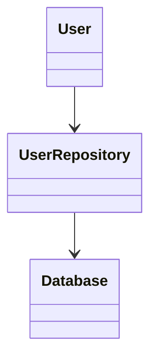

# 執筆スタイルガイド

『「楽しい」ソフトウェアエンジニアリング —— デジタル・アルケミー：伝統の美学とAIで紡ぐ創造の地図』の執筆スタイルを統一するためのガイドです。

---

## 文体・トーン

### 基本方針

- **親しみやすく、でも軽薄ではない**: 読者に語りかけるような文体だが、専門性は保つ
- **ワクワク感と知的興奮**: 技術を「楽しむ」視点を常に意識
- **具体的で実践的**: 抽象論に終わらず、読者が試せる内容を提供
- **美学的アプローチ**: 技術を「美しい」「エレガント」な視点で捉える

### 文体の例

**良い例**:
> ソフトウェアエンジニアリングは、魔法の地図のようなものです。複雑な現実世界を、美しく整理された論理の世界へと翻訳していく技術です。この章では、その翻訳の技法を学びましょう。

**避けるべき例**:
> ソフトウェアエンジニアリングとは、ソフトウェア開発における体系的なアプローチである。本章では要求工学について説明する。

### 読者への語りかけ

- **「あなた」を使う**: 読者を直接的に意識
- **「私たち」を使う**: 共に学ぶ仲間としての関係性
- **質問形式を活用**: 読者の思考を促す

**例**:
> あなたは、これまでにコードを書いていて「なんだか美しくないな」と感じたことはありませんか？

---

## 用語の統一

### 技術用語

| 統一表記 | 避ける表記 | 備考 |
|---------|-----------|------|
| ソフトウェアエンジニアリング | ソフトウェアエンジニアリング | 日本語優先 |
| AI | 人工知能 | AIで統一（初出時は「AI（人工知能）」） |
| プログラミング | コーディング | 文脈で使い分け可 |
| デザインパターン | 設計パターン | デザインパターンで統一 |
| リファクタリング | リファクタ | 正式名称を使用 |

### QuestForgeにおけるエンドユーザー呼称

| 文脈 | 使う言葉 | 備考 |
|------|---------|------|
| QuestForgeのエンドユーザー | **冒険者** | アプリを使うユーザーはすべて「冒険者」 |
| 一般的なシステム設計・技術説明 | **ユーザー** | QuestForge固有ではない文脈 |

初出は `chapters/part1/chapter01/1-1.md` のQuestForge紹介コラム内で定義済み。

### 本書独自の表現

| 表現 | 意味 | 使用箇所 |
|------|------|---------|
| 詠唱 | AIへのプロンプト | 第3章など |
| 賢者たちの処方箋 | デザインパターン | 第2章 |
| 刺客 | テストケース | 第4章 |

### カタカナ表記

- 長音符号（ー）の使用ルール
  - 3文字以上: 使う（例: ユーザー、エンジニア）
  - 2文字: 使わない（例: コード、テスト）
  - 例外: 慣例に従う（例: サーバー、エラー）

---

## 構成・レイアウト

### セクションの構成

各セクションは以下の要素で構成:

1. **導入**: 読者を引き込む（2-3段落）
2. **理論的背景**: 本質を簡潔に（3-5段落）
3. **実践例**: コードや図で具体化（適宜）
4. **AI時代の視点**: AIをどう活用するか（2-3段落）
5. **まとめ**: 学んだことの振り返り（3-5ポイント）

### 文章の長さ

- **段落**: 3-6文を目安
- **文**: 1文は長くても60文字以内を推奨
- **セクション**: 2000-4000文字を目安

### 見出しレベル

```markdown
# 章タイトル（H1）
## セクション（H2）
### サブセクション（H3）
#### 詳細項目（H4）
```

---

## コード例

### 基本原則

1. **実行可能**: 読者がコピー＆ペーストして動かせる
2. **簡潔**: 本質を示すのに必要最小限
3. **コメント**: 重要な部分に日本語コメント
4. **言語選択**: Python優先、必要に応じて他言語も

### コードブロックの書き方

```python
# 良い例: コメントでコードの意図を説明
def calculate_fibonacci(n):
    """
    フィボナッチ数列のn番目の値を計算する

    Args:
        n: 計算したい位置（0始まり）

    Returns:
        フィボナッチ数列のn番目の値
    """
    if n <= 1:
        return n
    return calculate_fibonacci(n - 1) + calculate_fibonacci(n - 2)

# 使用例
print(calculate_fibonacci(10))  # 55
```

### コード例の説明

- コードの前に「何をするコードか」を説明
- コードの後に「実行結果」や「ポイント」を記載
- 長いコードは分割して段階的に説明

---

## 図・表・リスト

### 図の扱い

- 図は `[図: 説明文]` で示す
- 後で実際の図を作成
- Mermaid記法を活用（可能な場合）

**例**:
```markdown
[図: クラス図 - ユーザー管理システムの基本構造]
```

または



### 表の使用

- 比較や整理に活用
- ヘッダーは太字
- 左寄せが基本

**例**:
| 手法 | メリット | デメリット |
|------|---------|----------|
| TDD | 品質向上 | 学習コスト |
| BDD | 要件明確化 | 記述の手間 |

### リストの使用

- **箇条書き（・）**: 順序が重要でない場合
- **番号付き（1, 2, 3）**: 手順や優先順位がある場合

---

## 強調・引用

### 強調

- **太字**: 重要な用語や概念
- *斜体*: 強調（あまり使わない）
- `コード`: インラインコードや技術用語

**例**:
> **デザインパターン**は、ソフトウェア設計における典型的な問題に対する再利用可能な解決策です。`Singleton`パターンや`Factory`パターンなどがあります。

### 引用

- 他の文献からの引用
- 注目すべきポイント
- 読者への問いかけ

**例**:
> 「早すぎる最適化は諸悪の根源である」— ドナルド・クヌース

---

## 例示・比喩

### 効果的な比喩

技術的な概念を身近なもので例える:

**良い例**:
> クラスは「設計図」、オブジェクトは「その設計図から作られた実物」です。たとえば「車の設計図」というクラスから、「赤いスポーツカー」「青いセダン」といったオブジェクトが生まれます。

### 具体例の選び方

- **身近**: 読者が想像しやすいもの
- **シンプル**: 本質を捉えた最小限の例
- **実践的**: 実際に使える例

---

## 書籍的可読性のルール

Webコンテンツと異なり、書籍は長時間・通読を前提として読まれます。以下の7つのルールを守ることで、読者が疲れず、自然な流れで読み進められる文章になります。

### ① 見出し密度——H3は概念の転換点のみ

H3見出しは「ここから話題が大きく変わる」という転換点にのみ使います。1つのセクション（H2）内でH3が5個を超えたら、見出しの乱立を疑いましょう。

**格下げの目安（H3 → 太字）:**
- 「コツ①」「コツ②」など連番型の見出し
- 「ステップ1」「ステップ2」など手順型の見出し
- 2〜3文しか続かない短い見出し

```markdown
# 避ける
### コツ①：命名規則を守る
命名規則を守ると...

# 推奨
**命名規則**を守ることで...
```

### ② 太字の使用——初出の専門用語のみ

太字（`**〜**`）は、専門用語の**初出時のみ**使います。一度太字で導入した用語は、2回目以降は通常のテキストで書きます。リスト冒頭の太字ラベル（`- **項目名**: 説明`）は、技術用語でなければ避けます。代わりにコードフォーマット（`` ` `` ）を使う場面が多くあります。

**目安**: 1,000字あたり `**` の使用が15個を超えたら多すぎる可能性があります。

### ③ AI詠唱例の配置——実践の直後に埋め込む

「AIへの詠唱例」は、対応する実践内容の**直後に小さく埋め込む**ことで、読者がすぐに試せるようにします。セクション末尾にまとめて置くと、本文との文脈が切れてしまいます。

セクションの末尾には「さらに発展させたい場合のプロンプト」のみを残す構成を推奨します。

### ⑤ 図の前後文——図を孤立させない

図を本文に差し込む際は、以下の2点を守ります：

1. **図の直前**：「次の図は〇〇を示しています」という1文の誘導を置く
2. **図の直後**：「ここで注目したいのは〜」という読み解きの段落を1つ置く

```markdown
# 推奨パターン
次の図は、クリーンアーキテクチャにおける依存関係の向きを示しています。


ここで重要な点は、依存の矢印が常に外から内へ向かっていることです。...
```

図と説明文が離れると、読者は図の意味を自力で解釈しなければならなくなります。

### ⑥ セクション末尾の順序——まとめ→詠唱例→リソース

各セクションの末尾は、以下の順序で統一します：

1. まとめ（本文の流れのクロージング段落、または `## まとめ` 見出し）
2. `## AIへの詠唱例`
3. `## さらに学ぶためのリソース`

「さらに学ぶためのリソース」が「AIへの詠唱例」より前にある場合は、順序を入れ替えてください。

### ⑦ コラムの上限——本文中は15行以内

`>` で囲むコラムボックスは**15行以内**に収めます。超える場合は：

- 章末の「コラム」節として独立させる
- 付録に移動する
- 本文に吸収して通常の段落として書く

コラムは補足情報であり、本文の読書体験を中断するものです。長いコラムは読者の集中を削いでしまいます。

### ⑧ 前節参照——問いかけ形式に変換

「前節では〜を学びました」「ここまでで〜を理解しました」という定型句は避けます。読者が線形に読んでいることを前提とした「確認」は、すでに知っていることを繰り返すだけになりがちです。

代わりに、自然な文脈の流れや問いかけ形式で次の話題へ移ります。

```markdown
# 避ける
前節では、SOLIDの原則を学びました。次はこれをどう実践するか見ていきましょう。

# 推奨
SOLIDの原則は、実際のコードに触れることで初めて意味を持ちます。では、QuestForgeのクエスト完了処理を使って、これを体験してみましょう。
```

---

## AIとの協働に関する記述

### AIの扱い方

本書では、AIを以下のように位置づける:

1. **強力なパートナー**: 敵ではなく味方
2. **道具**: 使いこなすべきツール
3. **学習の加速器**: より深く学ぶための手段

### AIプロンプトの記載

各セクションの最後に「AIへの詠唱例」を記載:

```markdown
## AIへの詠唱例

この節で学んだことを実践するためのプロンプト：

\`\`\`
以下の要件を満たすPythonクラスを設計してください：
- ユーザー情報を管理
- 単一責任の原則に従う
- テストしやすい構造
\`\`\`
```

---

## ポジティブ・ライティング方針（最重要）

### 基本原則

本書は従来のソフトウェアエンジニアリング攻略本と異なり、**課題や問題からではなく、可能性や価値から語ります**。

| 従来の攻略本 | 本書のアプローチ |
|-------------|----------------|
| 「〜しないと失敗する」 | 「〜すると成功に近づく」 |
| 「〜は危険です」 | 「〜にはワクワクする可能性があります」 |
| 「よくある間違い」 | 「さらに効果を高めるコツ」 |
| 「〜の問題点」 | 「〜の伸びしろ」 |

### 具体的な変換ルール

| ネガティブ表現 | ポジティブ表現 |
|--------------|--------------|
| 危険です / リスクがあります | 可能性が眠っています / チャンスがあります |
| 失敗する / 失敗の原因 | 成功に近づく / 成功の鍵 |
| 難しい / 困難 | 奥深い / 挑戦しがいがある / 工夫が活きる |
| 問題 / 課題 | 機会 / 伸びしろ / テーマ |
| 罠 / 落とし穴 | コツ / ポイント / 意識すべき点 |
| 悪い例 / アンチパターン | シンプルな例 / 基本的なアプローチ / さらに効果的な方法 |
| 欠点 / デメリット | 特徴 / トレードオフ / 考慮点 |
| 間違い / 誤り | 改善の余地 / 発展の可能性 |
| 衝突 / 矛盾 | バランス / 両立 / 調和 |
| 不満 / 困っている | 期待 / 実現したいこと |
| 見落としている / 盲点 | さらに広げられる視点 / 追加できる観点 |
| 〜できない | 〜するとさらに良くなる |
| 〜を避ける | 〜を心がける |

### 見出しの書き方

**従来型（使わない）:**
- 「なぜ〜は難しいのか」
- 「よくある落とし穴」
- 「〜の問題点」

**本書のスタイル:**
- 「〜で広がる可能性」
- 「効果を高めるコツ」
- 「〜をさらに活かすには」

### 導入文の書き方

**従来型（使わない）:**
> ソフトウェア開発では、要求の誤解が大きな問題となります。多くのプロジェクトが失敗する原因は...

**本書のスタイル:**
> ソフトウェア開発には、ワクワクする瞬間があります。ユーザーの言葉の奥に隠れた「本当の願い」を発見した時...

### ユーザーの感情を描写する場合

ペルソナや対話例でユーザーの感情（不満、困りごと）を描写する場合は許容しますが、**解説文でそれを「問題」として強調しない**ようにします。

**許容:**
> **Aさん**: 「朝起きて、やることリストを見ると、やる気が失せるんだよね」

**解説では:**
> この言葉から、Aさんが「もっとワクワクしながらタスクに取り組みたい」と願っていることがわかります。

### 技術的な課題・制約・特性の表現

**技術的事実を正確に伝える表現は許容します。**

本方針の目的は「読者を萎縮させない」「ソフトウェアエンジニアリングをべからず集にしない」ことであり、技術的な制約や特性を正確に説明することを妨げるものではありません。

**許容される表現:**
- 「O(N^2)は大規模データには危険」（アルゴリズムの特性）
- 「メモリが不足する」（リソース制約）
- 「このパターンは複雑度が増す」（設計上のトレードオフ）
- 「レイテンシが問題になる」（性能特性）

**避けるべき表現:**
- 「あなたがこうすると失敗する」（読者の行動を否定）
- 「これは初心者がよく陥る罠だ」（読者を見下す）
- 「こんなコードを書いてはいけない」（べからず集）

**判断基準**: 技術的事実の説明か、読者の行動・判断への否定的評価か

### ソフトウェア品質に対するネガティブ表現

**ソフトウェアの品質や状態に対するネガティブ表現は許容します。**

コードやアーキテクチャの「良し悪し」を評価することは、ソフトウェアエンジニアリングの本質です。読者の行動を否定せず、ソフトウェアそのものを評価対象とする表現は問題ありません。

**許容される表現:**
- 「悪い例」「良い例」（コードの品質比較）
- 「呪いの書」「迷宮のようなコード」（コード状態の比喩）
- 「技術的負債」「スパゲッティコード」（業界標準の用語）
- 「よくある誤解」（技術概念に対する誤解）
- 「アンチパターン」（設計上の定番の失敗例）

**避けるべき表現:**
- 「あなたのコードは悪い」（読者個人への批判）
- 「こう書く人はセンスがない」（読者の能力を否定）

**判断基準**: 批判の対象が「ソフトウェア」か「読者」か

| 対象 | ネガティブ表現 | 可否 |
|------|--------------|------|
| ソフトウェア・コード | 「悪い例」「複雑すぎる」 | ✅ 許容 |
| 読者の行動・判断 | 「こうすると失敗する」 | ❌ 避ける |

---

## 避けるべきその他の表現

### 断定的すぎる表現

❌ 避ける:
- 「これが唯一の正解です」
- 「必ずこうするべきです」

✅ 代わりに:
- 「多くの場合、この方法が有効です」
- 「一般的には、こうすることが推奨されます」

### 曖昧な表現

❌ 避ける:
- 「いろいろな方法があります」
- 「なんとなく」
- 「適当に」

✅ 代わりに:
- 「主に3つの方法があります：A、B、C」
- 「直感的に」
- 「状況に応じて」

---

## チェックリスト

執筆後、以下を確認:

### 内容
- [ ] 技術的に正確か
- [ ] 実践的か（読者が試せるか）
- [ ] AI時代の視点が盛り込まれているか
- [ ] 本書のコンセプトに合っているか

### 文体
- [ ] 親しみやすいトーンか
- [ ] 専門性は保たれているか
- [ ] ワクワク感があるか

### 構成
- [ ] 導入→理論→実践→まとめの流れか
- [ ] セクション間のつながりは良好か
- [ ] 文字数は適切か（2000-4000文字）

### 技術的要素
- [ ] コード例は実行可能か
- [ ] 図の説明は適切か
- [ ] 用語は統一されているか

### 読みやすさ
- [ ] 段落の長さは適切か
- [ ] 見出しは効果的に使われているか
- [ ] 強調は適切か（太字・引用など）

---

## 改訂履歴

- 2026-01-18: 初版作成
